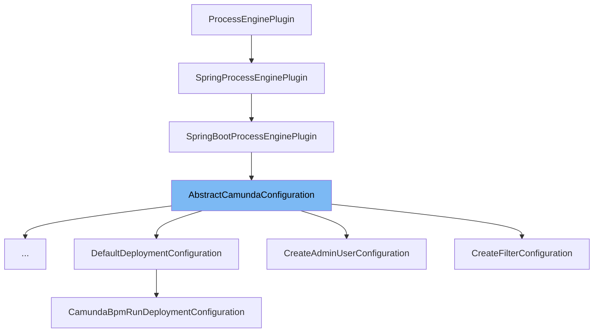

This document will cover the `AbstractCamundaConfiguration` class. We'll discuss:

1. What is `AbstractCamundaConfiguration`.
2. The variables and functions within `AbstractCamundaConfiguration`.
3. An example of how `AbstractCamundaConfiguration` is used.



# What is AbstractCamundaConfiguration

`AbstractCamundaConfiguration` is an abstract class that extends `SpringBootProcessEnginePlugin`. It provides a base configuration for the Camunda BPM platform when used with Spring Boot. It is part of the Camunda Spring Boot Starter module, which simplifies the integration of the Camunda BPM platform with Spring Boot applications.

<SwmSnippet path="/spring-boot-starter/starter/src/main/java/org/camunda/bpm/spring/boot/starter/configuration/impl/AbstractCamundaConfiguration.java" line="36">

---

# Variables and functions

The `LOG` variable is a static final instance of `SpringBootProcessEngineLogger` which is used for logging.

```java
  protected static final SpringBootProcessEngineLogger LOG = SpringBootProcessEngineLogger.LOG;
```

---

</SwmSnippet>

<SwmSnippet path="/spring-boot-starter/starter/src/main/java/org/camunda/bpm/spring/boot/starter/configuration/impl/AbstractCamundaConfiguration.java" line="38">

---

The `fail` function is a static method that returns a `Supplier` of `IllegalStateException`. It is used to create an exception with a specific message.

```java
  protected static Supplier<IllegalStateException> fail(String message) {
    return () -> new IllegalStateException(message);
  }
```

---

</SwmSnippet>

<SwmSnippet path="/spring-boot-starter/starter/src/main/java/org/camunda/bpm/spring/boot/starter/configuration/impl/AbstractCamundaConfiguration.java" line="42">

---

The `createToString` function is used to create a string representation of a map of attributes. It uses a `StringJoiner` to concatenate the map entries into a string.

```java
  protected String createToString(Map<String, Object> attributes) {
    StringJoiner joiner = new StringJoiner(", ", getClass().getSimpleName() + "[", "]");
    attributes.entrySet().forEach(e -> joiner.add(e.getKey() + "=" + e.getValue()));

    return joiner.toString();
  }
```

---

</SwmSnippet>

<SwmSnippet path="/spring-boot-starter/starter/src/main/java/org/camunda/bpm/spring/boot/starter/configuration/impl/AbstractCamundaConfiguration.java" line="53">

---

The `logger` variable is a `Logger` instance used for logging. It is deprecated and `SpringBootProcessEngineLogger` should be used instead.

```java
  protected final Logger logger = getLogger(this.getClass());
```

---

</SwmSnippet>

<SwmSnippet path="/spring-boot-starter/starter/src/main/java/org/camunda/bpm/spring/boot/starter/configuration/impl/AbstractCamundaConfiguration.java" line="56">

---

The `camundaBpmProperties` variable is an instance of `CamundaBpmProperties` which is autowired. It is used to access the Camunda BPM properties.

```java
  protected CamundaBpmProperties camundaBpmProperties;
```

---

</SwmSnippet>

<SwmSnippet path="/spring-boot-starter/starter/src/main/java/org/camunda/bpm/spring/boot/starter/configuration/impl/GenericPropertiesConfiguration.java" line="34">

---

# Usage example

`GenericPropertiesConfiguration` is an example of a class that extends `AbstractCamundaConfiguration`. It inherits all the variables and functions from `AbstractCamundaConfiguration`.

```java

@Order(Ordering.DEFAULT_ORDER - 1)
public class GenericPropertiesConfiguration extends AbstractCamundaConfiguration {

  protected static final SpringBootProcessEngineLogger LOG = SpringBootProcessEngineLogger.LOG;

  @Override
  public void preInit(SpringProcessEngineConfiguration springProcessEngineConfiguration) {
    GenericProperties genericProperties = camundaBpmProperties.getGenericProperties();
    final Map<String, Object> properties = genericProperties.getProperties();

    if (!CollectionUtils.isEmpty(properties)) {
      SpringBootStarterPropertyHelper
          .applyProperties(springProcessEngineConfiguration, properties, genericProperties.isIgnoreUnknownFields());
      LOG.propertiesApplied(genericProperties);
    }
  }

}

```

---

</SwmSnippet>

&nbsp;

*This is an auto-generated document by Swimm AI 🌊 and has not yet been verified by a human*

<SwmMeta version="3.0.0" repo-id="Z2l0aHViJTNBJTNBQ2l0aS1jYW11bmRhJTNBJTNBZ2lsYWRuYXZvdA==" repo-name="Citi-camunda" doc-type="general-class"><sup>Powered by [Swimm](/)</sup></SwmMeta>
