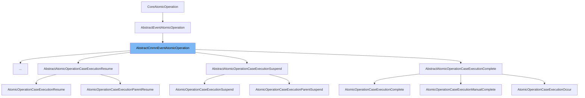

This document will cover the `AbstractCmmnEventAtomicOperation` class. We will cover:

1. What the `AbstractCmmnEventAtomicOperation` class is.
2. The variables and functions of the `AbstractCmmnEventAtomicOperation` class.
3. An example of how to use the `AbstractCmmnEventAtomicOperation` class.



# What is AbstractCmmnEventAtomicOperation

`AbstractCmmnEventAtomicOperation` is an abstract class that extends `AbstractEventAtomicOperation` and implements `CmmnAtomicOperation`. It is part of the Camunda BPMN engine and is used to handle atomic operations related to CMMN (Case Management Model and Notation) events. It provides a set of methods that can be overridden by subclasses to define specific behavior for different types of CMMN events.

<SwmSnippet path="/engine/src/main/java/org/camunda/bpm/engine/impl/cmmn/operation/AbstractCmmnEventAtomicOperation.java" line="32">

---

# Variables and functions

The function `getScope` is used to get the activity associated with the given execution. It returns a `CmmnActivity` object.

```java
  protected CmmnActivity getScope(CmmnExecution execution) {
    return execution.getActivity();
  }
```

---

</SwmSnippet>

<SwmSnippet path="/engine/src/main/java/org/camunda/bpm/engine/impl/cmmn/operation/AbstractCmmnEventAtomicOperation.java" line="36">

---

The function `isAsync` is used to check if the execution is asynchronous. It returns a boolean value.

```java
  public boolean isAsync(CmmnExecution execution) {
    return false;
  }
```

---

</SwmSnippet>

<SwmSnippet path="/engine/src/main/java/org/camunda/bpm/engine/impl/cmmn/operation/AbstractCmmnEventAtomicOperation.java" line="40">

---

The function `eventNotificationsCompleted` is called when all event notifications have been completed. It triggers the repetition, pre-transition notification, transition notification, and post-transition notification methods in order.

```java
  protected void eventNotificationsCompleted(CmmnExecution execution) {
    repetition(execution);
    preTransitionNotification(execution);
    performTransitionNotification(execution);
    postTransitionNotification(execution);
  }
```

---

</SwmSnippet>

<SwmSnippet path="/engine/src/main/java/org/camunda/bpm/engine/impl/cmmn/operation/AbstractCmmnEventAtomicOperation.java" line="47">

---

The function `repetition` is used to repeat the behavior associated with the given execution. It calls the `repeat` method of the `CmmnActivityBehavior` associated with the execution.

```java
  protected void repetition(CmmnExecution execution) {
    CmmnActivityBehavior behavior = getActivityBehavior(execution);
    behavior.repeat(execution, getEventName());
  }
```

---

</SwmSnippet>

<SwmSnippet path="/engine/src/main/java/org/camunda/bpm/engine/impl/cmmn/operation/AbstractCmmnEventAtomicOperation.java" line="52">

---

The function `preTransitionNotification` is a placeholder for pre-transition notification logic. It is meant to be overridden by subclasses.

```java
  protected void preTransitionNotification(CmmnExecution execution) {

  }
```

---

</SwmSnippet>

<SwmSnippet path="/engine/src/main/java/org/camunda/bpm/engine/impl/cmmn/operation/AbstractCmmnEventAtomicOperation.java" line="56">

---

The function `performTransitionNotification` is used to perform the transition notification. It gets the event name and the parent of the execution, and if the parent exists, it calls the `handleChildTransition` method of the parent with the execution and event name.

```java
  protected void performTransitionNotification(CmmnExecution execution) {
    String eventName = getEventName();

    CmmnExecution parent = execution.getParent();

    if (parent != null) {
      parent.handleChildTransition(execution, eventName);
    }
  }
```

---

</SwmSnippet>

<SwmSnippet path="/engine/src/main/java/org/camunda/bpm/engine/impl/cmmn/operation/AbstractCmmnEventAtomicOperation.java" line="66">

---

The function `postTransitionNotification` is a placeholder for post-transition notification logic. It is meant to be overridden by subclasses.

```java
  protected void postTransitionNotification(CmmnExecution execution) {
    // noop
  }
```

---

</SwmSnippet>

<SwmSnippet path="/engine/src/main/java/org/camunda/bpm/engine/impl/cmmn/operation/AtomicOperationCaseExecutionManualStart.java" line="30">

---

# Usage example

`AtomicOperationCaseExecutionManualStart` is an example of a class that extends `AbstractCmmnEventAtomicOperation`. It overrides the methods of `AbstractCmmnEventAtomicOperation` to define specific behavior for the manual start of a case execution.

```java
public class AtomicOperationCaseExecutionManualStart extends AbstractCmmnEventAtomicOperation {

  public String getCanonicalName() {
    return "case-execution-manual-start";
  }

```

---

</SwmSnippet>

&nbsp;

*This is an auto-generated document by Swimm AI 🌊 and has not yet been verified by a human*

<SwmMeta version="3.0.0" repo-id="Z2l0aHViJTNBJTNBQ2l0aS1jYW11bmRhJTNBJTNBZ2lsYWRuYXZvdA==" repo-name="Citi-camunda" doc-type="class"><sup>Powered by [Swimm](/)</sup></SwmMeta>
