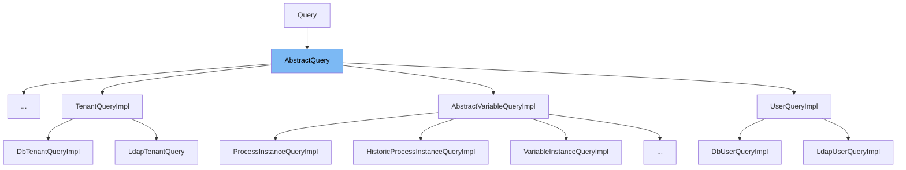

This document will cover the `AbstractQuery` class in the Citi-camunda repository. We'll cover:

1. What is `AbstractQuery`.
2. The variables and functions defined in `AbstractQuery`.
3. An example of how `AbstractQuery` is used in `HistoricBatchQueryImpl`.



# What is AbstractQuery

`AbstractQuery` is an abstract superclass for all query types in the Camunda Platform. It provides a structure and common functionality for all query types, such as ordering and result handling. It is used as a base class for specific query implementations.

<SwmSnippet path="/engine/src/main/java/org/camunda/bpm/engine/impl/AbstractQuery.java" line="62">

---

# Variables and functions

The `AbstractQuery` class defines several variables. `commandExecutor` is a transient `CommandExecutor` that executes commands. `resultType` is an enum that defines the type of result expected from the query. `expressions` is a `Map` that stores expressions used in the query. `validators` is a `Set` of validators used to validate the query. `maxResultsLimitEnabled` is a boolean that indicates whether the maximum results limit is enabled.

```java
  protected transient CommandExecutor commandExecutor;

  protected ResultType resultType;

  protected Map<String, String> expressions = new HashMap<>();

  protected Set<Validator<AbstractQuery<?, ?>>> validators = new HashSet<>();

  protected boolean maxResultsLimitEnabled;
```

---

</SwmSnippet>

<SwmSnippet path="/engine/src/main/java/org/camunda/bpm/engine/impl/AbstractQuery.java" line="84">

---

The `setCommandExecutor` function is used to set the `CommandExecutor` for the query. It returns the current instance of the query, allowing for method chaining.

```java
  public AbstractQuery<T, U> setCommandExecutor(CommandExecutor commandExecutor) {
    this.commandExecutor = commandExecutor;
    return this;
  }
```

---

</SwmSnippet>

<SwmSnippet path="/engine/src/main/java/org/camunda/bpm/engine/impl/AbstractQuery.java" line="89">

---

The `orderBy` function is used to specify the property to order the query results by. It takes a `QueryProperty` as an argument and returns the current instance of the query.

```java
  public T orderBy(QueryProperty property) {
    return orderBy(new QueryOrderingProperty(null, property));
  }
```

---

</SwmSnippet>

<SwmSnippet path="/engine/src/main/java/org/camunda/bpm/engine/impl/AbstractQuery.java" line="99">

---

The `asc` function is used to specify that the query results should be ordered in ascending order. It returns the current instance of the query.

```java
  public T asc() {
    return direction(Direction.ASCENDING);
  }
```

---

</SwmSnippet>

<SwmSnippet path="/engine/src/main/java/org/camunda/bpm/engine/impl/AbstractQuery.java" line="103">

---

The `desc` function is used to specify that the query results should be ordered in descending order. It returns the current instance of the query.

```java
  public T desc() {
    return direction(Direction.DESCENDING);
  }
```

---

</SwmSnippet>

<SwmSnippet path="/engine/src/main/java/org/camunda/bpm/engine/impl/AbstractQuery.java" line="133">

---

The `singleResult` function is used to execute the query and return a single result. If the query returns more than one result, an exception is thrown.

```java
  @SuppressWarnings("unchecked")
  public U singleResult() {
    this.resultType = ResultType.SINGLE_RESULT;
    return (U) executeResult(resultType);
  }
```

---

</SwmSnippet>

<SwmSnippet path="/engine/src/main/java/org/camunda/bpm/engine/impl/AbstractQuery.java" line="139">

---

The `list` function is used to execute the query and return a list of results.

```java
  @SuppressWarnings("unchecked")
  public List<U> list() {
    this.resultType = ResultType.LIST;
    return (List<U>) executeResult(resultType);
  }
```

---

</SwmSnippet>

<SwmSnippet path="/engine/src/main/java/org/camunda/bpm/engine/impl/AbstractQuery.java" line="145">

---

The `listPage` function is used to execute the query and return a paginated list of results. It takes two arguments: `firstResult` and `maxResults` which specify the starting point and the maximum number of results to return.

```java
  @SuppressWarnings("unchecked")
  public List<U> listPage(int firstResult, int maxResults) {
    this.firstResult = firstResult;
    this.maxResults = maxResults;
    this.resultType = ResultType.LIST_PAGE;
    return (List<U>) executeResult(resultType);
  }
```

---

</SwmSnippet>

<SwmSnippet path="/engine/src/main/java/org/camunda/bpm/engine/impl/AbstractQuery.java" line="174">

---

The `count` function is used to execute the query and return the count of results.

```java
  public long count() {
    this.resultType = ResultType.COUNT;
    if (commandExecutor!=null) {
      return (Long) commandExecutor.execute(this);
    }
    return evaluateExpressionsAndExecuteCount(Context.getCommandContext());
  }
```

---

</SwmSnippet>

<SwmSnippet path="/engine/src/main/java/org/camunda/bpm/engine/impl/AbstractQuery.java" line="182">

---

The `unlimitedList` function is used to execute the query and return a list of results without any limit.

```java
  @SuppressWarnings("unchecked")
  public List<U> unlimitedList() {
    this.resultType = ResultType.LIST;
    if (commandExecutor != null) {
      return (List<U>) commandExecutor.execute(this);
    }
    return evaluateExpressionsAndExecuteList(Context.getCommandContext(), null);
  }
```

---

</SwmSnippet>

# Usage example

`AbstractQuery` is an abstract class and is not used directly. Instead, it is extended by other classes to provide specific query functionality. For example, in the `HistoricBatchQueryImpl` class, `AbstractQuery` is extended to provide querying capabilities for historic batches.

&nbsp;

*This is an auto-generated document by Swimm AI 🌊 and has not yet been verified by a human*

<SwmMeta version="3.0.0" repo-id="Z2l0aHViJTNBJTNBQ2l0aS1jYW11bmRhJTNBJTNBZ2lsYWRuYXZvdA==" repo-name="Citi-camunda" doc-type="class"><sup>Powered by [Swimm](/)</sup></SwmMeta>
