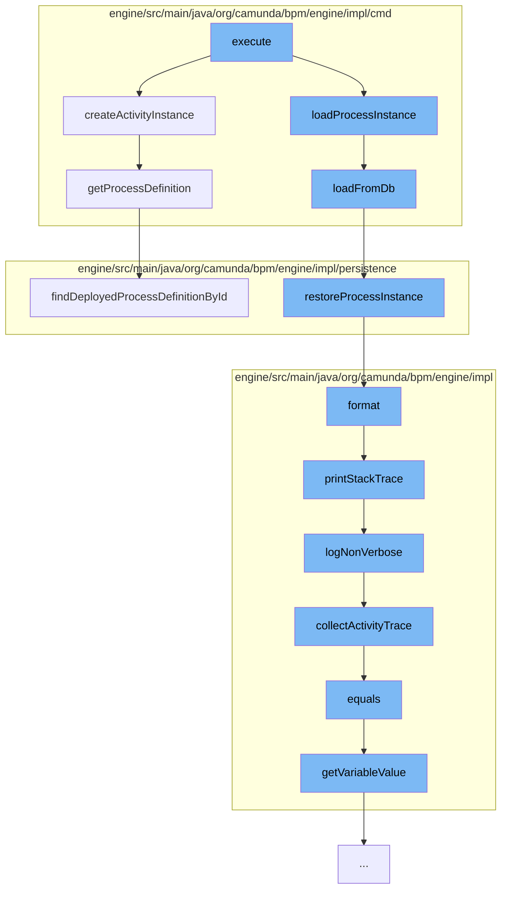

This document will cover the process of retrieving and processing activity instances in the Camunda BPMN engine. The steps include:

1. Executing the main command
2. Loading the process instance
3. Restoring the process instance
4. Formatting the log
5. Printing the stack trace
6. Collecting activity trace
7. Comparing task query variables
8. Creating the activity instance
9. Finding the deployed process definition.



<SwmSnippet path="/engine/src/main/java/org/camunda/bpm/engine/impl/cmd/GetActivityInstanceCmd.java" line="204">

---

# Executing the main command

The `execute` function initiates the process by calling the `createActivityInstance` and `loadProcessInstance` functions. The `createActivityInstance` function constructs an `ActivityInstanceImpl` object with details about the activity instance, including its ID, parent ID, process instance ID, process definition ID, business key, and activity ID.

```java
  protected ActivityInstanceImpl createActivityInstance(PvmExecutionImpl scopeExecution, ScopeImpl scope,
      String activityInstanceId, String parentActivityInstanceId,
      Map<String, List<Incident>> incidentsByExecution) {
    ActivityInstanceImpl actInst = new ActivityInstanceImpl();

    actInst.setId(activityInstanceId);
    actInst.setParentActivityInstanceId(parentActivityInstanceId);
    actInst.setProcessInstanceId(scopeExecution.getProcessInstanceId());
    actInst.setProcessDefinitionId(scopeExecution.getProcessDefinitionId());
    actInst.setBusinessKey(scopeExecution.getBusinessKey());
    actInst.setActivityId(scope.getId());

    String name = scope.getName();
    if (name == null) {
      name = (String) scope.getProperty("name");
    }
    actInst.setActivityName(name);

    if (scope.getId().equals(scopeExecution.getProcessDefinition().getId())) {
      actInst.setActivityType("processDefinition");
    }
```

---

</SwmSnippet>

<SwmSnippet path="/engine/src/main/java/org/camunda/bpm/engine/impl/cmd/GetActivityInstanceCmd.java" line="406">

---

# Loading the process instance

The `loadProcessInstance` function retrieves the process instance from the database by its ID. It then calls the `loadFromDb` function to load the execution entities associated with the process instance.

```java
  protected List<ExecutionEntity> loadFromDb(final String processInstanceId, final CommandContext commandContext) {

    List<ExecutionEntity> executions = commandContext.getExecutionManager().findExecutionsByProcessInstanceId(processInstanceId);
    ExecutionEntity processInstance = commandContext.getExecutionManager().findExecutionById(processInstanceId);

    // initialize parent/child sets
    if (processInstance != null) {
      processInstance.restoreProcessInstance(executions, null, null, null, null, null, null);
    }

    return executions;
  }
```

---

</SwmSnippet>

<SwmSnippet path="/engine/src/main/java/org/camunda/bpm/engine/impl/persistence/entity/ExecutionEntity.java" line="1294">

---

# Restoring the process instance

The `restoreProcessInstance` function restores the state of a process instance, including its executions, event subscriptions, variables, tasks, jobs, incidents, and external tasks. This is done by mapping these entities to their respective execution entities.

```java
  /**
   * Restores a complete process instance tree including referenced entities.
   *
   * @param executions
   *   the list of all executions that are part of this process instance.
   *   Cannot be null, must include the process instance execution itself.
   * @param eventSubscriptions
   *   the list of all event subscriptions that are linked to executions which is part of this process instance
   *   If null, event subscriptions are not initialized and lazy loaded on demand
   * @param variables
   *   the list of all variables that are linked to executions which are part of this process instance
   *   If null, variables are not initialized and are lazy loaded on demand
   * @param jobs
   * @param tasks
   * @param incidents
   */
  public void restoreProcessInstance(Collection<ExecutionEntity> executions,
      Collection<EventSubscriptionEntity> eventSubscriptions,
      Collection<VariableInstanceEntity> variables,
      Collection<TaskEntity> tasks,
      Collection<JobEntity> jobs,
```

---

</SwmSnippet>

<SwmSnippet path="/engine/src/main/java/org/camunda/bpm/engine/impl/util/LogUtil.java" line="82">

---

# Formatting the log

The `format` function formats the log record, including the date, log level, thread ID, message, and logger name. If an exception was thrown, its stack trace is also included in the log.

```java
    public String format(LogRecord record) {
      StringBuilder line = new StringBuilder();
      line.append(dateFormat.format(new Date()));
      if (Level.FINE.equals(record.getLevel())) {
        line.append(" FIN ");
      } else if (Level.FINEST.equals(record.getLevel())) {
        line.append(" FST ");
      } else if (Level.INFO.equals(record.getLevel())) {
        line.append(" INF ");
      } else if (Level.SEVERE.equals(record.getLevel())) {
        line.append(" SEV ");
      } else if (Level.WARNING.equals(record.getLevel())) {
        line.append(" WRN ");
      } else if (Level.FINER.equals(record.getLevel())) {
        line.append(" FNR ");
      } else if (Level.CONFIG.equals(record.getLevel())) {
        line.append(" CFG ");
      }

      int threadId = record.getThreadID();
      String threadIndent = getThreadIndent(threadId);
```

---

</SwmSnippet>

<SwmSnippet path="/engine/src/main/java/org/camunda/bpm/engine/impl/interceptor/BpmnStackTrace.java" line="39">

---

# Printing the stack trace

The `printStackTrace` function prints the BPMN stack trace, which includes the failed operation and a human-readable trace of activity IDs and names. The level of detail in the stack trace depends on the `verbose` parameter.

```java
  public void printStackTrace(boolean verbose) {
    if(perfromedInvocations.isEmpty()) {
      return;
    }

    StringWriter writer = new StringWriter();
    writer.write("BPMN Stack Trace:\n");

    if(!verbose) {
      logNonVerbose(writer);
    }
    else {
      logVerbose(writer);
    }

    LOG.bpmnStackTrace(writer.toString());

    perfromedInvocations.clear();
  }
```

---

</SwmSnippet>

<SwmSnippet path="/engine/src/main/java/org/camunda/bpm/engine/impl/interceptor/BpmnStackTrace.java" line="99">

---

# Collecting activity trace

The `collectActivityTrace` function collects a trace of activity IDs and names from the performed invocations. This trace is used in the non-verbose stack trace.

```java
  protected List<Map<String, String>> collectActivityTrace() {
    List<Map<String, String>> activityTrace = new ArrayList<Map<String, String>>();
    for (AtomicOperationInvocation atomicOperationInvocation : perfromedInvocations) {
      String activityId = atomicOperationInvocation.getActivityId();
      if(activityId == null) {
        continue;
      }

      Map<String, String> activity = new HashMap<String, String>();
      activity.put("activityId", activityId);

      String activityName = atomicOperationInvocation.getActivityName();
      if (activityName != null) {
        activity.put("activityName", activityName);
      }

      if(activityTrace.isEmpty() ||
          !activity.get("activityId").equals(activityTrace.get(0).get("activityId"))) {
        activityTrace.add(0, activity);
      }
    }
```

---

</SwmSnippet>

<SwmSnippet path="/engine/src/main/java/org/camunda/bpm/engine/impl/TaskQueryImpl.java" line="2329">

---

# Comparing task query variables

The `equals` function compares two `TaskQueryVariableValue` objects based on their name, whether they are process instance variables, and whether they are local.

```java
    @Override
    public boolean equals(Object o) {
      if (this == o) return true;
      if (o == null || getClass() != o.getClass()) return false;

      TaskQueryVariableValue other = ((TaskQueryVariableValueComparable) o).getVariableValue();

      return variableValue.getName().equals(other.getName())
             && variableValue.isProcessInstanceVariable() == other.isProcessInstanceVariable()
             && variableValue.isLocal() == other.isLocal();
    }
```

---

</SwmSnippet>

<SwmSnippet path="/engine/src/main/java/org/camunda/bpm/engine/impl/cmd/GetActivityInstanceCmd.java" line="204">

---

# Creating the activity instance

The `createActivityInstance` function constructs an `ActivityInstanceImpl` object with details about the activity instance, including its ID, parent ID, process instance ID, process definition ID, business key, and activity ID.

```java
  protected ActivityInstanceImpl createActivityInstance(PvmExecutionImpl scopeExecution, ScopeImpl scope,
      String activityInstanceId, String parentActivityInstanceId,
      Map<String, List<Incident>> incidentsByExecution) {
    ActivityInstanceImpl actInst = new ActivityInstanceImpl();

    actInst.setId(activityInstanceId);
    actInst.setParentActivityInstanceId(parentActivityInstanceId);
    actInst.setProcessInstanceId(scopeExecution.getProcessInstanceId());
    actInst.setProcessDefinitionId(scopeExecution.getProcessDefinitionId());
    actInst.setBusinessKey(scopeExecution.getBusinessKey());
    actInst.setActivityId(scope.getId());

    String name = scope.getName();
    if (name == null) {
      name = (String) scope.getProperty("name");
    }
    actInst.setActivityName(name);

    if (scope.getId().equals(scopeExecution.getProcessDefinition().getId())) {
      actInst.setActivityType("processDefinition");
    }
```

---

</SwmSnippet>

<SwmSnippet path="/engine/src/main/java/org/camunda/bpm/engine/impl/persistence/deploy/cache/DeploymentCache.java" line="80">

---

# Finding the deployed process definition

The `findDeployedProcessDefinitionById` function retrieves the deployed process definition by its ID from the deployment cache.

```java
  public ProcessDefinitionEntity findDeployedProcessDefinitionById(String processDefinitionId) {
    return processDefinitionEntityCache.findDeployedDefinitionById(processDefinitionId);
  }
```

---

</SwmSnippet>

&nbsp;

*This is an auto-generated document by Swimm AI 🌊 and has not yet been verified by a human*

<SwmMeta version="3.0.0" repo-id="Z2l0aHViJTNBJTNBQ2l0aS1jYW11bmRhJTNBJTNBZ2lsYWRuYXZvdA==" repo-name="Citi-camunda" doc-type="flows"><sup>Powered by [Swimm](/)</sup></SwmMeta>
