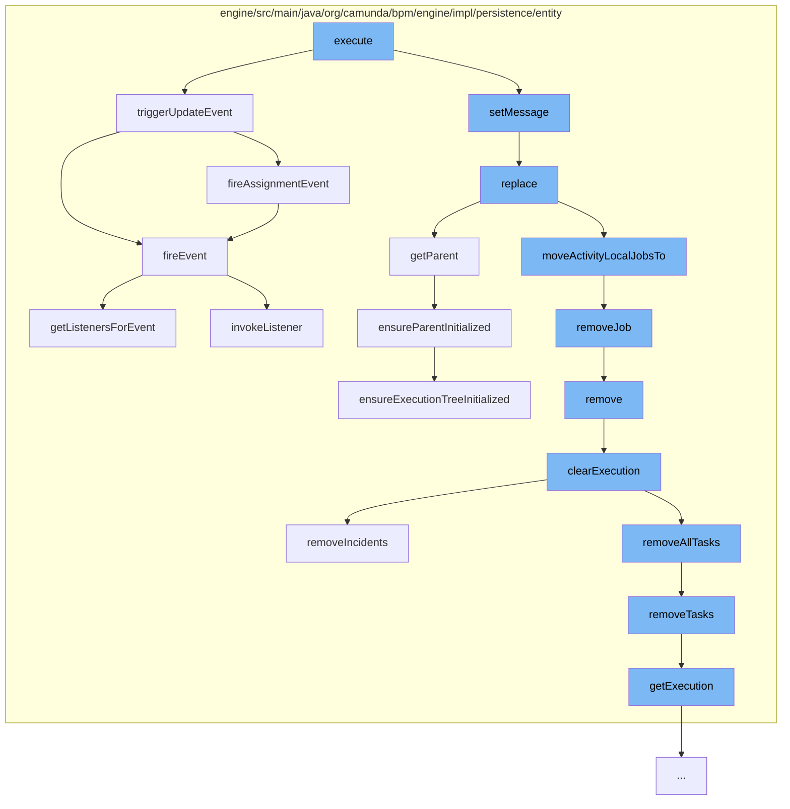

This document will cover the process of adding a comment in the Camunda BPM engine. The steps include:

1. Executing the AddCommentCmd
2. Triggering an update event
3. Setting the message for the comment
4. Replacing the execution entity
5. Clearing the execution entity



<SwmSnippet path="/engine/src/main/java/org/camunda/bpm/engine/impl/cmd/AddCommentCmd.java" line="1">

---

# Executing the AddCommentCmd

The `execute` function in `AddCommentCmd.java` is the entry point for adding a comment. This function initiates the process of adding a comment to a task or process instance.

```java
/*
 * Copyright Camunda Services GmbH and/or licensed to Camunda Services GmbH
 * under one or more contributor license agreements. See the NOTICE file
 * distributed with this work for additional information regarding copyright
 * ownership. Camunda licenses this file to you under the Apache License,
 * Version 2.0; you may not use this file except in compliance with the License.
 * You may obtain a copy of the License at
 *
 *     http://www.apache.org/licenses/LICENSE-2.0
 *
```

---

</SwmSnippet>

<SwmSnippet path="/engine/src/main/java/org/camunda/bpm/engine/impl/persistence/entity/TaskEntity.java" line="1202">

---

# Triggering an update event

The `triggerUpdateEvent` function is called to trigger an update event when a comment is added. This function is responsible for updating the state of the task and firing the update and assignment events.

```java
  public boolean triggerUpdateEvent() {
    if (lifecycleState == TaskState.STATE_CREATED) {
      registerCommandContextCloseListener();
      setLastUpdated(ClockUtil.getCurrentTime());
      setTaskState(TaskState.STATE_UPDATED.taskState);
      return fireEvent(TaskListener.EVENTNAME_UPDATE) && fireAssignmentEvent();
    }
    else {
      // silently ignore; no events are triggered in the other states
      return true;
    }
  }
```

---

</SwmSnippet>

<SwmSnippet path="/engine/src/main/java/org/camunda/bpm/engine/impl/persistence/entity/CommentEntity.java" line="1">

---

# Setting the message for the comment

The `setMessage` function is called to set the message of the comment. This function takes the comment text as input and sets it as the message of the `CommentEntity`.

```java
/*
 * Copyright Camunda Services GmbH and/or licensed to Camunda Services GmbH
 * under one or more contributor license agreements. See the NOTICE file
 * distributed with this work for additional information regarding copyright
 * ownership. Camunda licenses this file to you under the Apache License,
 * Version 2.0; you may not use this file except in compliance with the License.
 * You may obtain a copy of the License at
 *
 *     http://www.apache.org/licenses/LICENSE-2.0
 *
```

---

</SwmSnippet>

<SwmSnippet path="/engine/src/main/java/org/camunda/bpm/engine/impl/persistence/entity/ExecutionEntity.java" line="1123">

---

# Replacing the execution entity

The `replace` function is called to replace the current execution with a new one. This function is responsible for moving tasks, external tasks, and jobs from the old execution to the new one.

```java
  @Override
  public void replace(PvmExecutionImpl execution) {
    ExecutionEntity replacedExecution = (ExecutionEntity) execution;

    setListenerIndex(replacedExecution.getListenerIndex());
    replacedExecution.setListenerIndex(0);

    // update the related tasks
    replacedExecution.moveTasksTo(this);

    replacedExecution.moveExternalTasksTo(this);

    // update those jobs that are directly related to the argument execution's
    // current activity
    replacedExecution.moveActivityLocalJobsTo(this);

    if (!replacedExecution.isEnded()) {
      // on compaction, move all variables
      if (replacedExecution.getParent() == this) {
        replacedExecution.moveVariablesTo(this);
      }
```

---

</SwmSnippet>

<SwmSnippet path="/engine/src/main/java/org/camunda/bpm/engine/impl/persistence/entity/ExecutionEntity.java" line="531">

---

# Clearing the execution entity

The `clearExecution` function is called to clear the execution entity. This function is responsible for deleting tasks, variable instances, jobs, and incidents associated with the execution.

```java
  protected void clearExecution() {
    //call the onRemove method of the execution observers
    //so they can do some clean up before
    for (ExecutionObserver observer : executionObservers) {
      observer.onClear(this);
    }

    // delete all the tasks and external tasks
    removeAllTasks();

    // delete all the variable instances
    removeVariablesLocalInternal();

    // remove all jobs
    removeJobs();

    // remove all incidents
    removeIncidents();
  }
```

---

</SwmSnippet>

&nbsp;

*This is an auto-generated document by Swimm AI 🌊 and has not yet been verified by a human*

<SwmMeta version="3.0.0" repo-id="Z2l0aHViJTNBJTNBQ2l0aS1jYW11bmRhJTNBJTNBZ2lsYWRuYXZvdA==" repo-name="Citi-camunda" doc-type="flows"><sup>Powered by [Swimm](/)</sup></SwmMeta>
