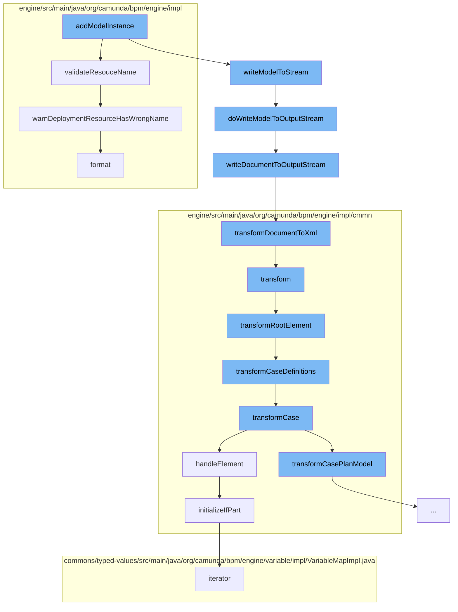

This document will cover the process of adding a model instance in the Camunda Platform, which includes:

1. Validating the resource name
2. Writing the model to a stream
3. Transforming the model to XML
4. Transforming the root element
5. Transforming case definitions
6. Handling elements and initializing parts
7. Warning about incorrect resource names.



<SwmSnippet path="/engine/src/main/java/org/camunda/bpm/engine/impl/repository/DeploymentBuilderImpl.java" line="142">

---

# Validating the resource name

The function `validateResouceName` is used to check if the resource name has the correct suffix. If it doesn't, a warning is logged.

```java
  private void validateResouceName(String resourceName, String[] resourceSuffixes) {
    if (!StringUtil.hasAnySuffix(resourceName, resourceSuffixes)) {
      LOG.warnDeploymentResourceHasWrongName(resourceName, resourceSuffixes);
    }
  }
```

---

</SwmSnippet>

<SwmSnippet path="/model-api/cmmn-model/src/main/java/org/camunda/bpm/model/cmmn/Cmmn.java" line="273">

---

# Writing the model to a stream

The function `doWriteModelToOutputStream` is used to write the model instance to an output stream. It first validates the model instance, then writes the XML document to the output stream.

```java
  protected void doWriteModelToOutputStream(OutputStream os, CmmnModelInstance modelInstance) {
    // validate DOM document
    doValidateModel(modelInstance);
    // write XML
    IoUtil.writeDocumentToOutputStream(modelInstance.getDocument(), os);
  }
```

---

</SwmSnippet>

<SwmSnippet path="/model-api/xml-model/src/main/java/org/camunda/bpm/model/xml/impl/util/IoUtil.java" line="124">

---

# Transforming the model to XML

The function `transformDocumentToXml` is used to transform the DOM document to XML output. It creates a new transformer and sets the output properties before transforming the document.

```java
  public static void transformDocumentToXml(DomDocument document, StreamResult result) {
    TransformerFactory transformerFactory = TransformerFactory.newInstance();
    try {
      Transformer transformer = transformerFactory.newTransformer();
      transformer.setOutputProperty(OutputKeys.ENCODING, "UTF-8");
      transformer.setOutputProperty(OutputKeys.INDENT, "yes");
      transformer.setOutputProperty("{http://xml.apache.org/xslt}indent-amount", "2");

      synchronized(document) {
        transformer.transform(document.getDomSource(), result);
      }
    } catch (TransformerConfigurationException e) {
      throw new ModelIoException("Unable to create a transformer for the model", e);
    } catch (TransformerException e) {
      throw new ModelIoException("Unable to transform model to xml", e);
    }
  }
```

---

</SwmSnippet>

<SwmSnippet path="/engine/src/main/java/org/camunda/bpm/engine/impl/cmmn/transformer/CmmnTransform.java" line="134">

---

# Transforming the root element

The function `transformRootElement` is used to transform the root element of the model. It first transforms the imports, then the case definitions.

```java
  protected void transformRootElement() {

    transformImports();
    transformCaseDefinitions();

    Definitions definitions = model.getDefinitions();
    for (CmmnTransformListener transformListener : transformListeners) {
      transformListener.transformRootElement(definitions, caseDefinitions);
    }

  }
```

---

</SwmSnippet>

<SwmSnippet path="/engine/src/main/java/org/camunda/bpm/engine/impl/cmmn/transformer/CmmnTransform.java" line="150">

---

# Transforming case definitions

The function `transformCaseDefinitions` is used to transform the case definitions in the model. It iterates over each case and transforms it.

```java
  protected void transformCaseDefinitions() {
    Definitions definitions = model.getDefinitions();

    Collection<Case> cases = definitions.getCases();

    for (Case currentCase : cases) {
      context.setCaseDefinition(null);
      context.setParent(null);
      CmmnCaseDefinition caseDefinition = transformCase(currentCase);
      caseDefinitions.add((CaseDefinitionEntity) caseDefinition);
    }
  }
```

---

</SwmSnippet>

<SwmSnippet path="/engine/src/main/java/org/camunda/bpm/engine/impl/cmmn/handler/SentryHandler.java" line="55">

---

# Handling elements and initializing parts

The function `handleElement` is used to handle each element in the case. It initializes the if part and variable on parts of the sentry declaration.

```java
  public CmmnSentryDeclaration handleElement(Sentry element, CmmnHandlerContext context) {

    String id = element.getId();
    Collection<OnPart> onParts = element.getOnParts();
    IfPart ifPart = element.getIfPart();
    List<CamundaVariableOnPart> variableOnParts = queryExtensionElementsByClass(element, CamundaVariableOnPart.class);

    if ((ifPart == null || ifPart.getConditions().isEmpty()) && variableOnParts.isEmpty()) {

      if (onParts == null || onParts.isEmpty()) {
        LOG.ignoredSentryWithMissingCondition(id);
        return null;
      } else {
        boolean atLeastOneOnPartsValid = false;

        for (OnPart onPart : onParts) {
          if (onPart instanceof PlanItemOnPart) {
            PlanItemOnPart planItemOnPart = (PlanItemOnPart) onPart;
            if (planItemOnPart.getSource() != null && planItemOnPart.getStandardEvent() != null) {
              atLeastOneOnPartsValid = true;
              break;
```

---

</SwmSnippet>

<SwmSnippet path="/engine/src/main/java/org/camunda/bpm/engine/impl/cmd/CommandLogger.java" line="228">

---

# Warning about incorrect resource names

The function `warnDeploymentResourceHasWrongName` is used to log a warning if the deployment resource has an incorrect name.

```java
  public void warnDeploymentResourceHasWrongName(String resourceName, String[] suffixes) {
    logWarn(
        "035",
        String.format("Deployment resource '%s' will be ignored as its name must have one of suffixes %s.",
            resourceName,
            Arrays.toString(suffixes)
            ));

  }
```

---

</SwmSnippet>

&nbsp;

*This is an auto-generated document by Swimm AI 🌊 and has not yet been verified by a human*

<SwmMeta version="3.0.0" repo-id="Z2l0aHViJTNBJTNBQ2l0aS1jYW11bmRhJTNBJTNBZ2lsYWRuYXZvdA==" repo-name="Citi-camunda" doc-type="flows"><sup>Powered by [Swimm](/)</sup></SwmMeta>
