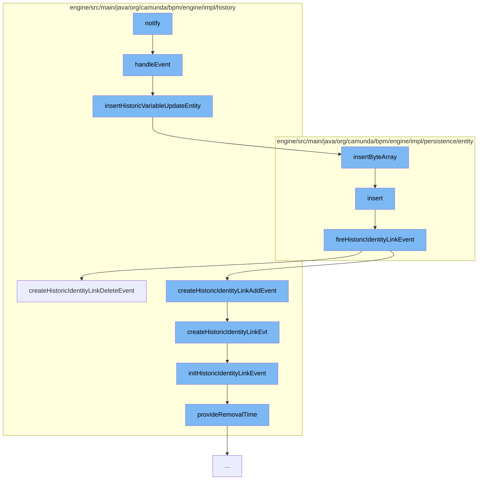

This document will cover the process of handling history events in the Camunda BPM engine, specifically focusing on the flow of adding a new historic identity link event. The steps include:

1. Handling the event
2. Inserting the historic variable update entity
3. Inserting the byte array
4. Inserting the identity link entity
5. Firing the historic identity link event
6. Creating the historic identity link add event
7. Initializing the historic identity link event
8. Providing the removal time.



<SwmSnippet path="/engine/src/main/java/org/camunda/bpm/engine/impl/history/handler/DbHistoryEventHandler.java" line="42">

---

# Handling the event

The `handleEvent` function is the entry point for handling history events. It checks the type of the event and calls the appropriate function to handle it. In this case, if the event is a `HistoricVariableUpdateEventEntity`, it calls `insertHistoricVariableUpdateEntity`.

```java
  public void handleEvent(HistoryEvent historyEvent) {

    if (historyEvent instanceof HistoricVariableUpdateEventEntity) {
      insertHistoricVariableUpdateEntity((HistoricVariableUpdateEventEntity) historyEvent);
    } else if(historyEvent instanceof HistoricDecisionEvaluationEvent) {
      insertHistoricDecisionEvaluationEvent((HistoricDecisionEvaluationEvent) historyEvent);
    } else {
      insertOrUpdate(historyEvent);
    }

  }
```

---

</SwmSnippet>

<SwmSnippet path="/engine/src/main/java/org/camunda/bpm/engine/impl/history/handler/DbHistoryEventHandler.java" line="87">

---

# Inserting the historic variable update entity

The `insertHistoricVariableUpdateEntity` function is responsible for inserting a `HistoricVariableUpdateEventEntity` into the database. If the event has a byte value, it also inserts a `ByteArrayEntity` into the database.

```java
  /** customized insert behavior for HistoricVariableUpdateEventEntity */
  protected void insertHistoricVariableUpdateEntity(HistoricVariableUpdateEventEntity historyEvent) {
    DbEntityManager dbEntityManager = getDbEntityManager();

    // insert update only if history level = FULL
    if(shouldWriteHistoricDetail(historyEvent)) {

      // insert byte array entity (if applicable)
      byte[] byteValue = historyEvent.getByteValue();
      if(byteValue != null) {
        ByteArrayEntity byteArrayEntity = new ByteArrayEntity(historyEvent.getVariableName(), byteValue, ResourceTypes.HISTORY);
        byteArrayEntity.setRootProcessInstanceId(historyEvent.getRootProcessInstanceId());
        byteArrayEntity.setRemovalTime(historyEvent.getRemovalTime());

        Context
        .getCommandContext()
        .getByteArrayManager()
        .insertByteArray(byteArrayEntity);
        historyEvent.setByteArrayId(byteArrayEntity.getId());

      }
```

---

</SwmSnippet>

<SwmSnippet path="/engine/src/main/java/org/camunda/bpm/engine/impl/persistence/entity/ByteArrayManager.java" line="44">

---

# Inserting the byte array

The `insertByteArray` function inserts a `ByteArrayEntity` into the database. This is used to store the byte value of a `HistoricVariableUpdateEventEntity`.

```java
  public void insertByteArray(ByteArrayEntity arr) {
    arr.setCreateTime(ClockUtil.getCurrentTime());
    getDbEntityManager().insert(arr);
  }
```

---

</SwmSnippet>

<SwmSnippet path="/engine/src/main/java/org/camunda/bpm/engine/impl/persistence/entity/IdentityLinkEntity.java" line="82">

---

# Inserting the identity link entity

The `insert` function inserts an `IdentityLinkEntity` into the database and then fires a historic identity link event.

```java
  public void insert() {
    Context
      .getCommandContext()
      .getDbEntityManager()
      .insert(this);
    fireHistoricIdentityLinkEvent(HistoryEventTypes.IDENTITY_LINK_ADD);
  }
```

---

</SwmSnippet>

<SwmSnippet path="/engine/src/main/java/org/camunda/bpm/engine/impl/persistence/entity/IdentityLinkEntity.java" line="204">

---

# Firing the historic identity link event

The `fireHistoricIdentityLinkEvent` function fires a historic identity link event. Depending on the event type, it either creates a historic identity link add event or a historic identity link delete event.

```java
  public void fireHistoricIdentityLinkEvent(final HistoryEventType eventType) {
    ProcessEngineConfigurationImpl processEngineConfiguration = Context.getProcessEngineConfiguration();

    HistoryLevel historyLevel = processEngineConfiguration.getHistoryLevel();
    if(historyLevel.isHistoryEventProduced(eventType, this)) {

      HistoryEventProcessor.processHistoryEvents(new HistoryEventProcessor.HistoryEventCreator() {
        @Override
        public HistoryEvent createHistoryEvent(HistoryEventProducer producer) {
          HistoryEvent event = null;
          if (HistoryEvent.IDENTITY_LINK_ADD.equals(eventType.getEventName())) {
            event = producer.createHistoricIdentityLinkAddEvent(IdentityLinkEntity.this);
          } else if (HistoryEvent.IDENTITY_LINK_DELETE.equals(eventType.getEventName())) {
            event = producer.createHistoricIdentityLinkDeleteEvent(IdentityLinkEntity.this);
          }
          return event;
        }
      });

    }
  }
```

---

</SwmSnippet>

<SwmSnippet path="/engine/src/main/java/org/camunda/bpm/engine/impl/history/producer/DefaultHistoryEventProducer.java" line="945">

---

# Creating the historic identity link add event

The `createHistoricIdentityLinkAddEvent` function creates a historic identity link add event by calling `createHistoricIdentityLinkEvt`.

```java
  @Override
  public HistoryEvent createHistoricIdentityLinkDeleteEvent(IdentityLink identityLink) {
    return createHistoricIdentityLinkEvt(identityLink, HistoryEventTypes.IDENTITY_LINK_DELETE);
  }
```

---

</SwmSnippet>

<SwmSnippet path="/engine/src/main/java/org/camunda/bpm/engine/impl/history/producer/DefaultHistoryEventProducer.java" line="962">

---

# Initializing the historic identity link event

The `initHistoricIdentityLinkEvent` function initializes a historic identity link event. It sets various properties of the event, such as the time, type, user ID, group ID, task ID, tenant ID, operation type, and event type.

```java
  protected void initHistoricIdentityLinkEvent(HistoricIdentityLinkLogEventEntity evt, IdentityLink identityLink, HistoryEventType eventType) {

    if (identityLink.getTaskId() != null) {
      TaskEntity task = Context
          .getCommandContext()
          .getTaskManager()
          .findTaskById(identityLink.getTaskId());

      evt.setProcessDefinitionId(task.getProcessDefinitionId());

      if (task.getProcessDefinition() != null) {
        evt.setProcessDefinitionKey(task.getProcessDefinition().getKey());
      }

      ExecutionEntity execution = task.getExecution();
      if (execution != null) {
        evt.setRootProcessInstanceId(execution.getRootProcessInstanceId());

        if (isHistoryRemovalTimeStrategyStart()) {
          provideRemovalTime(evt);
        }
```

---

</SwmSnippet>

<SwmSnippet path="/engine/src/main/java/org/camunda/bpm/engine/impl/history/producer/DefaultHistoryEventProducer.java" line="1300">

---

# Providing the removal time

The `provideRemovalTime` function calculates and sets the removal time for a historic batch entity.

```java
  protected void provideRemovalTime(HistoricBatchEntity historicBatch) {
    Date removalTime = calculateRemovalTime(historicBatch);
    if (removalTime != null) {
      historicBatch.setRemovalTime(removalTime);
    }
  }
```

---

</SwmSnippet>

&nbsp;

*This is an auto-generated document by Swimm AI 🌊 and has not yet been verified by a human*

<SwmMeta version="3.0.0" repo-id="Z2l0aHViJTNBJTNBQ2l0aS1jYW11bmRhJTNBJTNBZ2lsYWRuYXZvdA==" repo-name="Citi-camunda" doc-type="flows"><sup>Powered by [Swimm](/)</sup></SwmMeta>
