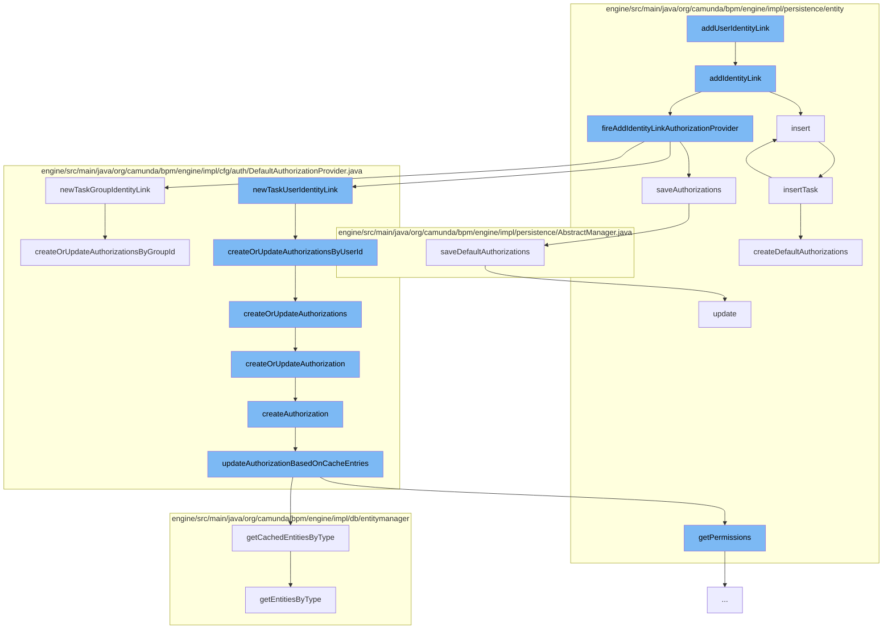

This document will cover the process of adding a user identity link in the Camunda Platform, which includes:

1. Adding the identity link
2. Inserting the task
3. Creating or updating authorizations by user ID
4. Creating or updating authorizations
5. Creating or updating a single authorization
6. Creating an authorization
7. Updating the authorization based on cache entries
8. Saving default authorizations
9. Updating the authorization



<SwmSnippet path="/engine/src/main/java/org/camunda/bpm/engine/impl/persistence/entity/TaskEntity.java" line="726">

---

# Adding the identity link

The `addIdentityLink` function is the starting point of the flow. It creates a new identity link and inserts it into the database. It then fires the `fireAddIdentityLinkAuthorizationProvider` function to handle authorization.

```java
  // task assignment //////////////////////////////////////////////////////////

  public IdentityLinkEntity addIdentityLink(String userId, String groupId, String type) {
    ensureTaskActive();

    IdentityLinkEntity identityLink = newIdentityLink(userId, groupId, type);
    identityLink.insert();
    getIdentityLinks().add(identityLink);

    fireAddIdentityLinkAuthorizationProvider(type, userId, groupId);
    return identityLink;
  }
```

---

</SwmSnippet>

<SwmSnippet path="/engine/src/main/java/org/camunda/bpm/engine/impl/persistence/entity/TaskEntity.java" line="238">

---

# Inserting the task

The `insert` function is called to insert the task into the task manager.

```java
  public void insert() {
    CommandContext commandContext = Context.getCommandContext();
    TaskManager taskManager = commandContext.getTaskManager();
    taskManager.insertTask(this);
  }
```

---

</SwmSnippet>

<SwmSnippet path="/engine/src/main/java/org/camunda/bpm/engine/impl/cfg/auth/DefaultAuthorizationProvider.java" line="257">

---

# Creating or updating authorizations by user ID

The `createOrUpdateAuthorizationsByUserId` function is called to create or update authorizations for a specific user ID.

```java
  protected AuthorizationEntity[] createOrUpdateAuthorizationsByUserId(Task task, String userId) {
    return createOrUpdateAuthorizations(task, null, userId);
  }
```

---

</SwmSnippet>

<SwmSnippet path="/engine/src/main/java/org/camunda/bpm/engine/impl/cfg/auth/DefaultAuthorizationProvider.java" line="261">

---

# Creating or updating authorizations

The `createOrUpdateAuthorizations` function is called to create or update authorizations. It checks if historic instance permissions are enabled and creates or updates the authorization accordingly.

```java
  /**
   * (1) Fetch existing runtime & history authorizations
   * (2) Update authorizations:
   *     (2a) fetched authorization == null
   *         ->  create a new runtime authorization (with READ, (UPDATE/TASK_WORK) permission,
   *             and READ_VARIABLE if enabled)
   *         ->  create a new history authorization (with READ on HISTORIC_TASK)
   *     (2b) fetched authorization != null
   *         ->  Add READ, (UPDATE/TASK_WORK) permission, and READ_VARIABLE if enabled
   *             UPDATE or TASK_WORK permission is configurable in camunda.cfg.xml and by default,
   *             UPDATE permission is provided
   *         ->  Add READ on HISTORIC_TASK
   */
  protected AuthorizationEntity[] createOrUpdateAuthorizations(Task task, String groupId,
                                                               String userId) {

    boolean enforceSpecificVariablePermission = isEnforceSpecificVariablePermission();

    Permission[] runtimeTaskPermissions = getRuntimePermissions(enforceSpecificVariablePermission);

    AuthorizationEntity runtimeAuthorization = createOrUpdateAuthorization(task, userId, groupId,
```

---

</SwmSnippet>

<SwmSnippet path="/engine/src/main/java/org/camunda/bpm/engine/impl/cfg/auth/DefaultAuthorizationProvider.java" line="298">

---

# Creating or updating a single authorization

The `createOrUpdateAuthorization` function is called to create or update a single authorization. If the authorization does not exist, it creates a new one. If it does exist, it adds the necessary permissions.

```java
  protected AuthorizationEntity createOrUpdateAuthorization(Task task, String userId,
                                                            String groupId, Resource resource,
                                                            boolean isHistoric,
                                                            Permission... permissions) {

    String taskId = task.getId();

    AuthorizationEntity authorization = getGrantAuthorization(taskId, userId, groupId, resource);

    if (authorization == null) {
      authorization = createAuthorization(userId, groupId, resource, taskId, permissions);

      if (isHistoric) {
        provideRemovalTime(authorization, task);
      }

    } else {
      addPermissions(authorization, permissions);

    }

```

---

</SwmSnippet>

<SwmSnippet path="/engine/src/main/java/org/camunda/bpm/engine/impl/cfg/auth/DefaultAuthorizationProvider.java" line="425">

---

# Creating an authorization

The `createAuthorization` function is called to create a new authorization. It then calls the `updateAuthorizationBasedOnCacheEntries` function to update the authorization based on cache entries.

```java
  protected AuthorizationEntity createAuthorization(String userId, String groupId,
                                                    Resource resource, String resourceId,
                                                    Permission... permissions) {
    AuthorizationEntity authorization =
        createGrantAuthorization(userId, groupId, resource, resourceId, permissions);

    updateAuthorizationBasedOnCacheEntries(authorization, userId, groupId, resource, resourceId);

    return authorization;
  }
```

---

</SwmSnippet>

<SwmSnippet path="/engine/src/main/java/org/camunda/bpm/engine/impl/cfg/auth/DefaultAuthorizationProvider.java" line="479">

---

# Updating the authorization based on cache entries

The `updateAuthorizationBasedOnCacheEntries` function is called to update the authorization based on cache entries. It checks if there is an authorization with the same rights in the cache and updates the authorization accordingly.

```java
  /**
   * Searches through the cache, if there is already an authorization with same rights. If that's the case
   * update the given authorization with the permissions and remove the old one from the cache.
   */
  protected void updateAuthorizationBasedOnCacheEntries(AuthorizationEntity authorization, String userId, String groupId,
                                                        Resource resource, String resourceId) {
    DbEntityManager dbManager = Context.getCommandContext().getDbEntityManager();
    List<AuthorizationEntity> list = dbManager.getCachedEntitiesByType(AuthorizationEntity.class);
    for (AuthorizationEntity authEntity : list) {
      boolean hasSameAuthRights = hasEntitySameAuthorizationRights(authEntity, userId, groupId, resource, resourceId);
      if (hasSameAuthRights) {
        int previousPermissions = authEntity.getPermissions();
        authorization.setPermissions(previousPermissions);
        dbManager.getDbEntityCache().remove(authEntity);
        return;
      }
    }
  }
```

---

</SwmSnippet>

<SwmSnippet path="/engine/src/main/java/org/camunda/bpm/engine/impl/persistence/AbstractManager.java" line="295">

---

# Saving default authorizations

The `saveDefaultAuthorizations` function is called to save the default authorizations. It checks if there are any authorizations and inserts or updates them in the authorization manager.

```java
  public void saveDefaultAuthorizations(final AuthorizationEntity[] authorizations) {
    if(authorizations != null && authorizations.length > 0) {
      Context.getCommandContext().runWithoutAuthorization(new Callable<Void>() {
        public Void call() {
          AuthorizationManager authorizationManager = getAuthorizationManager();
          for (AuthorizationEntity authorization : authorizations) {

            if(authorization.getId() == null) {
              authorizationManager.insert(authorization);
            } else {
              authorizationManager.update(authorization);
            }

          }
          return null;
        }
      });
    }
  }
```

---

</SwmSnippet>

<SwmSnippet path="/engine/src/main/java/org/camunda/bpm/engine/impl/persistence/entity/AuthorizationManager.java" line="181">

---

# Updating the authorization

Finally, the `update` function is called to update the authorization in the database.

```java
  public void update(AuthorizationEntity authorization) {
    checkAuthorization(UPDATE, AUTHORIZATION, authorization.getId());
    getDbEntityManager().merge(authorization);
  }
```

---

</SwmSnippet>

&nbsp;

*This is an auto-generated document by Swimm AI 🌊 and has not yet been verified by a human*

<SwmMeta version="3.0.0" repo-id="Z2l0aHViJTNBJTNBQ2l0aS1jYW11bmRhJTNBJTNBZ2lsYWRuYXZvdA==" repo-name="Citi-camunda" doc-type="flows"><sup>Powered by [Swimm](/)</sup></SwmMeta>
