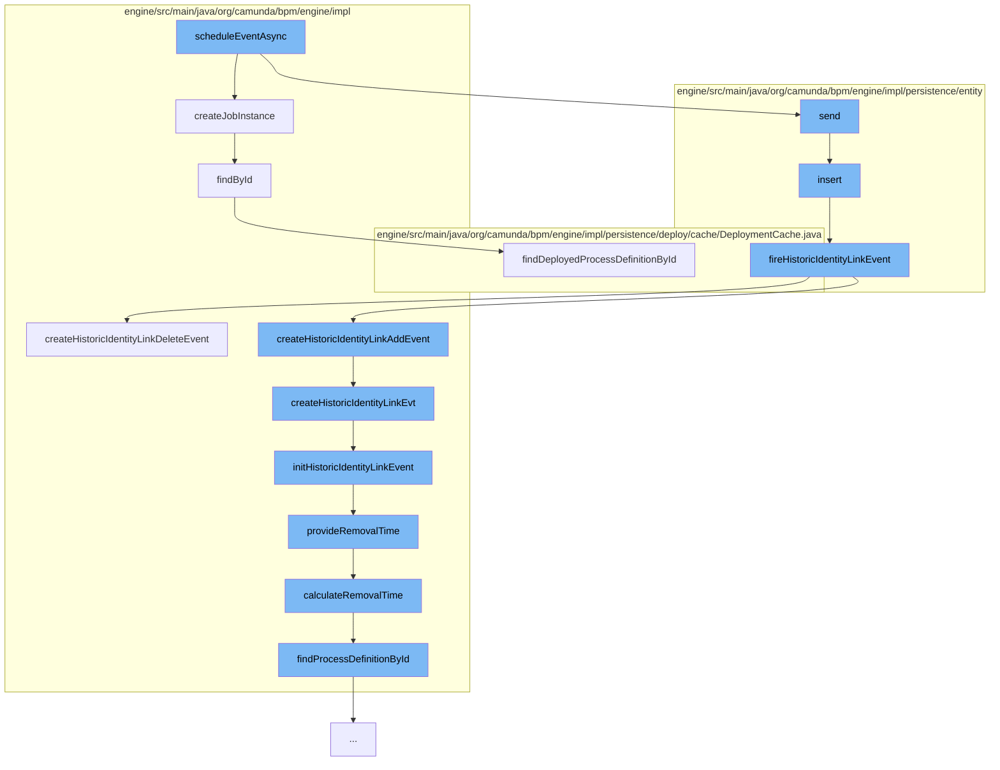

This document will cover the process of scheduling an event asynchronously in the Camunda Platform, which includes:

1. Creating a job instance
2. Sending the job to the Job Manager
3. Inserting an Identity Link
4. Firing a Historic Identity Link Event
5. Creating a Historic Identity Link Event
6. Initializing the Historic Identity Link Event
7. Providing a Removal Time
8. Calculating the Removal Time
9. Finding the Process Definition by ID.



<SwmSnippet path="/engine/src/main/java/org/camunda/bpm/engine/impl/jobexecutor/JobDeclaration.java" line="66">

---

# Creating a Job Instance

The `createJobInstance` function is responsible for creating a new job instance. It sets various properties of the job such as job definition id, job handler configuration, job handler type, and others. It also sets the priority of the job if the process engine configuration is set to produce prioritized jobs.

```java
  // Job instance factory //////////////////////////////////////////

  /**
   *
   * @return the created Job instances
   */
  public T createJobInstance(S context) {

    T job = newJobInstance(context);

    // set job definition id
    String jobDefinitionId = resolveJobDefinitionId(context);
    job.setJobDefinitionId(jobDefinitionId);

    if(jobDefinitionId != null) {

      JobDefinitionEntity jobDefinition = Context.getCommandContext()
        .getJobDefinitionManager()
        .findById(jobDefinitionId);

      if(jobDefinition != null) {
```

---

</SwmSnippet>

<SwmSnippet path="/engine/src/main/java/org/camunda/bpm/engine/impl/persistence/entity/JobManager.java" line="1">

---

# Sending the Job to the Job Manager

The `send` function in the Job Manager is responsible for sending the job to the Job Manager for execution.

```java
/*
```

---

</SwmSnippet>

<SwmSnippet path="/engine/src/main/java/org/camunda/bpm/engine/impl/persistence/entity/IdentityLinkEntity.java" line="82">

---

# Inserting an Identity Link

The `insert` function is responsible for inserting an Identity Link. After the insertion, it fires a Historic Identity Link Event of type `IDENTITY_LINK_ADD`.

```java
  public void insert() {
    Context
      .getCommandContext()
      .getDbEntityManager()
      .insert(this);
    fireHistoricIdentityLinkEvent(HistoryEventTypes.IDENTITY_LINK_ADD);
  }
```

---

</SwmSnippet>

<SwmSnippet path="/engine/src/main/java/org/camunda/bpm/engine/impl/persistence/entity/IdentityLinkEntity.java" line="204">

---

# Firing a Historic Identity Link Event

The `fireHistoricIdentityLinkEvent` function is responsible for firing a Historic Identity Link Event. It checks if the history level allows for the event to be produced and then processes the history events.

```java
  public void fireHistoricIdentityLinkEvent(final HistoryEventType eventType) {
    ProcessEngineConfigurationImpl processEngineConfiguration = Context.getProcessEngineConfiguration();

    HistoryLevel historyLevel = processEngineConfiguration.getHistoryLevel();
    if(historyLevel.isHistoryEventProduced(eventType, this)) {

      HistoryEventProcessor.processHistoryEvents(new HistoryEventProcessor.HistoryEventCreator() {
        @Override
        public HistoryEvent createHistoryEvent(HistoryEventProducer producer) {
          HistoryEvent event = null;
          if (HistoryEvent.IDENTITY_LINK_ADD.equals(eventType.getEventName())) {
            event = producer.createHistoricIdentityLinkAddEvent(IdentityLinkEntity.this);
          } else if (HistoryEvent.IDENTITY_LINK_DELETE.equals(eventType.getEventName())) {
            event = producer.createHistoricIdentityLinkDeleteEvent(IdentityLinkEntity.this);
          }
          return event;
        }
      });

    }
  }
```

---

</SwmSnippet>

<SwmSnippet path="/engine/src/main/java/org/camunda/bpm/engine/impl/history/producer/DefaultHistoryEventProducer.java" line="945">

---

# Creating a Historic Identity Link Event

The `createHistoricIdentityLinkDeleteEvent` function is responsible for creating a Historic Identity Link Event of type `IDENTITY_LINK_DELETE`.

```java
  @Override
  public HistoryEvent createHistoricIdentityLinkDeleteEvent(IdentityLink identityLink) {
    return createHistoricIdentityLinkEvt(identityLink, HistoryEventTypes.IDENTITY_LINK_DELETE);
  }
```

---

</SwmSnippet>

<SwmSnippet path="/engine/src/main/java/org/camunda/bpm/engine/impl/history/producer/DefaultHistoryEventProducer.java" line="962">

---

# Initializing the Historic Identity Link Event

The `initHistoricIdentityLinkEvent` function is responsible for initializing the Historic Identity Link Event. It sets various properties of the event such as process definition id, process definition key, tenant id, and others. It also provides a removal time if the history removal time strategy is set to start.

```java
  protected void initHistoricIdentityLinkEvent(HistoricIdentityLinkLogEventEntity evt, IdentityLink identityLink, HistoryEventType eventType) {

    if (identityLink.getTaskId() != null) {
      TaskEntity task = Context
          .getCommandContext()
          .getTaskManager()
          .findTaskById(identityLink.getTaskId());

      evt.setProcessDefinitionId(task.getProcessDefinitionId());

      if (task.getProcessDefinition() != null) {
        evt.setProcessDefinitionKey(task.getProcessDefinition().getKey());
      }

      ExecutionEntity execution = task.getExecution();
      if (execution != null) {
        evt.setRootProcessInstanceId(execution.getRootProcessInstanceId());

        if (isHistoryRemovalTimeStrategyStart()) {
          provideRemovalTime(evt);
        }
```

---

</SwmSnippet>

<SwmSnippet path="/engine/src/main/java/org/camunda/bpm/engine/impl/history/producer/DefaultHistoryEventProducer.java" line="1300">

---

# Providing a Removal Time

The `provideRemovalTime` function is responsible for providing a removal time for the Historic Batch Entity. It calculates the removal time and sets it if it is not null.

```java
  protected void provideRemovalTime(HistoricBatchEntity historicBatch) {
    Date removalTime = calculateRemovalTime(historicBatch);
    if (removalTime != null) {
      historicBatch.setRemovalTime(removalTime);
    }
  }
```

---

</SwmSnippet>

<SwmSnippet path="/engine/src/main/java/org/camunda/bpm/engine/impl/history/producer/DefaultHistoryEventProducer.java" line="1285">

---

# Calculating the Removal Time

The `calculateRemovalTime` function is responsible for calculating the removal time for the Historic Event. It finds the process definition by id and then calculates the removal time.

```java
  protected Date calculateRemovalTime(HistoryEvent historyEvent) {
    String processDefinitionId = historyEvent.getProcessDefinitionId();
    ProcessDefinition processDefinition = findProcessDefinitionById(processDefinitionId);

    return Context.getProcessEngineConfiguration()
      .getHistoryRemovalTimeProvider()
      .calculateRemovalTime((HistoricProcessInstanceEventEntity) historyEvent, processDefinition);
  }
```

---

</SwmSnippet>

<SwmSnippet path="/engine/src/main/java/org/camunda/bpm/engine/impl/history/producer/DefaultHistoryEventProducer.java" line="1326">

---

# Finding the Process Definition by ID

The `findProcessDefinitionById` function is responsible for finding the process definition by id. It uses the deployment cache to find the deployed process definition by id.

```java
  protected ProcessDefinition findProcessDefinitionById(String processDefinitionId) {
    return Context.getCommandContext()
      .getProcessEngineConfiguration()
      .getDeploymentCache()
      .findDeployedProcessDefinitionById(processDefinitionId);
  }
```

---

</SwmSnippet>

&nbsp;

*This is an auto-generated document by Swimm AI 🌊 and has not yet been verified by a human*

<SwmMeta version="3.0.0" repo-id="Z2l0aHViJTNBJTNBQ2l0aS1jYW11bmRhJTNBJTNBZ2lsYWRuYXZvdA==" repo-name="Citi-camunda" doc-type="flows"><sup>Powered by [Swimm](/)</sup></SwmMeta>
