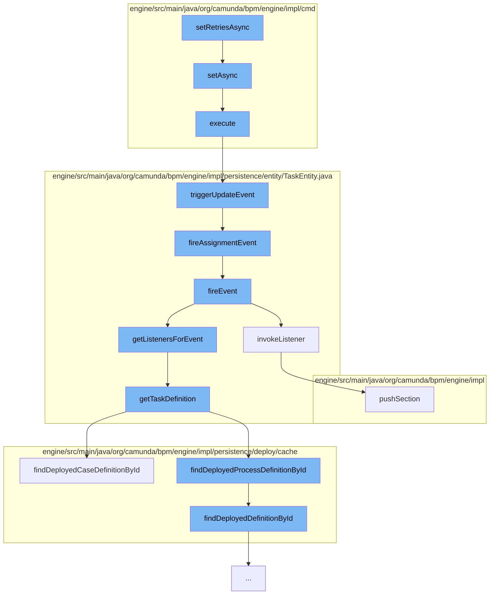

This document will cover the process of setting retries asynchronously in the Camunda BPMN engine. The steps include:

1. Setting retries asynchronously
2. Executing the set operation
3. Triggering an update event
4. Firing an assignment event
5. Firing a task event
6. Invoking a task listener
7. Getting the task definition
8. Finding the deployed process definition
9. Pushing a new section in the process data context.



<SwmSnippet path="/engine/src/main/java/org/camunda/bpm/engine/impl/cmd/UpdateExternalTaskRetriesBuilderImpl.java" line="106">

---

# Setting retries asynchronously

The `setAsync` method in `UpdateExternalTaskRetriesBuilderImpl` class sets the number of retries for a task and executes the `SetExternalTasksRetriesBatchCmd` command.

```java
  @Override
  public Batch setAsync(int retries) {
    this.retries = retries;
    return commandExecutor.execute(new SetExternalTasksRetriesBatchCmd(this));
  }
```

---

</SwmSnippet>

<SwmSnippet path="/engine/src/main/java/org/camunda/bpm/engine/impl/cmd/AbstractSetTaskPropertyCmd.java" line="73">

---

# Executing the set operation

The `execute` method in `AbstractSetTaskPropertyCmd` class validates the task and performs the set operation, then triggers an update event.

```java
  @Override
  public Void execute(CommandContext context) {
    TaskEntity task = validateAndGet(taskId, context);

    executeSetOperation(task, value);

    task.triggerUpdateEvent();
    logOperation(context, task);

    return null;
  }
```

---

</SwmSnippet>

<SwmSnippet path="/engine/src/main/java/org/camunda/bpm/engine/impl/persistence/entity/TaskEntity.java" line="1202">

---

# Triggering an update event

The `triggerUpdateEvent` method in `TaskEntity` class triggers an update event if the task is in the created state. It also fires an assignment event.

```java
  public boolean triggerUpdateEvent() {
    if (lifecycleState == TaskState.STATE_CREATED) {
      registerCommandContextCloseListener();
      setLastUpdated(ClockUtil.getCurrentTime());
      setTaskState(TaskState.STATE_UPDATED.taskState);
      return fireEvent(TaskListener.EVENTNAME_UPDATE) && fireAssignmentEvent();
    }
    else {
      // silently ignore; no events are triggered in the other states
      return true;
    }
  }
```

---

</SwmSnippet>

<SwmSnippet path="/engine/src/main/java/org/camunda/bpm/engine/impl/persistence/entity/TaskEntity.java" line="1229">

---

# Firing an assignment event

The `fireAssignmentEvent` method in `TaskEntity` class fires an assignment event if there is a change in the assignee property of the task.

```java
  protected boolean fireAssignmentEvent() {
    PropertyChange assigneePropertyChange = propertyChanges.get(ASSIGNEE);
    if (assigneePropertyChange != null) {
      return fireEvent(TaskListener.EVENTNAME_ASSIGNMENT);
    }

    return true;
  }
```

---

</SwmSnippet>

<SwmSnippet path="/engine/src/main/java/org/camunda/bpm/engine/impl/persistence/entity/TaskEntity.java" line="1032">

---

# Firing a task event

The `fireEvent` method in `TaskEntity` class fires a task event and invokes the task listener for each event listener associated with the task event.

```java
  /**
   * @return true if invoking the listener was successful;
   *   if not successful, either false is returned (case: BPMN error propagation)
   *   or an exception is thrown
   */
  public boolean fireEvent(String taskEventName) {

    List<TaskListener> taskEventListeners = getListenersForEvent(taskEventName);

    if (taskEventListeners != null) {
      for (TaskListener taskListener : taskEventListeners) {
        if (!invokeListener(taskEventName, taskListener)){
          return false;
        }
      }
    }

    return true;
  }
```

---

</SwmSnippet>

<SwmSnippet path="/engine/src/main/java/org/camunda/bpm/engine/impl/persistence/entity/TaskEntity.java" line="1076">

---

# Invoking a task listener

The `invokeListener` method in `TaskEntity` class invokes the task listener and pushes a new section in the process data context.

```java
  protected boolean invokeListener(String taskEventName, TaskListener taskListener) {
    boolean popProcessDataContext = false;
    CommandInvocationContext commandInvocationContext = Context.getCommandInvocationContext();
    CoreExecution execution = getExecution();
    if (execution == null) {
      execution = getCaseExecution();
    } else {
      if (commandInvocationContext != null) {
        popProcessDataContext = commandInvocationContext.getProcessDataContext().pushSection((ExecutionEntity) execution);
      }
    }
    if (execution != null) {
      setEventName(taskEventName);
    }
    try {
      boolean result = invokeListener(execution, taskEventName, taskListener);
      if (popProcessDataContext) {
        commandInvocationContext.getProcessDataContext().popSection();
      }
      return result;
    } catch (Exception e) {
```

---

</SwmSnippet>

<SwmSnippet path="/engine/src/main/java/org/camunda/bpm/engine/impl/persistence/entity/TaskEntity.java" line="1322">

---

# Getting the task definition

The `getTaskDefinition` method in `TaskEntity` class retrieves the task definition based on the process or case definition ID.

```java
  public TaskDefinition getTaskDefinition() {
    if (taskDefinition==null && taskDefinitionKey!=null) {

      Map<String, TaskDefinition> taskDefinitions = null;
      if (processDefinitionId != null) {
        ProcessDefinitionEntity processDefinition = Context
            .getProcessEngineConfiguration()
            .getDeploymentCache()
            .findDeployedProcessDefinitionById(processDefinitionId);

        taskDefinitions = processDefinition.getTaskDefinitions();

      } else {
        CaseDefinitionEntity caseDefinition = Context
            .getProcessEngineConfiguration()
            .getDeploymentCache()
            .findDeployedCaseDefinitionById(caseDefinitionId);

        taskDefinitions = caseDefinition.getTaskDefinitions();
      }

```

---

</SwmSnippet>

<SwmSnippet path="/engine/src/main/java/org/camunda/bpm/engine/impl/persistence/deploy/cache/DeploymentCache.java" line="158">

---

# Finding the deployed process definition

The `findDeployedCaseDefinitionById` method in `DeploymentCache` class retrieves the deployed case definition by its ID.

```java
  public CaseDefinitionEntity findDeployedCaseDefinitionById(String caseDefinitionId) {
    return caseDefinitionCache.findDeployedDefinitionById(caseDefinitionId);
  }
```

---

</SwmSnippet>

<SwmSnippet path="/engine/src/main/java/org/camunda/bpm/engine/impl/interceptor/ProcessDataContext.java" line="164">

---

# Pushing a new section in the process data context

The `pushSection` method in `ProcessDataContext` class starts a new section that keeps track of the pushed properties.

```java
  /**
   * Start a new section that keeps track of the pushed properties.
   *
   * If logging context properties are defined, the MDC is updated as well. This
   * also includes clearing the MDC for the first section that is pushed for the
   * logging context so that only the current properties will be present in the
   * MDC (might be less than previously present in the MDC). The previous
   * logging context needs to be reset in the MDC when this one is closed. This
   * can be achieved by using {@link #updateMdc(String)} with the previous
   * logging context.
   *
   * @param execution
   *          the execution to retrieve the context data from
   *
   * @return <code>true</code> if the section contains any updates and therefore
   *         should be popped later by {@link #popSection()}
   */
  public boolean pushSection(ExecutionEntity execution) {
    if (handleMdc && hasNoMdcValues()) {
      clearMdc();
    }
```

---

</SwmSnippet>

&nbsp;

*This is an auto-generated document by Swimm AI 🌊 and has not yet been verified by a human*

<SwmMeta version="3.0.0" repo-id="Z2l0aHViJTNBJTNBQ2l0aS1jYW11bmRhJTNBJTNBZ2lsYWRuYXZvdA==" repo-name="Citi-camunda" doc-type="flows"><sup>Powered by [Swimm](/)</sup></SwmMeta>
