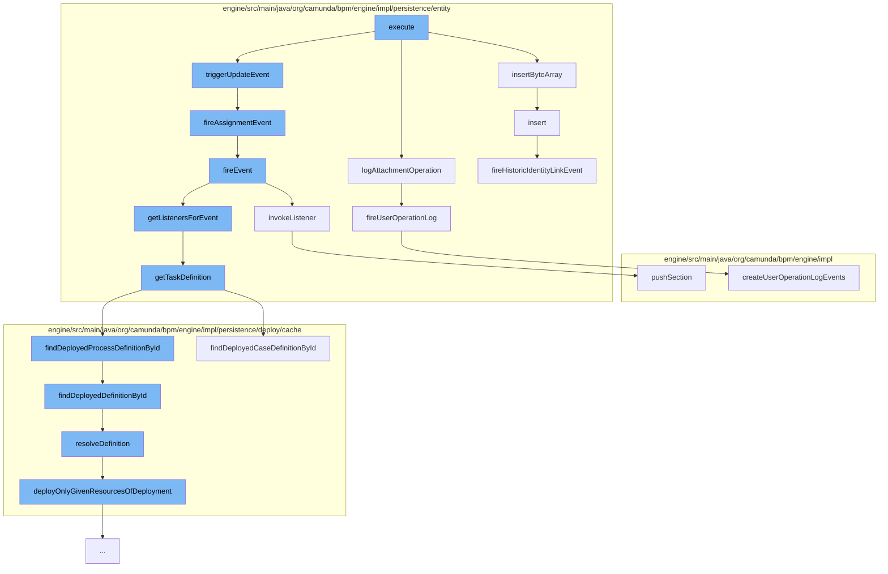

This document will cover the process of creating an attachment in the Camunda workflow engine. The steps include:

 1. Execution of the CreateAttachmentCmd
 2. Insertion of ByteArray
 3. Logging of Attachment Operation
 4. Triggering of Update Event
 5. Firing of Assignment Event
 6. Firing of Event
 7. Invoking Listener
 8. Getting Task Definition
 9. Finding Deployed Process Definition by ID
10. Resolving Definition
11. Pushing Section
12. Firing User Operation Log
13. Inserting Identity Link Entity



<SwmSnippet path="/engine/src/main/java/org/camunda/bpm/engine/impl/cmd/CreateAttachmentCmd.java" line="1">

---

# Execution of the CreateAttachmentCmd

The `execute` function in `CreateAttachmentCmd.java` initiates the process of creating an attachment. It calls several other functions to complete this process.

```java
/*
 * Copyright Camunda Services GmbH and/or licensed to Camunda Services GmbH
 * under one or more contributor license agreements. See the NOTICE file
 * distributed with this work for additional information regarding copyright
 * ownership. Camunda licenses this file to you under the Apache License,
 * Version 2.0; you may not use this file except in compliance with the License.
 * You may obtain a copy of the License at
 *
 *     http://www.apache.org/licenses/LICENSE-2.0
 *
 * Unless required by applicable law or agreed to in writing, software
 * distributed under the License is distributed on an "AS IS" BASIS,
 * WITHOUT WARRANTIES OR CONDITIONS OF ANY KIND, either express or implied.
 * See the License for the specific language governing permissions and
 * limitations under the License.
 */
package org.camunda.bpm.engine.impl.cmd;

import java.io.InputStream;
import java.util.Date;
import java.util.List;
```

---

</SwmSnippet>

<SwmSnippet path="/engine/src/main/java/org/camunda/bpm/engine/impl/persistence/entity/ByteArrayManager.java" line="44">

---

# Insertion of ByteArray

The `insertByteArray` function is called to insert a ByteArrayEntity into the database. The current time is set as the creation time of the ByteArrayEntity.

```java
  public void insertByteArray(ByteArrayEntity arr) {
    arr.setCreateTime(ClockUtil.getCurrentTime());
    getDbEntityManager().insert(arr);
  }
```

---

</SwmSnippet>

<SwmSnippet path="/engine/src/main/java/org/camunda/bpm/engine/impl/persistence/entity/UserOperationLogManager.java" line="779">

---

# Logging of Attachment Operation

The `logAttachmentOperation` function logs the operation of creating an attachment. It calls the `fireUserOperationLog` function to create user operation log events.

```java
  protected void fireUserOperationLog(final UserOperationLogContext context) {
    if (context.getUserId() == null) {
      context.setUserId(getAuthenticatedUserId());
    }

    HistoryEventProcessor.processHistoryEvents(new HistoryEventProcessor.HistoryEventCreator() {
      @Override
      public List<HistoryEvent> createHistoryEvents(HistoryEventProducer producer) {
        return producer.createUserOperationLogEvents(context);
      }
    });
  }
```

---

</SwmSnippet>

<SwmSnippet path="/engine/src/main/java/org/camunda/bpm/engine/impl/persistence/entity/TaskEntity.java" line="1">

---

# Triggering of Update Event

The `triggerUpdateEvent` function triggers an update event in the task entity.

```java
/*
 * Copyright Camunda Services GmbH and/or licensed to Camunda Services GmbH
 * under one or more contributor license agreements. See the NOTICE file
 * distributed with this work for additional information regarding copyright
 * ownership. Camunda licenses this file to you under the Apache License,
 * Version 2.0; you may not use this file except in compliance with the License.
 * You may obtain a copy of the License at
 *
 *     http://www.apache.org/licenses/LICENSE-2.0
 *
 * Unless required by applicable law or agreed to in writing, software
 * distributed under the License is distributed on an "AS IS" BASIS,
 * WITHOUT WARRANTIES OR CONDITIONS OF ANY KIND, either express or implied.
 * See the License for the specific language governing permissions and
 * limitations under the License.
 */
package org.camunda.bpm.engine.impl.persistence.entity;

import static org.camunda.bpm.engine.delegate.TaskListener.EVENTNAME_DELETE;
import static org.camunda.bpm.engine.impl.form.handler.DefaultFormHandler.FORM_REF_BINDING_VERSION;
import static org.camunda.bpm.engine.impl.util.EnsureUtil.ensureNotNull;
```

---

</SwmSnippet>

<SwmSnippet path="/engine/src/main/java/org/camunda/bpm/engine/impl/persistence/entity/TaskEntity.java" line="1229">

---

# Firing of Assignment Event

The `fireAssignmentEvent` function fires an assignment event if there is a change in the assignee property of the task.

```java
  protected boolean fireAssignmentEvent() {
    PropertyChange assigneePropertyChange = propertyChanges.get(ASSIGNEE);
    if (assigneePropertyChange != null) {
      return fireEvent(TaskListener.EVENTNAME_ASSIGNMENT);
    }

    return true;
  }
```

---

</SwmSnippet>

<SwmSnippet path="/engine/src/main/java/org/camunda/bpm/engine/impl/persistence/entity/TaskEntity.java" line="1032">

---

# Firing of Event

The `fireEvent` function fires a task event and invokes the corresponding task listeners.

```java
  /**
   * @return true if invoking the listener was successful;
   *   if not successful, either false is returned (case: BPMN error propagation)
   *   or an exception is thrown
   */
  public boolean fireEvent(String taskEventName) {

    List<TaskListener> taskEventListeners = getListenersForEvent(taskEventName);

    if (taskEventListeners != null) {
      for (TaskListener taskListener : taskEventListeners) {
        if (!invokeListener(taskEventName, taskListener)){
          return false;
        }
      }
    }

    return true;
  }
```

---

</SwmSnippet>

<SwmSnippet path="/engine/src/main/java/org/camunda/bpm/engine/impl/persistence/entity/TaskEntity.java" line="1076">

---

# Invoking Listener

The `invokeListener` function invokes a task listener for a given task event.

```java
  protected boolean invokeListener(String taskEventName, TaskListener taskListener) {
    boolean popProcessDataContext = false;
    CommandInvocationContext commandInvocationContext = Context.getCommandInvocationContext();
    CoreExecution execution = getExecution();
    if (execution == null) {
      execution = getCaseExecution();
    } else {
      if (commandInvocationContext != null) {
        popProcessDataContext = commandInvocationContext.getProcessDataContext().pushSection((ExecutionEntity) execution);
      }
    }
    if (execution != null) {
      setEventName(taskEventName);
    }
    try {
      boolean result = invokeListener(execution, taskEventName, taskListener);
      if (popProcessDataContext) {
        commandInvocationContext.getProcessDataContext().popSection();
      }
      return result;
    } catch (Exception e) {
```

---

</SwmSnippet>

<SwmSnippet path="/engine/src/main/java/org/camunda/bpm/engine/impl/persistence/entity/TaskEntity.java" line="1322">

---

# Getting Task Definition

The `getTaskDefinition` function retrieves the task definition for the task entity.

```java
  public TaskDefinition getTaskDefinition() {
    if (taskDefinition==null && taskDefinitionKey!=null) {

      Map<String, TaskDefinition> taskDefinitions = null;
      if (processDefinitionId != null) {
        ProcessDefinitionEntity processDefinition = Context
            .getProcessEngineConfiguration()
            .getDeploymentCache()
            .findDeployedProcessDefinitionById(processDefinitionId);

        taskDefinitions = processDefinition.getTaskDefinitions();

      } else {
        CaseDefinitionEntity caseDefinition = Context
            .getProcessEngineConfiguration()
            .getDeploymentCache()
            .findDeployedCaseDefinitionById(caseDefinitionId);

        taskDefinitions = caseDefinition.getTaskDefinitions();
      }

```

---

</SwmSnippet>

<SwmSnippet path="/engine/src/main/java/org/camunda/bpm/engine/impl/persistence/deploy/cache/DeploymentCache.java" line="158">

---

# Finding Deployed Process Definition by ID

The `findDeployedProcessDefinitionById` function finds the deployed process definition by its ID.

```java
  public CaseDefinitionEntity findDeployedCaseDefinitionById(String caseDefinitionId) {
    return caseDefinitionCache.findDeployedDefinitionById(caseDefinitionId);
  }
```

---

</SwmSnippet>

<SwmSnippet path="/engine/src/main/java/org/camunda/bpm/engine/impl/persistence/deploy/cache/ResourceDefinitionCache.java" line="111">

---

# Resolving Definition

The `resolveDefinition` function resolves the definition of a resource. It deploys the resource if it is not already deployed.

```java
  public T resolveDefinition(T definition) {
    String definitionId = definition.getId();
    String deploymentId = definition.getDeploymentId();
    T cachedDefinition = cache.get(definitionId);
    if (cachedDefinition == null) {
      synchronized (this) {
        cachedDefinition = cache.get(definitionId);
        if (cachedDefinition == null) {
          DeploymentEntity deployment = Context
              .getCommandContext()
              .getDeploymentManager()
              .findDeploymentById(deploymentId);
          deployment.setNew(false);
          cacheDeployer.deployOnlyGivenResourcesOfDeployment(deployment, definition.getResourceName(), definition.getDiagramResourceName());
          cachedDefinition = cache.get(definitionId);
        }
      }
      checkInvalidDefinitionWasCached(deploymentId, definitionId, cachedDefinition);
    }
    if (cachedDefinition != null) {
      cachedDefinition.updateModifiableFieldsFromEntity(definition);
```

---

</SwmSnippet>

<SwmSnippet path="/engine/src/main/java/org/camunda/bpm/engine/impl/interceptor/ProcessDataContext.java" line="164">

---

# Pushing Section

The `pushSection` function starts a new section that keeps track of the pushed properties.

```java
  /**
   * Start a new section that keeps track of the pushed properties.
   *
   * If logging context properties are defined, the MDC is updated as well. This
   * also includes clearing the MDC for the first section that is pushed for the
   * logging context so that only the current properties will be present in the
   * MDC (might be less than previously present in the MDC). The previous
   * logging context needs to be reset in the MDC when this one is closed. This
   * can be achieved by using {@link #updateMdc(String)} with the previous
   * logging context.
   *
   * @param execution
   *          the execution to retrieve the context data from
   *
   * @return <code>true</code> if the section contains any updates and therefore
   *         should be popped later by {@link #popSection()}
   */
  public boolean pushSection(ExecutionEntity execution) {
    if (handleMdc && hasNoMdcValues()) {
      clearMdc();
    }
```

---

</SwmSnippet>

<SwmSnippet path="/engine/src/main/java/org/camunda/bpm/engine/impl/persistence/entity/UserOperationLogManager.java" line="779">

---

# Firing User Operation Log

The `fireUserOperationLog` function creates user operation log events.

```java
  protected void fireUserOperationLog(final UserOperationLogContext context) {
    if (context.getUserId() == null) {
      context.setUserId(getAuthenticatedUserId());
    }

    HistoryEventProcessor.processHistoryEvents(new HistoryEventProcessor.HistoryEventCreator() {
      @Override
      public List<HistoryEvent> createHistoryEvents(HistoryEventProducer producer) {
        return producer.createUserOperationLogEvents(context);
      }
    });
  }
```

---

</SwmSnippet>

<SwmSnippet path="/engine/src/main/java/org/camunda/bpm/engine/impl/persistence/entity/IdentityLinkEntity.java" line="82">

---

# Inserting Identity Link Entity

The `insert` function inserts an IdentityLinkEntity into the database and fires a historic identity link event.

```java
  public void insert() {
    Context
      .getCommandContext()
      .getDbEntityManager()
      .insert(this);
    fireHistoricIdentityLinkEvent(HistoryEventTypes.IDENTITY_LINK_ADD);
  }
```

---

</SwmSnippet>

&nbsp;

*This is an auto-generated document by Swimm AI 🌊 and has not yet been verified by a human*

<SwmMeta version="3.0.0" repo-id="Z2l0aHViJTNBJTNBQ2l0aS1jYW11bmRhJTNBJTNBZ2lsYWRuYXZvdA==" repo-name="Citi-camunda" doc-type="flows"><sup>Powered by [Swimm](/)</sup></SwmMeta>
