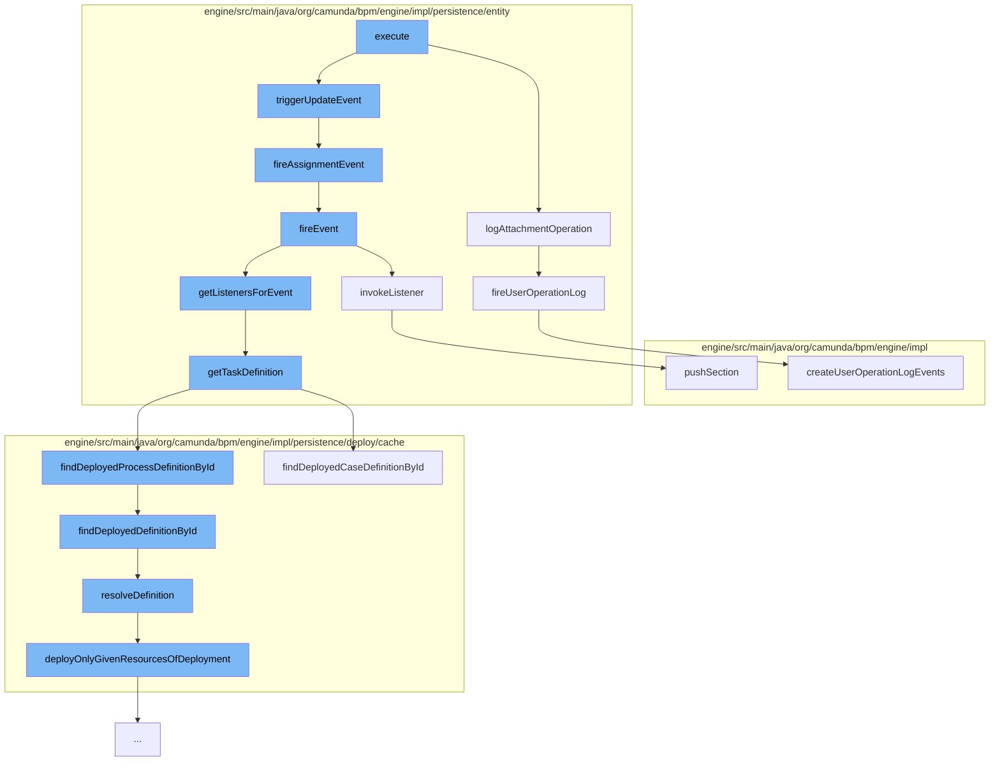

This document will cover the process of deleting an attachment in the Camunda BPMN engine. The process includes the following steps:

 1. Executing the delete attachment command
 2. Logging the attachment operation
 3. Triggering an update event
 4. Firing an assignment event
 5. Firing an event
 6. Invoking a listener
 7. Getting the task definition
 8. Finding the deployed process definition by ID
 9. Resolving the definition
10. Pushing a section
11. Firing a user operation log
12. Creating a user operation log event.



<SwmSnippet path="/engine/src/main/java/org/camunda/bpm/engine/impl/cmd/DeleteAttachmentCmd.java" line="1">

---

# Executing the delete attachment command

The process begins with the execution of the `DeleteAttachmentCmd` command. This command is responsible for initiating the deletion of an attachment in the Camunda BPMN engine.

```java
/*
 * Copyright Camunda Services GmbH and/or licensed to Camunda Services GmbH
 * under one or more contributor license agreements. See the NOTICE file
 * distributed with this work for additional information regarding copyright
 * ownership. Camunda licenses this file to you under the Apache License,
 * Version 2.0; you may not use this file except in compliance with the License.
 * You may obtain a copy of the License at
 *
 *     http://www.apache.org/licenses/LICENSE-2.0
 *
```

---

</SwmSnippet>

<SwmSnippet path="/engine/src/main/java/org/camunda/bpm/engine/impl/persistence/entity/UserOperationLogManager.java" line="468">

---

# Logging the attachment operation

The `logAttachmentOperation` function logs the operation of deleting an attachment. It creates a new `UserOperationLogContext` and adds an entry to it before firing the user operation log.

```java
  public void logAttachmentOperation(String operation, TaskEntity task, PropertyChange propertyChange) {
    if (isUserOperationLogEnabled()) {
      UserOperationLogContext context = new UserOperationLogContext();

      UserOperationLogContextEntryBuilder entryBuilder =
          UserOperationLogContextEntryBuilder.entry(operation, EntityTypes.ATTACHMENT)
            .category(UserOperationLogEntry.CATEGORY_TASK_WORKER)
            .inContextOf(task, Arrays.asList(propertyChange));
      context.addEntry(entryBuilder.create());

      fireUserOperationLog(context);
    }
  }
```

---

</SwmSnippet>

<SwmSnippet path="/engine/src/main/java/org/camunda/bpm/engine/impl/persistence/entity/TaskEntity.java" line="1">

---

# Triggering an update event

The `triggerUpdateEvent` function is called next, which is responsible for triggering an update event in the task entity.

```java
/*
 * Copyright Camunda Services GmbH and/or licensed to Camunda Services GmbH
 * under one or more contributor license agreements. See the NOTICE file
 * distributed with this work for additional information regarding copyright
 * ownership. Camunda licenses this file to you under the Apache License,
 * Version 2.0; you may not use this file except in compliance with the License.
 * You may obtain a copy of the License at
 *
 *     http://www.apache.org/licenses/LICENSE-2.0
 *
```

---

</SwmSnippet>

<SwmSnippet path="/engine/src/main/java/org/camunda/bpm/engine/impl/persistence/entity/TaskEntity.java" line="1229">

---

# Firing an assignment event

The `fireAssignmentEvent` function is then called to fire an assignment event. This function checks if there is a property change for the assignee and if so, fires an event.

```java
  protected boolean fireAssignmentEvent() {
    PropertyChange assigneePropertyChange = propertyChanges.get(ASSIGNEE);
    if (assigneePropertyChange != null) {
      return fireEvent(TaskListener.EVENTNAME_ASSIGNMENT);
    }

    return true;
  }
```

---

</SwmSnippet>

<SwmSnippet path="/engine/src/main/java/org/camunda/bpm/engine/impl/persistence/entity/TaskEntity.java" line="1032">

---

# Firing an event

The `fireEvent` function is called to fire an event. It retrieves the listeners for the event and invokes each listener.

```java
  /**
   * @return true if invoking the listener was successful;
   *   if not successful, either false is returned (case: BPMN error propagation)
   *   or an exception is thrown
   */
  public boolean fireEvent(String taskEventName) {

    List<TaskListener> taskEventListeners = getListenersForEvent(taskEventName);

    if (taskEventListeners != null) {
      for (TaskListener taskListener : taskEventListeners) {
        if (!invokeListener(taskEventName, taskListener)){
          return false;
        }
      }
    }

    return true;
  }
```

---

</SwmSnippet>

<SwmSnippet path="/engine/src/main/java/org/camunda/bpm/engine/impl/persistence/entity/TaskEntity.java" line="1076">

---

# Invoking a listener

The `invokeListener` function is called to invoke a task listener. It pushes a section to the process data context and invokes the listener.

```java
  protected boolean invokeListener(String taskEventName, TaskListener taskListener) {
    boolean popProcessDataContext = false;
    CommandInvocationContext commandInvocationContext = Context.getCommandInvocationContext();
    CoreExecution execution = getExecution();
    if (execution == null) {
      execution = getCaseExecution();
    } else {
      if (commandInvocationContext != null) {
        popProcessDataContext = commandInvocationContext.getProcessDataContext().pushSection((ExecutionEntity) execution);
      }
    }
    if (execution != null) {
      setEventName(taskEventName);
    }
    try {
      boolean result = invokeListener(execution, taskEventName, taskListener);
      if (popProcessDataContext) {
        commandInvocationContext.getProcessDataContext().popSection();
      }
      return result;
    } catch (Exception e) {
```

---

</SwmSnippet>

<SwmSnippet path="/engine/src/main/java/org/camunda/bpm/engine/impl/persistence/entity/TaskEntity.java" line="1322">

---

# Getting the task definition

The `getTaskDefinition` function is called to get the task definition. It checks if a task definition exists for the task definition key and if not, it finds the deployed process definition by ID.

```java
  public TaskDefinition getTaskDefinition() {
    if (taskDefinition==null && taskDefinitionKey!=null) {

      Map<String, TaskDefinition> taskDefinitions = null;
      if (processDefinitionId != null) {
        ProcessDefinitionEntity processDefinition = Context
            .getProcessEngineConfiguration()
            .getDeploymentCache()
            .findDeployedProcessDefinitionById(processDefinitionId);

        taskDefinitions = processDefinition.getTaskDefinitions();

      } else {
        CaseDefinitionEntity caseDefinition = Context
            .getProcessEngineConfiguration()
            .getDeploymentCache()
            .findDeployedCaseDefinitionById(caseDefinitionId);

        taskDefinitions = caseDefinition.getTaskDefinitions();
      }

```

---

</SwmSnippet>

<SwmSnippet path="/engine/src/main/java/org/camunda/bpm/engine/impl/persistence/deploy/cache/DeploymentCache.java" line="158">

---

# Finding the deployed process definition by ID

The `findDeployedProcessDefinitionById` function is called to find the deployed process definition by its ID. It retrieves the definition from the cache.

```java
  public CaseDefinitionEntity findDeployedCaseDefinitionById(String caseDefinitionId) {
    return caseDefinitionCache.findDeployedDefinitionById(caseDefinitionId);
  }
```

---

</SwmSnippet>

<SwmSnippet path="/engine/src/main/java/org/camunda/bpm/engine/impl/persistence/deploy/cache/ResourceDefinitionCache.java" line="111">

---

# Resolving the definition

The `resolveDefinition` function is called to resolve the definition. It checks if the definition is in the cache and if not, it deploys the resources of the deployment.

```java
  public T resolveDefinition(T definition) {
    String definitionId = definition.getId();
    String deploymentId = definition.getDeploymentId();
    T cachedDefinition = cache.get(definitionId);
    if (cachedDefinition == null) {
      synchronized (this) {
        cachedDefinition = cache.get(definitionId);
        if (cachedDefinition == null) {
          DeploymentEntity deployment = Context
              .getCommandContext()
              .getDeploymentManager()
              .findDeploymentById(deploymentId);
          deployment.setNew(false);
          cacheDeployer.deployOnlyGivenResourcesOfDeployment(deployment, definition.getResourceName(), definition.getDiagramResourceName());
          cachedDefinition = cache.get(definitionId);
        }
      }
      checkInvalidDefinitionWasCached(deploymentId, definitionId, cachedDefinition);
    }
    if (cachedDefinition != null) {
      cachedDefinition.updateModifiableFieldsFromEntity(definition);
```

---

</SwmSnippet>

<SwmSnippet path="/engine/src/main/java/org/camunda/bpm/engine/impl/interceptor/ProcessDataContext.java" line="164">

---

# Pushing a section

The `pushSection` function is called to push a section to the process data context. It adds the current context data to the stack and seals the current section.

```java
  /**
   * Start a new section that keeps track of the pushed properties.
   *
   * If logging context properties are defined, the MDC is updated as well. This
   * also includes clearing the MDC for the first section that is pushed for the
   * logging context so that only the current properties will be present in the
   * MDC (might be less than previously present in the MDC). The previous
   * logging context needs to be reset in the MDC when this one is closed. This
   * can be achieved by using {@link #updateMdc(String)} with the previous
   * logging context.
   *
   * @param execution
   *          the execution to retrieve the context data from
   *
   * @return <code>true</code> if the section contains any updates and therefore
   *         should be popped later by {@link #popSection()}
   */
  public boolean pushSection(ExecutionEntity execution) {
    if (handleMdc && hasNoMdcValues()) {
      clearMdc();
    }
```

---

</SwmSnippet>

<SwmSnippet path="/engine/src/main/java/org/camunda/bpm/engine/impl/persistence/entity/UserOperationLogManager.java" line="779">

---

# Firing a user operation log

The `fireUserOperationLog` function is called to fire a user operation log. It sets the user ID in the context and processes the history events.

```java
  protected void fireUserOperationLog(final UserOperationLogContext context) {
    if (context.getUserId() == null) {
      context.setUserId(getAuthenticatedUserId());
    }

    HistoryEventProcessor.processHistoryEvents(new HistoryEventProcessor.HistoryEventCreator() {
      @Override
      public List<HistoryEvent> createHistoryEvents(HistoryEventProducer producer) {
        return producer.createUserOperationLogEvents(context);
      }
    });
  }
```

---

</SwmSnippet>

<SwmSnippet path="/engine/src/main/java/org/camunda/bpm/engine/impl/history/producer/DefaultHistoryEventProducer.java" line="820">

---

# Creating a user operation log event

Finally, the `createUserOperationLogEvents` function is called to create user operation log events. It initializes the operation ID in the context and creates a new `UserOperationLogEntryEventEntity` for each property change.

```java
  // User Operation Logs ///////////////////////////

  public List<HistoryEvent> createUserOperationLogEvents(UserOperationLogContext context) {
    List<HistoryEvent> historyEvents = new ArrayList<HistoryEvent>();

    String operationId = Context.getCommandContext().getOperationId();
    context.setOperationId(operationId);

    for (UserOperationLogContextEntry entry : context.getEntries()) {
      for (PropertyChange propertyChange : entry.getPropertyChanges()) {
        UserOperationLogEntryEventEntity evt = new UserOperationLogEntryEventEntity();

        initUserOperationLogEvent(evt, context, entry, propertyChange);

        historyEvents.add(evt);
      }
    }

    return historyEvents;
  }
```

---

</SwmSnippet>

&nbsp;

*This is an auto-generated document by Swimm AI 🌊 and has not yet been verified by a human*

<SwmMeta version="3.0.0" repo-id="Z2l0aHViJTNBJTNBQ2l0aS1jYW11bmRhJTNBJTNBZ2lsYWRuYXZvdA==" repo-name="Citi-camunda" doc-type="flows"><sup>Powered by [Swimm](/)</sup></SwmMeta>
