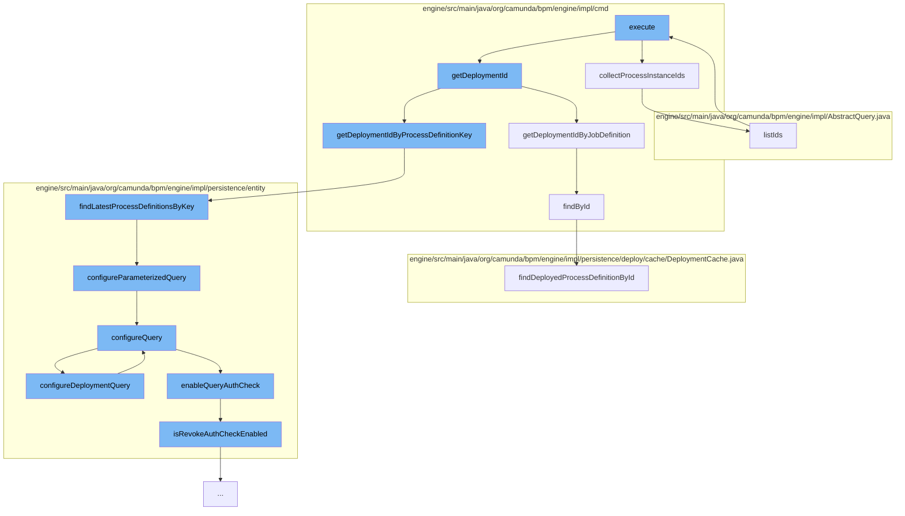

This document will cover the process of executing a batch command in the Camunda BPM engine, which includes:

1. Collecting process instance IDs
2. Retrieving deployment ID
3. Finding latest process definitions by key
4. Configuring parameterized query
5. Enabling query authorization check
6. Retrieving process definition by ID
7. Listing IDs
8. Executing the query.



<SwmSnippet path="/engine/src/main/java/org/camunda/bpm/engine/impl/cmd/AbstractSetExternalTaskRetriesCmd.java" line="44">

---

# Collecting process instance IDs

The function `collectProcessInstanceIds` is used to gather all the process instance IDs related to the current task. It checks both active and historic process instances.

```java
  protected List<String> collectProcessInstanceIds() {

    Set<String> collectedProcessInstanceIds = new HashSet<>();

    List<String> processInstanceIds = builder.getProcessInstanceIds();
    if (processInstanceIds != null && !processInstanceIds.isEmpty()) {
      collectedProcessInstanceIds.addAll(processInstanceIds);
    }

    ProcessInstanceQueryImpl processInstanceQuery = (ProcessInstanceQueryImpl) builder.getProcessInstanceQuery();
    if (processInstanceQuery != null) {
      collectedProcessInstanceIds.addAll(processInstanceQuery.listIds());
    }

    HistoricProcessInstanceQueryImpl historicProcessInstanceQuery = (HistoricProcessInstanceQueryImpl) builder.getHistoricProcessInstanceQuery();
    if (historicProcessInstanceQuery != null) {
      collectedProcessInstanceIds.addAll(historicProcessInstanceQuery.listIds());
    }

    return new ArrayList<>(collectedProcessInstanceIds);
  }
```

---

</SwmSnippet>

<SwmSnippet path="/engine/src/main/java/org/camunda/bpm/engine/impl/cmd/AbstractSetStateCmd.java" line="169">

---

# Retrieving deployment ID

The function `getDeploymentIdByJobDefinition` retrieves the deployment ID associated with a given job definition. It uses the job definition ID to find the corresponding process definition and then retrieves its deployment ID.

```java
  protected String getDeploymentIdByJobDefinition(CommandContext commandContext, String jobDefinitionId) {
    JobDefinitionManager jobDefinitionManager = commandContext.getJobDefinitionManager();
    JobDefinitionEntity jobDefinition = jobDefinitionManager.findById(jobDefinitionId);
    if (jobDefinition != null) {
      if (jobDefinition.getProcessDefinitionId() != null) {
        return getDeploymentIdByProcessDefinition(commandContext, jobDefinition.getProcessDefinitionId());
      }
    }
    return null;
  }
```

---

</SwmSnippet>

<SwmSnippet path="/engine/src/main/java/org/camunda/bpm/engine/impl/persistence/entity/ProcessDefinitionManager.java" line="82">

---

# Finding latest process definitions by key

The function `findLatestProcessDefinitionsByKey` is used to find the latest versions of the process definition with the given key. It uses a parameterized query to retrieve the results.

```java
  /**
   * @return the latest versions of the process definition with the given key (from any tenant),
   *         contains multiple elements if more than one tenant has a process definition with
   *         the given key
   *
   * @see #findLatestProcessDefinitionByKey(String)
   */
  @SuppressWarnings("unchecked")
  public List<ProcessDefinitionEntity> findLatestProcessDefinitionsByKey(String processDefinitionKey) {
    return getDbEntityManager().selectList("selectLatestProcessDefinitionByKey", configureParameterizedQuery(processDefinitionKey));
  }
```

---

</SwmSnippet>

<SwmSnippet path="/engine/src/main/java/org/camunda/bpm/engine/impl/persistence/entity/ProcessDefinitionManager.java" line="398">

---

# Configuring parameterized query

The function `configureParameterizedQuery` is used to configure the query with the given parameter. It delegates the configuration to the tenant manager.

```java
  protected ListQueryParameterObject configureParameterizedQuery(Object parameter) {
    return getTenantManager().configureQuery(parameter);
  }
```

---

</SwmSnippet>

<SwmSnippet path="/engine/src/main/java/org/camunda/bpm/engine/impl/persistence/entity/AuthorizationManager.java" line="389">

---

# Enabling query authorization check

The function `enableQueryAuthCheck` is used to enable the authorization check for the query. It sets the user ID and group IDs for the authorization check.

```java
  public void enableQueryAuthCheck(AuthorizationCheck authCheck) {
    List<String> authGroupIds = authCheck.getAuthGroupIds();
    String authUserId = authCheck.getAuthUserId();

    authCheck.setAuthorizationCheckEnabled(true);
    authCheck.setAuthGroupIds(filterAuthenticatedGroupIds(authGroupIds));
    authCheck.setRevokeAuthorizationCheckEnabled(isRevokeAuthCheckEnabled(authUserId, authGroupIds));
  }
```

---

</SwmSnippet>

<SwmSnippet path="/engine/src/main/java/org/camunda/bpm/engine/impl/cmd/GetDeployedProcessDefinitionCmd.java" line="78">

---

# Retrieving process definition by ID

The function `findById` retrieves the deployed process definition by its ID. It uses the deployment cache to find the process definition.

```java
  protected ProcessDefinitionEntity findById(DeploymentCache deploymentCache, String processDefinitionId) {
    return deploymentCache.findDeployedProcessDefinitionById(processDefinitionId);
  }
```

---

</SwmSnippet>

<SwmSnippet path="/engine/src/main/java/org/camunda/bpm/engine/impl/AbstractQuery.java" line="352">

---

# Listing IDs

The function `listIds` is used to list the IDs of the results of the query. It executes the query and returns the list of IDs.

```java
  @SuppressWarnings("unchecked")
  public List<String> listIds() {
    this.resultType = ResultType.LIST_IDS;
    List<String> ids = null;
    if (commandExecutor != null) {
      ids = (List<String>) commandExecutor.execute(this);
    } else {
      ids = evaluateExpressionsAndExecuteIdsList(Context.getCommandContext());
    }

    if (ids != null) {
      QueryMaxResultsLimitUtil.checkMaxResultsLimit(ids.size());
    }

    return ids;
  }
```

---

</SwmSnippet>

<SwmSnippet path="/engine/src/main/java/org/camunda/bpm/engine/impl/AbstractQuery.java" line="191">

---

# Executing the query

The function `execute` is used to execute the query based on the result type. It evaluates the expressions and executes the appropriate type of query.

```java
  public Object execute(CommandContext commandContext) {
    if (resultType==ResultType.LIST) {
      return evaluateExpressionsAndExecuteList(commandContext, null);
    } else if (resultType==ResultType.SINGLE_RESULT) {
      return executeSingleResult(commandContext);
    } else if (resultType==ResultType.LIST_PAGE) {
      return evaluateExpressionsAndExecuteList(commandContext, null);
    } else if (resultType == ResultType.LIST_IDS) {
      return evaluateExpressionsAndExecuteIdsList(commandContext);
    } else if (resultType == ResultType.LIST_DEPLOYMENT_ID_MAPPINGS) {
      return evaluateExpressionsAndExecuteDeploymentIdMappingsList(commandContext);
    } else {
      return evaluateExpressionsAndExecuteCount(commandContext);
    }
  }
```

---

</SwmSnippet>

&nbsp;

*This is an auto-generated document by Swimm AI 🌊 and has not yet been verified by a human*

<SwmMeta version="3.0.0" repo-id="Z2l0aHViJTNBJTNBQ2l0aS1jYW11bmRhJTNBJTNBZ2lsYWRuYXZvdA==" repo-name="Citi-camunda" doc-type="flows"><sup>Powered by [Swimm](/)</sup></SwmMeta>
