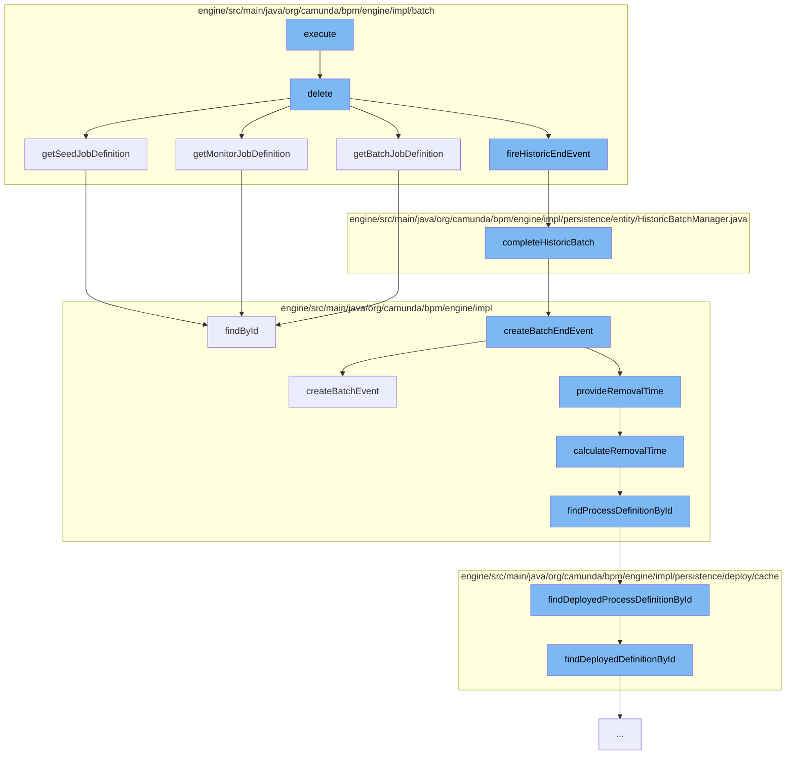

This document will cover the process of deleting a batch in the Camunda BPM engine. The process includes the following steps:

1. Executing the delete command
2. Deleting the seed, monitor, and batch job definitions
3. Firing the historic end event
4. Completing the historic batch
5. Creating the batch end event
6. Calculating the removal time
7. Finding the process definition by ID



<SwmSnippet path="/engine/src/main/java/org/camunda/bpm/engine/impl/batch/DeleteBatchCmd.java" line="1">

---

# Executing the delete command

The `execute` function in `DeleteBatchCmd.java` initiates the process of deleting a batch. It calls the `delete` function in `BatchEntity.java` to perform the actual deletion.

```java
/*
 * Copyright Camunda Services GmbH and/or licensed to Camunda Services GmbH
 * under one or more contributor license agreements. See the NOTICE file
 * distributed with this work for additional information regarding copyright
 * ownership. Camunda licenses this file to you under the Apache License,
 * Version 2.0; you may not use this file except in compliance with the License.
 * You may obtain a copy of the License at
 *
 *     http://www.apache.org/licenses/LICENSE-2.0
 *
```

---

</SwmSnippet>

<SwmSnippet path="/engine/src/main/java/org/camunda/bpm/engine/impl/batch/BatchEntity.java" line="359">

---

# Deleting the seed, monitor, and batch job definitions

The `delete` function in `BatchEntity.java` deletes the seed, monitor, and batch job definitions. It does this by calling the `getSeedJobDefinition`, `getMonitorJobDefinition`, and `getBatchJobDefinition` functions respectively.

```java
  public void delete(boolean cascadeToHistory, boolean deleteJobs) {
    CommandContext commandContext = Context.getCommandContext();

    if (Batch.TYPE_SET_VARIABLES.equals(type) ||
        Batch.TYPE_PROCESS_INSTANCE_MIGRATION.equals(type) ||
        Batch.TYPE_CORRELATE_MESSAGE.equals(type)) {
      deleteVariables(commandContext);
    }

    deleteSeedJob();
    deleteMonitorJob();
    if (deleteJobs) {
      getBatchJobHandler().deleteJobs(this);
    }

    JobDefinitionManager jobDefinitionManager = commandContext.getJobDefinitionManager();
    jobDefinitionManager.delete(getSeedJobDefinition());
    jobDefinitionManager.delete(getMonitorJobDefinition());
    jobDefinitionManager.delete(getBatchJobDefinition());
```

---

</SwmSnippet>

<SwmSnippet path="/engine/src/main/java/org/camunda/bpm/engine/impl/batch/BatchEntity.java" line="382">

---

# Firing the historic end event

After deleting the job definitions, the `delete` function fires the historic end event by calling the `fireHistoricEndEvent` function.

```java
    fireHistoricEndEvent();
```

---

</SwmSnippet>

<SwmSnippet path="/engine/src/main/java/org/camunda/bpm/engine/impl/persistence/entity/HistoricBatchManager.java" line="112">

---

# Completing the historic batch

The `fireHistoricEndEvent` function completes the historic batch by calling the `completeHistoricBatch` function in `HistoricBatchManager.java`.

```java
  public void completeHistoricBatch(final BatchEntity batch) {
    ProcessEngineConfigurationImpl configuration = Context.getProcessEngineConfiguration();

    HistoryLevel historyLevel = configuration.getHistoryLevel();
    if(historyLevel.isHistoryEventProduced(HistoryEventTypes.BATCH_END, batch)) {

      HistoryEventProcessor.processHistoryEvents(new HistoryEventProcessor.HistoryEventCreator() {
        @Override
        public HistoryEvent createHistoryEvent(HistoryEventProducer producer) {
          return producer.createBatchEndEvent(batch);
        }
      });
    }
  }
```

---

</SwmSnippet>

<SwmSnippet path="/engine/src/main/java/org/camunda/bpm/engine/impl/history/producer/DefaultHistoryEventProducer.java" line="1030">

---

# Creating the batch end event

The `completeHistoricBatch` function creates the batch end event by calling the `createBatchEndEvent` function in `DefaultHistoryEventProducer.java`.

```java
  @Override
  public HistoryEvent createBatchEndEvent(Batch batch) {
    HistoryEvent historicBatch = createBatchEvent((BatchEntity) batch, HistoryEventTypes.BATCH_END);

    if (isHistoryRemovalTimeStrategyEnd()) {
      provideRemovalTime((HistoricBatchEntity) historicBatch);

      addRemovalTimeToHistoricJobLog((HistoricBatchEntity) historicBatch);
      addRemovalTimeToHistoricIncidents((HistoricBatchEntity) historicBatch);
    }

    return historicBatch;
  }
```

---

</SwmSnippet>

<SwmSnippet path="/engine/src/main/java/org/camunda/bpm/engine/impl/history/producer/DefaultHistoryEventProducer.java" line="1285">

---

# Calculating the removal time

The `createBatchEndEvent` function calculates the removal time by calling the `calculateRemovalTime` function.

```java
  protected Date calculateRemovalTime(HistoryEvent historyEvent) {
    String processDefinitionId = historyEvent.getProcessDefinitionId();
    ProcessDefinition processDefinition = findProcessDefinitionById(processDefinitionId);

    return Context.getProcessEngineConfiguration()
      .getHistoryRemovalTimeProvider()
      .calculateRemovalTime((HistoricProcessInstanceEventEntity) historyEvent, processDefinition);
  }
```

---

</SwmSnippet>

<SwmSnippet path="/engine/src/main/java/org/camunda/bpm/engine/impl/history/producer/DefaultHistoryEventProducer.java" line="1326">

---

# Finding the process definition by ID

The `calculateRemovalTime` function finds the process definition by ID by calling the `findProcessDefinitionById` function.

```java
  protected ProcessDefinition findProcessDefinitionById(String processDefinitionId) {
    return Context.getCommandContext()
      .getProcessEngineConfiguration()
      .getDeploymentCache()
      .findDeployedProcessDefinitionById(processDefinitionId);
  }
```

---

</SwmSnippet>

&nbsp;

*This is an auto-generated document by Swimm AI 🌊 and has not yet been verified by a human*

<SwmMeta version="3.0.0" repo-id="Z2l0aHViJTNBJTNBQ2l0aS1jYW11bmRhJTNBJTNBZ2lsYWRuYXZvdA==" repo-name="Citi-camunda" doc-type="flows"><sup>Powered by [Swimm](/)</sup></SwmMeta>
