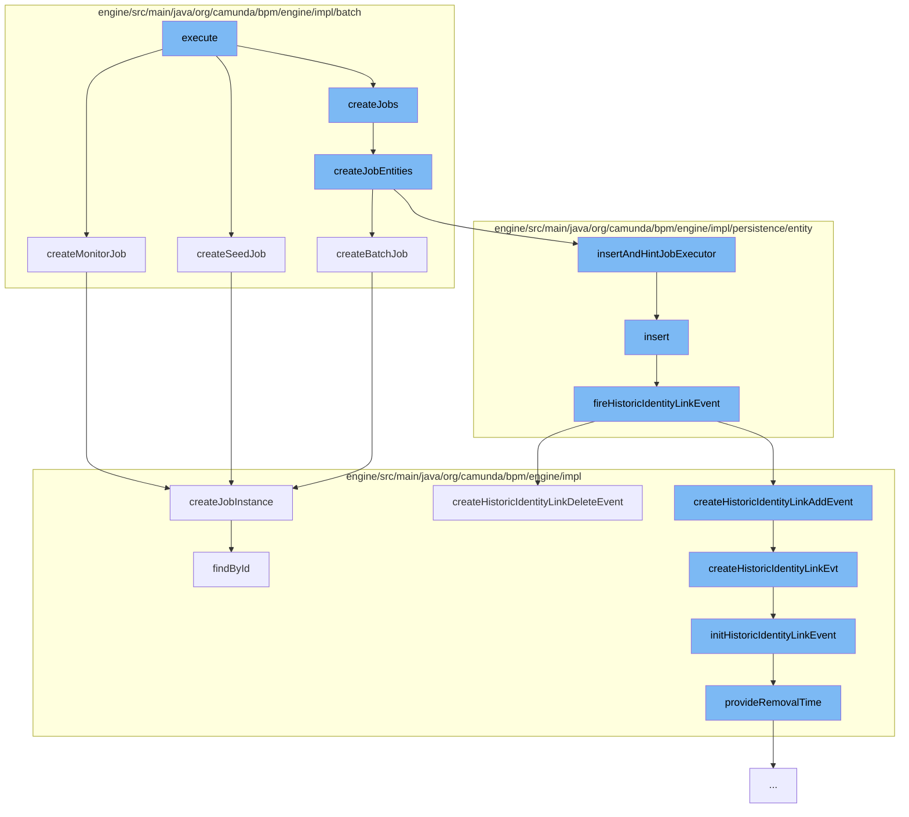

This document will cover the process of Batch Job Execution in Camunda, which includes:

1. Execution of Batch Job
2. Creation of Monitor, Seed and Batch Jobs
3. Insertion of Identity Link
4. Historic Identity Link Event Creation
5. Job Instance Creation



<SwmSnippet path="/engine/src/main/java/org/camunda/bpm/engine/impl/batch/BatchSeedJobHandler.java" line="1">

---

# Execution of Batch Job

The `execute` function in `BatchSeedJobHandler.java` initiates the batch job execution process. It calls `createMonitorJob`, `createSeedJob`, and `createJobs` functions to create necessary jobs for the batch execution.

```java
/*
 * Copyright Camunda Services GmbH and/or licensed to Camunda Services GmbH
 * under one or more contributor license agreements. See the NOTICE file
 * distributed with this work for additional information regarding copyright
 * ownership. Camunda licenses this file to you under the Apache License,
 * Version 2.0; you may not use this file except in compliance with the License.
 * You may obtain a copy of the License at
 *
 *     http://www.apache.org/licenses/LICENSE-2.0
 *
 * Unless required by applicable law or agreed to in writing, software
 * distributed under the License is distributed on an "AS IS" BASIS,
 * WITHOUT WARRANTIES OR CONDITIONS OF ANY KIND, either express or implied.
 * See the License for the specific language governing permissions and
 * limitations under the License.
 */
package org.camunda.bpm.engine.impl.batch;

import static org.camunda.bpm.engine.impl.util.EnsureUtil.ensureNotNull;

import org.camunda.bpm.engine.impl.batch.BatchSeedJobHandler.BatchSeedJobConfiguration;
```

---

</SwmSnippet>

<SwmSnippet path="/engine/src/main/java/org/camunda/bpm/engine/impl/batch/BatchEntity.java" line="328">

---

# Creation of Monitor, Seed and Batch Jobs

The `createMonitorJob` function in `BatchEntity.java` creates a monitor job for the batch execution. It sets the due date for the job and inserts it into the job manager.

```java
  public JobEntity createMonitorJob(boolean setDueDate) {
    // Maybe use an other job declaration
    JobEntity monitorJob = BATCH_MONITOR_JOB_DECLARATION.createJobInstance(this);
    if (setDueDate) {
      monitorJob.setDuedate(calculateMonitorJobDueDate());
    }

    Context.getCommandContext()
      .getJobManager().insertAndHintJobExecutor(monitorJob);

    return monitorJob;
  }
```

---

</SwmSnippet>

<SwmSnippet path="/engine/src/main/java/org/camunda/bpm/engine/impl/batch/AbstractBatchJobHandler.java" line="148">

---

The `createJobs` function in `AbstractBatchJobHandler.java` creates job entities for the batch execution. It iterates over the process IDs and creates a job configuration for each process ID. Then, it creates a batch job for each configuration and inserts it into the job manager.

```java
  protected void createJobEntities(BatchEntity batch, T configuration, String deploymentId,
      List<String> processIds, int invocationsPerBatchJob) {

    if (processIds == null || processIds.isEmpty()) {
      return;
    }

    CommandContext commandContext = Context.getCommandContext();
    ByteArrayManager byteArrayManager = commandContext.getByteArrayManager();
    JobManager jobManager = commandContext.getJobManager();

    int createdJobs = 0;
    while (!processIds.isEmpty()) {
      int lastIdIndex = Math.min(invocationsPerBatchJob, processIds.size());
      // view of process instances for this job
      List<String> idsForJob = processIds.subList(0, lastIdIndex);

      T jobConfiguration = createJobConfiguration(configuration, idsForJob);

      jobConfiguration.setBatchId(batch.getId());

```

---

</SwmSnippet>

<SwmSnippet path="/engine/src/main/java/org/camunda/bpm/engine/impl/persistence/entity/IdentityLinkEntity.java" line="82">

---

# Insertion of Identity Link

The `insert` function in `IdentityLinkEntity.java` inserts an identity link into the database and fires a historic identity link event.

```java
  public void insert() {
    Context
      .getCommandContext()
      .getDbEntityManager()
      .insert(this);
    fireHistoricIdentityLinkEvent(HistoryEventTypes.IDENTITY_LINK_ADD);
  }
```

---

</SwmSnippet>

<SwmSnippet path="/engine/src/main/java/org/camunda/bpm/engine/impl/persistence/entity/IdentityLinkEntity.java" line="204">

---

# Historic Identity Link Event Creation

The `fireHistoricIdentityLinkEvent` function in `IdentityLinkEntity.java` creates a historic identity link event. Depending on the event type, it creates either a `HistoricIdentityLinkAddEvent` or a `HistoricIdentityLinkDeleteEvent`.

```java
  public void fireHistoricIdentityLinkEvent(final HistoryEventType eventType) {
    ProcessEngineConfigurationImpl processEngineConfiguration = Context.getProcessEngineConfiguration();

    HistoryLevel historyLevel = processEngineConfiguration.getHistoryLevel();
    if(historyLevel.isHistoryEventProduced(eventType, this)) {

      HistoryEventProcessor.processHistoryEvents(new HistoryEventProcessor.HistoryEventCreator() {
        @Override
        public HistoryEvent createHistoryEvent(HistoryEventProducer producer) {
          HistoryEvent event = null;
          if (HistoryEvent.IDENTITY_LINK_ADD.equals(eventType.getEventName())) {
            event = producer.createHistoricIdentityLinkAddEvent(IdentityLinkEntity.this);
          } else if (HistoryEvent.IDENTITY_LINK_DELETE.equals(eventType.getEventName())) {
            event = producer.createHistoricIdentityLinkDeleteEvent(IdentityLinkEntity.this);
          }
          return event;
        }
      });

    }
  }
```

---

</SwmSnippet>

<SwmSnippet path="/engine/src/main/java/org/camunda/bpm/engine/impl/jobexecutor/JobDeclaration.java" line="66">

---

# Job Instance Creation

The `createJobInstance` function in `JobDeclaration.java` creates a job instance. It sets the job definition ID, job handler configuration, job handler type, exclusivity, retries, due date, and priority for the job instance.

```java
  // Job instance factory //////////////////////////////////////////

  /**
   *
   * @return the created Job instances
   */
  public T createJobInstance(S context) {

    T job = newJobInstance(context);

    // set job definition id
    String jobDefinitionId = resolveJobDefinitionId(context);
    job.setJobDefinitionId(jobDefinitionId);

    if(jobDefinitionId != null) {

      JobDefinitionEntity jobDefinition = Context.getCommandContext()
        .getJobDefinitionManager()
        .findById(jobDefinitionId);

      if(jobDefinition != null) {
```

---

</SwmSnippet>

&nbsp;

*This is an auto-generated document by Swimm AI 🌊 and has not yet been verified by a human*

<SwmMeta version="3.0.0" repo-id="Z2l0aHViJTNBJTNBQ2l0aS1jYW11bmRhJTNBJTNBZ2lsYWRuYXZvdA==" repo-name="Citi-camunda" doc-type="flows"><sup>Powered by [Swimm](/)</sup></SwmMeta>
