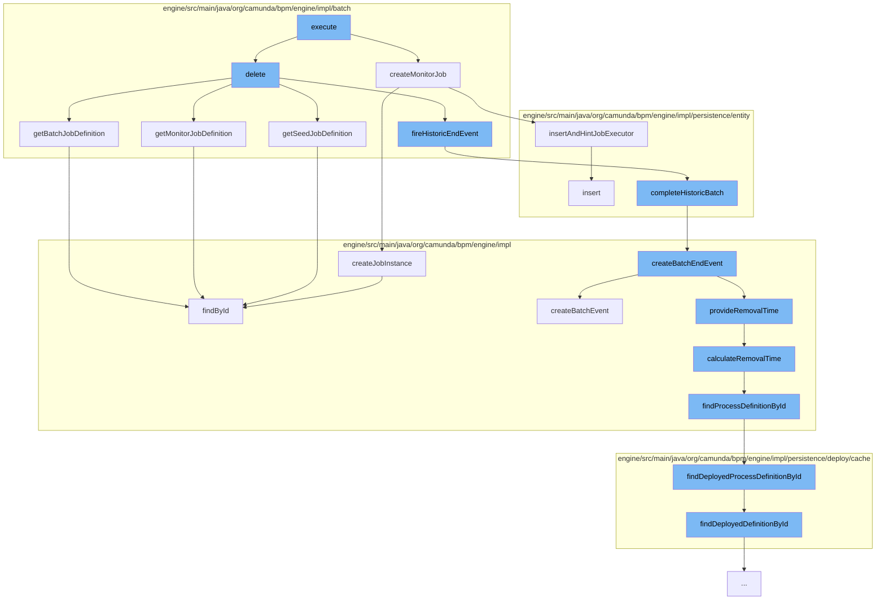

This document will cover the process of batch job execution in the Camunda BPM engine, which includes:

1. Creating a monitor job
2. Deleting a batch job
3. Completing a historic batch
4. Creating a batch end event
5. Calculating the removal time of a batch event
6. Finding a deployed process definition by ID



<SwmSnippet path="/engine/src/main/java/org/camunda/bpm/engine/impl/batch/BatchEntity.java" line="328">

---

# Creating a Monitor Job

The `createMonitorJob` function is used to create a monitor job for a batch. It sets the due date for the job and inserts it into the job manager.

```java
  public JobEntity createMonitorJob(boolean setDueDate) {
    // Maybe use an other job declaration
    JobEntity monitorJob = BATCH_MONITOR_JOB_DECLARATION.createJobInstance(this);
    if (setDueDate) {
      monitorJob.setDuedate(calculateMonitorJobDueDate());
    }

    Context.getCommandContext()
      .getJobManager().insertAndHintJobExecutor(monitorJob);

    return monitorJob;
  }
```

---

</SwmSnippet>

<SwmSnippet path="/engine/src/main/java/org/camunda/bpm/engine/impl/batch/BatchEntity.java" line="223">

---

# Deleting a Batch Job

The `delete` function is used to delete a batch job. It retrieves the job definitions and fires a historic end event.

```java
  // transient

  public JobDefinitionEntity getSeedJobDefinition() {
    if (seedJobDefinition == null && seedJobDefinitionId != null) {
      seedJobDefinition = Context.getCommandContext().getJobDefinitionManager().findById(seedJobDefinitionId);
    }

    return seedJobDefinition;
  }
```

---

</SwmSnippet>

<SwmSnippet path="/engine/src/main/java/org/camunda/bpm/engine/impl/persistence/entity/HistoricBatchManager.java" line="112">

---

# Completing a Historic Batch

The `completeHistoricBatch` function is used to mark a batch as completed. It creates a batch end event if the history level allows it.

```java
  public void completeHistoricBatch(final BatchEntity batch) {
    ProcessEngineConfigurationImpl configuration = Context.getProcessEngineConfiguration();

    HistoryLevel historyLevel = configuration.getHistoryLevel();
    if(historyLevel.isHistoryEventProduced(HistoryEventTypes.BATCH_END, batch)) {

      HistoryEventProcessor.processHistoryEvents(new HistoryEventProcessor.HistoryEventCreator() {
        @Override
        public HistoryEvent createHistoryEvent(HistoryEventProducer producer) {
          return producer.createBatchEndEvent(batch);
        }
      });
    }
  }
```

---

</SwmSnippet>

<SwmSnippet path="/engine/src/main/java/org/camunda/bpm/engine/impl/history/producer/DefaultHistoryEventProducer.java" line="1030">

---

# Creating a Batch End Event

The `createBatchEndEvent` function is used to create a batch end event. It also provides the removal time if the history removal time strategy is set to 'end'.

```java
  @Override
  public HistoryEvent createBatchEndEvent(Batch batch) {
    HistoryEvent historicBatch = createBatchEvent((BatchEntity) batch, HistoryEventTypes.BATCH_END);

    if (isHistoryRemovalTimeStrategyEnd()) {
      provideRemovalTime((HistoricBatchEntity) historicBatch);

      addRemovalTimeToHistoricJobLog((HistoricBatchEntity) historicBatch);
      addRemovalTimeToHistoricIncidents((HistoricBatchEntity) historicBatch);
    }

    return historicBatch;
  }
```

---

</SwmSnippet>

<SwmSnippet path="/engine/src/main/java/org/camunda/bpm/engine/impl/history/producer/DefaultHistoryEventProducer.java" line="1285">

---

# Calculating the Removal Time of a Batch Event

The `calculateRemovalTime` function is used to calculate the removal time for a batch event. It retrieves the process definition and calculates the removal time based on it.

```java
  protected Date calculateRemovalTime(HistoryEvent historyEvent) {
    String processDefinitionId = historyEvent.getProcessDefinitionId();
    ProcessDefinition processDefinition = findProcessDefinitionById(processDefinitionId);

    return Context.getProcessEngineConfiguration()
      .getHistoryRemovalTimeProvider()
      .calculateRemovalTime((HistoricProcessInstanceEventEntity) historyEvent, processDefinition);
  }
```

---

</SwmSnippet>

<SwmSnippet path="/engine/src/main/java/org/camunda/bpm/engine/impl/persistence/deploy/cache/DeploymentCache.java" line="80">

---

# Finding a Deployed Process Definition by ID

The `findDeployedProcessDefinitionById` function is used to find a deployed process definition by its ID. It retrieves the definition from the deployment cache.

```java
  public ProcessDefinitionEntity findDeployedProcessDefinitionById(String processDefinitionId) {
    return processDefinitionEntityCache.findDeployedDefinitionById(processDefinitionId);
  }
```

---

</SwmSnippet>

&nbsp;

*This is an auto-generated document by Swimm AI 🌊 and has not yet been verified by a human*

<SwmMeta version="3.0.0" repo-id="Z2l0aHViJTNBJTNBQ2l0aS1jYW11bmRhJTNBJTNBZ2lsYWRuYXZvdA==" repo-name="Citi-camunda" doc-type="flows"><sup>Powered by [Swimm](/)</sup></SwmMeta>
