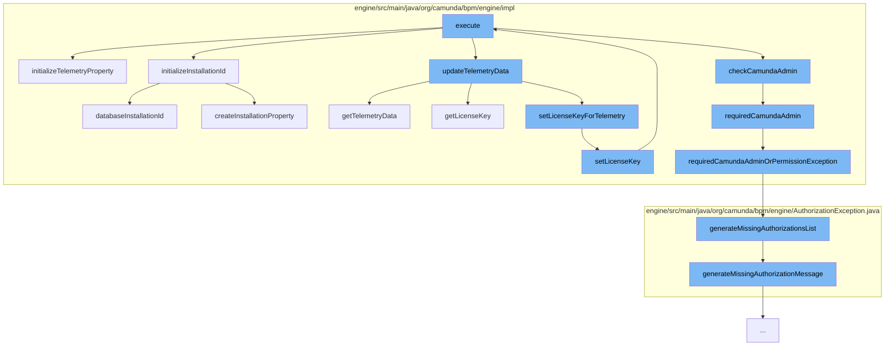

This document will cover the process of bootstrapping the Camunda engine, which includes:

1. Initializing telemetry property
2. Initializing installation ID
3. Updating telemetry data
4. Setting license key for telemetry
5. Checking Camunda admin authorization
6. Handling missing authorizations.



<SwmSnippet path="/engine/src/main/java/org/camunda/bpm/engine/impl/BootstrapEngineCommand.java" line="108">

---

# Initializing telemetry property

The `initializeTelemetryProperty` function is responsible for setting up telemetry properties. It checks if telemetry lock exists, acquires it, and then checks if the telemetry property exists in the database. If not, it creates a new one. It also handles any exceptions that might occur during this process.

```java
  public void initializeTelemetryProperty(CommandContext commandContext) {
    try {

      checkTelemetryLockExists(commandContext);

      acquireExclusiveTelemetryLock(commandContext);
      PropertyEntity databaseTelemetryProperty = databaseTelemetryConfiguration(commandContext);

      ProcessEngineConfigurationImpl processEngineConfiguration = commandContext.getProcessEngineConfiguration();
      if (databaseTelemetryProperty == null) {
        LOG.noTelemetryPropertyFound();
        createTelemetryProperty(commandContext);
      }

      // reset collected dynamic data
      if ((databaseTelemetryProperty == null && processEngineConfiguration.isInitializeTelemetry())
          || (databaseTelemetryProperty != null && Boolean.parseBoolean(databaseTelemetryProperty.getValue()))) {
        TelemetryUtil.toggleLocalTelemetry(true,
            processEngineConfiguration.getTelemetryRegistry(),
            processEngineConfiguration.getMetricsRegistry());
      }
```

---

</SwmSnippet>

<SwmSnippet path="/engine/src/main/java/org/camunda/bpm/engine/impl/BootstrapEngineCommand.java" line="191">

---

# Initializing installation ID

The `databaseInstallationId` function is used to retrieve the installation ID from the database. If an error occurs during this process, it logs the error and returns null.

```java
  protected String databaseInstallationId(CommandContext commandContext) {
    try {
      PropertyEntity installationIdProperty = commandContext.getPropertyManager().findPropertyById(INSTALLATION_PROPERTY_NAME);
      return installationIdProperty != null ? installationIdProperty.getValue() : null;
    } catch (Exception e) {
      LOG.couldNotSelectInstallationId(e.getMessage());
      return null;
    }
  }
```

---

</SwmSnippet>

<SwmSnippet path="/engine/src/main/java/org/camunda/bpm/engine/impl/BootstrapEngineCommand.java" line="584">

---

# Updating telemetry data

The `getTelemetryData` function is used to retrieve telemetry data. It executes the `GetTelemetryDataCmd` command to fetch the data.

```java

```

---

</SwmSnippet>

<SwmSnippet path="/engine/src/main/java/org/camunda/bpm/engine/impl/ManagementServiceImpl.java" line="266">

---

# Setting license key for telemetry

The `setLicenseKey` function is used to set the license key. It executes the `SetLicenseKeyCmd` command with the provided license key.

```java
  public void setLicenseKey(String licenseKey) {
    commandExecutor.execute(new SetLicenseKeyCmd(licenseKey));
  }
```

---

</SwmSnippet>

<SwmSnippet path="/engine/src/main/java/org/camunda/bpm/engine/impl/persistence/entity/AuthorizationManager.java" line="495">

---

# Checking Camunda admin authorization

The `checkCamundaAdmin` function checks if the current authentication contains the group `CAMUNDA_ADMIN`. If the authorization is disabled or no authentication exists, the check is ignored. If the check fails, it throws an `AuthorizationException`.

```java
  // predefined authorization checks

  /* MEMBER OF CAMUNDA_ADMIN */

  /**
   * Checks if the current authentication contains the group
   * {@link Groups#CAMUNDA_ADMIN}. The check is ignored if the authorization is
   * disabled or no authentication exists.
   *
   * @throws AuthorizationException
   */
  public void checkCamundaAdmin() {
    final Authentication currentAuthentication = getCurrentAuthentication();

    if (isAuthorizationEnabled() && getCommandContext().isAuthorizationCheckEnabled()
        && currentAuthentication != null && !isCamundaAdmin(currentAuthentication)) {

      throw LOG.requiredCamundaAdmin();
    }
  }
```

---

</SwmSnippet>

<SwmSnippet path="/engine/src/main/java/org/camunda/bpm/engine/AuthorizationException.java" line="161">

---

# Handling missing authorizations

The `generateMissingAuthorizationsList` function generates a string containing a list of missing authorizations. It iterates over the list of missing authorizations and appends each one to the string.

```java
  /**
   * Generate a String containing a list of missing authorizations.
   *
   * @param missingAuthorizations
   */
  public static String generateMissingAuthorizationsList(List<MissingAuthorization> missingAuthorizations) {
    StringBuilder sBuilder = new StringBuilder();
    boolean first = true;
    for(MissingAuthorization missingAuthorization: missingAuthorizations) {
      if (!first) {
        sBuilder.append(" or ");
      } else {
        first = false;
      }
      sBuilder.append(generateMissingAuthorizationMessage(missingAuthorization));
    }
    return sBuilder.toString();
  }
```

---

</SwmSnippet>

&nbsp;

*This is an auto-generated document by Swimm AI 🌊 and has not yet been verified by a human*

<SwmMeta version="3.0.0" repo-id="Z2l0aHViJTNBJTNBQ2l0aS1jYW11bmRhJTNBJTNBZ2lsYWRuYXZvdA==" repo-name="Citi-camunda" doc-type="flows"><sup>Powered by [Swimm](/)</sup></SwmMeta>
