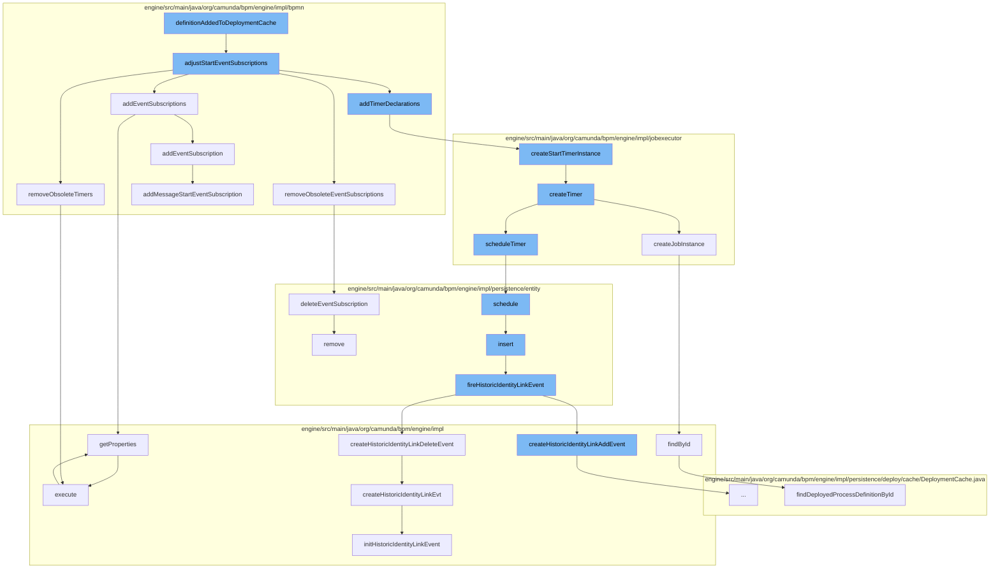

This document will cover the process of BPMN deployment in the Camunda engine, which includes:

1. Adjusting start event subscriptions
2. Removing obsolete timers and event subscriptions
3. Adding timer declarations and event subscriptions
4. Creating and scheduling timer instances
5. Managing job instances and identity link events



<SwmSnippet path="/engine/src/main/java/org/camunda/bpm/engine/impl/bpmn/deployer/BpmnDeployer.java" line="227">

---

# Adjusting Start Event Subscriptions

The `adjustStartEventSubscriptions` function is responsible for managing event subscriptions that initiate process instances. It removes obsolete timers and event subscriptions, then adds new ones for the newly deployed process definitions.

```java
  /**
   * adjust all event subscriptions responsible to start process instances
   * (timer start event, message start event). The default behavior is to remove the old
   * subscriptions and add new ones for the new deployed process definitions.
   */
  protected void adjustStartEventSubscriptions(ProcessDefinitionEntity newLatestProcessDefinition, ProcessDefinitionEntity oldLatestProcessDefinition) {
    removeObsoleteTimers(newLatestProcessDefinition);
    removeObsoleteEventSubscriptions(newLatestProcessDefinition, oldLatestProcessDefinition);

    addTimerDeclarations(newLatestProcessDefinition);
    addEventSubscriptions(newLatestProcessDefinition);
  }
```

---

</SwmSnippet>

<SwmSnippet path="/engine/src/main/java/org/camunda/bpm/engine/impl/bpmn/deployer/BpmnDeployer.java" line="260">

---

# Removing Obsolete Timers and Event Subscriptions

The `removeObsoleteEventSubscriptions` function removes obsolete event subscriptions and timers associated with the new process definition and the previous version of the process definition.

```java
  protected void removeObsoleteEventSubscriptions(ProcessDefinitionEntity newLatestProcessDefinition, ProcessDefinitionEntity latestProcessDefinition) {
    List<EventSubscriptionEntity> orphanSubscriptions = getOrphanSubscriptionEvents(newLatestProcessDefinition);
    if(!orphanSubscriptions.isEmpty()) { // remove orphan subscriptions if any
      for (EventSubscriptionEntity eventSubscriptionEntity : orphanSubscriptions) {
        getEventSubscriptionManager().deleteEventSubscription(eventSubscriptionEntity);
      }
    }

    if (latestProcessDefinition != null) { // remove all subscriptions for the previous version
      List<EventSubscriptionEntity> previousSubscriptions = getPreviousSubscriptionEvents(latestProcessDefinition);
      for (EventSubscriptionEntity eventSubscriptionEntity : previousSubscriptions) {
        eventSubscriptionEntity.delete();
      }
    }
  }
```

---

</SwmSnippet>

<SwmSnippet path="/engine/src/main/java/org/camunda/bpm/engine/impl/bpmn/deployer/BpmnDeployer.java" line="314">

---

# Adding Timer Declarations and Event Subscriptions

The `addEventSubscription` function adds event subscriptions for start events in the process definition. It handles different event types including message, signal, and conditional start events.

```java
  protected void addEventSubscription(ProcessDefinitionEntity processDefinition, EventSubscriptionDeclaration eventDefinition) {
    if (eventDefinition.isStartEvent()) {
      String eventType = eventDefinition.getEventType();

      if (eventType.equals(EventType.MESSAGE.name())) {
        addMessageStartEventSubscription(eventDefinition, processDefinition);
      } else if (eventType.equals(EventType.SIGNAL.name())) {
        addSignalStartEventSubscription(eventDefinition, processDefinition);
      } else if (eventType.equals(EventType.CONDITONAL.name())) {
        addConditionalStartEventSubscription(eventDefinition, processDefinition);
      }
    }
  }
```

---

</SwmSnippet>

<SwmSnippet path="/engine/src/main/java/org/camunda/bpm/engine/impl/jobexecutor/TimerDeclarationImpl.java" line="170">

---

# Creating and Scheduling Timer Instances

The `createStartTimerInstance` and `createTimer` functions are responsible for creating timer instances and scheduling them for execution.

```java
  public TimerEntity createStartTimerInstance(String deploymentId) {
    return createTimer(deploymentId);
  }

  public TimerEntity createTimer(String deploymentId) {
    TimerEntity timer = super.createJobInstance((ExecutionEntity) null);
    timer.setDeploymentId(deploymentId);
    scheduleTimer(timer);
    return timer;
  }
```

---

</SwmSnippet>

<SwmSnippet path="/engine/src/main/java/org/camunda/bpm/engine/impl/jobexecutor/JobDeclaration.java" line="66">

---

# Managing Job Instances and Identity Link Events

The `createJobInstance` function creates a new job instance and initializes it with the necessary properties. It also manages the suspension state of the job and assigns it a priority.

```java
  // Job instance factory //////////////////////////////////////////

  /**
   *
   * @return the created Job instances
   */
  public T createJobInstance(S context) {

    T job = newJobInstance(context);

    // set job definition id
    String jobDefinitionId = resolveJobDefinitionId(context);
    job.setJobDefinitionId(jobDefinitionId);

    if(jobDefinitionId != null) {

      JobDefinitionEntity jobDefinition = Context.getCommandContext()
        .getJobDefinitionManager()
        .findById(jobDefinitionId);

      if(jobDefinition != null) {
```

---

</SwmSnippet>

&nbsp;

*This is an auto-generated document by Swimm AI 🌊 and has not yet been verified by a human*

<SwmMeta version="3.0.0" repo-id="Z2l0aHViJTNBJTNBQ2l0aS1jYW11bmRhJTNBJTNBZ2lsYWRuYXZvdA==" repo-name="Citi-camunda" doc-type="flows"><sup>Powered by [Swimm](/)</sup></SwmMeta>
