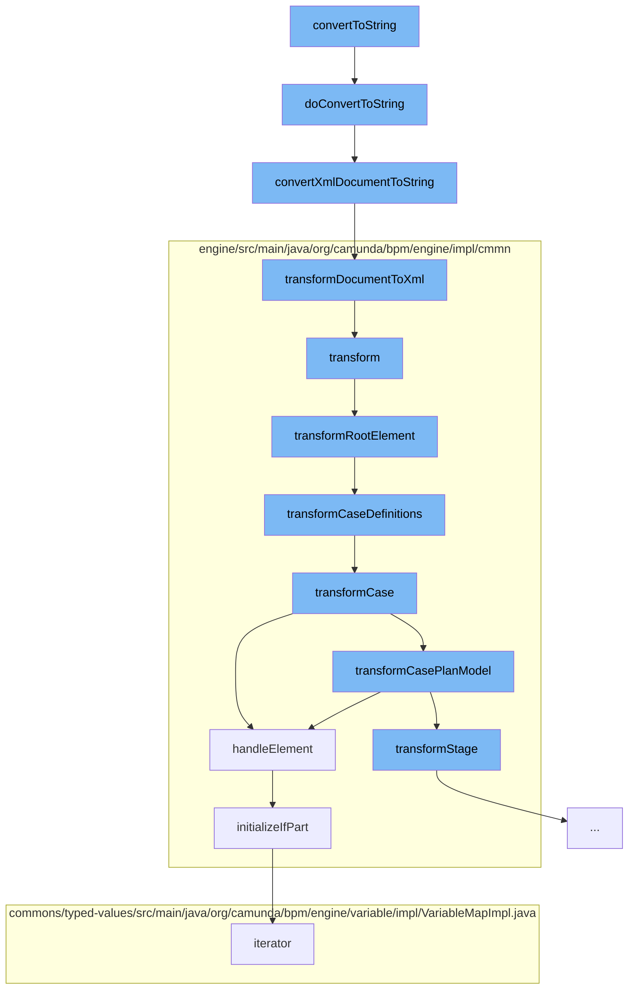

This document will cover the process of converting a BPMN model instance to a string representation in the Citi-camunda repository. The process includes the following steps:

1. Invoking the `convertToString` function
2. Validating the model instance and converting it to an XML string
3. Transforming the XML document to a string
4. Transforming the document to XML output
5. Transforming the root element and case definitions
6. Handling the sentry element and initializing the if part.



<SwmSnippet path="/model-api/bpmn-model/src/main/java/org/camunda/bpm/model/bpmn/Bpmn.java" line="441">

---

# Invoking the `convertToString` function

The `convertToString` function is the entry point of the process. It calls the `doConvertToString` function, which validates the model instance and converts it to an XML string.

```java
  protected String doConvertToString(BpmnModelInstance modelInstance) {
    // validate DOM document
    doValidateModel(modelInstance);
    // convert to XML string
    return IoUtil.convertXmlDocumentToString(modelInstance.getDocument());
  }
```

---

</SwmSnippet>

<SwmSnippet path="/model-api/xml-model/src/main/java/org/camunda/bpm/model/xml/impl/util/IoUtil.java" line="95">

---

# Converting the XML document to a string

The `convertXmlDocumentToString` function is called next. It creates a `StringWriter` and a `StreamResult`, and then calls the `transformDocumentToXml` function to transform the document to XML.

```java
  /**
   * Converts a {@link DomDocument} to its String representation
   *
   * @param document  the XML document to convert
   */
  public static String convertXmlDocumentToString(DomDocument document) {
    StringWriter stringWriter = new StringWriter();
    StreamResult result = new StreamResult(stringWriter);
    transformDocumentToXml(document, result);
    return stringWriter.toString();
  }
```

---

</SwmSnippet>

<SwmSnippet path="/model-api/xml-model/src/main/java/org/camunda/bpm/model/xml/impl/util/IoUtil.java" line="118">

---

# Transforming the document to XML output

The `transformDocumentToXml` function creates a new `Transformer` and sets its output properties. It then synchronizes on the document and transforms it to XML.

```java
  /**
   * Transforms a {@link DomDocument} to XML output.
   *
   * @param document  the DOM document to transform
   * @param result  the {@link StreamResult} to write to
   */
  public static void transformDocumentToXml(DomDocument document, StreamResult result) {
    TransformerFactory transformerFactory = TransformerFactory.newInstance();
    try {
      Transformer transformer = transformerFactory.newTransformer();
      transformer.setOutputProperty(OutputKeys.ENCODING, "UTF-8");
      transformer.setOutputProperty(OutputKeys.INDENT, "yes");
      transformer.setOutputProperty("{http://xml.apache.org/xslt}indent-amount", "2");

      synchronized(document) {
        transformer.transform(document.getDomSource(), result);
      }
    } catch (TransformerConfigurationException e) {
      throw new ModelIoException("Unable to create a transformer for the model", e);
    } catch (TransformerException e) {
      throw new ModelIoException("Unable to transform model to xml", e);
```

---

</SwmSnippet>

<SwmSnippet path="/engine/src/main/java/org/camunda/bpm/engine/impl/cmmn/transformer/CmmnTransform.java" line="134">

---

# Transforming the root element and case definitions

The `transformRootElement` function is called next. It transforms the imports and case definitions of the model.

```java
  protected void transformRootElement() {

    transformImports();
    transformCaseDefinitions();

    Definitions definitions = model.getDefinitions();
    for (CmmnTransformListener transformListener : transformListeners) {
      transformListener.transformRootElement(definitions, caseDefinitions);
    }

  }
```

---

</SwmSnippet>

<SwmSnippet path="/engine/src/main/java/org/camunda/bpm/engine/impl/cmmn/handler/SentryHandler.java" line="55">

---

# Handling the sentry element

The `handleElement` function is called to handle the sentry element. It initializes the if part and variable on parts of the sentry declaration.

```java
  public CmmnSentryDeclaration handleElement(Sentry element, CmmnHandlerContext context) {

    String id = element.getId();
    Collection<OnPart> onParts = element.getOnParts();
    IfPart ifPart = element.getIfPart();
    List<CamundaVariableOnPart> variableOnParts = queryExtensionElementsByClass(element, CamundaVariableOnPart.class);

    if ((ifPart == null || ifPart.getConditions().isEmpty()) && variableOnParts.isEmpty()) {

      if (onParts == null || onParts.isEmpty()) {
        LOG.ignoredSentryWithMissingCondition(id);
        return null;
      } else {
        boolean atLeastOneOnPartsValid = false;

        for (OnPart onPart : onParts) {
          if (onPart instanceof PlanItemOnPart) {
            PlanItemOnPart planItemOnPart = (PlanItemOnPart) onPart;
            if (planItemOnPart.getSource() != null && planItemOnPart.getStandardEvent() != null) {
              atLeastOneOnPartsValid = true;
              break;
```

---

</SwmSnippet>

<SwmSnippet path="/engine/src/main/java/org/camunda/bpm/engine/impl/cmmn/handler/SentryHandler.java" line="165">

---

# Initializing the if part

The `initializeIfPart` function is called to initialize the if part of the sentry declaration. It creates an expression from the condition and sets it on the if part declaration.

```java
  protected void initializeIfPart(IfPart ifPart, CmmnSentryDeclaration sentryDeclaration, CmmnHandlerContext context) {
    if (ifPart == null) {
      return;
    }

    Collection<ConditionExpression> conditions = ifPart.getConditions();

    if (conditions.size() > 1) {
      String id = sentryDeclaration.getId();
      LOG.multipleIgnoredConditions(id);
    }

    ExpressionManager expressionManager = context.getExpressionManager();
    ConditionExpression condition = conditions.iterator().next();
    Expression conditionExpression = expressionManager.createExpression(condition.getText());

    CmmnIfPartDeclaration ifPartDeclaration = new CmmnIfPartDeclaration();
    ifPartDeclaration.setCondition(conditionExpression);
    sentryDeclaration.setIfPart(ifPartDeclaration);
  }
```

---

</SwmSnippet>

&nbsp;

*This is an auto-generated document by Swimm AI 🌊 and has not yet been verified by a human*

<SwmMeta version="3.0.0" repo-id="Z2l0aHViJTNBJTNBQ2l0aS1jYW11bmRhJTNBJTNBZ2lsYWRuYXZvdA==" repo-name="Citi-camunda" doc-type="flows"><sup>Powered by [Swimm](/)</sup></SwmMeta>
