This document will cover the process of deploying a BPMN process in the Camunda engine. The steps include:

1. Executing the deployment task
2. Reading the logging configuration
3. Parsing the definition resources
4. Transforming the resource
5. Getting the resources
6. Checking for duplicate resource names
7. Getting the deployment ID
8. Formatting the log
9. Ensuring resources exist

```mermaid
graph TD;
subgraph engine/src/main/java/org/camunda/bpm/engine/impl/util
  execute:::mainFlowStyle --> readJavaUtilLoggingConfigFromClasspath
end
subgraph engine/src/main/java/org/camunda/bpm/engine/impl
  execute:::mainFlowStyle --> deploy
end
subgraph engine/src/main/java/org/camunda/bpm/engine/impl
  readJavaUtilLoggingConfigFromClasspath --> readConfiguration
end
subgraph engine/src/main/java/org/camunda/bpm/engine/impl
  readJavaUtilLoggingConfigFromClasspath --> setProperty
end
subgraph engine/src/main/java/org/camunda/bpm/engine/impl/util
  readJavaUtilLoggingConfigFromClasspath --> closeSilently
end
subgraph engine/src/main/java/org/camunda/bpm/engine/impl
  readConfiguration --> readIdMappings
end
subgraph engine/src/main/java/org/camunda/bpm/engine/impl
  readConfiguration --> readProcessInstanceIds
end
subgraph engine/src/main/java/org/camunda/bpm/engine/impl
  setProperty --> execute
end
subgraph engine/src/main/java/org/camunda/bpm/engine/impl
  closeSilently --> close
end
subgraph engine/src/main/java/org/camunda/bpm/engine/impl
  deploy:::mainFlowStyle --> parseDefinitionResources
end
subgraph engine/src/main/java/org/camunda/bpm/engine/impl
  parseDefinitionResources:::mainFlowStyle --> transformResource
end
subgraph engine/src/main/java/org/camunda/bpm/engine/impl/cmd
  transformResource:::mainFlowStyle --> getResources
end
subgraph engine/src/main/java/org/camunda/bpm/engine/impl/cmd
  getResources:::mainFlowStyle --> getResourcesById
end
subgraph engine/src/main/java/org/camunda/bpm/engine/impl/cmd
  getResources:::mainFlowStyle --> getResourcesByName
end
subgraph engine/src/main/java/org/camunda/bpm/engine/impl/cmd
  getResources:::mainFlowStyle --> checkDuplicateResourceName
end
subgraph engine/src/main/java/org/camunda/bpm/engine/impl/cmd
  getResourcesById --> ensureResourcesWithIdsExist
end
subgraph engine/src/main/java/org/camunda/bpm/engine/impl/cmd
  ensureResourcesWithIdsExist --> ensureResourcesWithKeysExist
end
subgraph engine/src/main/java/org/camunda/bpm/engine/impl/cmd
  getResourcesByName --> ensureResourcesWithNamesExist
end
subgraph engine/src/main/java/org/camunda/bpm/engine/impl/cmd
  ensureResourcesWithNamesExist --> ensureResourcesWithKeysExist
end
subgraph engine/src/main/java/org/camunda/bpm/engine/impl/util
  checkDuplicateResourceName:::mainFlowStyle --> format
end
subgraph engine/src/main/java/org/camunda/bpm/engine/impl/cmd
  checkDuplicateResourceName:::mainFlowStyle --> getDeploymentId
end
subgraph engine/src/main/java/org/camunda/bpm/engine/impl
  format --> printStackTrace
end
subgraph engine/src/main/java/org/camunda/bpm/engine/impl
  printStackTrace --> logNonVerbose
end
subgraph engine/src/main/java/org/camunda/bpm/engine/impl/cmd
  getDeploymentId:::mainFlowStyle --> getDeploymentIdByJobDefinition
end
subgraph engine/src/main/java/org/camunda/bpm/engine/impl/cmd
  getDeploymentId:::mainFlowStyle --> getDeploymentIdByProcessDefinitionKey
end
subgraph engine/src/main/java/org/camunda/bpm/engine/impl/cmd
  getDeploymentIdByJobDefinition --> findById
end
subgraph engine/src/main/java/org/camunda/bpm/engine/impl/persistence
  findById --> findDeployedProcessDefinitionById
end
subgraph engine/src/main/java/org/camunda/bpm/engine/impl/persistence
  getDeploymentIdByProcessDefinitionKey:::mainFlowStyle --> findLatestProcessDefinitionsByKey
end
subgraph engine/src/main/java/org/camunda/bpm/engine/impl/persistence
  findLatestProcessDefinitionsByKey:::mainFlowStyle --> configureParameterizedQuery
end
  configureParameterizedQuery:::mainFlowStyle --> ...

 classDef mainFlowStyle color:#000000,fill:#7CB9F4
  classDef rootsStyle color:#000000,fill:#00FFF4
```



<SwmSnippet path="/engine/src/main/java/org/camunda/bpm/engine/impl/ant/DeployBarTask.java" line="1">

---

# Executing the deployment task

The `execute` function in `DeployBarTask.java` is the entry point for the deployment process. It initiates the deployment of a BPMN process.

```java
/*
 * Copyright Camunda Services GmbH and/or licensed to Camunda Services GmbH
 * under one or more contributor license agreements. See the NOTICE file
 * distributed with this work for additional information regarding copyright
 * ownership. Camunda licenses this file to you under the Apache License,
 * Version 2.0; you may not use this file except in compliance with the License.
 * You may obtain a copy of the License at
 *
 *     http://www.apache.org/licenses/LICENSE-2.0
 *
```

---

</SwmSnippet>

<SwmSnippet path="/engine/src/main/java/org/camunda/bpm/engine/impl/util/LogUtil.java" line="60">

---

# Reading the logging configuration

The `readJavaUtilLoggingConfigFromClasspath` function reads the logging configuration from the classpath. This is necessary for logging the deployment process.

```java
  public static void readJavaUtilLoggingConfigFromClasspath() {
    InputStream inputStream = ReflectUtil.getResourceAsStream("logging.properties");
    try {
      if (inputStream != null) {
        LogManager.getLogManager().readConfiguration(inputStream);

        String redirectCommons = LogManager.getLogManager().getProperty("redirect.commons.logging");
        if ((redirectCommons != null) && (!redirectCommons.equalsIgnoreCase("false"))) {
          System.setProperty("org.apache.commons.logging.Log", "org.apache.commons.logging.impl.Jdk14Logger");
        }
      }
    } catch (Exception e) {
      throw new PvmException("couldn't initialize logging properly", e);
    } finally {
      IoUtil.closeSilently(inputStream);
    }
  }
```

---

</SwmSnippet>

<SwmSnippet path="/engine/src/main/java/org/camunda/bpm/engine/impl/AbstractDefinitionDeployer.java" line="69">

---

# Parsing the definition resources

The `parseDefinitionResources` function parses the resources of the deployment. This is necessary for transforming the resources in the next step.

```java
  protected List<DefinitionEntity> parseDefinitionResources(DeploymentEntity deployment, Properties properties) {
    List<DefinitionEntity> definitions = new ArrayList<DefinitionEntity>();
    for (ResourceEntity resource : deployment.getResources().values()) {
      LOG.debugProcessingResource(resource.getName());
      if (isResourceHandled(resource)) {
        definitions.addAll(transformResource(deployment, resource, properties));
      }
    }
    return definitions;
  }
```

---

</SwmSnippet>

<SwmSnippet path="/engine/src/main/java/org/camunda/bpm/engine/impl/AbstractDefinitionDeployer.java" line="97">

---

# Transforming the resource

The `transformResource` function transforms the resources of the deployment. This is necessary for getting the resources in the next step.

```java
  protected Collection<DefinitionEntity> transformResource(DeploymentEntity deployment, ResourceEntity resource, Properties properties) {
    String resourceName = resource.getName();
    List<DefinitionEntity> definitions = transformDefinitions(deployment, resource, properties);

    for (DefinitionEntity definition : definitions) {
      definition.setResourceName(resourceName);

      String diagramResourceName = getDiagramResourceForDefinition(deployment, resourceName, definition, deployment.getResources());
      if (diagramResourceName != null) {
        definition.setDiagramResourceName(diagramResourceName);
      }
    }

    return definitions;
  }
```

---

</SwmSnippet>

<SwmSnippet path="/engine/src/main/java/org/camunda/bpm/engine/impl/cmd/DeployCmd.java" line="407">

---

# Getting the resources

The `getResources` function gets the resources of the deployment. This is necessary for checking for duplicate resource names in the next step.

```java
  protected List<ResourceEntity> getResources(final DeploymentBuilderImpl deploymentBuilder, final CommandContext commandContext) {
    List<ResourceEntity> resources = new ArrayList<>();

    Set<String> deploymentIds = deploymentBuilder.getDeployments();
    resources.addAll(getResourcesByDeploymentId(deploymentIds, commandContext));

    Map<String, Set<String>> deploymentResourcesById = deploymentBuilder.getDeploymentResourcesById();
    resources.addAll(getResourcesById(deploymentResourcesById, commandContext));

    Map<String, Set<String>> deploymentResourcesByName = deploymentBuilder.getDeploymentResourcesByName();
    resources.addAll(getResourcesByName(deploymentResourcesByName, commandContext));

    checkDuplicateResourceName(resources);

    return resources;
  }
```

---

</SwmSnippet>

<SwmSnippet path="/engine/src/main/java/org/camunda/bpm/engine/impl/cmd/DeployCmd.java" line="442">

---

# Checking for duplicate resource names

The `checkDuplicateResourceName` function checks for duplicate resource names in the deployment. This is necessary for ensuring the uniqueness of resource names.

```java
  protected List<ResourceEntity> getResourcesById(Map<String, Set<String>> resourcesById, CommandContext commandContext) {
    List<ResourceEntity> result = new ArrayList<>();

    ResourceManager resourceManager = commandContext.getResourceManager();

    for (String deploymentId : resourcesById.keySet()) {
      Set<String> resourceIds = resourcesById.get(deploymentId);

      String[] resourceIdArray = resourceIds.toArray(new String[resourceIds.size()]);
      List<ResourceEntity> resources = resourceManager.findResourceByDeploymentIdAndResourceIds(deploymentId, resourceIdArray);

      ensureResourcesWithIdsExist(deploymentId, resourceIds, resources);

      result.addAll(resources);
    }

    return result;
  }
```

---

</SwmSnippet>

<SwmSnippet path="/engine/src/main/java/org/camunda/bpm/engine/impl/cmd/AbstractSetJobDefinitionStateCmd.java" line="169">

---

# Getting the deployment ID

The `getDeploymentIdByJobDefinition` function gets the deployment ID. This is necessary for logging the deployment process.

```java

    } else if (processDefinitionKey != null) {
      builder.byProcessDefinitionKey(processDefinitionKey);

      if (isProcessDefinitionTenantIdSet && processDefinitionTenantId != null) {
        builder.processDefinitionTenantId(processDefinitionTenantId);

      } else if (isProcessDefinitionTenantIdSet) {
        builder.processDefinitionWithoutTenantId();
      }
```

---

</SwmSnippet>

<SwmSnippet path="/engine/src/main/java/org/camunda/bpm/engine/impl/util/LogUtil.java" line="82">

---

# Formatting the log

The `format` function formats the log. This is necessary for logging the deployment process.

```java
    public String format(LogRecord record) {
      StringBuilder line = new StringBuilder();
      line.append(dateFormat.format(new Date()));
      if (Level.FINE.equals(record.getLevel())) {
        line.append(" FIN ");
      } else if (Level.FINEST.equals(record.getLevel())) {
        line.append(" FST ");
      } else if (Level.INFO.equals(record.getLevel())) {
        line.append(" INF ");
      } else if (Level.SEVERE.equals(record.getLevel())) {
        line.append(" SEV ");
      } else if (Level.WARNING.equals(record.getLevel())) {
        line.append(" WRN ");
      } else if (Level.FINER.equals(record.getLevel())) {
        line.append(" FNR ");
      } else if (Level.CONFIG.equals(record.getLevel())) {
        line.append(" CFG ");
      }

      int threadId = record.getThreadID();
      String threadIndent = getThreadIndent(threadId);
```

---

</SwmSnippet>

<SwmSnippet path="/engine/src/main/java/org/camunda/bpm/engine/impl/cmd/DeployCmd.java" line="612">

---

# Ensuring resources exist

The `ensureResourcesWithIdsExist` function ensures that the resources exist. This is necessary for the successful deployment of the BPMN process.

```java
  protected void ensureResourcesWithIdsExist(String deploymentId, Set<String> expectedIds, List<ResourceEntity> actual) {
    Map<String, ResourceEntity> resources = new HashMap<>();
    for (ResourceEntity resource : actual) {
      resources.put(resource.getId(), resource);
    }
    ensureResourcesWithKeysExist(deploymentId, expectedIds, resources, "id");
  }
```

---

</SwmSnippet>

&nbsp;

*This is an auto-generated document by Swimm AI 🌊 and has not yet been verified by a human*

<SwmMeta version="3.0.0" repo-id="Z2l0aHViJTNBJTNBQ2l0aS1jYW11bmRhJTNBJTNBZ2lsYWRuYXZvdA==" repo-name="Citi-camunda" doc-type="flows"><sup>Powered by [Swimm](/)</sup></SwmMeta>
