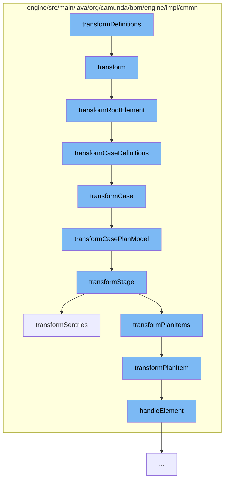

This document will cover the process of transforming case definitions in the CmmnDeployer.java file, which includes:

1. Transforming the root element
2. Transforming case definitions
3. Transforming case plan model
4. Transforming stage
5. Transforming sentries
6. Transforming plan items



<SwmSnippet path="/engine/src/main/java/org/camunda/bpm/engine/impl/cmmn/transformer/CmmnTransform.java" line="134">

---

# Transforming the root element

The `transformRootElement` function is responsible for transforming the root element of the case definition. It calls the `transformImports` and `transformCaseDefinitions` functions to perform the transformation.

```java
  protected void transformRootElement() {

    transformImports();
    transformCaseDefinitions();

    Definitions definitions = model.getDefinitions();
    for (CmmnTransformListener transformListener : transformListeners) {
      transformListener.transformRootElement(definitions, caseDefinitions);
    }

  }
```

---

</SwmSnippet>

<SwmSnippet path="/engine/src/main/java/org/camunda/bpm/engine/impl/cmmn/transformer/CmmnTransform.java" line="150">

---

# Transforming case definitions

The `transformCaseDefinitions` function is responsible for transforming the case definitions. It iterates over the cases and calls the `transformCase` function for each case.

```java
  protected void transformCaseDefinitions() {
    Definitions definitions = model.getDefinitions();

    Collection<Case> cases = definitions.getCases();

    for (Case currentCase : cases) {
      context.setCaseDefinition(null);
      context.setParent(null);
      CmmnCaseDefinition caseDefinition = transformCase(currentCase);
      caseDefinitions.add((CaseDefinitionEntity) caseDefinition);
    }
  }
```

---

</SwmSnippet>

<SwmSnippet path="/engine/src/main/java/org/camunda/bpm/engine/impl/cmmn/transformer/CmmnTransform.java" line="181">

---

# Transforming case plan model

The `transformCasePlanModel` function is responsible for transforming the case plan model. It calls the `transformStage` function to perform the transformation.

```java
  protected void transformCasePlanModel(CasePlanModel casePlanModel) {
    CasePlanModelHandler transformer = (CasePlanModelHandler) getPlanItemHandler(CasePlanModel.class);
    CmmnActivity newActivity = transformer.handleElement(casePlanModel, context);
    context.setParent(newActivity);

    transformStage(casePlanModel, newActivity);

    context.setParent(newActivity);
    transformer.initializeExitCriterias(casePlanModel, newActivity, context);

    for (CmmnTransformListener transformListener : transformListeners) {
      transformListener.transformCasePlanModel((org.camunda.bpm.model.cmmn.impl.instance.CasePlanModel) casePlanModel, newActivity);
    }
  }
```

---

</SwmSnippet>

<SwmSnippet path="/engine/src/main/java/org/camunda/bpm/engine/impl/cmmn/transformer/CmmnTransform.java" line="196">

---

# Transforming stage

The `transformStage` function is responsible for transforming the stage. It calls the `transformSentries` and `transformPlanItems` functions to perform the transformation.

```java
  protected void transformStage(Stage stage, CmmnActivity parent) {

    context.setParent(parent);

    // transform a sentry with it ifPart (onParts will
    // not be transformed in this step)
    transformSentries(stage);

    // transform planItems
    transformPlanItems(stage, parent);

    // transform the onParts of the existing sentries
    transformSentryOnParts(stage);

    // parse planningTable (not yet implemented)
    transformPlanningTable(stage.getPlanningTable(), parent);

  }
```

---

</SwmSnippet>

<SwmSnippet path="/engine/src/main/java/org/camunda/bpm/engine/impl/cmmn/transformer/CmmnTransform.java" line="223">

---

# Transforming sentries

The `transformSentries` function is responsible for transforming the sentries. It iterates over the sentries and calls the `handleElement` function for each sentry.

```java
  protected void transformSentries(Stage stage) {
    Collection<Sentry> sentries = stage.getSentrys();

    if (sentries != null && !sentries.isEmpty()) {
      SentryHandler handler = getSentryHandler();
      for (Sentry sentry : sentries) {
        handler.handleElement(sentry, context);
      }
    }
  }
```

---

</SwmSnippet>

<SwmSnippet path="/engine/src/main/java/org/camunda/bpm/engine/impl/cmmn/transformer/CmmnTransform.java" line="259">

---

# Transforming plan items

The `transformPlanItem` function is responsible for transforming the plan items. It checks the type of the plan item and calls the appropriate handler function to perform the transformation.

```java
  protected void transformPlanItem(PlanItem planItem, CmmnActivity parent) {
    PlanItemDefinition definition = planItem.getDefinition();

    ItemHandler planItemTransformer = null;

    if (definition instanceof HumanTask) {
      planItemTransformer = getPlanItemHandler(HumanTask.class);
    } else if (definition instanceof ProcessTask) {
      planItemTransformer = getPlanItemHandler(ProcessTask.class);
    } else if (definition instanceof CaseTask) {
      planItemTransformer = getPlanItemHandler(CaseTask.class);
    } else if (definition instanceof DecisionTask) {
      planItemTransformer = getPlanItemHandler(DecisionTask.class);
    } else if (definition instanceof Task) {
      planItemTransformer = getPlanItemHandler(Task.class);
    } else if (definition instanceof Stage) {
      planItemTransformer = getPlanItemHandler(Stage.class);
    } else if (definition instanceof Milestone) {
      planItemTransformer = getPlanItemHandler(Milestone.class);
    } else if (definition instanceof EventListener) {
      planItemTransformer = getPlanItemHandler(EventListener.class);
```

---

</SwmSnippet>

&nbsp;

*This is an auto-generated document by Swimm AI 🌊 and has not yet been verified by a human*

<SwmMeta version="3.0.0" repo-id="Z2l0aHViJTNBJTNBQ2l0aS1jYW11bmRhJTNBJTNBZ2lsYWRuYXZvdA==" repo-name="Citi-camunda" doc-type="flows"><sup>Powered by [Swimm](/)</sup></SwmMeta>
