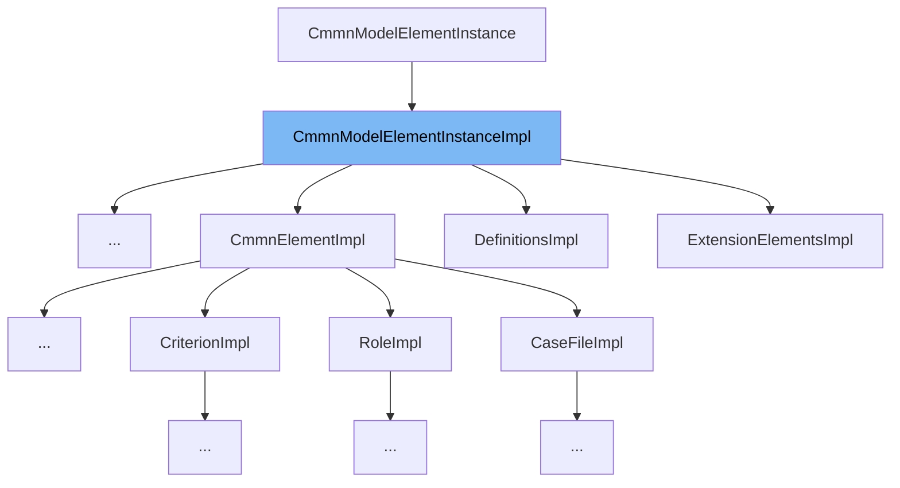

This document will cover the `CmmnModelElementInstanceImpl` class. We'll cover:

1. What is `CmmnModelElementInstanceImpl`.
2. Variables and functions in `CmmnModelElementInstanceImpl`.
3. Usage example of `CmmnModelElementInstanceImpl`.



# What is CmmnModelElementInstanceImpl

`CmmnModelElementInstanceImpl` is an abstract class that extends `ModelElementInstanceImpl` and implements `CmmnModelElementInstance`. It is part of the Camunda BPMN model API and is used as a base class for implementing model element instances in the CMMN model.

<SwmSnippet path="/model-api/cmmn-model/src/main/java/org/camunda/bpm/model/cmmn/impl/instance/CmmnModelElementInstanceImpl.java" line="29">

---

# Variables and functions

The constructor `CmmnModelElementInstanceImpl(ModelTypeInstanceContext instanceContext)` is used to create an instance of `CmmnModelElementInstanceImpl`. It takes a `ModelTypeInstanceContext` as a parameter and passes it to the superclass constructor.

```java
  public CmmnModelElementInstanceImpl(ModelTypeInstanceContext instanceContext) {
    super(instanceContext);
  }
```

---

</SwmSnippet>

<SwmSnippet path="/model-api/cmmn-model/src/main/java/org/camunda/bpm/model/cmmn/impl/instance/camunda/CamundaInImpl.java" line="41">

---

# Usage example

`CamundaInImpl` is an example of a class that extends `CmmnModelElementInstanceImpl`. This shows how `CmmnModelElementInstanceImpl` is used as a base class for other model element instances in the CMMN model.

```java
public class CamundaInImpl extends CmmnModelElementInstanceImpl implements CamundaIn {
```

---

</SwmSnippet>

&nbsp;

*This is an auto-generated document by Swimm AI 🌊 and has not yet been verified by a human*

<SwmMeta version="3.0.0" repo-id="Z2l0aHViJTNBJTNBQ2l0aS1jYW11bmRhJTNBJTNBZ2lsYWRuYXZvdA==" repo-name="Citi-camunda" doc-type="general-class"><sup>Powered by [Swimm](/)</sup></SwmMeta>
