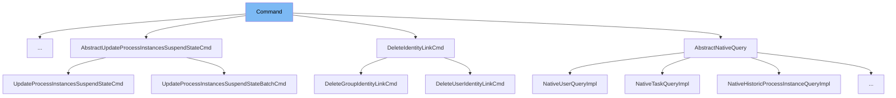

This document will cover the `Command` interface in the Citi-camunda project. We'll cover:

1. What is `Command`
2. Variables and functions in `Command`
3. Usage example of `Command`



# What is Command

`Command` is an interface in the Citi-camunda project. It is used to define a command that can be executed within a `CommandContext`. It also provides a mechanism to determine if the command is retryable in case of a `CrdbTransactionRetryException`.

<SwmSnippet path="/engine/src/main/java/org/camunda/bpm/engine/impl/interceptor/Command.java" line="26">

---

# Variables and functions

The function `execute` is the main function of the `Command` interface. It takes a `CommandContext` as an argument and returns a generic type `T`. This function is meant to be implemented by any class that implements the `Command` interface and defines the main logic of the command.

```java
  T execute(CommandContext commandContext);
```

---

</SwmSnippet>

<SwmSnippet path="/engine/src/main/java/org/camunda/bpm/engine/impl/interceptor/Command.java" line="33">

---

The function `isRetryable` is used to determine if the command can be retried in case of a `CrdbTransactionRetryException`. By default, it returns false, indicating that the command is not retryable. This function can be overridden by any class that implements the `Command` interface to specify its own retry logic.

```java
  default boolean isRetryable() {
    return false;
```

---

</SwmSnippet>

<SwmSnippet path="/engine/src/main/java/org/camunda/bpm/engine/impl/cmd/SetAnnotationForIncidentCmd.java" line="1">

---

# Usage example

`SetAnnotationForIncidentCmd` is an example of a class that implements the `Command` interface. It defines its own `execute` function and uses the `Command` interface to interact with the `CommandContext`.

```java
/*
 * Copyright Camunda Services GmbH and/or licensed to Camunda Services GmbH
 * under one or more contributor license agreements. See the NOTICE file
 * distributed with this work for additional information regarding copyright
 * ownership. Camunda licenses this file to you under the Apache License,
 * Version 2.0; you may not use this file except in compliance with the License.
 * You may obtain a copy of the License at
 *
 *     http://www.apache.org/licenses/LICENSE-2.0
 *
 * Unless required by applicable law or agreed to in writing, software
 * distributed under the License is distributed on an "AS IS" BASIS,
 * WITHOUT WARRANTIES OR CONDITIONS OF ANY KIND, either express or implied.
 * See the License for the specific language governing permissions and
 * limitations under the License.
 */
package org.camunda.bpm.engine.impl.cmd;

import org.camunda.bpm.engine.BadUserRequestException;
import org.camunda.bpm.engine.exception.NotValidException;
import org.camunda.bpm.engine.impl.cfg.CommandChecker;
```

---

</SwmSnippet>

&nbsp;

*This is an auto-generated document by Swimm AI 🌊 and has not yet been verified by a human*

<SwmMeta version="3.0.0" repo-id="Z2l0aHViJTNBJTNBQ2l0aS1jYW11bmRhJTNBJTNBZ2lsYWRuYXZvdA==" repo-name="Citi-camunda" doc-type="class"><sup>Powered by [Swimm](/)</sup></SwmMeta>
