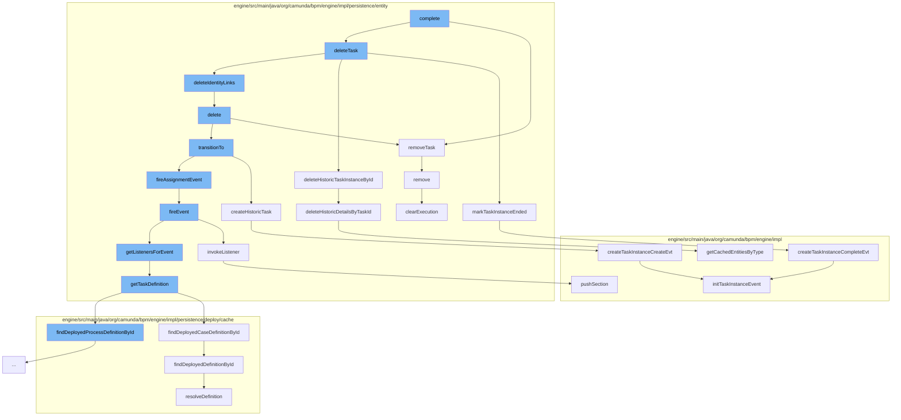

This document will cover the process of task completion in the Camunda BPMN engine, which includes:

 1. Completing the task
 2. Removing the task from execution
 3. Deleting the task
 4. Marking the task instance as ended
 5. Deleting identity links
 6. Transitioning the task to a different state
 7. Creating a historic task
 8. Firing an assignment event
 9. Invoking a listener
10. Getting the task definition
11. Finding the deployed case definition by ID
12. Resolving the definition
13. Pushing a section
14. Creating a task instance create event
15. Deleting historic details by task ID
16. Creating a task instance complete event
17. Removing the execution



<SwmSnippet path="/engine/src/main/java/org/camunda/bpm/engine/impl/persistence/entity/TaskEntity.java" line="365">

---

# Completing the task

The `complete` function in `TaskEntity.java` is the starting point of the task completion process. It sets the delete reason and transitions the task to the `STATE_DELETED` state if it is not already in that state or completed. It then calls the `deleteTask` function in the `TaskManager`.

```java
  public void delete(String deleteReason, boolean cascade) {
    this.deleteReason = deleteReason;

    // only fire lifecycle events if task is actually cancelled/deleted
    if (!TaskEntity.DELETE_REASON_COMPLETED.equals(deleteReason)
        && !TaskState.STATE_DELETED.equals(lifecycleState)) {
      transitionTo(TaskState.STATE_DELETED);
    }

    Context
    .getCommandContext()
    .getTaskManager()
    .deleteTask(this, deleteReason, cascade, skipCustomListeners);

    if (executionId != null) {
      ExecutionEntity execution = getExecution();
      execution.removeTask(this);
    }
  }
```

---

</SwmSnippet>

<SwmSnippet path="/engine/src/main/java/org/camunda/bpm/engine/impl/persistence/entity/ExecutionEntity.java" line="1611">

---

# Removing the task from execution

The `removeTask` function in `ExecutionEntity.java` is called to remove the task from the current execution. It does this by removing the task from the internal list of tasks.

```java
  public void removeTask(TaskEntity task) {
    getTasksInternal().remove(task);
  }
```

---

</SwmSnippet>

<SwmSnippet path="/engine/src/main/java/org/camunda/bpm/engine/impl/persistence/entity/TaskManager.java" line="206">

---

# Deleting the task

The `deleteTask` function in `TaskManager.java` is called to delete the task. It marks the task instance as ended and deletes the historic task instance by ID.

```java
    }
  }

  protected void configureQuery(TaskQueryImpl query) {
    getAuthorizationManager().configureTaskQuery(query);
    getTenantManager().configureQuery(query);
  }

  protected ListQueryParameterObject configureParameterizedQuery(Object parameter) {
    return getTenantManager().configureQuery(parameter);
  }

}

```

---

</SwmSnippet>

<SwmSnippet path="/engine/src/main/java/org/camunda/bpm/engine/impl/persistence/entity/HistoricTaskInstanceManager.java" line="206">

---

# Marking the task instance as ended

The `markTaskInstanceEnded` function in `HistoricTaskInstanceManager.java` is called to mark the task instance as ended. It creates a task instance complete event.

```java
  public void markTaskInstanceEnded(String taskId, final String deleteReason) {
    ProcessEngineConfigurationImpl configuration = Context.getProcessEngineConfiguration();

    final TaskEntity taskEntity = Context.getCommandContext()
        .getDbEntityManager()
        .selectById(TaskEntity.class, taskId);

    HistoryLevel historyLevel = configuration.getHistoryLevel();
    if(historyLevel.isHistoryEventProduced(HistoryEventTypes.TASK_INSTANCE_COMPLETE, taskEntity)) {

      HistoryEventProcessor.processHistoryEvents(new HistoryEventProcessor.HistoryEventCreator() {
        @Override
        public HistoryEvent createHistoryEvent(HistoryEventProducer producer) {
          return producer.createTaskInstanceCompleteEvt(taskEntity, deleteReason);
        }
      });
    }
  }
```

---

</SwmSnippet>

<SwmSnippet path="/engine/src/main/java/org/camunda/bpm/engine/impl/persistence/entity/TaskEntity.java" line="365">

---

# Deleting identity links

The `deleteIdentityLinks` function in `TaskEntity.java` is called to delete the identity links associated with the task. It does this by calling the `delete` function.

```java
  public void delete(String deleteReason, boolean cascade) {
    this.deleteReason = deleteReason;

    // only fire lifecycle events if task is actually cancelled/deleted
    if (!TaskEntity.DELETE_REASON_COMPLETED.equals(deleteReason)
        && !TaskState.STATE_DELETED.equals(lifecycleState)) {
      transitionTo(TaskState.STATE_DELETED);
    }

    Context
    .getCommandContext()
    .getTaskManager()
    .deleteTask(this, deleteReason, cascade, skipCustomListeners);

    if (executionId != null) {
      ExecutionEntity execution = getExecution();
      execution.removeTask(this);
    }
  }
```

---

</SwmSnippet>

<SwmSnippet path="/engine/src/main/java/org/camunda/bpm/engine/impl/persistence/entity/TaskEntity.java" line="365">

---

# Transitioning the task to a different state

The `transitionTo` function in `TaskEntity.java` is called to transition the task to a different state. It creates a historic task and fires an assignment event.

```java
  public void delete(String deleteReason, boolean cascade) {
    this.deleteReason = deleteReason;

    // only fire lifecycle events if task is actually cancelled/deleted
    if (!TaskEntity.DELETE_REASON_COMPLETED.equals(deleteReason)
        && !TaskState.STATE_DELETED.equals(lifecycleState)) {
      transitionTo(TaskState.STATE_DELETED);
    }

    Context
    .getCommandContext()
    .getTaskManager()
    .deleteTask(this, deleteReason, cascade, skipCustomListeners);

    if (executionId != null) {
      ExecutionEntity execution = getExecution();
      execution.removeTask(this);
    }
  }
```

---

</SwmSnippet>

<SwmSnippet path="/engine/src/main/java/org/camunda/bpm/engine/impl/persistence/entity/HistoricTaskInstanceManager.java" line="226">

---

# Creating a historic task

The `createHistoricTask` function in `HistoricTaskInstanceManager.java` is called to create a historic task. It does this by creating a task instance create event.

```java
  public void createHistoricTask(final TaskEntity task) {
    ProcessEngineConfigurationImpl configuration = Context.getProcessEngineConfiguration();

    HistoryLevel historyLevel = configuration.getHistoryLevel();
    if(historyLevel.isHistoryEventProduced(HistoryEventTypes.TASK_INSTANCE_CREATE, task)) {

      HistoryEventProcessor.processHistoryEvents(new HistoryEventProcessor.HistoryEventCreator() {
        @Override
        public HistoryEvent createHistoryEvent(HistoryEventProducer producer) {
          return producer.createTaskInstanceCreateEvt(task);
        }
      });

    }
  }
```

---

</SwmSnippet>

<SwmSnippet path="/engine/src/main/java/org/camunda/bpm/engine/impl/persistence/entity/TaskEntity.java" line="1032">

---

# Firing an assignment event

The `fireAssignmentEvent` function in `TaskEntity.java` is called to fire an assignment event. It does this by calling the `fireEvent` function.

```java
  /**
   * @return true if invoking the listener was successful;
   *   if not successful, either false is returned (case: BPMN error propagation)
   *   or an exception is thrown
   */
  public boolean fireEvent(String taskEventName) {

    List<TaskListener> taskEventListeners = getListenersForEvent(taskEventName);

    if (taskEventListeners != null) {
      for (TaskListener taskListener : taskEventListeners) {
        if (!invokeListener(taskEventName, taskListener)){
          return false;
        }
      }
    }

    return true;
  }
```

---

</SwmSnippet>

<SwmSnippet path="/engine/src/main/java/org/camunda/bpm/engine/impl/persistence/entity/TaskEntity.java" line="1076">

---

# Invoking a listener

The `invokeListener` function in `TaskEntity.java` is called to invoke a listener. It does this by pushing a section.

```java
  protected boolean invokeListener(String taskEventName, TaskListener taskListener) {
    boolean popProcessDataContext = false;
    CommandInvocationContext commandInvocationContext = Context.getCommandInvocationContext();
    CoreExecution execution = getExecution();
    if (execution == null) {
      execution = getCaseExecution();
    } else {
      if (commandInvocationContext != null) {
        popProcessDataContext = commandInvocationContext.getProcessDataContext().pushSection((ExecutionEntity) execution);
      }
    }
    if (execution != null) {
      setEventName(taskEventName);
    }
    try {
      boolean result = invokeListener(execution, taskEventName, taskListener);
      if (popProcessDataContext) {
        commandInvocationContext.getProcessDataContext().popSection();
      }
      return result;
    } catch (Exception e) {
```

---

</SwmSnippet>

<SwmSnippet path="/engine/src/main/java/org/camunda/bpm/engine/impl/persistence/entity/TaskEntity.java" line="1322">

---

# Getting the task definition

The `getTaskDefinition` function in `TaskEntity.java` is called to get the task definition. It does this by finding the deployed case definition by ID.

```java
  public TaskDefinition getTaskDefinition() {
    if (taskDefinition==null && taskDefinitionKey!=null) {

      Map<String, TaskDefinition> taskDefinitions = null;
      if (processDefinitionId != null) {
        ProcessDefinitionEntity processDefinition = Context
            .getProcessEngineConfiguration()
            .getDeploymentCache()
            .findDeployedProcessDefinitionById(processDefinitionId);

        taskDefinitions = processDefinition.getTaskDefinitions();

      } else {
        CaseDefinitionEntity caseDefinition = Context
            .getProcessEngineConfiguration()
            .getDeploymentCache()
            .findDeployedCaseDefinitionById(caseDefinitionId);

        taskDefinitions = caseDefinition.getTaskDefinitions();
      }

```

---

</SwmSnippet>

<SwmSnippet path="/engine/src/main/java/org/camunda/bpm/engine/impl/persistence/deploy/cache/DeploymentCache.java" line="158">

---

# Finding the deployed case definition by ID

The `findDeployedCaseDefinitionById` function in `DeploymentCache.java` is called to find the deployed case definition by ID. It does this by finding the deployed definition by ID.

```java
  public CaseDefinitionEntity findDeployedCaseDefinitionById(String caseDefinitionId) {
    return caseDefinitionCache.findDeployedDefinitionById(caseDefinitionId);
  }
```

---

</SwmSnippet>

<SwmSnippet path="/engine/src/main/java/org/camunda/bpm/engine/impl/persistence/deploy/cache/ResourceDefinitionCache.java" line="111">

---

# Resolving the definition

The `resolveDefinition` function in `ResourceDefinitionCache.java` is called to resolve the definition. It does this by updating the cache with the resolved definition.

```java
  public T resolveDefinition(T definition) {
    String definitionId = definition.getId();
    String deploymentId = definition.getDeploymentId();
    T cachedDefinition = cache.get(definitionId);
    if (cachedDefinition == null) {
      synchronized (this) {
        cachedDefinition = cache.get(definitionId);
        if (cachedDefinition == null) {
          DeploymentEntity deployment = Context
              .getCommandContext()
              .getDeploymentManager()
              .findDeploymentById(deploymentId);
          deployment.setNew(false);
          cacheDeployer.deployOnlyGivenResourcesOfDeployment(deployment, definition.getResourceName(), definition.getDiagramResourceName());
          cachedDefinition = cache.get(definitionId);
        }
      }
      checkInvalidDefinitionWasCached(deploymentId, definitionId, cachedDefinition);
    }
    if (cachedDefinition != null) {
      cachedDefinition.updateModifiableFieldsFromEntity(definition);
```

---

</SwmSnippet>

<SwmSnippet path="/engine/src/main/java/org/camunda/bpm/engine/impl/interceptor/ProcessDataContext.java" line="164">

---

# Pushing a section

The `pushSection` function in `ProcessDataContext.java` is called to push a section. It does this by adding to the stack and sealing the current section.

```java
  /**
   * Start a new section that keeps track of the pushed properties.
   *
   * If logging context properties are defined, the MDC is updated as well. This
   * also includes clearing the MDC for the first section that is pushed for the
   * logging context so that only the current properties will be present in the
   * MDC (might be less than previously present in the MDC). The previous
   * logging context needs to be reset in the MDC when this one is closed. This
   * can be achieved by using {@link #updateMdc(String)} with the previous
   * logging context.
   *
   * @param execution
   *          the execution to retrieve the context data from
   *
   * @return <code>true</code> if the section contains any updates and therefore
   *         should be popped later by {@link #popSection()}
   */
  public boolean pushSection(ExecutionEntity execution) {
    if (handleMdc && hasNoMdcValues()) {
      clearMdc();
    }
```

---

</SwmSnippet>

<SwmSnippet path="/engine/src/main/java/org/camunda/bpm/engine/impl/history/producer/DefaultHistoryEventProducer.java" line="765">

---

# Creating a task instance create event

The `createTaskInstanceCreateEvt` function in `DefaultHistoryEventProducer.java` is called to create a task instance create event. It does this by initializing a task instance event.

```java
  public HistoryEvent createTaskInstanceCreateEvt(DelegateTask task) {

    // create event instance
    HistoricTaskInstanceEventEntity evt = newTaskInstanceEventEntity(task);

    // initialize event
    initTaskInstanceEvent(evt, (TaskEntity) task, HistoryEventTypes.TASK_INSTANCE_CREATE);

    evt.setStartTime(ClockUtil.getCurrentTime());

    return evt;
  }
```

---

</SwmSnippet>

<SwmSnippet path="/engine/src/main/java/org/camunda/bpm/engine/impl/persistence/entity/HistoricDetailManager.java" line="83">

---

# Deleting historic details by task ID

The `deleteHistoricDetailsByTaskId` function in `HistoricDetailManager.java` is called to delete the historic details by task ID. It does this by deleting the entries in the DB and cache.

```java
  public void deleteHistoricDetailsByTaskId(String taskId) {
    if (isHistoryEnabled()) {
      // delete entries in DB
      List<HistoricDetail> historicDetails = findHistoricDetailsByTaskId(taskId);

      for (HistoricDetail historicDetail : historicDetails) {
        ((HistoricDetailEventEntity) historicDetail).delete();
      }

      //delete entries in Cache
      List<HistoricDetailEventEntity> cachedHistoricDetails = getDbEntityManager().getCachedEntitiesByType(HistoricDetailEventEntity.class);
      for (HistoricDetailEventEntity historicDetail : cachedHistoricDetails) {
        // make sure we only delete the right ones (as we cannot make a proper query in the cache)
        if (taskId.equals(historicDetail.getTaskId())) {
          historicDetail.delete();
        }
      }
    }
  }
```

---

</SwmSnippet>

<SwmSnippet path="/engine/src/main/java/org/camunda/bpm/engine/impl/history/producer/DefaultHistoryEventProducer.java" line="800">

---

# Creating a task instance complete event

The `createTaskInstanceCompleteEvt` function in `DefaultHistoryEventProducer.java` is called to create a task instance complete event. It does this by initializing a task instance event.

```java
  public HistoryEvent createTaskInstanceCompleteEvt(DelegateTask task, String deleteReason) {

    // create event instance
    HistoricTaskInstanceEventEntity evt = loadTaskInstanceEvent(task);

    // initialize event
    initTaskInstanceEvent(evt, (TaskEntity) task, HistoryEventTypes.TASK_INSTANCE_COMPLETE);

    // set end time
    evt.setEndTime(ClockUtil.getCurrentTime());
    if(evt.getStartTime() != null) {
      evt.setDurationInMillis(evt.getEndTime().getTime()-evt.getStartTime().getTime());
    }

    // set delete reason
    evt.setDeleteReason(deleteReason);

    return evt;
  }
```

---

</SwmSnippet>

<SwmSnippet path="/engine/src/main/java/org/camunda/bpm/engine/impl/persistence/entity/ExecutionEntity.java" line="1019">

---

# Removing the execution

The `remove` function in `ExecutionEntity.java` is called to remove the execution. It does this by clearing the execution and removing all event subscriptions for this scope.

```java
  // customized persistence behavior /////////////////////////////////////////

  @Override
  public void remove() {
    super.remove();

    // removes jobs, incidents and tasks, and
    // clears the variable store
    clearExecution();

    // remove all event subscriptions for this scope, if the scope has event
    // subscriptions:
    removeEventSubscriptions();

    // finally delete this execution
    Context.getCommandContext().getExecutionManager().deleteExecution(this);
  }
```

---

</SwmSnippet>

&nbsp;

*This is an auto-generated document by Swimm AI 🌊 and has not yet been verified by a human*

<SwmMeta version="3.0.0" repo-id="Z2l0aHViJTNBJTNBQ2l0aS1jYW11bmRhJTNBJTNBZ2lsYWRuYXZvdA==" repo-name="Citi-camunda" doc-type="flows"><sup>Powered by [Swimm](/)</sup></SwmMeta>
