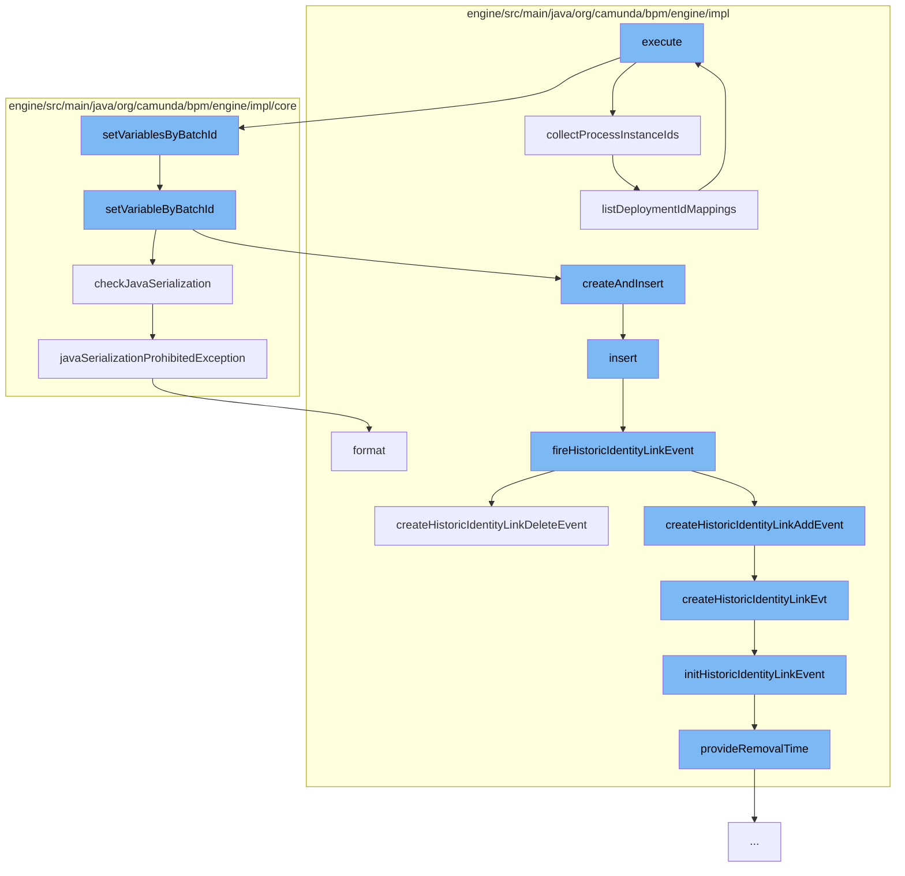

This document will cover the process of correlating all messages in a batch, which includes:

 1. Collecting process instance IDs
 2. Setting variables by batch ID
 3. Checking Java serialization
 4. Inserting identity link entities
 5. Firing historic identity link events
 6. Creating historic identity link events
 7. Initializing historic identity link events
 8. Providing removal time for historic events
 9. Listing deployment ID mappings
10. Executing the correlation of all messages in a batch.



<SwmSnippet path="/engine/src/main/java/org/camunda/bpm/engine/impl/cmd/batch/CorrelateAllMessageBatchCmd.java" line="91">

---

# Collecting process instance IDs

The function `collectProcessInstanceIds` is used to collect all the process instance IDs for a batch. It creates a new `BatchElementConfiguration` and adds deployment mappings for each process instance ID.

```java
  protected BatchElementConfiguration collectProcessInstanceIds(CommandContext commandContext) {

    BatchElementConfiguration elementConfiguration = new BatchElementConfiguration();

    if (!CollectionUtil.isEmpty(processInstanceIds)) {
      ProcessInstanceQueryImpl query = new ProcessInstanceQueryImpl();
      query.processInstanceIds(new HashSet<>(processInstanceIds));

      elementConfiguration.addDeploymentMappings(
          commandContext.runWithoutAuthorization(query::listDeploymentIdMappings), processInstanceIds);
    }

    if (processInstanceQuery != null) {
      elementConfiguration.addDeploymentMappings(((ProcessInstanceQueryImpl) processInstanceQuery).listDeploymentIdMappings());
    }

    if (historicProcessInstanceQuery != null) {
      elementConfiguration.addDeploymentMappings(((HistoricProcessInstanceQueryImpl) historicProcessInstanceQuery).listDeploymentIdMappings());
    }

    return elementConfiguration;
```

---

</SwmSnippet>

<SwmSnippet path="/engine/src/main/java/org/camunda/bpm/engine/impl/core/variable/VariableUtil.java" line="109">

---

# Setting variables by batch ID

The function `setVariableByBatchId` is used to set a variable for a specific batch ID. It checks if the variable is transient and if Java serialization is allowed before creating and inserting a new `VariableInstanceEntity`.

```java
  public static void setVariableByBatchId(String batchId, String variableName, Object variableValue) {
    TypedValue variableTypedValue = Variables.untypedValue(variableValue);

    boolean isTransient = variableTypedValue.isTransient();
    if (isTransient) {
      throw CMD_LOGGER.exceptionSettingTransientVariablesAsyncNotSupported(variableName);
    }

    checkJavaSerialization(variableName, variableTypedValue);

    VariableInstanceEntity variableInstance =
        VariableInstanceEntity.createAndInsert(variableName, variableTypedValue);

    variableInstance.setVariableScopeId(batchId);
    variableInstance.setBatchId(batchId);
  }
```

---

</SwmSnippet>

<SwmSnippet path="/engine/src/main/java/org/camunda/bpm/engine/impl/core/variable/VariableUtil.java" line="81">

---

# Checking Java serialization

The function `checkJavaSerialization` is used to check if Java serialization is allowed for a variable. If it is not allowed, it throws a `javaSerializationProhibitedException`.

```java
  public static void checkJavaSerialization(String variableName, TypedValue value) {
    if (isJavaSerializationProhibited(value)) {
      throw CORE_LOGGER.javaSerializationProhibitedException(variableName);
    }
  }
```

---

</SwmSnippet>

<SwmSnippet path="/engine/src/main/java/org/camunda/bpm/engine/impl/persistence/entity/IdentityLinkEntity.java" line="82">

---

# Inserting identity link entities

The function `insert` is used to insert a new `IdentityLinkEntity` into the database and fire a historic identity link event.

```java
  public void insert() {
    Context
      .getCommandContext()
      .getDbEntityManager()
      .insert(this);
    fireHistoricIdentityLinkEvent(HistoryEventTypes.IDENTITY_LINK_ADD);
  }
```

---

</SwmSnippet>

<SwmSnippet path="/engine/src/main/java/org/camunda/bpm/engine/impl/persistence/entity/IdentityLinkEntity.java" line="204">

---

# Firing historic identity link events

The function `fireHistoricIdentityLinkEvent` is used to fire a historic identity link event. It checks if the history level allows for the event to be produced and then creates the event.

```java
  public void fireHistoricIdentityLinkEvent(final HistoryEventType eventType) {
    ProcessEngineConfigurationImpl processEngineConfiguration = Context.getProcessEngineConfiguration();

    HistoryLevel historyLevel = processEngineConfiguration.getHistoryLevel();
    if(historyLevel.isHistoryEventProduced(eventType, this)) {

      HistoryEventProcessor.processHistoryEvents(new HistoryEventProcessor.HistoryEventCreator() {
        @Override
        public HistoryEvent createHistoryEvent(HistoryEventProducer producer) {
          HistoryEvent event = null;
          if (HistoryEvent.IDENTITY_LINK_ADD.equals(eventType.getEventName())) {
            event = producer.createHistoricIdentityLinkAddEvent(IdentityLinkEntity.this);
          } else if (HistoryEvent.IDENTITY_LINK_DELETE.equals(eventType.getEventName())) {
            event = producer.createHistoricIdentityLinkDeleteEvent(IdentityLinkEntity.this);
          }
          return event;
        }
      });

    }
  }
```

---

</SwmSnippet>

<SwmSnippet path="/engine/src/main/java/org/camunda/bpm/engine/impl/history/producer/DefaultHistoryEventProducer.java" line="945">

---

# Creating historic identity link events

The function `createHistoricIdentityLinkEvt` is used to create a historic identity link event. It initializes the event with the identity link and event type.

```java
  @Override
  public HistoryEvent createHistoricIdentityLinkDeleteEvent(IdentityLink identityLink) {
    return createHistoricIdentityLinkEvt(identityLink, HistoryEventTypes.IDENTITY_LINK_DELETE);
  }

  protected HistoryEvent createHistoricIdentityLinkEvt(IdentityLink identityLink, HistoryEventTypes eventType) {
    // create historic identity link event
    HistoricIdentityLinkLogEventEntity evt = newIdentityLinkEventEntity();
    // Mapping all the values of identity link to HistoricIdentityLinkEvent
    initHistoricIdentityLinkEvent(evt, identityLink, eventType);
    return evt;
  }
```

---

</SwmSnippet>

<SwmSnippet path="/engine/src/main/java/org/camunda/bpm/engine/impl/history/producer/DefaultHistoryEventProducer.java" line="962">

---

# Initializing historic identity link events

The function `initHistoricIdentityLinkEvent` is used to initialize a historic identity link event. It sets the process definition ID, key, and root process instance ID, among other properties.

```java
  protected void initHistoricIdentityLinkEvent(HistoricIdentityLinkLogEventEntity evt, IdentityLink identityLink, HistoryEventType eventType) {

    if (identityLink.getTaskId() != null) {
      TaskEntity task = Context
          .getCommandContext()
          .getTaskManager()
          .findTaskById(identityLink.getTaskId());

      evt.setProcessDefinitionId(task.getProcessDefinitionId());

      if (task.getProcessDefinition() != null) {
        evt.setProcessDefinitionKey(task.getProcessDefinition().getKey());
      }

      ExecutionEntity execution = task.getExecution();
      if (execution != null) {
        evt.setRootProcessInstanceId(execution.getRootProcessInstanceId());

        if (isHistoryRemovalTimeStrategyStart()) {
          provideRemovalTime(evt);
        }
```

---

</SwmSnippet>

<SwmSnippet path="/engine/src/main/java/org/camunda/bpm/engine/impl/history/producer/DefaultHistoryEventProducer.java" line="1300">

---

# Providing removal time for historic events

The function `provideRemovalTime` is used to provide a removal time for a historic event. It calculates the removal time and sets it on the historic batch entity.

```java
  protected void provideRemovalTime(HistoricBatchEntity historicBatch) {
    Date removalTime = calculateRemovalTime(historicBatch);
    if (removalTime != null) {
      historicBatch.setRemovalTime(removalTime);
    }
  }
```

---

</SwmSnippet>

<SwmSnippet path="/engine/src/main/java/org/camunda/bpm/engine/impl/AbstractQuery.java" line="369">

---

# Listing deployment ID mappings

The function `listDeploymentIdMappings` is used to list all deployment ID mappings. It executes the query and returns the list of IDs.

```java
  @SuppressWarnings("unchecked")
  public List<ImmutablePair<String, String>> listDeploymentIdMappings() {
    this.resultType = ResultType.LIST_DEPLOYMENT_ID_MAPPINGS;
    List<ImmutablePair<String, String>> ids = null;
    if (commandExecutor != null) {
      ids = (List<ImmutablePair<String, String>>) commandExecutor.execute(this);
    } else {
      ids = evaluateExpressionsAndExecuteDeploymentIdMappingsList(Context.getCommandContext());
    }

    if (ids != null) {
      QueryMaxResultsLimitUtil.checkMaxResultsLimit(ids.size());
    }

    return ids;
  }
```

---

</SwmSnippet>

<SwmSnippet path="/engine/src/main/java/org/camunda/bpm/engine/impl/AbstractQuery.java" line="191">

---

# Executing the correlation of all messages in a batch

The function `execute` is used to execute the correlation of all messages in a batch. It checks the result type and calls the appropriate function to execute the query.

```java
  public Object execute(CommandContext commandContext) {
    if (resultType==ResultType.LIST) {
      return evaluateExpressionsAndExecuteList(commandContext, null);
    } else if (resultType==ResultType.SINGLE_RESULT) {
      return executeSingleResult(commandContext);
    } else if (resultType==ResultType.LIST_PAGE) {
      return evaluateExpressionsAndExecuteList(commandContext, null);
    } else if (resultType == ResultType.LIST_IDS) {
      return evaluateExpressionsAndExecuteIdsList(commandContext);
    } else if (resultType == ResultType.LIST_DEPLOYMENT_ID_MAPPINGS) {
      return evaluateExpressionsAndExecuteDeploymentIdMappingsList(commandContext);
    } else {
      return evaluateExpressionsAndExecuteCount(commandContext);
    }
  }
```

---

</SwmSnippet>

&nbsp;

*This is an auto-generated document by Swimm AI 🌊 and has not yet been verified by a human*

<SwmMeta version="3.0.0" repo-id="Z2l0aHViJTNBJTNBQ2l0aS1jYW11bmRhJTNBJTNBZ2lsYWRuYXZvdA==" repo-name="Citi-camunda" doc-type="flows"><sup>Powered by [Swimm](/)</sup></SwmMeta>
