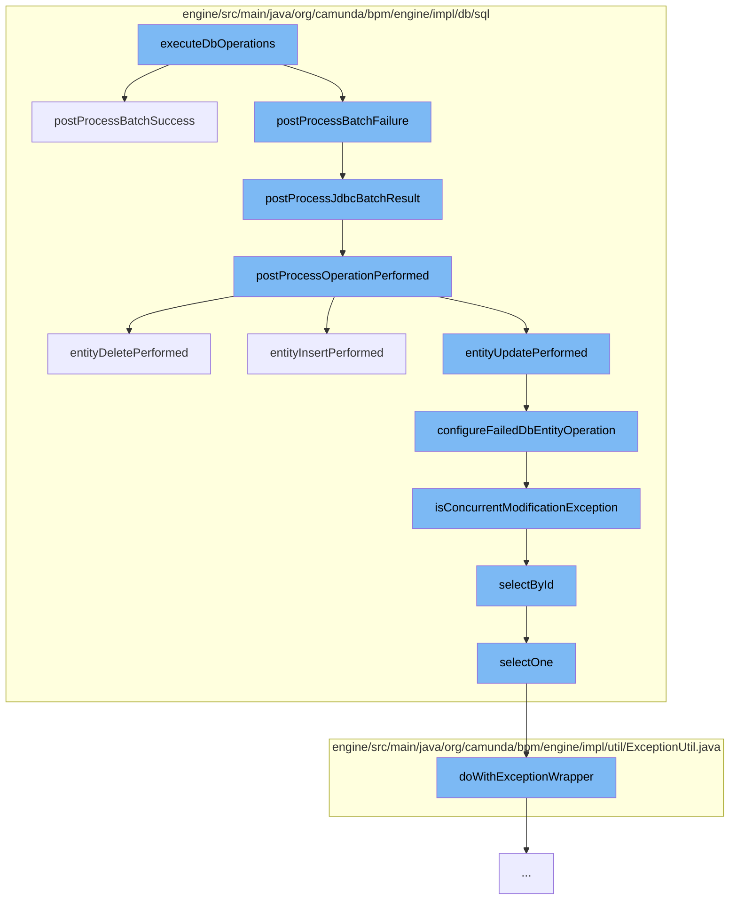

This document will cover the process of executing database operations in the Citi-camunda project. We'll cover:

1. The execution of database operations
2. Handling of successful batch operations
3. Processing of JDBC batch results
4. Post-processing of performed operations
5. Handling of entity deletion
6. Configuration of failed database entity operations
7. Handling of concurrent modification exceptions
8. Selection of entities by ID
9. Wrapping of exceptions.



<SwmSnippet path="/engine/src/main/java/org/camunda/bpm/engine/impl/db/sql/BatchDbSqlSession.java" line="81">

---

# Execution of Database Operations

The `executeDbOperations` function initiates the process of executing database operations. It calls `postProcessBatchSuccess` and `postProcessBatchFailure` to handle the results of the batch operations.

```java
  protected FlushResult postProcessBatchSuccess(List<DbOperation> operations, List<BatchResult> batchResults) {
    Iterator<DbOperation> operationsIt = operations.iterator();
    List<DbOperation> failedOperations = new ArrayList<>();
    for (BatchResult successfulBatch : batchResults) {
      // even if all batches are successful, there can be concurrent modification failures
      // (e.g. 0 rows updated)
      postProcessJdbcBatchResult(operationsIt, successfulBatch.getUpdateCounts(), null, failedOperations);
    }

    // there should be no more operations remaining
    if (operationsIt.hasNext()) {
      throw LOG.wrongBatchResultsSizeException(operations);
    }

    return FlushResult.withFailures(failedOperations);
  }
```

---

</SwmSnippet>

<SwmSnippet path="/engine/src/main/java/org/camunda/bpm/engine/impl/db/sql/BatchDbSqlSession.java" line="81">

---

# Handling of Successful Batch Operations

`postProcessBatchSuccess` handles the successful batch operations. It iterates over the batch results and processes each successful batch. If there are any remaining operations, an exception is thrown.

```java
  protected FlushResult postProcessBatchSuccess(List<DbOperation> operations, List<BatchResult> batchResults) {
    Iterator<DbOperation> operationsIt = operations.iterator();
    List<DbOperation> failedOperations = new ArrayList<>();
    for (BatchResult successfulBatch : batchResults) {
      // even if all batches are successful, there can be concurrent modification failures
      // (e.g. 0 rows updated)
      postProcessJdbcBatchResult(operationsIt, successfulBatch.getUpdateCounts(), null, failedOperations);
    }

    // there should be no more operations remaining
    if (operationsIt.hasNext()) {
      throw LOG.wrongBatchResultsSizeException(operations);
    }

    return FlushResult.withFailures(failedOperations);
  }
```

---

</SwmSnippet>

<SwmSnippet path="/engine/src/main/java/org/camunda/bpm/engine/impl/db/sql/BatchDbSqlSession.java" line="124">

---

# Processing of JDBC Batch Results

`postProcessJdbcBatchResult` processes the results of the JDBC batch operations. It handles different cases of success and failure, and processes each operation based on the statement result.

```java
  /**
   * <p>This method can be called with three cases:
   *
   * <ul>
   * <li>Case 1: Success. statementResults contains the number of
   * affected rows for all operations.
   * <li>Case 2: Failure. statementResults contains the number of
   * affected rows for all successful operations that were executed
   * before the failed operation.
   * <li>Case 3: Failure. statementResults contains the number of
   * affected rows for all operations of the batch, i.e. further
   * statements were executed after the first failed statement.
   * </ul>
   *
   * <p>See {@link BatchUpdateException#getUpdateCounts()} for the specification
   * of cases 2 and 3.
   *
   * @return all failed operations
   */
  protected void postProcessJdbcBatchResult(
      Iterator<DbOperation> operationsIt,
```

---

</SwmSnippet>

<SwmSnippet path="/engine/src/main/java/org/camunda/bpm/engine/impl/db/sql/BatchDbSqlSession.java" line="218">

---

# Post-processing of Performed Operations

`postProcessOperationPerformed` post-processes the performed operations. It handles different types of operations such as INSERT, DELETE, and UPDATE.

```java
  protected void postProcessOperationPerformed(DbOperation operation,
                                               int rowsAffected,
                                               PersistenceException failure) {

    switch(operation.getOperationType()) {

      case INSERT:
        entityInsertPerformed((DbEntityOperation) operation, rowsAffected, failure);
        break;

      case DELETE:
        entityDeletePerformed((DbEntityOperation) operation, rowsAffected, failure);
        break;
      case DELETE_BULK:
        bulkDeletePerformed((DbBulkOperation) operation, rowsAffected, failure);
        break;

      case UPDATE:
        entityUpdatePerformed((DbEntityOperation) operation, rowsAffected, failure);
        break;
      case UPDATE_BULK:
```

---

</SwmSnippet>

<SwmSnippet path="/engine/src/main/java/org/camunda/bpm/engine/impl/db/sql/DbSqlSession.java" line="213">

---

# Handling of Entity Deletion

`entityDeletePerformed` handles the deletion of entities. If there is a failure, it calls `configureFailedDbEntityOperation` to handle it.

```java
  protected void entityDeletePerformed(DbEntityOperation operation,
                                       int rowsAffected,
                                       PersistenceException failure) {

    if (failure != null) {
      configureFailedDbEntityOperation(operation, failure);
    } else {
      operation.setRowsAffected(rowsAffected);

      DbEntity dbEntity = operation.getEntity();

      // It only makes sense to check for optimistic locking exceptions for objects that actually have a revision
      if (dbEntity instanceof HasDbRevision && rowsAffected == 0) {
        operation.setState(State.FAILED_CONCURRENT_MODIFICATION);
      } else {
        operation.setState(State.APPLIED);
      }
    }
  }
```

---

</SwmSnippet>

<SwmSnippet path="/engine/src/main/java/org/camunda/bpm/engine/impl/db/sql/DbSqlSession.java" line="233">

---

# Configuration of Failed Database Entity Operations

`configureFailedDbEntityOperation` configures the failed database entity operations. It sets the state of the operation based on the type of failure.

```java
  protected void configureFailedDbEntityOperation(DbEntityOperation operation, PersistenceException failure) {
    operation.setRowsAffected(0);
    operation.setFailure(failure);

    DbOperationType operationType = operation.getOperationType();
    DbOperation dependencyOperation = operation.getDependentOperation();

    State failedState;
    if (isCrdbConcurrencyConflict(failure)) {
      failedState = State.FAILED_CONCURRENT_MODIFICATION_CRDB;
    } else if (isConcurrentModificationException(operation, failure)) {
      failedState = DatabaseUtil.checkDatabaseRollsBackTransactionOnError()
          ? State.FAILED_CONCURRENT_MODIFICATION_EXCEPTION
          : State.FAILED_CONCURRENT_MODIFICATION;
    } else if (DbOperationType.DELETE.equals(operationType)
              && dependencyOperation != null
              && dependencyOperation.getState() != null
              && dependencyOperation.getState() != State.APPLIED) {

      // the owning operation was not successful, so the prerequisite for this operation was not given
      LOG.ignoreFailureDuePreconditionNotMet(operation, "Parent database operation failed", dependencyOperation);
```

---

</SwmSnippet>

<SwmSnippet path="/engine/src/main/java/org/camunda/bpm/engine/impl/db/sql/DbSqlSession.java" line="262">

---

# Handling of Concurrent Modification Exceptions

`isConcurrentModificationException` checks if the failure is due to a concurrent modification exception. If it is, it returns true; otherwise, it returns false.

```java
  protected boolean isConcurrentModificationException(DbOperation failedOperation,
                                                      PersistenceException cause) {

    boolean isConstraintViolation = ExceptionUtil.checkForeignKeyConstraintViolation(cause);
    boolean isVariableIntegrityViolation = ExceptionUtil.checkVariableIntegrityViolation(cause);

    if (isVariableIntegrityViolation) {
      return true;
    } else if (
      isConstraintViolation
      && failedOperation instanceof DbEntityOperation
      && ((DbEntityOperation) failedOperation).getEntity() instanceof HasDbReferences
      && (failedOperation.getOperationType().equals(DbOperationType.INSERT)
      || failedOperation.getOperationType().equals(DbOperationType.UPDATE))
      ) {
      if (DatabaseUtil.checkDatabaseRollsBackTransactionOnError()) {
        return Context.getCommandContext().getProcessEngineConfiguration().isEnableOptimisticLockingOnForeignKeyViolation();
      }
      DbEntity entity = ((DbEntityOperation) failedOperation).getEntity();
      for (Map.Entry<String, Class> reference : ((HasDbReferences)entity).getReferencedEntitiesIdAndClass().entrySet()) {
        DbEntity referencedEntity = selectById(reference.getValue(), reference.getKey());
```

---

</SwmSnippet>

<SwmSnippet path="/engine/src/main/java/org/camunda/bpm/engine/impl/db/sql/DbSqlSession.java" line="115">

---

# Selection of Entities by ID

`selectById` selects entities by their ID. It uses the select statement for the type of the entity to select the entity from the database.

```java
  @Override
  @SuppressWarnings("unchecked")
  public <T extends DbEntity> T selectById(Class<T> type, String id) {
    String selectStatement = dbSqlSessionFactory.getSelectStatement(type);
    String mappedSelectStatement = dbSqlSessionFactory.mapStatement(selectStatement);
    ensureNotNull("no select statement for " + type + " in the ibatis mapping files", "selectStatement", selectStatement);

    Object result = ExceptionUtil.doWithExceptionWrapper(() -> sqlSession.selectOne(mappedSelectStatement, id));
    fireEntityLoaded(result);
    return (T) result;
  }
```

---

</SwmSnippet>

<SwmSnippet path="/engine/src/main/java/org/camunda/bpm/engine/impl/util/ExceptionUtil.java" line="357">

---

# Wrapping of Exceptions

`doWithExceptionWrapper` wraps exceptions. It calls the supplier and if an exception is thrown, it wraps it into a `ProcessEngineException`.

```java
  /**
   * Pass logic, which directly calls MyBatis API. In case a MyBatis exception is thrown, it is
   * wrapped into a {@link ProcessEngineException} and never propagated directly to an Engine API
   * call. In some cases, the top-level exception and its message are shown as a response body in
   * the REST API. Wrapping all MyBatis API calls in our codebase makes sure that the top-level
   * exception is always a {@link ProcessEngineException} with a generic message. Like this, SQL
   * details are never disclosed to potential attackers.
   *
   * @param supplier which calls MyBatis API
   * @param <T> is the type of the return value
   * @return the value returned by the supplier
   * @throws ProcessEngineException which wraps the actual exception
   */
  public static <T> T doWithExceptionWrapper(Supplier<T> supplier) {
    try {
      return supplier.get();
    } catch (Exception ex) {
      throw wrapPersistenceException(ex);
    }
  }
```

---

</SwmSnippet>

&nbsp;

*This is an auto-generated document by Swimm AI 🌊 and has not yet been verified by a human*

<SwmMeta version="3.0.0" repo-id="Z2l0aHViJTNBJTNBQ2l0aS1jYW11bmRhJTNBJTNBZ2lsYWRuYXZvdA==" repo-name="Citi-camunda" doc-type="flows"><sup>Powered by [Swimm](/)</sup></SwmMeta>
