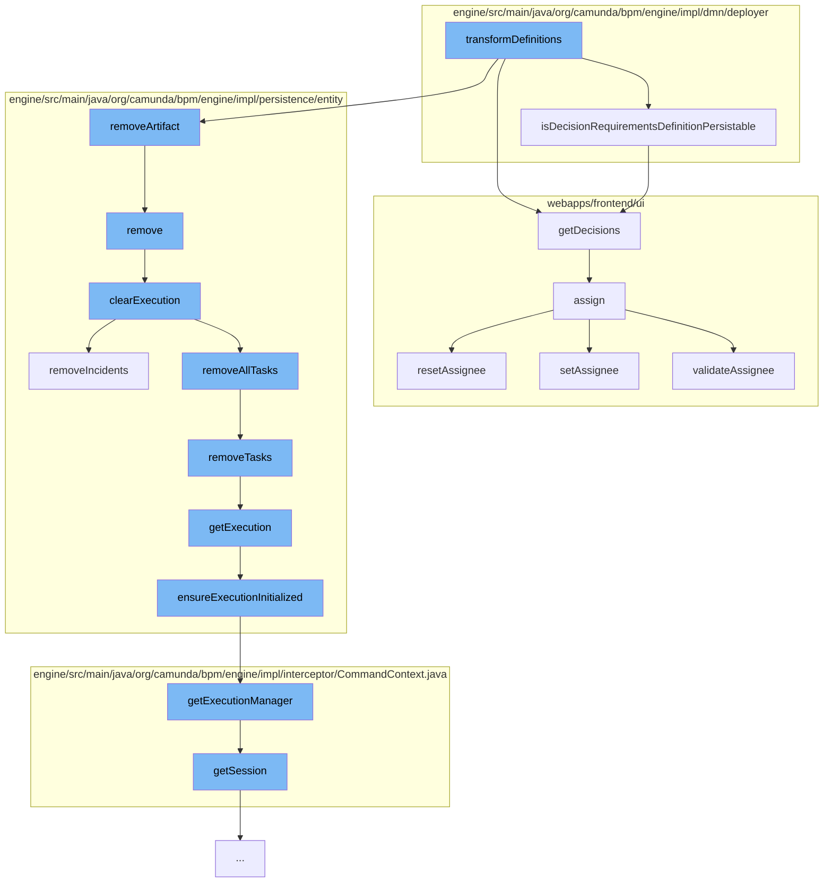

This document will cover the process of decision definition deployment in the Camunda engine. The process includes the following steps:

1. Transforming decision definitions
2. Checking if decision requirements definition is persistable
3. Removing artifacts from deployment
4. Clearing execution entities
5. Removing tasks and incidents
6. Ensuring execution is initialized
7. Getting decisions
8. Assigning tasks



<SwmSnippet path="/engine/src/main/java/org/camunda/bpm/engine/impl/dmn/deployer/DecisionDefinitionDeployer.java" line="1">

---

# Transforming Decision Definitions

The `transformDefinitions` function is the starting point of the decision definition deployment process. It prepares the decision definitions for deployment.

```java
/*
 * Copyright Camunda Services GmbH and/or licensed to Camunda Services GmbH
 * under one or more contributor license agreements. See the NOTICE file
 * distributed with this work for additional information regarding copyright
 * ownership. Camunda licenses this file to you under the Apache License,
 * Version 2.0; you may not use this file except in compliance with the License.
 * You may obtain a copy of the License at
 *
 *     http://www.apache.org/licenses/LICENSE-2.0
 *
```

---

</SwmSnippet>

<SwmSnippet path="/engine/src/main/java/org/camunda/bpm/engine/impl/dmn/deployer/DecisionRequirementsDefinitionDeployer.java" line="125">

---

# Checking Decision Requirements Definition Persistability

The `isDecisionRequirementsDefinitionPersistable` function checks if the decision requirements definition is persistable. It returns true if there is more than one decision in the definition.

```java
  public static boolean isDecisionRequirementsDefinitionPersistable(DecisionRequirementsDefinitionEntity definition) {
    // persist no decision requirements definition for a single decision
    return definition.getDecisions().size() > 1;
  }
```

---

</SwmSnippet>

<SwmSnippet path="/engine/src/main/java/org/camunda/bpm/engine/impl/persistence/entity/DeploymentEntity.java" line="1022">

---

# Removing Artifacts from Deployment

The `remove` function removes artifacts from the deployment. This includes jobs, incidents, tasks, and variable store.

```java

```

---

</SwmSnippet>

<SwmSnippet path="/engine/src/main/java/org/camunda/bpm/engine/impl/persistence/entity/ExecutionEntity.java" line="531">

---

# Clearing Execution Entities

The `clearExecution` function clears execution entities. This includes tasks, variable instances, jobs, and incidents.

```java
  protected void clearExecution() {
    //call the onRemove method of the execution observers
    //so they can do some clean up before
    for (ExecutionObserver observer : executionObservers) {
      observer.onClear(this);
    }

    // delete all the tasks and external tasks
    removeAllTasks();

    // delete all the variable instances
    removeVariablesLocalInternal();

    // remove all jobs
    removeJobs();

    // remove all incidents
    removeIncidents();
  }
```

---

</SwmSnippet>

<SwmSnippet path="/engine/src/main/java/org/camunda/bpm/engine/impl/persistence/entity/ExecutionEntity.java" line="1084">

---

# Removing Tasks and Incidents

The `removeTasks` function removes tasks associated with the execution entity. The `removeIncidents` function removes incidents associated with the execution entity.

```java
  protected void removeTasks(String reason, boolean skipCustomListeners) {
    if (reason == null) {
      reason = TaskEntity.DELETE_REASON_DELETED;
    }
    for (TaskEntity task : getTasks()) {
      if (isReplacedByParent()) {
        if (task.getExecution() == null || task.getExecution() != replacedBy) {
          // All tasks should have been moved when "replacedBy" has been set.
          // Just in case tasks where added,
          // wo do an additional check here and move it
          task.setExecution(replacedBy);
          this.getReplacedBy().addTask(task);
        }
      } else {
        task.delete(reason, false, skipCustomListeners);
      }
    }
  }
```

---

</SwmSnippet>

<SwmSnippet path="/engine/src/main/java/org/camunda/bpm/engine/impl/persistence/entity/VariableInstanceEntity.java" line="312">

---

# Ensuring Execution Initialization

The `ensureExecutionInitialized` function ensures that the execution entity is initialized. If it's not, it fetches the execution entity from the execution manager.

```java
  // execution ////////////////////////////////////////////////////////////////

  protected void ensureExecutionInitialized() {
    if (execution == null && executionId != null) {
      execution = Context
          .getCommandContext()
          .getExecutionManager()
          .findExecutionById(executionId);
    }
  }
```

---

</SwmSnippet>

<SwmSnippet path="/webapps/frontend/ui/cockpit/plugins/decisionList/app/views/dashboard/services/decision-list.js" line="37">

---

# Getting Decisions

The `getDecisions` function fetches the list of decisions from the decision definition service.

```javascript
    function getDecisions(params) {
      return decisionDefinitionService
        .list(Object.assign({}, defaultParams, params))
        .then(function(result) {
          decisions = result;

          if (drds) result = connectDrdsToDecisionDefinitions(drds, result);

          return result;
        });
    }
```

---

</SwmSnippet>

<SwmSnippet path="/webapps/frontend/ui/tasklist/client/scripts/task/directives/cam-tasklist-task-meta.js" line="301">

---

# Assigning Tasks

The `assign` function assigns tasks to users. If the assignee is not valid, it resets the assignee. If the assignee is valid, it sets the assignee.

```javascript
        $scope.assign = function(varValue) {
          var original = $scope.assignee ? $scope.assignee.id : '';

          validateAssignee($element.find('.assignee input')[0], function() {
            if (!$scope.validAssignee) {
              varValue = original;
              $scope.validAssignee = true;
              return;
            }
            setEditingState('assignee', false);

            var newAssignee = varValue.trim();

            if (!newAssignee) {
              if ($scope.isAssignee) {
                unclaim();
              } else {
                resetAssignee();
              }
            } else {
              setAssignee(newAssignee);
```

---

</SwmSnippet>

&nbsp;

*This is an auto-generated document by Swimm AI 🌊 and has not yet been verified by a human*

<SwmMeta version="3.0.0" repo-id="Z2l0aHViJTNBJTNBQ2l0aS1jYW11bmRhJTNBJTNBZ2lsYWRuYXZvdA==" repo-name="Citi-camunda" doc-type="flows"><sup>Powered by [Swimm](/)</sup></SwmMeta>
