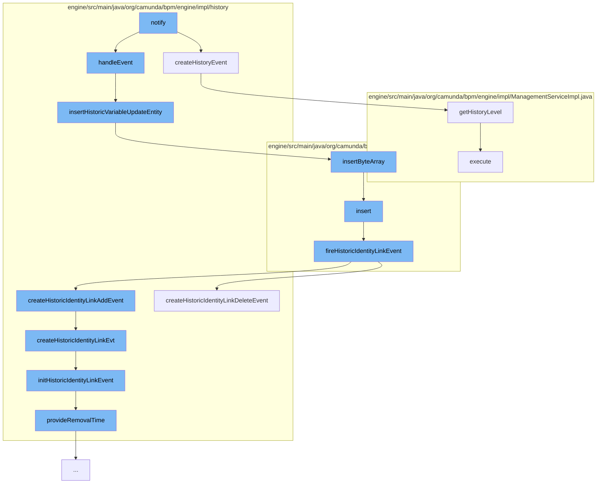

This document will cover the process of Decision Evaluation History Recording in the Camunda BPM Engine. The process includes:

1. Creating a history event
2. Handling the event
3. Inserting a historic variable update entity
4. Inserting a byte array
5. Inserting an identity link entity
6. Firing a historic identity link event
7. Creating a historic identity link event
8. Initializing a historic identity link event
9. Providing a removal time for the event.



<SwmSnippet path="/engine/src/main/java/org/camunda/bpm/engine/impl/history/parser/HistoryDecisionEvaluationListener.java" line="52">

---

# Creating a history event

The `createHistoryEvent` function is the starting point of the flow. It creates a history event for a decision evaluation. The event is created only if the decision table is deployed and the history level allows for the event to be produced.

```java
  protected HistoryEvent createHistoryEvent(DmnDecisionEvaluationEvent evaluationEvent) {
    if (historyLevel == null) {
      historyLevel = Context.getProcessEngineConfiguration().getHistoryLevel();
    }
    DmnDecision decisionTable = evaluationEvent.getDecisionResult().getDecision();
    if(isDeployedDecisionTable(decisionTable) && historyLevel.isHistoryEventProduced(HistoryEventTypes.DMN_DECISION_EVALUATE, decisionTable)) {

      CoreExecutionContext<? extends CoreExecution> executionContext = Context.getCoreExecutionContext();
      if (executionContext != null) {
        CoreExecution coreExecution = executionContext.getExecution();

        if (coreExecution instanceof ExecutionEntity) {
          ExecutionEntity execution = (ExecutionEntity) coreExecution;
          return eventProducer.createDecisionEvaluatedEvt(execution, evaluationEvent);
        }
        else if (coreExecution instanceof CaseExecutionEntity) {
          CaseExecutionEntity caseExecution = (CaseExecutionEntity) coreExecution;
          return eventProducer.createDecisionEvaluatedEvt(caseExecution, evaluationEvent);
        }

      }
```

---

</SwmSnippet>

<SwmSnippet path="/engine/src/main/java/org/camunda/bpm/engine/impl/history/handler/DbHistoryEventHandler.java" line="87">

---

# Handling the event

The `handleEvent` function is responsible for handling the history event. It calls the `insertHistoricVariableUpdateEntity` function to insert a historic variable update entity.

```java
  /** customized insert behavior for HistoricVariableUpdateEventEntity */
  protected void insertHistoricVariableUpdateEntity(HistoricVariableUpdateEventEntity historyEvent) {
    DbEntityManager dbEntityManager = getDbEntityManager();

    // insert update only if history level = FULL
    if(shouldWriteHistoricDetail(historyEvent)) {

      // insert byte array entity (if applicable)
      byte[] byteValue = historyEvent.getByteValue();
      if(byteValue != null) {
        ByteArrayEntity byteArrayEntity = new ByteArrayEntity(historyEvent.getVariableName(), byteValue, ResourceTypes.HISTORY);
        byteArrayEntity.setRootProcessInstanceId(historyEvent.getRootProcessInstanceId());
        byteArrayEntity.setRemovalTime(historyEvent.getRemovalTime());

        Context
        .getCommandContext()
        .getByteArrayManager()
        .insertByteArray(byteArrayEntity);
        historyEvent.setByteArrayId(byteArrayEntity.getId());

      }
```

---

</SwmSnippet>

<SwmSnippet path="/engine/src/main/java/org/camunda/bpm/engine/impl/history/handler/DbHistoryEventHandler.java" line="87">

---

# Inserting a historic variable update entity

The `insertHistoricVariableUpdateEntity` function inserts a historic variable update entity. It also inserts a byte array entity if the history event has a byte value.

```java
  /** customized insert behavior for HistoricVariableUpdateEventEntity */
  protected void insertHistoricVariableUpdateEntity(HistoricVariableUpdateEventEntity historyEvent) {
    DbEntityManager dbEntityManager = getDbEntityManager();

    // insert update only if history level = FULL
    if(shouldWriteHistoricDetail(historyEvent)) {

      // insert byte array entity (if applicable)
      byte[] byteValue = historyEvent.getByteValue();
      if(byteValue != null) {
        ByteArrayEntity byteArrayEntity = new ByteArrayEntity(historyEvent.getVariableName(), byteValue, ResourceTypes.HISTORY);
        byteArrayEntity.setRootProcessInstanceId(historyEvent.getRootProcessInstanceId());
        byteArrayEntity.setRemovalTime(historyEvent.getRemovalTime());

        Context
        .getCommandContext()
        .getByteArrayManager()
        .insertByteArray(byteArrayEntity);
        historyEvent.setByteArrayId(byteArrayEntity.getId());

      }
```

---

</SwmSnippet>

<SwmSnippet path="/engine/src/main/java/org/camunda/bpm/engine/impl/persistence/entity/ByteArrayManager.java" line="44">

---

# Inserting a byte array

The `insertByteArray` function inserts a byte array entity into the database.

```java
  public void insertByteArray(ByteArrayEntity arr) {
    arr.setCreateTime(ClockUtil.getCurrentTime());
    getDbEntityManager().insert(arr);
  }
```

---

</SwmSnippet>

<SwmSnippet path="/engine/src/main/java/org/camunda/bpm/engine/impl/persistence/entity/IdentityLinkEntity.java" line="82">

---

# Inserting an identity link entity

The `insert` function inserts an identity link entity into the database and fires a historic identity link event.

```java
  public void insert() {
    Context
      .getCommandContext()
      .getDbEntityManager()
      .insert(this);
    fireHistoricIdentityLinkEvent(HistoryEventTypes.IDENTITY_LINK_ADD);
  }
```

---

</SwmSnippet>

<SwmSnippet path="/engine/src/main/java/org/camunda/bpm/engine/impl/persistence/entity/IdentityLinkEntity.java" line="204">

---

# Firing a historic identity link event

The `fireHistoricIdentityLinkEvent` function fires a historic identity link event. It creates either a historic identity link add event or a historic identity link delete event.

```java
  public void fireHistoricIdentityLinkEvent(final HistoryEventType eventType) {
    ProcessEngineConfigurationImpl processEngineConfiguration = Context.getProcessEngineConfiguration();

    HistoryLevel historyLevel = processEngineConfiguration.getHistoryLevel();
    if(historyLevel.isHistoryEventProduced(eventType, this)) {

      HistoryEventProcessor.processHistoryEvents(new HistoryEventProcessor.HistoryEventCreator() {
        @Override
        public HistoryEvent createHistoryEvent(HistoryEventProducer producer) {
          HistoryEvent event = null;
          if (HistoryEvent.IDENTITY_LINK_ADD.equals(eventType.getEventName())) {
            event = producer.createHistoricIdentityLinkAddEvent(IdentityLinkEntity.this);
          } else if (HistoryEvent.IDENTITY_LINK_DELETE.equals(eventType.getEventName())) {
            event = producer.createHistoricIdentityLinkDeleteEvent(IdentityLinkEntity.this);
          }
          return event;
        }
      });

    }
  }
```

---

</SwmSnippet>

<SwmSnippet path="/engine/src/main/java/org/camunda/bpm/engine/impl/history/producer/DefaultHistoryEventProducer.java" line="945">

---

# Creating a historic identity link event

The `createHistoricIdentityLinkDeleteEvent` function creates a historic identity link event. It calls the `createHistoricIdentityLinkEvt` function to initialize the event.

```java
  @Override
  public HistoryEvent createHistoricIdentityLinkDeleteEvent(IdentityLink identityLink) {
    return createHistoricIdentityLinkEvt(identityLink, HistoryEventTypes.IDENTITY_LINK_DELETE);
  }
```

---

</SwmSnippet>

<SwmSnippet path="/engine/src/main/java/org/camunda/bpm/engine/impl/history/producer/DefaultHistoryEventProducer.java" line="962">

---

# Initializing a historic identity link event

The `initHistoricIdentityLinkEvent` function initializes a historic identity link event. It sets the necessary properties of the event and provides a removal time for the event.

```java
  protected void initHistoricIdentityLinkEvent(HistoricIdentityLinkLogEventEntity evt, IdentityLink identityLink, HistoryEventType eventType) {

    if (identityLink.getTaskId() != null) {
      TaskEntity task = Context
          .getCommandContext()
          .getTaskManager()
          .findTaskById(identityLink.getTaskId());

      evt.setProcessDefinitionId(task.getProcessDefinitionId());

      if (task.getProcessDefinition() != null) {
        evt.setProcessDefinitionKey(task.getProcessDefinition().getKey());
      }

      ExecutionEntity execution = task.getExecution();
      if (execution != null) {
        evt.setRootProcessInstanceId(execution.getRootProcessInstanceId());

        if (isHistoryRemovalTimeStrategyStart()) {
          provideRemovalTime(evt);
        }
```

---

</SwmSnippet>

<SwmSnippet path="/engine/src/main/java/org/camunda/bpm/engine/impl/history/producer/DefaultHistoryEventProducer.java" line="1300">

---

# Providing a removal time for the event

The `provideRemovalTime` function calculates and sets the removal time for the historic batch entity.

```java
  protected void provideRemovalTime(HistoricBatchEntity historicBatch) {
    Date removalTime = calculateRemovalTime(historicBatch);
    if (removalTime != null) {
      historicBatch.setRemovalTime(removalTime);
    }
  }
```

---

</SwmSnippet>

&nbsp;

*This is an auto-generated document by Swimm AI 🌊 and has not yet been verified by a human*

<SwmMeta version="3.0.0" repo-id="Z2l0aHViJTNBJTNBQ2l0aS1jYW11bmRhJTNBJTNBZ2lsYWRuYXZvdA==" repo-name="Citi-camunda" doc-type="flows"><sup>Powered by [Swimm](/)</sup></SwmMeta>
