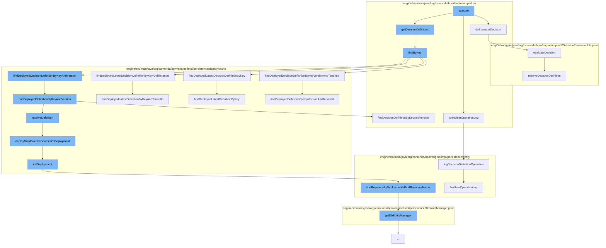

This document will cover the process of evaluating a decision in the Camunda BPMN engine, which includes:

1. Executing the decision
2. Fetching the decision definition
3. Logging the decision operation
4. Evaluating the decision.



<SwmSnippet path="/engine/src/main/java/org/camunda/bpm/engine/impl/dmn/cmd/EvaluateDecisionCmd.java" line="85">

---

# Executing the decision

The `execute` function in `EvaluateDecisionCmd.java` starts the process of evaluating a decision. It calls the `doEvaluateDecision` function which handles the actual evaluation of the decision.

```java
  protected DmnDecisionResult doEvaluateDecision(DecisionDefinition decisionDefinition, VariableMap variables) {
    try {
      return evaluateDecision(decisionDefinition, variables);
    }
    catch (Exception e) {
      throw new ProcessEngineException("Exception while evaluating decision with key '"+decisionDefinitionKey+"'", e);
    }
  }
```

---

</SwmSnippet>

<SwmSnippet path="/engine/src/main/java/org/camunda/bpm/engine/impl/dmn/cmd/EvaluateDecisionCmd.java" line="108">

---

# Fetching the decision definition

The `getDecisionDefinition` function is called to fetch the decision definition. This function calls the `findByKey` function which retrieves the decision definition from the deployment cache.

```java
  protected DecisionDefinition findByKey(DeploymentCache deploymentCache) {
    DecisionDefinition decisionDefinition = null;

    if (version == null && !isTenandIdSet) {
      decisionDefinition = deploymentCache.findDeployedLatestDecisionDefinitionByKey(decisionDefinitionKey);
    }
    else if (version == null && isTenandIdSet) {
      decisionDefinition = deploymentCache.findDeployedLatestDecisionDefinitionByKeyAndTenantId(decisionDefinitionKey, decisionDefinitionTenantId);
    }
    else if (version != null && !isTenandIdSet) {
      decisionDefinition = deploymentCache.findDeployedDecisionDefinitionByKeyAndVersion(decisionDefinitionKey, version);
    }
    else if (version != null && isTenandIdSet) {
      decisionDefinition = deploymentCache.findDeployedDecisionDefinitionByKeyVersionAndTenantId(decisionDefinitionKey, version, decisionDefinitionTenantId);
    }

    return decisionDefinition;
  }
```

---

</SwmSnippet>

<SwmSnippet path="/engine/src/main/java/org/camunda/bpm/engine/impl/dmn/cmd/EvaluateDecisionCmd.java" line="365">

---

# Logging the decision operation

The `writeUserOperationLog` function is called to log the decision operation. This function calls the `logDecisionDefinitionOperation` function which logs the operation and fires a user operation log event.

```java

```

---

</SwmSnippet>

<SwmSnippet path="/engine/src/main/java/org/camunda/bpm/engine/impl/util/DecisionEvaluationUtil.java" line="68">

---

# Evaluating the decision

The `doEvaluateDecision` function calls the `evaluateDecision` function which handles the actual evaluation of the decision. This function resolves the decision definition and invokes the decision.

```java
  public static void evaluateDecision(AbstractVariableScope execution,
      String defaultTenantId,
      BaseCallableElement callableElement,
      String resultVariable,
      DecisionResultMapper decisionResultMapper) throws Exception {

    DecisionDefinition decisionDefinition = resolveDecisionDefinition(callableElement, execution, defaultTenantId);
    DecisionInvocation invocation = createInvocation(decisionDefinition, execution);

    invoke(invocation);

    DmnDecisionResult result = invocation.getInvocationResult();
    if (result != null) {
      TypedValue typedValue = Variables.untypedValue(result, true);
      execution.setVariableLocal(DECISION_RESULT_VARIABLE, typedValue);

      if (resultVariable != null && decisionResultMapper != null) {
        Object mappedDecisionResult = decisionResultMapper.mapDecisionResult(result);
        execution.setVariable(resultVariable, mappedDecisionResult);
      }
    }
```

---

</SwmSnippet>

&nbsp;

*This is an auto-generated document by Swimm AI 🌊 and has not yet been verified by a human*

<SwmMeta version="3.0.0" repo-id="Z2l0aHViJTNBJTNBQ2l0aS1jYW11bmRhJTNBJTNBZ2lsYWRuYXZvdA==" repo-name="Citi-camunda" doc-type="flows"><sup>Powered by [Swimm](/)</sup></SwmMeta>
