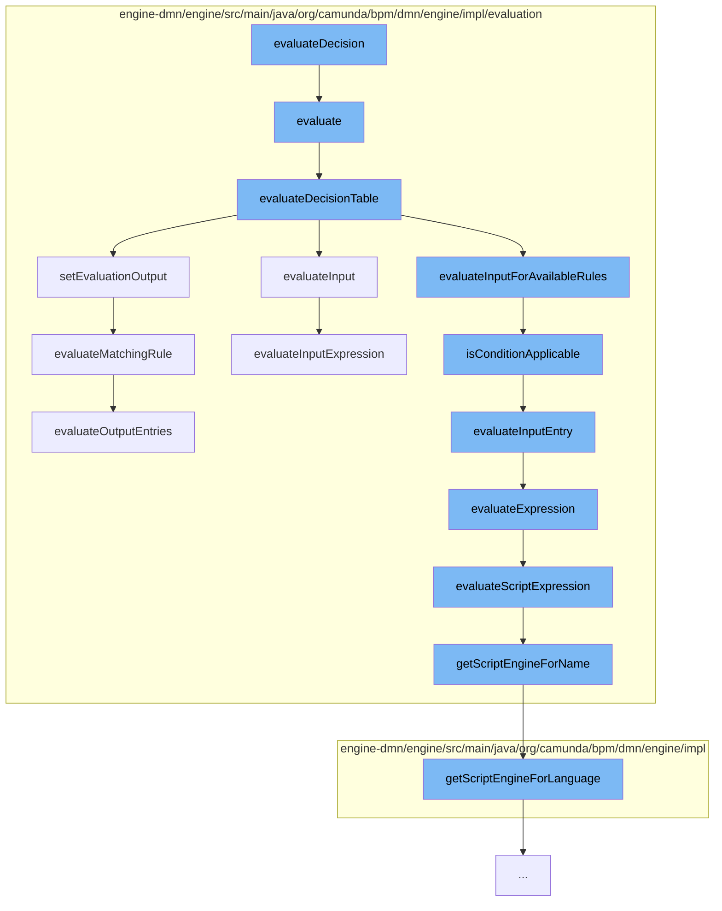

This document will cover the process of evaluating a decision in the Camunda BPMN engine, which includes:

1. Evaluating the decision table
2. Evaluating the input and output entries
3. Evaluating the matching rule
4. Evaluating the script expression



<SwmSnippet path="/engine-dmn/engine/src/main/java/org/camunda/bpm/dmn/engine/impl/evaluation/DecisionTableEvaluationHandler.java" line="76">

---

# Evaluating the decision table

The `evaluate` function is the entry point for evaluating a decision. It creates a new `DmnDecisionTableEvaluationEventImpl` object and sets the decision table. It then calls `evaluateDecisionTable` to evaluate the decision table.

```java
  @Override
  public DmnDecisionLogicEvaluationEvent evaluate(DmnDecision decision, VariableContext variableContext) {
    DmnDecisionTableEvaluationEventImpl evaluationResult = new DmnDecisionTableEvaluationEventImpl();
    evaluationResult.setDecisionTable(decision);

    DmnDecisionTableImpl decisionTable = (DmnDecisionTableImpl) decision.getDecisionLogic();
    evaluationResult.setExecutedDecisionElements(calculateExecutedDecisionElements(decisionTable));

    evaluateDecisionTable(decisionTable, variableContext, evaluationResult);

    // apply hit policy
    decisionTable.getHitPolicyHandler().apply(evaluationResult);

    // notify listeners
    for (DmnDecisionTableEvaluationListener evaluationListener : evaluationListeners) {
      evaluationListener.notify(evaluationResult);
    }

    return evaluationResult;
  }
```

---

</SwmSnippet>

<SwmSnippet path="/engine-dmn/engine/src/main/java/org/camunda/bpm/dmn/engine/impl/evaluation/DecisionTableEvaluationHandler.java" line="101">

---

# Evaluating the input and output entries

The `evaluateDecisionTable` function evaluates the input and output entries of the decision table. It iterates over the inputs, evaluates each input, and filters the rules applicable with this input. Finally, it sets the evaluation output.

```java
  protected void evaluateDecisionTable(DmnDecisionTableImpl decisionTable, VariableContext variableContext, DmnDecisionTableEvaluationEventImpl evaluationResult) {
    int inputSize = decisionTable.getInputs().size();
    List<DmnDecisionTableRuleImpl> matchingRules = new ArrayList<DmnDecisionTableRuleImpl>(decisionTable.getRules());
    for (int inputIdx = 0; inputIdx < inputSize; inputIdx++) {
      // evaluate input
      DmnDecisionTableInputImpl input = decisionTable.getInputs().get(inputIdx);
      DmnEvaluatedInput evaluatedInput = evaluateInput(input, variableContext);
      evaluationResult.getInputs().add(evaluatedInput);

      // compose local variable context out of global variable context enhanced with the value of the current input.
      VariableContext localVariableContext = getLocalVariableContext(input, evaluatedInput, variableContext);

      // filter rules applicable with this input
      matchingRules = evaluateInputForAvailableRules(inputIdx, input, matchingRules, localVariableContext);
    }

    setEvaluationOutput(decisionTable, matchingRules, variableContext, evaluationResult);
  }
```

---

</SwmSnippet>

<SwmSnippet path="/engine-dmn/engine/src/main/java/org/camunda/bpm/dmn/engine/impl/evaluation/DecisionTableEvaluationHandler.java" line="152">

---

# Evaluating the matching rule

The `setEvaluationOutput` function evaluates the matching rule. It iterates over the matching rules and evaluates each rule. The evaluated rules are then set as the matching rules in the evaluation result.

```java
  protected void setEvaluationOutput(DmnDecisionTableImpl decisionTable, List<DmnDecisionTableRuleImpl> matchingRules, VariableContext variableContext, DmnDecisionTableEvaluationEventImpl evaluationResult) {
    List<DmnDecisionTableOutputImpl> decisionTableOutputs = decisionTable.getOutputs();

    List<DmnEvaluatedDecisionRule> evaluatedDecisionRules = new ArrayList<DmnEvaluatedDecisionRule>();
    for (DmnDecisionTableRuleImpl matchingRule : matchingRules) {
      DmnEvaluatedDecisionRule evaluatedRule = evaluateMatchingRule(decisionTableOutputs, matchingRule, variableContext);
      evaluatedDecisionRules.add(evaluatedRule);
    }
    evaluationResult.setMatchingRules(evaluatedDecisionRules);
  }
```

---

</SwmSnippet>

<SwmSnippet path="/engine-dmn/engine/src/main/java/org/camunda/bpm/dmn/engine/impl/evaluation/ExpressionEvaluationHandler.java" line="54">

---

# Evaluating the script expression

The `evaluateExpression` function evaluates the script expression. It checks the expression language and calls the appropriate function to evaluate the expression.

```java
  public Object evaluateExpression(String expressionLanguage, DmnExpressionImpl expression, VariableContext variableContext) {
    String expressionText = getExpressionTextForLanguage(expression, expressionLanguage);
    if (expressionText != null) {

      if (isFeelExpressionLanguage(expressionLanguage)) {
        return evaluateFeelSimpleExpression(expressionText, variableContext);

      } else if (isElExpression(expressionLanguage)) {
        return evaluateElExpression(expressionLanguage, expressionText, variableContext, expression);

      } else {
        return evaluateScriptExpression(expressionLanguage, variableContext, expressionText, expression);
      }
    } else {
      return null;
    }
  }
```

---

</SwmSnippet>

&nbsp;

*This is an auto-generated document by Swimm AI 🌊 and has not yet been verified by a human*

<SwmMeta version="3.0.0" repo-id="Z2l0aHViJTNBJTNBQ2l0aS1jYW11bmRhJTNBJTNBZ2lsYWRuYXZvdA==" repo-name="Citi-camunda" doc-type="flows"><sup>Powered by [Swimm](/)</sup></SwmMeta>
