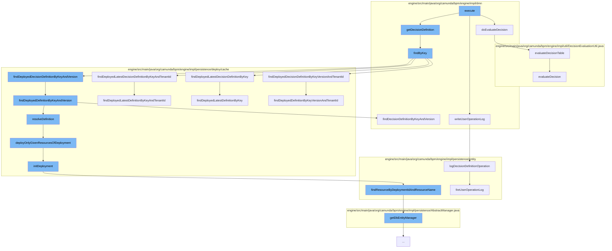

This document will cover the process of evaluating a decision table in the Camunda BPMN engine. The process includes the following steps:

1. Executing the decision table
2. Fetching the decision definition
3. Logging the user operation
4. Evaluating the decision



<SwmSnippet path="/engine/src/main/java/org/camunda/bpm/engine/impl/dmn/cmd/EvaluateDecisionTableCmd.java" line="87">

---

# Executing the decision table

The `execute` function starts the process by calling the `doEvaluateDecision` function. This function attempts to evaluate the decision table and throws an exception if an error occurs.

```java
  protected DmnDecisionTableResult doEvaluateDecision(DecisionDefinition decisionDefinition, VariableMap variables) {
    try {
      return evaluateDecisionTable(decisionDefinition, variables);
    }
    catch (Exception e) {
      throw new ProcessEngineException("Exception while evaluating decision with key '"+decisionDefinitionKey+"'", e);
    }
  }
```

---

</SwmSnippet>

<SwmSnippet path="/engine/src/main/java/org/camunda/bpm/engine/impl/dmn/cmd/EvaluateDecisionTableCmd.java" line="110">

---

# Fetching the decision definition

The `getDecisionDefinition` function calls the `findByKey` function to fetch the decision definition. Depending on the version and tenant ID, it calls different functions in the `DeploymentCache` class to find the appropriate decision definition.

```java
  protected DecisionDefinition findByKey(DeploymentCache deploymentCache) {
    DecisionDefinition decisionDefinition = null;

    if (version == null && !isTenandIdSet) {
      decisionDefinition = deploymentCache.findDeployedLatestDecisionDefinitionByKey(decisionDefinitionKey);
    }
    else if (version == null && isTenandIdSet) {
      decisionDefinition = deploymentCache.findDeployedLatestDecisionDefinitionByKeyAndTenantId(decisionDefinitionKey, decisionDefinitionTenantId);
    }
    else if (version != null && !isTenandIdSet) {
      decisionDefinition = deploymentCache.findDeployedDecisionDefinitionByKeyAndVersion(decisionDefinitionKey, version);
    }
    else if (version != null && isTenandIdSet) {
      decisionDefinition = deploymentCache.findDeployedDecisionDefinitionByKeyVersionAndTenantId(decisionDefinitionKey, version, decisionDefinitionTenantId);
    }

    return decisionDefinition;
  }
```

---

</SwmSnippet>

<SwmSnippet path="/engine/src/main/java/org/camunda/bpm/engine/impl/persistence/entity/UserOperationLogManager.java" line="365">

---

# Logging the user operation

The `writeUserOperationLog` function logs the operation by calling the `logDecisionDefinitionOperation` function. This function creates a new `UserOperationLogContext` and adds an entry to it. The `fireUserOperationLog` function then processes these events.

```java
  public void logDecisionDefinitionOperation(String operation, String tenantId, List<PropertyChange> propertyChanges) {
    if (isUserOperationLogEnabled()) {

      UserOperationLogContext context = new UserOperationLogContext();
      UserOperationLogContextEntryBuilder entryBuilder =
        UserOperationLogContextEntryBuilder.entry(operation, EntityTypes.DECISION_DEFINITION)
          .propertyChanges(propertyChanges)
          .tenantId(tenantId)
          .category(UserOperationLogEntry.CATEGORY_OPERATOR);

      context.addEntry(entryBuilder.create());
      fireUserOperationLog(context);
    }
  }
```

---

</SwmSnippet>

<SwmSnippet path="/engine/src/main/java/org/camunda/bpm/engine/impl/util/DecisionEvaluationUtil.java" line="97">

---

# Evaluating the decision

The `doEvaluateDecision` function calls the `evaluateDecisionTable` function to evaluate the decision. This function wraps the result of the `evaluateDecision` function in a `DmnDecisionTableResult` object.

```java
  public static DmnDecisionTableResult evaluateDecisionTable(DecisionDefinition decisionDefinition, VariableMap variables) throws Exception {
    // doesn't throw an exception if the decision definition is not implemented as decision table
    DmnDecisionResult decisionResult = evaluateDecision(decisionDefinition, variables);
    return DmnDecisionTableResultImpl.wrap(decisionResult);
  }
```

---

</SwmSnippet>

&nbsp;

*This is an auto-generated document by Swimm AI 🌊 and has not yet been verified by a human*

<SwmMeta version="3.0.0" repo-id="Z2l0aHViJTNBJTNBQ2l0aS1jYW11bmRhJTNBJTNBZ2lsYWRuYXZvdA==" repo-name="Citi-camunda" doc-type="flows"><sup>Powered by [Swimm](/)</sup></SwmMeta>
