This document will cover the process of deleting a candidate user in the Camunda Platform, which includes:

1. Deleting the user identity link
2. Deleting the identity link
3. Deleting the task
4. Transitioning the task state
5. Removing the task from the execution
6. Deleting authorizations
7. Deleting historic task instances
8. Marking the task instance as ended

```mermaid
graph TD;
subgraph engine/src/main/java/org/camunda/bpm/engine/impl/persistence/entity
  deleteCandidateUser:::mainFlowStyle --> deleteUserIdentityLink
end
subgraph engine/src/main/java/org/camunda/bpm/engine/impl/persistence/entity
  deleteUserIdentityLink:::mainFlowStyle --> deleteIdentityLink
end
subgraph engine/src/main/java/org/camunda/bpm/engine/impl/persistence/entity
  deleteIdentityLink:::mainFlowStyle --> delete
end
subgraph engine/src/main/java/org/camunda/bpm/engine/impl/persistence/entity
  delete:::mainFlowStyle --> transitionTo
end
subgraph engine/src/main/java/org/camunda/bpm/engine/impl/persistence/entity
  delete:::mainFlowStyle --> removeTask
end
subgraph engine/src/main/java/org/camunda/bpm/engine/impl/persistence/entity
  delete:::mainFlowStyle --> deleteTask
end
subgraph engine/src/main/java/org/camunda/bpm/engine/impl/persistence/entity
  transitionTo --> fireAssignmentEvent
end
subgraph engine/src/main/java/org/camunda/bpm/engine/impl/persistence/entity
  transitionTo --> fireEvent
end
subgraph engine/src/main/java/org/camunda/bpm/engine/impl/persistence/entity
  transitionTo --> createHistoricTask
end
subgraph engine/src/main/java/org/camunda/bpm/engine/impl/persistence/entity
  fireAssignmentEvent --> fireEvent
end
subgraph engine/src/main/java/org/camunda/bpm/engine/impl/persistence/entity
  fireEvent --> getListenersForEvent
end
subgraph engine/src/main/java/org/camunda/bpm/engine/impl/persistence/entity
  fireEvent --> invokeListener
end
subgraph engine/src/main/java/org/camunda/bpm/engine/impl
  createHistoricTask --> createTaskInstanceCreateEvt
end
subgraph engine/src/main/java/org/camunda/bpm/engine/impl/persistence/entity
  removeTask --> remove
end
subgraph engine/src/main/java/org/camunda/bpm/engine/impl/persistence/entity
  remove --> clearExecution
end
subgraph engine/src/main/java/org/camunda/bpm/engine/impl/persistence/entity
  deleteTask:::mainFlowStyle --> markTaskInstanceEnded
end
subgraph engine/src/main/java/org/camunda/bpm/engine/impl/persistence/entity
  deleteTask:::mainFlowStyle --> deleteHistoricTaskInstanceById
end
subgraph engine/src/main/java/org/camunda/bpm/engine/impl/persistence/entity
  deleteTask:::mainFlowStyle --> deleteIdentityLinks
end
subgraph engine/src/main/java/org/camunda/bpm/engine/impl
  markTaskInstanceEnded --> createTaskInstanceCompleteEvt
end
subgraph engine/src/main/java/org/camunda/bpm/engine/impl
  createTaskInstanceCompleteEvt --> initTaskInstanceEvent
end
subgraph engine/src/main/java/org/camunda/bpm/engine/impl/persistence/entity
  deleteHistoricTaskInstanceById --> deleteHistoricDetailsByTaskId
end
subgraph engine/src/main/java/org/camunda/bpm/engine/impl
  deleteHistoricDetailsByTaskId --> getCachedEntitiesByType
end
subgraph engine/src/main/java/org/camunda/bpm/engine/impl/persistence/entity
  deleteIdentityLinks:::mainFlowStyle --> fireDeleteIdentityLinkAuthorizationProvider
end
subgraph engine/src/main/java/org/camunda/bpm/engine/impl/persistence/entity
  fireDeleteIdentityLinkAuthorizationProvider:::mainFlowStyle --> deleteAuthorizations
end
subgraph engine/src/main/java/org/camunda/bpm/engine/impl/persistence/AbstractManager.java
  deleteAuthorizations:::mainFlowStyle --> deleteDefaultAuthorizations
end
subgraph engine/src/main/java/org/camunda/bpm/engine/impl/persistence/AbstractManager.java
  deleteDefaultAuthorizations:::mainFlowStyle --> delete
end
  delete:::mainFlowStyle --> ...

 classDef mainFlowStyle color:#000000,fill:#7CB9F4
  classDef rootsStyle color:#000000,fill:#00FFF4
```



<SwmSnippet path="/engine/src/main/java/org/camunda/bpm/engine/impl/persistence/entity/TaskEntity.java" line="840">

---

# Deleting the user identity link

The function `deleteUserIdentityLink` is used to delete a user identity link. It checks if the userId is not null and then calls the `deleteIdentityLink` function.

```java
  @Override
  public void deleteUserIdentityLink(String userId, String identityLinkType) {
    if (userId!=null) {
      deleteIdentityLink(userId, null, identityLinkType);
    }
  }
```

---

</SwmSnippet>

<SwmSnippet path="/engine/src/main/java/org/camunda/bpm/engine/impl/persistence/entity/TaskEntity.java" line="754">

---

# Deleting the identity link

The function `deleteIdentityLink` is used to delete an identity link. It ensures the task is active, finds the identity link by task user group and type, and then deletes it.

```java
  public void deleteIdentityLink(String userId, String groupId, String type) {
    ensureTaskActive();

    List<IdentityLinkEntity> identityLinks = Context
        .getCommandContext()
        .getIdentityLinkManager()
        .findIdentityLinkByTaskUserGroupAndType(id, userId, groupId, type);

    for (IdentityLinkEntity identityLink: identityLinks) {
      fireDeleteIdentityLinkAuthorizationProvider(type, userId, groupId);
      identityLink.delete();
    }
  }
```

---

</SwmSnippet>

<SwmSnippet path="/engine/src/main/java/org/camunda/bpm/engine/impl/persistence/entity/TaskEntity.java" line="365">

---

# Deleting the task

The function `delete` is used to delete the task. It sets the delete reason, transitions the task to the deleted state, and removes the task from the execution.

```java
  public void delete(String deleteReason, boolean cascade) {
    this.deleteReason = deleteReason;

    // only fire lifecycle events if task is actually cancelled/deleted
    if (!TaskEntity.DELETE_REASON_COMPLETED.equals(deleteReason)
        && !TaskState.STATE_DELETED.equals(lifecycleState)) {
      transitionTo(TaskState.STATE_DELETED);
    }

    Context
    .getCommandContext()
    .getTaskManager()
    .deleteTask(this, deleteReason, cascade, skipCustomListeners);

    if (executionId != null) {
      ExecutionEntity execution = getExecution();
      execution.removeTask(this);
    }
  }
```

---

</SwmSnippet>

<SwmSnippet path="/engine/src/main/java/org/camunda/bpm/engine/impl/persistence/entity/TaskEntity.java" line="1178">

---

# Transitioning the task state

The function `transitionTo` is used to transition the task to a new state. Depending on the state, it fires different events and creates a historic task.

```java
  public boolean transitionTo(TaskState state) {
    this.lifecycleState = state;
    this.taskState = this.lifecycleState.taskState;

    switch (state) {
    case STATE_CREATED:
      CommandContext commandContext = Context.getCommandContext();
      if (commandContext != null) {
        commandContext.getHistoricTaskInstanceManager().createHistoricTask(this);
      }
      return fireEvent(TaskListener.EVENTNAME_CREATE) && fireAssignmentEvent();

    case STATE_COMPLETED:
      return fireEvent(TaskListener.EVENTNAME_COMPLETE) && TaskState.STATE_COMPLETED.equals(this.lifecycleState);

    case STATE_DELETED:
      return fireEvent(EVENTNAME_DELETE);

    case STATE_INIT:
    default:
      throw new ProcessEngineException(String.format("Task %s cannot transition into state %s.", id, state));
```

---

</SwmSnippet>

<SwmSnippet path="/engine/src/main/java/org/camunda/bpm/engine/impl/persistence/entity/ExecutionEntity.java" line="1019">

---

# Removing the task from the execution

The function `remove` is used to remove the task from the execution. It removes tasks, incidents, and variables, and clears the execution.

```java
  // customized persistence behavior /////////////////////////////////////////

  @Override
  public void remove() {
    super.remove();

    // removes jobs, incidents and tasks, and
    // clears the variable store
    clearExecution();

    // remove all event subscriptions for this scope, if the scope has event
    // subscriptions:
    removeEventSubscriptions();

    // finally delete this execution
    Context.getCommandContext().getExecutionManager().deleteExecution(this);
  }
```

---

</SwmSnippet>

<SwmSnippet path="/engine/src/main/java/org/camunda/bpm/engine/impl/persistence/entity/TaskEntity.java" line="1278">

---

# Deleting authorizations

The function `fireDeleteIdentityLinkAuthorizationProvider` is used to delete authorizations. It checks if authorization is enabled and then deletes the authorizations.

```java
  protected void fireDeleteIdentityLinkAuthorizationProvider(String type, String userId, String groupId) {
    if (isAuthorizationEnabled() && caseExecutionId == null) {
      ResourceAuthorizationProvider provider = getResourceAuthorizationProvider();

      AuthorizationEntity[] authorizations = null;
      if (userId != null) {
        authorizations = provider.deleteTaskUserIdentityLink(this, userId, type);
      }
      else if (groupId != null) {
        authorizations = provider.deleteTaskGroupIdentityLink(this, groupId, type);
      }

      deleteAuthorizations(authorizations);
    }
  }
```

---

</SwmSnippet>

<SwmSnippet path="/engine/src/main/java/org/camunda/bpm/engine/impl/persistence/entity/HistoricTaskInstanceManager.java" line="206">

---

# Deleting historic task instances

The function `markTaskInstanceEnded` is used to mark the task instance as ended. It creates a task instance complete event.

```java
  public void markTaskInstanceEnded(String taskId, final String deleteReason) {
    ProcessEngineConfigurationImpl configuration = Context.getProcessEngineConfiguration();

    final TaskEntity taskEntity = Context.getCommandContext()
        .getDbEntityManager()
        .selectById(TaskEntity.class, taskId);

    HistoryLevel historyLevel = configuration.getHistoryLevel();
    if(historyLevel.isHistoryEventProduced(HistoryEventTypes.TASK_INSTANCE_COMPLETE, taskEntity)) {

      HistoryEventProcessor.processHistoryEvents(new HistoryEventProcessor.HistoryEventCreator() {
        @Override
        public HistoryEvent createHistoryEvent(HistoryEventProducer producer) {
          return producer.createTaskInstanceCompleteEvt(taskEntity, deleteReason);
        }
      });
    }
  }
```

---

</SwmSnippet>

&nbsp;

*This is an auto-generated document by Swimm AI 🌊 and has not yet been verified by a human*

<SwmMeta version="3.0.0" repo-id="Z2l0aHViJTNBJTNBQ2l0aS1jYW11bmRhJTNBJTNBZ2lsYWRuYXZvdA==" repo-name="Citi-camunda" doc-type="flows"><sup>Powered by [Swimm](/)</sup></SwmMeta>
