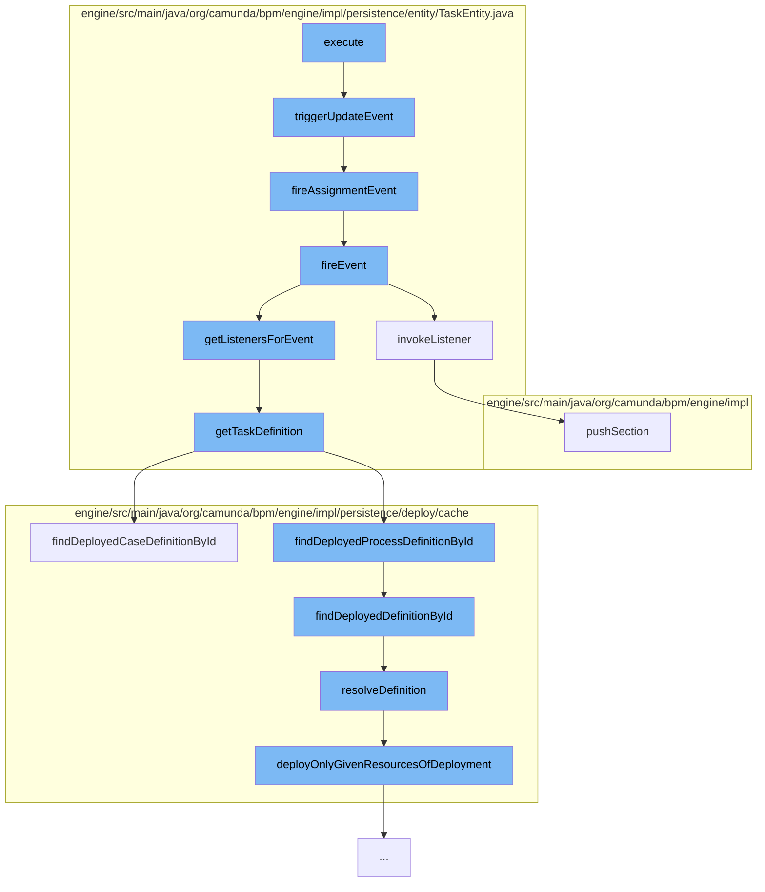

This document will cover the process of deleting identity links in the Camunda BPM engine, which includes:

1. Triggering the update event
2. Firing the assignment event
3. Invoking the listener
4. Resolving the definition



<SwmSnippet path="/engine/src/main/java/org/camunda/bpm/engine/impl/persistence/entity/TaskEntity.java" line="1202">

---

# Triggering the Update Event

The `triggerUpdateEvent` function is the first step in the process. It checks the lifecycle state of the task and if it's in the 'created' state, it registers a command context close listener, updates the last updated time, sets the task state to 'updated', and fires an update event and an assignment event.

```java
  public boolean triggerUpdateEvent() {
    if (lifecycleState == TaskState.STATE_CREATED) {
      registerCommandContextCloseListener();
      setLastUpdated(ClockUtil.getCurrentTime());
      setTaskState(TaskState.STATE_UPDATED.taskState);
      return fireEvent(TaskListener.EVENTNAME_UPDATE) && fireAssignmentEvent();
    }
    else {
      // silently ignore; no events are triggered in the other states
      return true;
    }
  }
```

---

</SwmSnippet>

<SwmSnippet path="/engine/src/main/java/org/camunda/bpm/engine/impl/persistence/entity/TaskEntity.java" line="1229">

---

# Firing the Assignment Event

The `fireAssignmentEvent` function is called next. It checks if there has been a change in the assignee property and if so, fires an assignment event.

```java
  protected boolean fireAssignmentEvent() {
    PropertyChange assigneePropertyChange = propertyChanges.get(ASSIGNEE);
    if (assigneePropertyChange != null) {
      return fireEvent(TaskListener.EVENTNAME_ASSIGNMENT);
    }

    return true;
  }
```

---

</SwmSnippet>

<SwmSnippet path="/engine/src/main/java/org/camunda/bpm/engine/impl/persistence/entity/TaskEntity.java" line="1076">

---

# Invoking the Listener

The `invokeListener` function is then called. It pushes a new section to the process data context and invokes the listener for the task event.

```java
  protected boolean invokeListener(String taskEventName, TaskListener taskListener) {
    boolean popProcessDataContext = false;
    CommandInvocationContext commandInvocationContext = Context.getCommandInvocationContext();
    CoreExecution execution = getExecution();
    if (execution == null) {
      execution = getCaseExecution();
    } else {
      if (commandInvocationContext != null) {
        popProcessDataContext = commandInvocationContext.getProcessDataContext().pushSection((ExecutionEntity) execution);
      }
    }
    if (execution != null) {
      setEventName(taskEventName);
    }
    try {
      boolean result = invokeListener(execution, taskEventName, taskListener);
      if (popProcessDataContext) {
        commandInvocationContext.getProcessDataContext().popSection();
      }
      return result;
    } catch (Exception e) {
```

---

</SwmSnippet>

<SwmSnippet path="/engine/src/main/java/org/camunda/bpm/engine/impl/persistence/deploy/cache/ResourceDefinitionCache.java" line="111">

---

# Resolving the Definition

Finally, the `resolveDefinition` function is called. It checks the cache for the definition and if not found, it deploys the resources of the deployment and updates the cache.

```java
  public T resolveDefinition(T definition) {
    String definitionId = definition.getId();
    String deploymentId = definition.getDeploymentId();
    T cachedDefinition = cache.get(definitionId);
    if (cachedDefinition == null) {
      synchronized (this) {
        cachedDefinition = cache.get(definitionId);
        if (cachedDefinition == null) {
          DeploymentEntity deployment = Context
              .getCommandContext()
              .getDeploymentManager()
              .findDeploymentById(deploymentId);
          deployment.setNew(false);
          cacheDeployer.deployOnlyGivenResourcesOfDeployment(deployment, definition.getResourceName(), definition.getDiagramResourceName());
          cachedDefinition = cache.get(definitionId);
        }
      }
      checkInvalidDefinitionWasCached(deploymentId, definitionId, cachedDefinition);
    }
    if (cachedDefinition != null) {
      cachedDefinition.updateModifiableFieldsFromEntity(definition);
```

---

</SwmSnippet>

&nbsp;

*This is an auto-generated document by Swimm AI 🌊 and has not yet been verified by a human*

<SwmMeta version="3.0.0" repo-id="Z2l0aHViJTNBJTNBQ2l0aS1jYW11bmRhJTNBJTNBZ2lsYWRuYXZvdA==" repo-name="Citi-camunda" doc-type="flows"><sup>Powered by [Swimm](/)</sup></SwmMeta>
