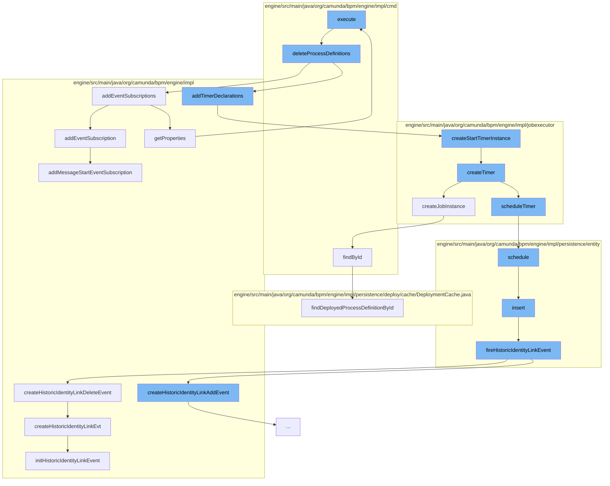

This document will cover the process of deleting process definitions in the Camunda BPM engine. The process involves the following steps:

1. Executing the delete command
2. Deleting process definitions
3. Adding event subscriptions and timer declarations
4. Creating and scheduling timer instances
5. Inserting identity link entities
6. Creating historic identity link events



<SwmSnippet path="/engine/src/main/java/org/camunda/bpm/engine/impl/cmd/DeleteProcessDefinitionsByIdsCmd.java" line="181">

---

# Executing the delete command

The `execute` method in `DeleteProcessDefinitionsByIdsCmd.java` initiates the process of deleting process definitions. It calls the `deleteProcessDefinitions` method, which iterates over the process definitions in a group and deletes each one.

```java
  protected void deleteProcessDefinitions(ProcessDefinitionGroup group) {
    ProcessDefinitionEntity newLatestProcessDefinition = findNewLatestProcessDefinition(group);

    CommandContext commandContext = Context.getCommandContext();
    UserOperationLogManager userOperationLogManager = commandContext.getOperationLogManager();
    ProcessDefinitionManager definitionManager = commandContext.getProcessDefinitionManager();

    List<ProcessDefinitionEntity> processDefinitions = group.processDefinitions;
    for (ProcessDefinitionEntity processDefinition : processDefinitions) {
      String processDefinitionId = processDefinition.getId();

      if (writeUserOperationLog) {
        userOperationLogManager.logProcessDefinitionOperation(UserOperationLogEntry.OPERATION_TYPE_DELETE, processDefinitionId, processDefinition.getKey(),
            new PropertyChange("cascade", false, cascadeToHistory));
      }

      definitionManager.deleteProcessDefinition(processDefinition, processDefinitionId, cascadeToHistory, cascadeToInstances, skipCustomListeners, skipIoMappings);
    }

    if (newLatestProcessDefinition != null) {
      ProcessEngineConfigurationImpl configuration = Context.getProcessEngineConfiguration();
```

---

</SwmSnippet>

<SwmSnippet path="/engine/src/main/java/org/camunda/bpm/engine/impl/bpmn/deployer/BpmnDeployer.java" line="307">

---

# Adding event subscriptions and timer declarations

The `addEventSubscriptions` method in `BpmnDeployer.java` is called to add event subscriptions to the process definition. It iterates over the event definitions and adds each one as an event subscription.

```java
  public void addEventSubscriptions(ProcessDefinitionEntity processDefinition) {
    Map<String, EventSubscriptionDeclaration> eventDefinitions = processDefinition.getProperties().get(BpmnProperties.EVENT_SUBSCRIPTION_DECLARATIONS);
    for (EventSubscriptionDeclaration eventDefinition : eventDefinitions.values()) {
      addEventSubscription(processDefinition, eventDefinition);
    }
  }
```

---

</SwmSnippet>

<SwmSnippet path="/engine/src/main/java/org/camunda/bpm/engine/impl/jobexecutor/TimerDeclarationImpl.java" line="170">

---

# Creating and scheduling timer instances

The `createStartTimerInstance` method in `TimerDeclarationImpl.java` is called to create a timer instance. This method calls the `createTimer` method, which creates a timer and schedules it.

```java
  public TimerEntity createStartTimerInstance(String deploymentId) {
    return createTimer(deploymentId);
  }

  public TimerEntity createTimer(String deploymentId) {
    TimerEntity timer = super.createJobInstance((ExecutionEntity) null);
    timer.setDeploymentId(deploymentId);
    scheduleTimer(timer);
    return timer;
  }
```

---

</SwmSnippet>

<SwmSnippet path="/engine/src/main/java/org/camunda/bpm/engine/impl/persistence/entity/IdentityLinkEntity.java" line="82">

---

# Inserting identity link entities

The `insert` method in `IdentityLinkEntity.java` is called to insert an identity link entity. After the entity is inserted, a historic identity link event is fired.

```java
  public void insert() {
    Context
      .getCommandContext()
      .getDbEntityManager()
      .insert(this);
    fireHistoricIdentityLinkEvent(HistoryEventTypes.IDENTITY_LINK_ADD);
  }
```

---

</SwmSnippet>

<SwmSnippet path="/engine/src/main/java/org/camunda/bpm/engine/impl/history/producer/DefaultHistoryEventProducer.java" line="945">

---

# Creating historic identity link events

The `createHistoricIdentityLinkDeleteEvent` method in `DefaultHistoryEventProducer.java` is called to create a historic identity link delete event. This method calls the `createHistoricIdentityLinkEvt` method, which initializes the historic identity link event.

```java
  @Override
  public HistoryEvent createHistoricIdentityLinkDeleteEvent(IdentityLink identityLink) {
    return createHistoricIdentityLinkEvt(identityLink, HistoryEventTypes.IDENTITY_LINK_DELETE);
  }

  protected HistoryEvent createHistoricIdentityLinkEvt(IdentityLink identityLink, HistoryEventTypes eventType) {
    // create historic identity link event
    HistoricIdentityLinkLogEventEntity evt = newIdentityLinkEventEntity();
    // Mapping all the values of identity link to HistoricIdentityLinkEvent
    initHistoricIdentityLinkEvent(evt, identityLink, eventType);
    return evt;
  }

  protected HistoricIdentityLinkLogEventEntity newIdentityLinkEventEntity() {
    return new HistoricIdentityLinkLogEventEntity();
  }

  protected void initHistoricIdentityLinkEvent(HistoricIdentityLinkLogEventEntity evt, IdentityLink identityLink, HistoryEventType eventType) {

    if (identityLink.getTaskId() != null) {
      TaskEntity task = Context
```

---

</SwmSnippet>

&nbsp;

*This is an auto-generated document by Swimm AI 🌊 and has not yet been verified by a human*

<SwmMeta version="3.0.0" repo-id="Z2l0aHViJTNBJTNBQ2l0aS1jYW11bmRhJTNBJTNBZ2lsYWRuYXZvdA==" repo-name="Citi-camunda" doc-type="flows"><sup>Powered by [Swimm](/)</sup></SwmMeta>
