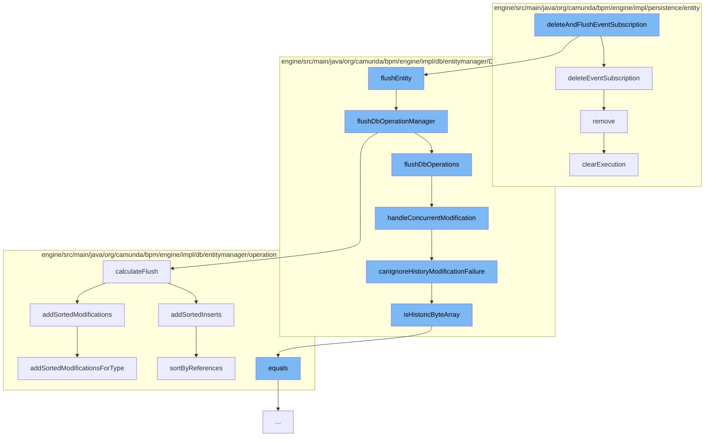

This document will cover the process of deleting and flushing event subscriptions in the Citi-camunda repository. The process includes the following steps:

1. Deleting the event subscription
2. Flushing the entity
3. Handling concurrent modifications
4. Ignoring history modification failures
5. Sorting modifications by references



<SwmSnippet path="/engine/src/main/java/org/camunda/bpm/engine/impl/persistence/entity/EventSubscriptionManager.java" line="55">

---

# Deleting the event subscription

The `deleteEventSubscription` function is responsible for deleting a specific event subscription. It removes the subscription from the database and also from the list of created signal subscriptions if it is of type SIGNAL. If the event subscription has been triggered asynchronously but not yet executed, it also deletes the corresponding asynchronous jobs.

```java
  public void deleteEventSubscription(EventSubscriptionEntity persistentObject) {
    getDbEntityManager().delete(persistentObject);
    if (persistentObject.isSubscriptionForEventType(EventType.SIGNAL)) {
      createdSignalSubscriptions.remove(persistentObject);
    }

    // if the event subscription has been triggered asynchronously but not yet executed
    List<JobEntity> asyncJobs = getJobManager().findJobsByConfiguration(ProcessEventJobHandler.TYPE, persistentObject.getId(), persistentObject.getTenantId());
    for (JobEntity asyncJob : asyncJobs) {
      asyncJob.delete();
    }
  }
```

---

</SwmSnippet>

<SwmSnippet path="/engine/src/main/java/org/camunda/bpm/engine/impl/db/entitymanager/DbEntityManager.java" line="302">

---

# Flushing the entity

The `flushDbOperationManager` function is responsible for flushing the database operation manager. It obtains a list of operations to flush from the operation manager and executes them. If the operation involves deleting all table data on tables with self-references, it turns off the foreign key check for MySQL and MariaDB.

```java
  protected void flushDbOperationManager() {

    // obtain totally ordered operation list from operation manager
    List<DbOperation> operationsToFlush = dbOperationManager.calculateFlush();
    if (operationsToFlush == null || operationsToFlush.size() == 0) {
      return;
    }

    LOG.databaseFlushSummary(operationsToFlush);

    // If we want to delete all table data as bulk operation, on tables which have self references,
    // We need to turn the foreign key check off on MySQL and MariaDB.
    // On other databases we have to do nothing, the mapped statement will be empty.
    if (isIgnoreForeignKeysForNextFlush) {
      persistenceSession.executeNonEmptyUpdateStmt(TOGGLE_FOREIGN_KEY_STMT, false);
      persistenceSession.flushOperations();
    }

    try {
      final List<List<DbOperation>> batches = CollectionUtil.partition(operationsToFlush, BATCH_SIZE);
      for (List<DbOperation> batch : batches) {
```

---

</SwmSnippet>

<SwmSnippet path="/engine/src/main/java/org/camunda/bpm/engine/impl/db/entitymanager/DbEntityManager.java" line="392">

---

# Handling concurrent modifications

The `handleConcurrentModification` function decides whether a failed operation due to concurrent modifications can be tolerated or if an OptimisticLockingException should be raised.

```java
  /**
   * Decides if an operation that failed for concurrent modifications can be tolerated,
   * or if {@link OptimisticLockingException} should be raised
   *
   * @param dbOperation
   * @throws OptimisticLockingException if there is no handler for the failure
   */
  protected void handleConcurrentModification(DbOperation dbOperation) {
    OptimisticLockingResult handlingResult = invokeOptimisticLockingListeners(dbOperation);

    if (OptimisticLockingResult.THROW.equals(handlingResult)
        && canIgnoreHistoryModificationFailure(dbOperation)) {
        handlingResult = OptimisticLockingResult.IGNORE;
    }

    switch (handlingResult) {
      case IGNORE:
        break;
      case THROW:
      default:
        throw LOG.concurrentUpdateDbEntityException(dbOperation);
```

---

</SwmSnippet>

<SwmSnippet path="/engine/src/main/java/org/camunda/bpm/engine/impl/db/entitymanager/DbEntityManager.java" line="455">

---

# Ignoring history modification failures

The `canIgnoreHistoryModificationFailure` function determines if a failed database operation on a Historic entity can be ignored. This is based on the process engine configuration and the type of the database entity.

```java
  /**
   * Determines if a failed database operation (OptimisticLockingException)
   * on a Historic entity can be ignored.
   *
   * @param dbOperation that failed
   * @return true if the failure can be ignored
   */
  protected boolean canIgnoreHistoryModificationFailure(DbOperation dbOperation) {
    DbEntity dbEntity = ((DbEntityOperation) dbOperation).getEntity();
    return
        Context.getProcessEngineConfiguration().isSkipHistoryOptimisticLockingExceptions()
        && (dbEntity instanceof HistoricEntity || isHistoricByteArray(dbEntity));
  }

  protected boolean isHistoricByteArray(DbEntity dbEntity) {
    if (dbEntity instanceof ByteArrayEntity) {
      ByteArrayEntity byteArrayEntity = (ByteArrayEntity) dbEntity;
      return byteArrayEntity.getType().equals(ResourceTypes.HISTORY.getValue());
    } else {
      return false;
    }
```

---

</SwmSnippet>

<SwmSnippet path="/engine/src/main/java/org/camunda/bpm/engine/impl/db/entitymanager/operation/DbOperationManager.java" line="197">

---

# Sorting modifications by references

The `sortByReferences` function sorts database operations by their references. This is necessary for operations on entities that have self-references to ensure the correct order of operations.

```java
  /**
   * Assumptions:
   * a) all operations in the set work on entities such that the entities implement {@link HasDbReferences}.
   * b) all operations in the set work on the same type (ie. all operations are INSERTs or DELETEs).
   *
   */
  protected List<DbEntityOperation> sortByReferences(SortedSet<DbEntityOperation> preSorted) {
    // copy the pre-sorted set and apply final sorting to list
    List<DbEntityOperation> opList = new ArrayList<DbEntityOperation>(preSorted);

    for (int i = 0; i < opList.size(); i++) {

      DbEntityOperation currentOperation = opList.get(i);
      DbEntity currentEntity = currentOperation.getEntity();
      Set<String> currentReferences = currentOperation.getFlushRelevantEntityReferences();

      // check whether this operation must be placed after another operation
      int moveTo = i;
      for(int k = i+1; k < opList.size(); k++) {
        DbEntityOperation otherOperation = opList.get(k);
        DbEntity otherEntity = otherOperation.getEntity();
```

---

</SwmSnippet>

&nbsp;

*This is an auto-generated document by Swimm AI 🌊 and has not yet been verified by a human*

<SwmMeta version="3.0.0" repo-id="Z2l0aHViJTNBJTNBQ2l0aS1jYW11bmRhJTNBJTNBZ2lsYWRuYXZvdA==" repo-name="Citi-camunda" doc-type="flows"><sup>Powered by [Swimm](/)</sup></SwmMeta>
