This document will cover the process of deleting a candidate group in the Camunda Platform, which includes:

1. Deleting the group identity link
2. Deleting the identity link
3. Deleting the task
4. Transitioning the task to a new state
5. Removing the task from the execution
6. Deleting authorizations
7. Deleting historic task instances and details
8. Marking the task instance as ended

```mermaid
graph TD;
subgraph engine/src/main/java/org/camunda/bpm/engine/impl/persistence/entity
  deleteCandidateGroup:::mainFlowStyle --> deleteGroupIdentityLink
end
subgraph engine/src/main/java/org/camunda/bpm/engine/impl/persistence/entity
  deleteGroupIdentityLink:::mainFlowStyle --> deleteIdentityLink
end
subgraph engine/src/main/java/org/camunda/bpm/engine/impl/persistence/entity
  deleteIdentityLink:::mainFlowStyle --> delete
end
subgraph engine/src/main/java/org/camunda/bpm/engine/impl/persistence/entity
  delete:::mainFlowStyle --> transitionTo
end
subgraph engine/src/main/java/org/camunda/bpm/engine/impl/persistence/entity
  delete:::mainFlowStyle --> removeTask
end
subgraph engine/src/main/java/org/camunda/bpm/engine/impl/persistence/entity
  delete:::mainFlowStyle --> deleteTask
end
subgraph engine/src/main/java/org/camunda/bpm/engine/impl/persistence/entity
  transitionTo --> fireAssignmentEvent
end
subgraph engine/src/main/java/org/camunda/bpm/engine/impl/persistence/entity
  transitionTo --> fireEvent
end
subgraph engine/src/main/java/org/camunda/bpm/engine/impl/persistence/entity
  transitionTo --> createHistoricTask
end
subgraph engine/src/main/java/org/camunda/bpm/engine/impl/persistence/entity
  fireAssignmentEvent --> fireEvent
end
subgraph engine/src/main/java/org/camunda/bpm/engine/impl/persistence/entity
  fireEvent --> getListenersForEvent
end
subgraph engine/src/main/java/org/camunda/bpm/engine/impl/persistence/entity
  fireEvent --> invokeListener
end
subgraph engine/src/main/java/org/camunda/bpm/engine/impl
  createHistoricTask --> createTaskInstanceCreateEvt
end
subgraph engine/src/main/java/org/camunda/bpm/engine/impl/persistence/entity
  removeTask --> remove
end
subgraph engine/src/main/java/org/camunda/bpm/engine/impl/persistence/entity
  remove --> clearExecution
end
subgraph engine/src/main/java/org/camunda/bpm/engine/impl/persistence/entity
  deleteTask:::mainFlowStyle --> markTaskInstanceEnded
end
subgraph engine/src/main/java/org/camunda/bpm/engine/impl/persistence/entity
  deleteTask:::mainFlowStyle --> deleteHistoricTaskInstanceById
end
subgraph engine/src/main/java/org/camunda/bpm/engine/impl/persistence/entity
  deleteTask:::mainFlowStyle --> deleteIdentityLinks
end
subgraph engine/src/main/java/org/camunda/bpm/engine/impl
  markTaskInstanceEnded --> createTaskInstanceCompleteEvt
end
subgraph engine/src/main/java/org/camunda/bpm/engine/impl
  createTaskInstanceCompleteEvt --> initTaskInstanceEvent
end
subgraph engine/src/main/java/org/camunda/bpm/engine/impl/persistence/entity
  deleteHistoricTaskInstanceById --> deleteHistoricDetailsByTaskId
end
subgraph engine/src/main/java/org/camunda/bpm/engine/impl
  deleteHistoricDetailsByTaskId --> getCachedEntitiesByType
end
subgraph engine/src/main/java/org/camunda/bpm/engine/impl/persistence/entity
  deleteIdentityLinks:::mainFlowStyle --> fireDeleteIdentityLinkAuthorizationProvider
end
subgraph engine/src/main/java/org/camunda/bpm/engine/impl/persistence/entity
  fireDeleteIdentityLinkAuthorizationProvider:::mainFlowStyle --> deleteAuthorizations
end
subgraph engine/src/main/java/org/camunda/bpm/engine/impl/persistence/AbstractManager.java
  deleteAuthorizations:::mainFlowStyle --> deleteDefaultAuthorizations
end
subgraph engine/src/main/java/org/camunda/bpm/engine/impl/persistence/AbstractManager.java
  deleteDefaultAuthorizations:::mainFlowStyle --> delete
end
  delete:::mainFlowStyle --> ...

 classDef mainFlowStyle color:#000000,fill:#7CB9F4
  classDef rootsStyle color:#000000,fill:#00FFF4
```



<SwmSnippet path="/engine/src/main/java/org/camunda/bpm/engine/impl/persistence/entity/TaskEntity.java" line="833">

---

# Deleting the Group Identity Link

The `deleteGroupIdentityLink` function is used to delete a group identity link. It checks if the groupId is not null and then calls the `deleteIdentityLink` function.

```java
  @Override
  public void deleteGroupIdentityLink(String groupId, String identityLinkType) {
    if (groupId!=null) {
      deleteIdentityLink(null, groupId, identityLinkType);
    }
  }
```

---

</SwmSnippet>

<SwmSnippet path="/engine/src/main/java/org/camunda/bpm/engine/impl/persistence/entity/TaskEntity.java" line="754">

---

# Deleting the Identity Link

The `deleteIdentityLink` function ensures the task is active, finds the identity links for the task, and then deletes each identity link.

```java
  public void deleteIdentityLink(String userId, String groupId, String type) {
    ensureTaskActive();

    List<IdentityLinkEntity> identityLinks = Context
        .getCommandContext()
        .getIdentityLinkManager()
        .findIdentityLinkByTaskUserGroupAndType(id, userId, groupId, type);

    for (IdentityLinkEntity identityLink: identityLinks) {
      fireDeleteIdentityLinkAuthorizationProvider(type, userId, groupId);
      identityLink.delete();
    }
  }
```

---

</SwmSnippet>

<SwmSnippet path="/engine/src/main/java/org/camunda/bpm/engine/impl/persistence/entity/TaskEntity.java" line="365">

---

# Deleting the Task

The `delete` function sets the delete reason, transitions the task to a deleted state if it's not already completed, and then removes the task from the execution.

```java
  public void delete(String deleteReason, boolean cascade) {
    this.deleteReason = deleteReason;

    // only fire lifecycle events if task is actually cancelled/deleted
    if (!TaskEntity.DELETE_REASON_COMPLETED.equals(deleteReason)
        && !TaskState.STATE_DELETED.equals(lifecycleState)) {
      transitionTo(TaskState.STATE_DELETED);
    }

    Context
    .getCommandContext()
    .getTaskManager()
    .deleteTask(this, deleteReason, cascade, skipCustomListeners);

    if (executionId != null) {
      ExecutionEntity execution = getExecution();
      execution.removeTask(this);
    }
  }
```

---

</SwmSnippet>

<SwmSnippet path="/engine/src/main/java/org/camunda/bpm/engine/impl/persistence/entity/TaskEntity.java" line="1178">

---

# Transitioning the Task to a New State

The `transitionTo` function changes the lifecycle state of the task and fires the appropriate event based on the new state.

```java
  public boolean transitionTo(TaskState state) {
    this.lifecycleState = state;
    this.taskState = this.lifecycleState.taskState;

    switch (state) {
    case STATE_CREATED:
      CommandContext commandContext = Context.getCommandContext();
      if (commandContext != null) {
        commandContext.getHistoricTaskInstanceManager().createHistoricTask(this);
      }
      return fireEvent(TaskListener.EVENTNAME_CREATE) && fireAssignmentEvent();

    case STATE_COMPLETED:
      return fireEvent(TaskListener.EVENTNAME_COMPLETE) && TaskState.STATE_COMPLETED.equals(this.lifecycleState);

    case STATE_DELETED:
      return fireEvent(EVENTNAME_DELETE);

    case STATE_INIT:
    default:
      throw new ProcessEngineException(String.format("Task %s cannot transition into state %s.", id, state));
```

---

</SwmSnippet>

<SwmSnippet path="/engine/src/main/java/org/camunda/bpm/engine/impl/persistence/entity/ExecutionEntity.java" line="1019">

---

# Removing the Task from the Execution

The `remove` function removes the task from the execution, deletes all tasks, variable instances, jobs, and incidents associated with the execution.

```java
  // customized persistence behavior /////////////////////////////////////////

  @Override
  public void remove() {
    super.remove();

    // removes jobs, incidents and tasks, and
    // clears the variable store
    clearExecution();

    // remove all event subscriptions for this scope, if the scope has event
    // subscriptions:
    removeEventSubscriptions();

    // finally delete this execution
    Context.getCommandContext().getExecutionManager().deleteExecution(this);
  }
```

---

</SwmSnippet>

<SwmSnippet path="/engine/src/main/java/org/camunda/bpm/engine/impl/persistence/entity/TaskEntity.java" line="1305">

---

# Deleting Authorizations

The `deleteAuthorizations` function deletes the authorizations associated with the task.

```java
  protected void deleteAuthorizations(AuthorizationEntity[] authorizations) {
    CommandContext commandContext = Context.getCommandContext();
    TaskManager taskManager = commandContext.getTaskManager();
    taskManager.deleteDefaultAuthorizations(authorizations);
  }
```

---

</SwmSnippet>

<SwmSnippet path="/engine/src/main/java/org/camunda/bpm/engine/impl/persistence/entity/HistoricDetailManager.java" line="83">

---

# Deleting Historic Task Instances and Details

The `deleteHistoricDetailsByTaskId` function deletes the historic details associated with the task ID.

```java
  public void deleteHistoricDetailsByTaskId(String taskId) {
    if (isHistoryEnabled()) {
      // delete entries in DB
      List<HistoricDetail> historicDetails = findHistoricDetailsByTaskId(taskId);

      for (HistoricDetail historicDetail : historicDetails) {
        ((HistoricDetailEventEntity) historicDetail).delete();
      }

      //delete entries in Cache
      List<HistoricDetailEventEntity> cachedHistoricDetails = getDbEntityManager().getCachedEntitiesByType(HistoricDetailEventEntity.class);
      for (HistoricDetailEventEntity historicDetail : cachedHistoricDetails) {
        // make sure we only delete the right ones (as we cannot make a proper query in the cache)
        if (taskId.equals(historicDetail.getTaskId())) {
          historicDetail.delete();
        }
      }
    }
  }
```

---

</SwmSnippet>

<SwmSnippet path="/engine/src/main/java/org/camunda/bpm/engine/impl/persistence/entity/HistoricTaskInstanceManager.java" line="206">

---

# Marking the Task Instance as Ended

The `markTaskInstanceEnded` function marks the task instance as ended and creates a history event for the task completion.

```java
  public void markTaskInstanceEnded(String taskId, final String deleteReason) {
    ProcessEngineConfigurationImpl configuration = Context.getProcessEngineConfiguration();

    final TaskEntity taskEntity = Context.getCommandContext()
        .getDbEntityManager()
        .selectById(TaskEntity.class, taskId);

    HistoryLevel historyLevel = configuration.getHistoryLevel();
    if(historyLevel.isHistoryEventProduced(HistoryEventTypes.TASK_INSTANCE_COMPLETE, taskEntity)) {

      HistoryEventProcessor.processHistoryEvents(new HistoryEventProcessor.HistoryEventCreator() {
        @Override
        public HistoryEvent createHistoryEvent(HistoryEventProducer producer) {
          return producer.createTaskInstanceCompleteEvt(taskEntity, deleteReason);
        }
      });
    }
  }
```

---

</SwmSnippet>

&nbsp;

*This is an auto-generated document by Swimm AI 🌊 and has not yet been verified by a human*

<SwmMeta version="3.0.0" repo-id="Z2l0aHViJTNBJTNBQ2l0aS1jYW11bmRhJTNBJTNBZ2lsYWRuYXZvdA==" repo-name="Citi-camunda" doc-type="flows"><sup>Powered by [Swimm](/)</sup></SwmMeta>
