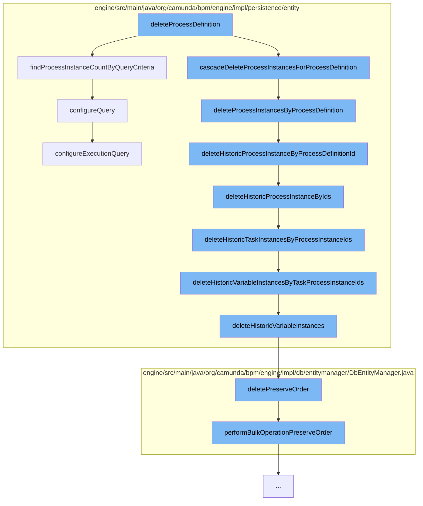

This document will cover the process of deleting a process definition in the Camunda Platform, which includes:

1. Finding the process instance count by query criteria
2. Deleting process instances by process definition
3. Deleting historic process instances by process definition ID
4. Deleting historic task instances by process instance IDs
5. Deleting historic variable instances by task process instance IDs
6. Configuring the query for the process instance count



<SwmSnippet path="/engine/src/main/java/org/camunda/bpm/engine/impl/persistence/entity/ExecutionManager.java" line="131">

---

# Finding the process instance count by query criteria

The function `findProcessInstanceCountByQueryCriteria` is used to find the count of process instances that match the provided query criteria. This is the first step in the deletion process.

```java
  public long findProcessInstanceCountByQueryCriteria(ProcessInstanceQueryImpl processInstanceQuery) {
    configureQuery(processInstanceQuery);
    return (Long) getDbEntityManager().selectOne("selectProcessInstanceCountByQueryCriteria", processInstanceQuery);
  }
```

---

</SwmSnippet>

<SwmSnippet path="/engine/src/main/java/org/camunda/bpm/engine/impl/persistence/entity/ExecutionManager.java" line="58">

---

# Deleting process instances by process definition

The function `deleteProcessInstancesByProcessDefinition` is used to delete all process instances associated with a specific process definition. This is the second step in the deletion process.

```java
  @SuppressWarnings("unchecked")
  public void deleteProcessInstancesByProcessDefinition(String processDefinitionId, String deleteReason, boolean cascade, boolean skipCustomListeners, boolean skipIoMappings) {
    List<String> processInstanceIds = getDbEntityManager()
      .selectList("selectProcessInstanceIdsByProcessDefinitionId", processDefinitionId);

    for (String processInstanceId: processInstanceIds) {
      deleteProcessInstance(processInstanceId, deleteReason, cascade, skipCustomListeners, false, skipIoMappings, false);
    }

    if (cascade) {
      getHistoricProcessInstanceManager().deleteHistoricProcessInstanceByProcessDefinitionId(processDefinitionId);
    }
  }
```

---

</SwmSnippet>

<SwmSnippet path="/engine/src/main/java/org/camunda/bpm/engine/impl/persistence/entity/HistoricProcessInstanceManager.java" line="69">

---

# Deleting historic process instances by process definition ID

The function `deleteHistoricProcessInstanceByProcessDefinitionId` is used to delete all historic process instances associated with a specific process definition. This is the third step in the deletion process.

```java
  @SuppressWarnings("unchecked")
  public void deleteHistoricProcessInstanceByProcessDefinitionId(String processDefinitionId) {
    if (isHistoryEnabled()) {
      List<String> historicProcessInstanceIds = getDbEntityManager()
        .selectList("selectHistoricProcessInstanceIdsByProcessDefinitionId", processDefinitionId);

      if (!historicProcessInstanceIds.isEmpty()) {
        deleteHistoricProcessInstanceByIds(historicProcessInstanceIds);
      }
    }
  }
```

---

</SwmSnippet>

<SwmSnippet path="/engine/src/main/java/org/camunda/bpm/engine/impl/persistence/entity/HistoricTaskInstanceManager.java" line="49">

---

# Deleting historic task instances by process instance IDs

The function `deleteHistoricTaskInstancesByProcessInstanceIds` is used to delete all historic task instances associated with a specific process instance. This is the fourth step in the deletion process.

```java
  /**
   * Deletes all data related with tasks, which belongs to specified process instance ids.
   * @param processInstanceIds
   * @param deleteVariableInstances when true, will also delete variable instances. Can be false when variable instances were deleted separately.
   */
  public void deleteHistoricTaskInstancesByProcessInstanceIds(List<String> processInstanceIds, boolean deleteVariableInstances) {

    CommandContext commandContext = Context.getCommandContext();

    if (deleteVariableInstances) {
      getHistoricVariableInstanceManager().deleteHistoricVariableInstancesByTaskProcessInstanceIds(processInstanceIds);
    }

    getHistoricDetailManager()
        .deleteHistoricDetailsByTaskProcessInstanceIds(processInstanceIds);

    commandContext
        .getCommentManager()
        .deleteCommentsByTaskProcessInstanceIds(processInstanceIds);

    getAttachmentManager()
```

---

</SwmSnippet>

<SwmSnippet path="/engine/src/main/java/org/camunda/bpm/engine/impl/persistence/entity/HistoricVariableInstanceManager.java" line="54">

---

# Deleting historic variable instances by task process instance IDs

The function `deleteHistoricVariableInstancesByTaskProcessInstanceIds` is used to delete all historic variable instances associated with a specific task process instance. This is the fifth step in the deletion process.

```java
  public void deleteHistoricVariableInstancesByTaskProcessInstanceIds(List<String> historicProcessInstanceIds) {
    Map<String, Object> parameters = new HashMap<String, Object>();
    parameters.put("taskProcessInstanceIds", historicProcessInstanceIds);
    deleteHistoricVariableInstances(parameters);
  }
```

---

</SwmSnippet>

<SwmSnippet path="/engine/src/main/java/org/camunda/bpm/engine/impl/persistence/entity/ExecutionManager.java" line="217">

---

# Configuring the query for the process instance count

The function `configureQuery` is used to configure the query for finding the process instance count. This is the final step in the deletion process.

```java
  protected void configureQuery(AbstractQuery<?, ?> query) {
    getAuthorizationManager().configureExecutionQuery(query);
    getTenantManager().configureQuery(query);
  }
```

---

</SwmSnippet>

&nbsp;

*This is an auto-generated document by Swimm AI 🌊 and has not yet been verified by a human*

<SwmMeta version="3.0.0" repo-id="Z2l0aHViJTNBJTNBQ2l0aS1jYW11bmRhJTNBJTNBZ2lsYWRuYXZvdA==" repo-name="Citi-camunda" doc-type="flows"><sup>Powered by [Swimm](/)</sup></SwmMeta>
