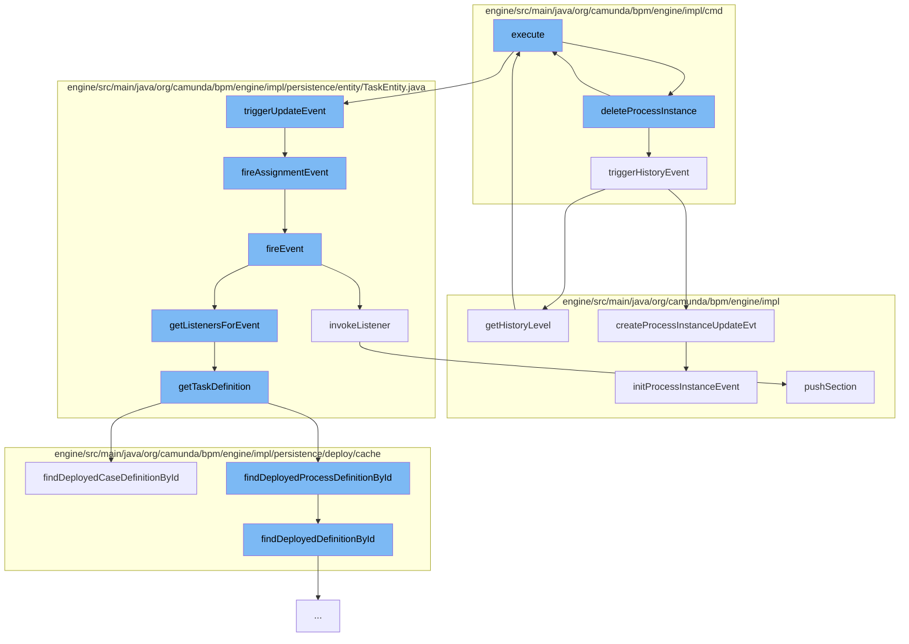

This document will cover the process of deleting a process instance in the Camunda BPM engine. We'll cover:

1. The initiation of the deletion process
2. The triggering of history events
3. The triggering of update events
4. The firing of assignment and other events
5. The invocation of listeners
6. The retrieval of task definitions
7. The execution of management services.



<SwmSnippet path="/engine/src/main/java/org/camunda/bpm/engine/impl/cmd/DeleteProcessInstanceCmd.java" line="69">

---

# Initiation of the Deletion Process

The `deleteProcessInstance` method in `DeleteProcessInstanceCmd.java` is the entry point for the deletion process. It ensures the process instance ID is not null, fetches the process instance, checks if it exists, and then proceeds to delete it.

```java

```

---

</SwmSnippet>

<SwmSnippet path="/engine/src/main/java/org/camunda/bpm/engine/impl/cmd/AbstractDeleteProcessInstanceCmd.java" line="115">

---

# Triggering of History Events

The `triggerHistoryEvent` method is responsible for triggering history events for each subprocess instance. It checks if a history event is produced for the process instance update and if so, it creates a history event.

```java
  public void triggerHistoryEvent(List<ProcessInstance> subProcesslist) {
    ProcessEngineConfigurationImpl configuration = Context.getProcessEngineConfiguration();
    HistoryLevel historyLevel = configuration.getHistoryLevel();

    for (final ProcessInstance processInstance : subProcesslist) {
      // TODO: This smells bad, as the rest of the history is done via the
      // ParseListener
      if (historyLevel.isHistoryEventProduced(HistoryEventTypes.PROCESS_INSTANCE_UPDATE, processInstance)) {

        HistoryEventProcessor.processHistoryEvents(new HistoryEventProcessor.HistoryEventCreator() {
          @Override
          public HistoryEvent createHistoryEvent(HistoryEventProducer producer) {
            return producer.createProcessInstanceUpdateEvt((DelegateExecution) processInstance);
          }
        });
      }
    }
  }
```

---

</SwmSnippet>

<SwmSnippet path="/engine/src/main/java/org/camunda/bpm/engine/impl/persistence/entity/TaskEntity.java" line="1202">

---

# Triggering of Update Events

The `triggerUpdateEvent` method is responsible for triggering update events. If the task is in the created state, it registers a command context close listener, sets the last updated time, and fires an update event and an assignment event.

```java
  public boolean triggerUpdateEvent() {
    if (lifecycleState == TaskState.STATE_CREATED) {
      registerCommandContextCloseListener();
      setLastUpdated(ClockUtil.getCurrentTime());
      setTaskState(TaskState.STATE_UPDATED.taskState);
      return fireEvent(TaskListener.EVENTNAME_UPDATE) && fireAssignmentEvent();
    }
    else {
      // silently ignore; no events are triggered in the other states
      return true;
    }
  }
```

---

</SwmSnippet>

<SwmSnippet path="/engine/src/main/java/org/camunda/bpm/engine/impl/persistence/entity/TaskEntity.java" line="1229">

---

# Firing of Assignment and Other Events

The `fireAssignmentEvent` method is responsible for firing assignment events. It checks if there is a property change for the assignee and if so, it fires an assignment event.

```java
  protected boolean fireAssignmentEvent() {
    PropertyChange assigneePropertyChange = propertyChanges.get(ASSIGNEE);
    if (assigneePropertyChange != null) {
      return fireEvent(TaskListener.EVENTNAME_ASSIGNMENT);
    }

    return true;
  }
```

---

</SwmSnippet>

<SwmSnippet path="/engine/src/main/java/org/camunda/bpm/engine/impl/persistence/entity/TaskEntity.java" line="1032">

---

# Invocation of Listeners

The `fireEvent` method is responsible for invoking listeners for a given task event. It retrieves the listeners for the event and invokes each listener.

```java
  /**
   * @return true if invoking the listener was successful;
   *   if not successful, either false is returned (case: BPMN error propagation)
   *   or an exception is thrown
   */
  public boolean fireEvent(String taskEventName) {

    List<TaskListener> taskEventListeners = getListenersForEvent(taskEventName);

    if (taskEventListeners != null) {
      for (TaskListener taskListener : taskEventListeners) {
        if (!invokeListener(taskEventName, taskListener)){
          return false;
        }
      }
    }

    return true;
  }
```

---

</SwmSnippet>

<SwmSnippet path="/engine/src/main/java/org/camunda/bpm/engine/impl/persistence/entity/TaskEntity.java" line="1322">

---

# Retrieval of Task Definitions

The `getTaskDefinition` method is responsible for retrieving task definitions. If the task definition is null and the task definition key is not null, it retrieves the task definitions from the process definition or case definition.

```java
  public TaskDefinition getTaskDefinition() {
    if (taskDefinition==null && taskDefinitionKey!=null) {

      Map<String, TaskDefinition> taskDefinitions = null;
      if (processDefinitionId != null) {
        ProcessDefinitionEntity processDefinition = Context
            .getProcessEngineConfiguration()
            .getDeploymentCache()
            .findDeployedProcessDefinitionById(processDefinitionId);

        taskDefinitions = processDefinition.getTaskDefinitions();

      } else {
        CaseDefinitionEntity caseDefinition = Context
            .getProcessEngineConfiguration()
            .getDeploymentCache()
            .findDeployedCaseDefinitionById(caseDefinitionId);

        taskDefinitions = caseDefinition.getTaskDefinitions();
      }

```

---

</SwmSnippet>

<SwmSnippet path="/engine/src/main/java/org/camunda/bpm/engine/impl/ManagementServiceImpl.java" line="509">

---

# Execution of Management Services

The `getHistoryLevel` method in `ManagementServiceImpl.java` is responsible for executing management services. It executes a `GetHistoryLevelCmd` command.

```java
  public int getHistoryLevel() {
    return commandExecutor.execute(new GetHistoryLevelCmd());
  }
```

---

</SwmSnippet>

&nbsp;

*This is an auto-generated document by Swimm AI 🌊 and has not yet been verified by a human*

<SwmMeta version="3.0.0" repo-id="Z2l0aHViJTNBJTNBQ2l0aS1jYW11bmRhJTNBJTNBZ2lsYWRuYXZvdA==" repo-name="Citi-camunda" doc-type="flows"><sup>Powered by [Swimm](/)</sup></SwmMeta>
