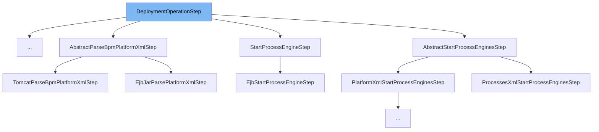

This document will cover the `DeploymentOperationStep` class. We'll discuss:

1. What `DeploymentOperationStep` is and its purpose.
2. The variables and functions within `DeploymentOperationStep`.
3. An example of how `DeploymentOperationStep` is used in `StartManagedThreadPoolStep`.



# What is DeploymentOperationStep

`DeploymentOperationStep` is an abstract class that represents an atomic step as part of a composite `DeploymentOperation`. It is used to define the structure of a deployment operation step in the Camunda BPM platform.

# Variables and functions

`DeploymentOperationStep` does not contain any variables. However, it defines three abstract methods: `getName`, `performOperationStep`, and `cancelOperationStep`.

<SwmSnippet path="/engine/src/main/java/org/camunda/bpm/container/impl/spi/DeploymentOperationStep.java" line="27">

---

# Variables and functions

The `getName` function is an abstract method that should return the name of the operation step when implemented.

```java
  public abstract String getName();
```

---

</SwmSnippet>

<SwmSnippet path="/engine/src/main/java/org/camunda/bpm/container/impl/spi/DeploymentOperationStep.java" line="29">

---

The `performOperationStep` function is an abstract method that should define the operation to be performed during the deployment step when implemented.

```java
  public abstract void performOperationStep(DeploymentOperation operationContext);
```

---

</SwmSnippet>

<SwmSnippet path="/engine/src/main/java/org/camunda/bpm/container/impl/spi/DeploymentOperationStep.java" line="31">

---

The `cancelOperationStep` function is an abstract method that should define the operation to be performed if the deployment step fails. By default, it does nothing.

```java
  public void cancelOperationStep(DeploymentOperation operationContext){
    // default behavior is to to nothing if the step fails
  }
```

---

</SwmSnippet>

# Usage example

`DeploymentOperationStep` is an abstract class and is meant to be extended by other classes. An example of this is the `StartManagedThreadPoolStep` class.

<SwmSnippet path="/engine/src/main/java/org/camunda/bpm/container/impl/deployment/jobexecutor/StartManagedThreadPoolStep.java" line="1">

---

# Usage example

Here, `StartManagedThreadPoolStep` extends `DeploymentOperationStep` and implements the abstract methods defined in `DeploymentOperationStep`.

```java
/*
 * Copyright Camunda Services GmbH and/or licensed to Camunda Services GmbH
 * under one or more contributor license agreements. See the NOTICE file
 * distributed with this work for additional information regarding copyright
 * ownership. Camunda licenses this file to you under the Apache License,
 * Version 2.0; you may not use this file except in compliance with the License.
 * You may obtain a copy of the License at
 *
 *     http://www.apache.org/licenses/LICENSE-2.0
 *
 * Unless required by applicable law or agreed to in writing, software
 * distributed under the License is distributed on an "AS IS" BASIS,
 * WITHOUT WARRANTIES OR CONDITIONS OF ANY KIND, either express or implied.
 * See the License for the specific language governing permissions and
 * limitations under the License.
 */
package org.camunda.bpm.container.impl.deployment.jobexecutor;

import java.util.concurrent.ArrayBlockingQueue;
import java.util.concurrent.BlockingQueue;
import java.util.concurrent.ThreadPoolExecutor;
```

---

</SwmSnippet>

&nbsp;

*This is an auto-generated document by Swimm AI 🌊 and has not yet been verified by a human*

<SwmMeta version="3.0.0" repo-id="Z2l0aHViJTNBJTNBQ2l0aS1jYW11bmRhJTNBJTNBZ2lsYWRuYXZvdA==" repo-name="Citi-camunda" doc-type="class"><sup>Powered by [Swimm](/)</sup></SwmMeta>
