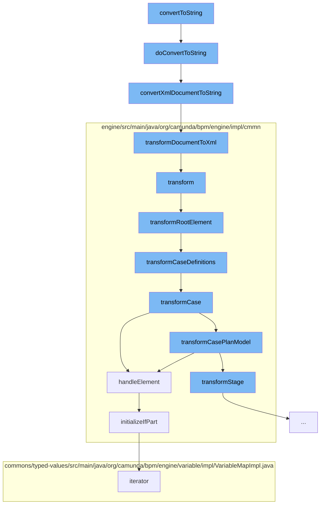

This document will cover the process of converting a DMN model instance to a string representation in the Citi-camunda repository. The process includes the following steps:

1. Converting the DMN model instance to a string
2. Converting the XML document to a string
3. Transforming the XML document to XML output
4. Transforming the root element
5. Transforming case definitions
6. Handling the sentry element
7. Initializing the 'if' part of the sentry element.



<SwmSnippet path="/model-api/dmn-model/src/main/java/org/camunda/bpm/model/dmn/Dmn.java" line="274">

---

# Converting the DMN model instance to a string

The `doConvertToString` function is used to convert a DMN model instance to a string. It first validates the model instance and then converts it to an XML string using the `convertXmlDocumentToString` function.

```java
  protected String doConvertToString(DmnModelInstance modelInstance) {
    // validate DOM document
    doValidateModel(modelInstance);
    // convert to XML string
    return IoUtil.convertXmlDocumentToString(modelInstance.getDocument());
  }
```

---

</SwmSnippet>

<SwmSnippet path="/model-api/xml-model/src/main/java/org/camunda/bpm/model/xml/impl/util/IoUtil.java" line="95">

---

# Converting the XML document to a string

The `convertXmlDocumentToString` function converts a `DomDocument` to its string representation. It uses the `transformDocumentToXml` function to transform the document to XML output.

```java
  /**
   * Converts a {@link DomDocument} to its String representation
   *
   * @param document  the XML document to convert
   */
  public static String convertXmlDocumentToString(DomDocument document) {
    StringWriter stringWriter = new StringWriter();
    StreamResult result = new StreamResult(stringWriter);
    transformDocumentToXml(document, result);
    return stringWriter.toString();
  }
```

---

</SwmSnippet>

<SwmSnippet path="/model-api/xml-model/src/main/java/org/camunda/bpm/model/xml/impl/util/IoUtil.java" line="118">

---

# Transforming the XML document to XML output

The `transformDocumentToXml` function transforms a `DomDocument` to XML output. It creates a new transformer and sets its output properties before transforming the document.

```java
  /**
   * Transforms a {@link DomDocument} to XML output.
   *
   * @param document  the DOM document to transform
   * @param result  the {@link StreamResult} to write to
   */
  public static void transformDocumentToXml(DomDocument document, StreamResult result) {
    TransformerFactory transformerFactory = TransformerFactory.newInstance();
    try {
      Transformer transformer = transformerFactory.newTransformer();
      transformer.setOutputProperty(OutputKeys.ENCODING, "UTF-8");
      transformer.setOutputProperty(OutputKeys.INDENT, "yes");
      transformer.setOutputProperty("{http://xml.apache.org/xslt}indent-amount", "2");

      synchronized(document) {
        transformer.transform(document.getDomSource(), result);
      }
    } catch (TransformerConfigurationException e) {
      throw new ModelIoException("Unable to create a transformer for the model", e);
    } catch (TransformerException e) {
      throw new ModelIoException("Unable to transform model to xml", e);
```

---

</SwmSnippet>

<SwmSnippet path="/engine/src/main/java/org/camunda/bpm/engine/impl/cmmn/transformer/CmmnTransform.java" line="134">

---

# Transforming the root element

The `transformRootElement` function transforms the root element of the model. It first transforms the imports and then the case definitions.

```java
  protected void transformRootElement() {

    transformImports();
    transformCaseDefinitions();

    Definitions definitions = model.getDefinitions();
    for (CmmnTransformListener transformListener : transformListeners) {
      transformListener.transformRootElement(definitions, caseDefinitions);
    }

  }
```

---

</SwmSnippet>

<SwmSnippet path="/engine/src/main/java/org/camunda/bpm/engine/impl/cmmn/transformer/CmmnTransform.java" line="150">

---

# Transforming case definitions

The `transformCaseDefinitions` function transforms the case definitions in the model. It iterates over each case and transforms it using the `transformCase` function.

```java
  protected void transformCaseDefinitions() {
    Definitions definitions = model.getDefinitions();

    Collection<Case> cases = definitions.getCases();

    for (Case currentCase : cases) {
      context.setCaseDefinition(null);
      context.setParent(null);
      CmmnCaseDefinition caseDefinition = transformCase(currentCase);
      caseDefinitions.add((CaseDefinitionEntity) caseDefinition);
    }
  }
```

---

</SwmSnippet>

<SwmSnippet path="/engine/src/main/java/org/camunda/bpm/engine/impl/cmmn/handler/SentryHandler.java" line="55">

---

# Handling the sentry element

The `handleElement` function handles a sentry element. It initializes the 'if' part of the sentry and the variable on parts immediately, while the on parts are initialized later.

```java
  public CmmnSentryDeclaration handleElement(Sentry element, CmmnHandlerContext context) {

    String id = element.getId();
    Collection<OnPart> onParts = element.getOnParts();
    IfPart ifPart = element.getIfPart();
    List<CamundaVariableOnPart> variableOnParts = queryExtensionElementsByClass(element, CamundaVariableOnPart.class);

    if ((ifPart == null || ifPart.getConditions().isEmpty()) && variableOnParts.isEmpty()) {

      if (onParts == null || onParts.isEmpty()) {
        LOG.ignoredSentryWithMissingCondition(id);
        return null;
      } else {
        boolean atLeastOneOnPartsValid = false;

        for (OnPart onPart : onParts) {
          if (onPart instanceof PlanItemOnPart) {
            PlanItemOnPart planItemOnPart = (PlanItemOnPart) onPart;
            if (planItemOnPart.getSource() != null && planItemOnPart.getStandardEvent() != null) {
              atLeastOneOnPartsValid = true;
              break;
```

---

</SwmSnippet>

<SwmSnippet path="/engine/src/main/java/org/camunda/bpm/engine/impl/cmmn/handler/SentryHandler.java" line="165">

---

# Initializing the 'if' part of the sentry element

The `initializeIfPart` function initializes the 'if' part of a sentry. If the 'if' part is not null, it creates a new `CmmnIfPartDeclaration` and sets its condition.

```java
  protected void initializeIfPart(IfPart ifPart, CmmnSentryDeclaration sentryDeclaration, CmmnHandlerContext context) {
    if (ifPart == null) {
      return;
    }

    Collection<ConditionExpression> conditions = ifPart.getConditions();

    if (conditions.size() > 1) {
      String id = sentryDeclaration.getId();
      LOG.multipleIgnoredConditions(id);
    }

    ExpressionManager expressionManager = context.getExpressionManager();
    ConditionExpression condition = conditions.iterator().next();
    Expression conditionExpression = expressionManager.createExpression(condition.getText());

    CmmnIfPartDeclaration ifPartDeclaration = new CmmnIfPartDeclaration();
    ifPartDeclaration.setCondition(conditionExpression);
    sentryDeclaration.setIfPart(ifPartDeclaration);
  }
```

---

</SwmSnippet>

&nbsp;

*This is an auto-generated document by Swimm AI 🌊 and has not yet been verified by a human*

<SwmMeta version="3.0.0" repo-id="Z2l0aHViJTNBJTNBQ2l0aS1jYW11bmRhJTNBJTNBZ2lsYWRuYXZvdA==" repo-name="Citi-camunda" doc-type="flows"><sup>Powered by [Swimm](/)</sup></SwmMeta>
