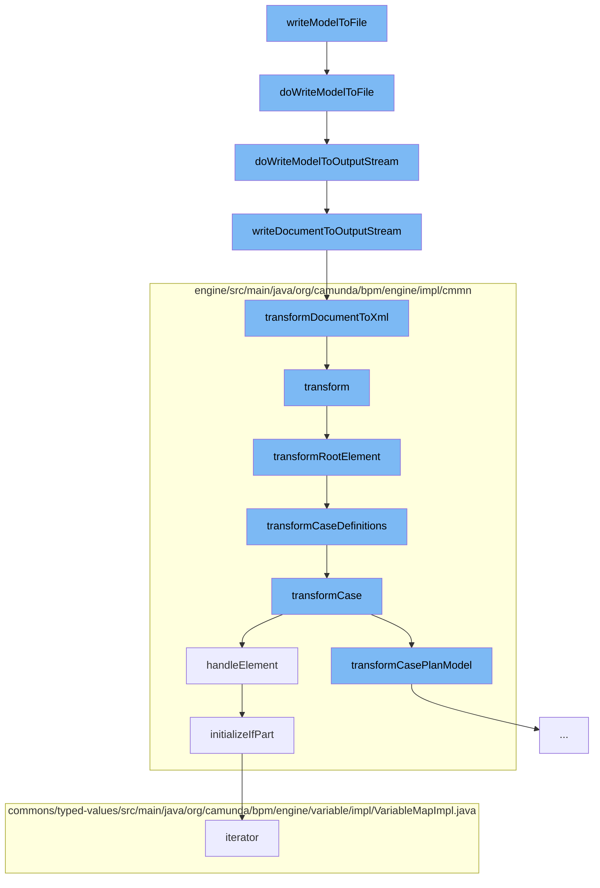

This document will cover the process of writing a Decision Model and Notation (DMN) model to a file in the Citi-camunda repository. We'll cover:

1. The initiation of the write process
2. Writing the model to an output stream
3. Transforming the model to XML
4. Transforming the XML to a Case Management Model and Notation (CMMN) model
5. Handling the transformation of the CMMN model elements



<SwmSnippet path="/model-api/dmn-model/src/main/java/org/camunda/bpm/model/dmn/Dmn.java" line="254">

---

# The initiation of the write process

The `writeModelToFile` function initiates the process of writing the DMN model to a file. It creates a new `FileOutputStream` for the given file and calls `doWriteModelToOutputStream` to write the model to this output stream.

```java
  protected void doWriteModelToFile(File file, DmnModelInstance modelInstance) {
    OutputStream os = null;
    try {
      os = new FileOutputStream(file);
      doWriteModelToOutputStream(os, modelInstance);
    }
    catch (FileNotFoundException e) {
      throw new DmnModelException("Cannot write model to file "+file+": file does not exist.");
    } finally {
      IoUtil.closeSilently(os);
    }
  }
```

---

</SwmSnippet>

<SwmSnippet path="/model-api/dmn-model/src/main/java/org/camunda/bpm/model/dmn/Dmn.java" line="267">

---

# Writing the model to an output stream

The `doWriteModelToOutputStream` function writes the DMN model to an output stream. It first validates the model, then writes the XML representation of the model to the output stream by calling `IoUtil.writeDocumentToOutputStream`.

```java
  protected void doWriteModelToOutputStream(OutputStream os, DmnModelInstance modelInstance) {
    // validate DOM document
    doValidateModel(modelInstance);
    // write XML
    IoUtil.writeDocumentToOutputStream(modelInstance.getDocument(), os);
  }
```

---

</SwmSnippet>

<SwmSnippet path="/model-api/xml-model/src/main/java/org/camunda/bpm/model/xml/impl/util/IoUtil.java" line="113">

---

# Transforming the model to XML

The `writeDocumentToOutputStream` function transforms the DOM document of the model to XML and writes it to the output stream. It calls `transformDocumentToXml` to perform the transformation.

```java
  public static void writeDocumentToOutputStream(DomDocument document, OutputStream outputStream) {
    StreamResult result = new StreamResult(outputStream);
    transformDocumentToXml(document, result);
  }
```

---

</SwmSnippet>

<SwmSnippet path="/engine/src/main/java/org/camunda/bpm/engine/impl/cmmn/transformer/CmmnTransform.java" line="98">

---

# Transforming the XML to a CMMN model

The `transform` function transforms the XML representation of the model to a CMMN model. It reads the XML from an input stream, sets the model in the context, and calls `transformRootElement` to start the transformation process.

```java
  public List<CaseDefinitionEntity> transform() {
    // get name of resource
    String resourceName = resource.getName();

    // create an input stream
    byte[] bytes = resource.getBytes();
    ByteArrayInputStream inputStream = new ByteArrayInputStream(bytes);

    try {
      // read input stream
      model = Cmmn.readModelFromStream(inputStream);

    } catch (CmmnModelException e) {
      throw LOG.transformResourceException(resourceName, e);
    }

    // TODO: use model API to validate (ie.
    // semantic and execution validation) model

    context.setModel(model);
    context.setDeployment(deployment);
```

---

</SwmSnippet>

<SwmSnippet path="/engine/src/main/java/org/camunda/bpm/engine/impl/cmmn/handler/SentryHandler.java" line="55">

---

# Handling the transformation of the CMMN model elements

The `handleElement` function handles the transformation of the CMMN model elements. It initializes the if part of the sentry and the variable on parts, and adds the sentry to the parent activity.

```java
  public CmmnSentryDeclaration handleElement(Sentry element, CmmnHandlerContext context) {

    String id = element.getId();
    Collection<OnPart> onParts = element.getOnParts();
    IfPart ifPart = element.getIfPart();
    List<CamundaVariableOnPart> variableOnParts = queryExtensionElementsByClass(element, CamundaVariableOnPart.class);

    if ((ifPart == null || ifPart.getConditions().isEmpty()) && variableOnParts.isEmpty()) {

      if (onParts == null || onParts.isEmpty()) {
        LOG.ignoredSentryWithMissingCondition(id);
        return null;
      } else {
        boolean atLeastOneOnPartsValid = false;

        for (OnPart onPart : onParts) {
          if (onPart instanceof PlanItemOnPart) {
            PlanItemOnPart planItemOnPart = (PlanItemOnPart) onPart;
            if (planItemOnPart.getSource() != null && planItemOnPart.getStandardEvent() != null) {
              atLeastOneOnPartsValid = true;
              break;
```

---

</SwmSnippet>

&nbsp;

*This is an auto-generated document by Swimm AI 🌊 and has not yet been verified by a human*

<SwmMeta version="3.0.0" repo-id="Z2l0aHViJTNBJTNBQ2l0aS1jYW11bmRhJTNBJTNBZ2lsYWRuYXZvdA==" repo-name="Citi-camunda" doc-type="flows"><sup>Powered by [Swimm](/)</sup></SwmMeta>
