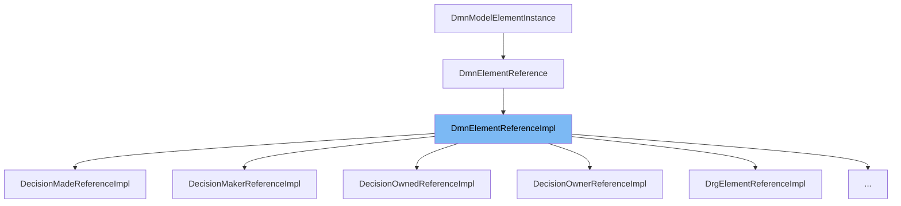

This document will cover the `DmnElementReferenceImpl` class. We will cover:

1. What the `DmnElementReferenceImpl` class is.
2. `DmnElementReferenceImpl` class main variables and functions.
3. Example of how to use the `DmnElementReferenceImpl` class.



# What is DmnElementReferenceImpl

`DmnElementReferenceImpl` is a class that implements the `DmnElementReference` interface. It is used to represent a reference to a DMN element in the DMN model. The class is part of the DMN model API and is used to create and manipulate DMN models.

<SwmSnippet path="/model-api/dmn-model/src/main/java/org/camunda/bpm/model/dmn/impl/instance/DmnElementReferenceImpl.java" line="32">

---

# Variables and functions

The `hrefAttribute` variable is a static attribute of type String. It is used to store the href attribute of the DMN element reference.

```java
  protected static Attribute<String> hrefAttribute;
```

---

</SwmSnippet>

<SwmSnippet path="/model-api/dmn-model/src/main/java/org/camunda/bpm/model/dmn/impl/instance/DmnElementReferenceImpl.java" line="38">

---

The `getHref` function is used to get the href attribute of the DMN element reference. It returns the value of the `hrefAttribute`.

```java
  public String getHref() {
    return hrefAttribute.getValue(this);
  }
```

---

</SwmSnippet>

<SwmSnippet path="/model-api/dmn-model/src/main/java/org/camunda/bpm/model/dmn/impl/instance/DmnElementReferenceImpl.java" line="42">

---

The `setHref` function is used to set the href attribute of the DMN element reference. It sets the value of the `hrefAttribute`.

```java
  public void setHref(String href) {
    hrefAttribute.setValue(this, href);
  }
```

---

</SwmSnippet>

<SwmSnippet path="/model-api/dmn-model/src/main/java/org/camunda/bpm/model/dmn/impl/instance/DmnElementReferenceImpl.java" line="46">

---

The `registerType` function is a static function that is used to register the `DmnElementReference` type in the model builder. It defines the type, sets the namespace URI, sets the instance provider, and builds the type.

```java
  public static void registerType(ModelBuilder modelBuilder) {
    ModelElementTypeBuilder typeBuilder = modelBuilder.defineType(DmnElementReference.class, DMN_ELEMENT_REFERENCE)
      .namespaceUri(LATEST_DMN_NS)
      .instanceProvider(new ModelTypeInstanceProvider<DmnElementReference>() {
        public DmnElementReference newInstance(ModelTypeInstanceContext instanceContext) {
          return new DmnElementReferenceImpl(instanceContext);
        }
      });

    hrefAttribute = typeBuilder.stringAttribute(DMN_ATTRIBUTE_HREF)
      .required()
      .build();

    typeBuilder.build();
  }
```

---

</SwmSnippet>

<SwmSnippet path="/model-api/dmn-model/src/main/java/org/camunda/bpm/model/dmn/impl/instance/DmnElementReferenceImpl.java" line="50">

---

The `newInstance` function is used to create a new instance of `DmnElementReference`. It returns a new instance of `DmnElementReferenceImpl`.

```java
        public DmnElementReference newInstance(ModelTypeInstanceContext instanceContext) {
          return new DmnElementReferenceImpl(instanceContext);
        }
```

---

</SwmSnippet>

<SwmSnippet path="/model-api/dmn-model/src/main/java/org/camunda/bpm/model/dmn/impl/instance/DmnElementReferenceImpl.java" line="34">

---

The `DmnElementReferenceImpl` function is the constructor of the class. It takes a `ModelTypeInstanceContext` as a parameter and passes it to the superclass constructor.

```java
  public DmnElementReferenceImpl(ModelTypeInstanceContext instanceContext) {
    super(instanceContext);
  }
```

---

</SwmSnippet>

<SwmSnippet path="/model-api/dmn-model/src/main/java/org/camunda/bpm/model/dmn/impl/instance/OwnerReferenceImpl.java" line="29">

---

# Usage example

The `OwnerReferenceImpl` class is an example of how to use the `DmnElementReferenceImpl` class. It extends the `DmnElementReferenceImpl` class and implements the `OwnerReference` interface.

```java
public class OwnerReferenceImpl extends DmnElementReferenceImpl implements OwnerReference {
```

---

</SwmSnippet>

&nbsp;

*This is an auto-generated document by Swimm AI 🌊 and has not yet been verified by a human*

<SwmMeta version="3.0.0" repo-id="Z2l0aHViJTNBJTNBQ2l0aS1jYW11bmRhJTNBJTNBZ2lsYWRuYXZvdA==" repo-name="Citi-camunda" doc-type="general-class"><sup>Powered by [Swimm](/)</sup></SwmMeta>
