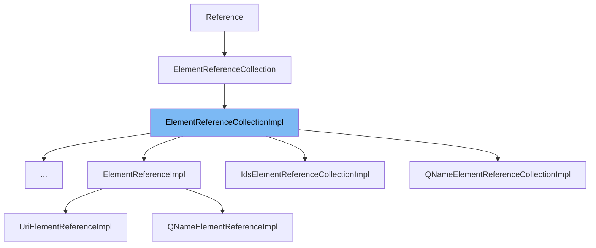

This document will cover the following topics related to the `ElementReferenceCollectionImpl` class:

1. What is `ElementReferenceCollectionImpl`.
2. Explanation of all the variables and functions defined in `ElementReferenceCollectionImpl`.
3. An example of how to use `ElementReferenceCollectionImpl` in `UriElementReferenceCollectionImpl`.



# What is ElementReferenceCollectionImpl

`ElementReferenceCollectionImpl` is a class in the Camunda Platform that implements the `ElementReferenceCollection` interface. It is used to manage collections of references to model elements. This class provides methods to add, remove, and update references, as well as to perform operations on the collection of references.

<SwmSnippet path="/model-api/xml-model/src/main/java/org/camunda/bpm/model/xml/impl/type/reference/ElementReferenceCollectionImpl.java" line="42">

---

# Variables and functions

The `referenceSourceCollection` variable is a collection of source elements that are referenced. The `referenceSourceType` variable is the type of the source elements in the collection.

```java
  private final ChildElementCollection<Source> referenceSourceCollection;
  private ModelElementTypeImpl referenceSourceType;
```

---

</SwmSnippet>

<SwmSnippet path="/model-api/xml-model/src/main/java/org/camunda/bpm/model/xml/impl/type/reference/ElementReferenceCollectionImpl.java" line="49">

---

The `getReferenceSourceCollection` function returns the collection of source elements that are referenced.

```java
  public ChildElementCollection<Source> getReferenceSourceCollection() {
    return referenceSourceCollection;
  }
```

---

</SwmSnippet>

<SwmSnippet path="/model-api/xml-model/src/main/java/org/camunda/bpm/model/xml/impl/type/reference/ElementReferenceCollectionImpl.java" line="54">

---

The `setReferenceIdentifier` function sets the identifier of a reference source element.

```java
  protected void setReferenceIdentifier(ModelElementInstance referenceSourceElement, String referenceIdentifier) {
    referenceSourceElement.setTextContent(referenceIdentifier);
  }
```

---

</SwmSnippet>

<SwmSnippet path="/model-api/xml-model/src/main/java/org/camunda/bpm/model/xml/impl/type/reference/ElementReferenceCollectionImpl.java" line="58">

---

The `performAddOperation` function adds a reference target element to the collection of references.

```java
  protected void performAddOperation(ModelElementInstanceImpl referenceSourceParentElement, Target referenceTargetElement) {
    ModelInstanceImpl modelInstance = referenceSourceParentElement.getModelInstance();
    String referenceTargetIdentifier = referenceTargetAttribute.getValue(referenceTargetElement);
    ModelElementInstance existingElement = modelInstance.getModelElementById(referenceTargetIdentifier);

    if (existingElement == null || !existingElement.equals(referenceTargetElement)) {
      throw new ModelReferenceException("Cannot create reference to model element " + referenceTargetElement
        +": element is not part of model. Please connect element to the model first.");
    }
    else {
      Collection<Source> referenceSourceElements = referenceSourceCollection.get(referenceSourceParentElement);
      Source referenceSourceElement = modelInstance.newInstance(referenceSourceType);
      referenceSourceElements.add(referenceSourceElement);
      setReferenceIdentifier(referenceSourceElement, referenceTargetIdentifier);
    }
  }
```

---

</SwmSnippet>

<SwmSnippet path="/model-api/xml-model/src/main/java/org/camunda/bpm/model/xml/impl/type/reference/ElementReferenceCollectionImpl.java" line="75">

---

The `performRemoveOperation` function removes a reference target element from the collection of references.

```java
  protected void performRemoveOperation(ModelElementInstanceImpl referenceSourceParentElement, Object referenceTargetElement) {
    Collection<ModelElementInstance> referenceSourceChildElements = referenceSourceParentElement.getChildElementsByType(referenceSourceType);
    for (ModelElementInstance referenceSourceChildElement : referenceSourceChildElements) {
      if (getReferenceTargetElement(referenceSourceChildElement).equals(referenceTargetElement)) {
        referenceSourceParentElement.removeChildElement(referenceSourceChildElement);
      }
    }
  }
```

---

</SwmSnippet>

<SwmSnippet path="/model-api/xml-model/src/main/java/org/camunda/bpm/model/xml/impl/type/reference/ElementReferenceCollectionImpl.java" line="84">

---

The `performClearOperation` function removes all elements from the collection of references.

```java
  protected void performClearOperation(ModelElementInstanceImpl referenceSourceParentElement, Collection<DomElement> elementsToRemove) {
    for (DomElement element: elementsToRemove) {
      referenceSourceParentElement.getDomElement().removeChild(element);
    }
  }
```

---

</SwmSnippet>

<SwmSnippet path="/model-api/xml-model/src/main/java/org/camunda/bpm/model/xml/impl/type/reference/ElementReferenceCollectionImpl.java" line="90">

---

The `getReferenceIdentifier` function returns the identifier of a reference source element.

```java
  public String getReferenceIdentifier(ModelElementInstance referenceSourceElement) {
    return referenceSourceElement.getTextContent();
  }
```

---

</SwmSnippet>

<SwmSnippet path="/model-api/xml-model/src/main/java/org/camunda/bpm/model/xml/impl/type/reference/ElementReferenceCollectionImpl.java" line="95">

---

The `updateReference` function updates the identifier of a reference source element.

```java
  protected void updateReference(ModelElementInstance referenceSourceElement, String oldIdentifier, String newIdentifier) {
    String referencingTextContent = getReferenceIdentifier(referenceSourceElement);
    if (oldIdentifier != null && oldIdentifier.equals(referencingTextContent)) {
      setReferenceIdentifier(referenceSourceElement, newIdentifier);
    }
```

---

</SwmSnippet>

<SwmSnippet path="/model-api/xml-model/src/main/java/org/camunda/bpm/model/xml/impl/type/reference/ElementReferenceCollectionImpl.java" line="103">

---

The `removeReference` function removes a reference from the collection of references.

```java
  protected void removeReference(ModelElementInstance referenceSourceElement, ModelElementInstance referenceTargetElement) {
    ModelElementInstance parentElement = referenceSourceElement.getParentElement();
    Collection<Source> childElementCollection = referenceSourceCollection.get(parentElement);
    childElementCollection.remove(referenceSourceElement);
  }
```

---

</SwmSnippet>

<SwmSnippet path="/model-api/xml-model/src/main/java/org/camunda/bpm/model/xml/impl/type/reference/ElementReferenceCollectionImpl.java" line="109">

---

The `setReferenceSourceElementType` function sets the type of the source elements in the collection of references.

```java
  public void setReferenceSourceElementType(ModelElementTypeImpl referenceSourceType) {
    this.referenceSourceType = referenceSourceType;
  }
```

---

</SwmSnippet>

<SwmSnippet path="/model-api/xml-model/src/main/java/org/camunda/bpm/model/xml/impl/type/reference/ElementReferenceCollectionImpl.java" line="113">

---

The `getReferenceSourceElementType` function returns the type of the source elements in the collection of references.

```java
  public ModelElementType getReferenceSourceElementType() {
    return referenceSourceType;
  }
```

---

</SwmSnippet>

# Usage example

`ElementReferenceCollectionImpl` is used in `UriElementReferenceCollectionImpl` as a base class to manage collections of URI element references. It provides the functionality to add, remove, and update URI element references, as well as to perform operations on the collection of URI element references.

&nbsp;

*This is an auto-generated document by Swimm AI 🌊 and has not yet been verified by a human*

<SwmMeta version="3.0.0" repo-id="Z2l0aHViJTNBJTNBQ2l0aS1jYW11bmRhJTNBJTNBZ2lsYWRuYXZvdA==" repo-name="Citi-camunda" doc-type="general-class"><sup>Powered by [Swimm](/)</sup></SwmMeta>
