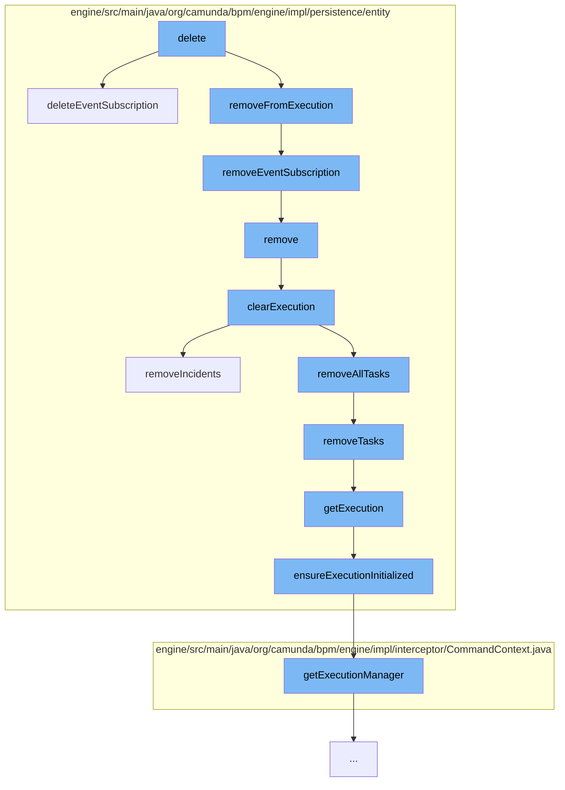

This document will cover the process of event subscription deletion in the Camunda BPMN engine, which includes:

1. Deleting the event subscription
2. Removing the event subscription from execution
3. Removing the execution entity
4. Clearing the execution entity
5. Removing tasks associated with the execution entity
6. Fetching the execution entity for a variable instance



<SwmSnippet path="/engine/src/main/java/org/camunda/bpm/engine/impl/persistence/entity/EventSubscriptionManager.java" line="55">

---

# Deleting the event subscription

The `deleteEventSubscription` function is responsible for deleting a specific event subscription. It also handles the case where the event subscription has been triggered asynchronously but not yet executed.

```java
  public void deleteEventSubscription(EventSubscriptionEntity persistentObject) {
    getDbEntityManager().delete(persistentObject);
    if (persistentObject.isSubscriptionForEventType(EventType.SIGNAL)) {
      createdSignalSubscriptions.remove(persistentObject);
    }

    // if the event subscription has been triggered asynchronously but not yet executed
    List<JobEntity> asyncJobs = getJobManager().findJobsByConfiguration(ProcessEventJobHandler.TYPE, persistentObject.getId(), persistentObject.getTenantId());
    for (JobEntity asyncJob : asyncJobs) {
      asyncJob.delete();
    }
  }
```

---

</SwmSnippet>

<SwmSnippet path="/engine/src/main/java/org/camunda/bpm/engine/impl/persistence/entity/ExecutionEntity.java" line="1516">

---

# Removing the event subscription from execution

The `removeEventSubscription` function removes a specific event subscription from the execution.

```java
  public void removeEventSubscription(EventSubscriptionEntity eventSubscriptionEntity) {
    getEventSubscriptionsInternal().remove(eventSubscriptionEntity);
  }
```

---

</SwmSnippet>

<SwmSnippet path="/engine/src/main/java/org/camunda/bpm/engine/impl/persistence/entity/ExecutionEntity.java" line="1021">

---

# Removing the execution entity

The `remove` function removes the execution entity. This includes removing jobs, incidents, tasks, and clearing the variable store.

```java
  @Override
  public void remove() {
    super.remove();

    // removes jobs, incidents and tasks, and
    // clears the variable store
    clearExecution();

    // remove all event subscriptions for this scope, if the scope has event
    // subscriptions:
    removeEventSubscriptions();

    // finally delete this execution
    Context.getCommandContext().getExecutionManager().deleteExecution(this);
  }
```

---

</SwmSnippet>

<SwmSnippet path="/engine/src/main/java/org/camunda/bpm/engine/impl/persistence/entity/ExecutionEntity.java" line="531">

---

# Clearing the execution entity

The `clearExecution` function clears the execution entity. This includes deleting all tasks, variable instances, jobs, and incidents.

```java
  protected void clearExecution() {
    //call the onRemove method of the execution observers
    //so they can do some clean up before
    for (ExecutionObserver observer : executionObservers) {
      observer.onClear(this);
    }

    // delete all the tasks and external tasks
    removeAllTasks();

    // delete all the variable instances
    removeVariablesLocalInternal();

    // remove all jobs
    removeJobs();

    // remove all incidents
    removeIncidents();
  }
```

---

</SwmSnippet>

<SwmSnippet path="/engine/src/main/java/org/camunda/bpm/engine/impl/persistence/entity/ExecutionEntity.java" line="1084">

---

# Removing tasks associated with the execution entity

The `removeTasks` function removes all tasks associated with the execution entity.

```java
  protected void removeTasks(String reason, boolean skipCustomListeners) {
    if (reason == null) {
      reason = TaskEntity.DELETE_REASON_DELETED;
    }
    for (TaskEntity task : getTasks()) {
      if (isReplacedByParent()) {
        if (task.getExecution() == null || task.getExecution() != replacedBy) {
          // All tasks should have been moved when "replacedBy" has been set.
          // Just in case tasks where added,
          // wo do an additional check here and move it
          task.setExecution(replacedBy);
          this.getReplacedBy().addTask(task);
        }
      } else {
        task.delete(reason, false, skipCustomListeners);
      }
    }
  }
```

---

</SwmSnippet>

<SwmSnippet path="/engine/src/main/java/org/camunda/bpm/engine/impl/persistence/entity/VariableInstanceEntity.java" line="323">

---

# Fetching the execution entity for a variable instance

The `getExecution` function fetches the execution entity for a variable instance. It ensures that the execution entity is initialized.

```java
  public ExecutionEntity getExecution() {
    ensureExecutionInitialized();
    return execution;
  }
```

---

</SwmSnippet>

&nbsp;

*This is an auto-generated document by Swimm AI 🌊 and has not yet been verified by a human*

<SwmMeta version="3.0.0" repo-id="Z2l0aHViJTNBJTNBQ2l0aS1jYW11bmRhJTNBJTNBZ2lsYWRuYXZvdA==" repo-name="Citi-camunda" doc-type="flows"><sup>Powered by [Swimm](/)</sup></SwmMeta>
