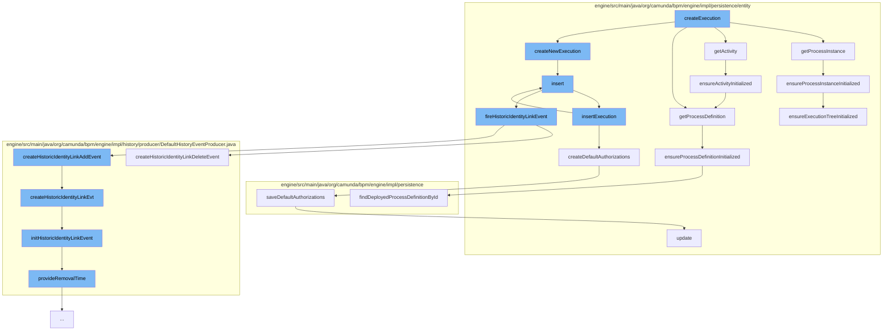

This document will cover the process of creating and managing execution entities in the Camunda BPM engine. The main topics we'll cover are:

1. The creation of an execution entity
2. The initialization of process instance and activity
3. The insertion of the execution entity into the execution manager
4. The creation of default authorizations
5. The handling of historic identity link events.



<SwmSnippet path="/engine/src/main/java/org/camunda/bpm/engine/impl/persistence/entity/ExecutionEntity.java" line="1440">

---

# Creating an Execution Entity

The `createExecution` function initiates the creation of an execution entity. This function calls other functions like `getProcessInstance`, `getActivity`, `getProcessDefinition`, and `createNewExecution` to gather necessary information and create a new execution entity.

```java
  public void insert() {
    Context.getCommandContext().getExecutionManager().insertExecution(this);
  }
```

---

</SwmSnippet>

<SwmSnippet path="/engine/src/main/java/org/camunda/bpm/engine/impl/persistence/entity/ExecutionEntity.java" line="782">

---

# Initializing Process Instance and Activity

The `getProcessInstance` function ensures that the process instance is initialized. It calls the `ensureProcessInstanceInitialized` function to perform this task.

```java
  @Override
  public ExecutionEntity getProcessInstance() {
    ensureProcessInstanceInitialized();
    return processInstance;
  }
```

---

</SwmSnippet>

<SwmSnippet path="/engine/src/main/java/org/camunda/bpm/engine/impl/persistence/entity/ExecutionEntity.java" line="1440">

---

# Inserting Execution Entity into Execution Manager

The `insert` function is responsible for inserting the execution entity into the execution manager. It does this by calling the `insertExecution` function of the execution manager.

```java
  public void insert() {
    Context.getCommandContext().getExecutionManager().insertExecution(this);
  }
```

---

</SwmSnippet>

<SwmSnippet path="/engine/src/main/java/org/camunda/bpm/engine/impl/persistence/entity/ExecutionManager.java" line="207">

---

# Creating Default Authorizations

The `createDefaultAuthorizations` function is responsible for creating default authorizations for the execution entity. It checks if the execution is a process instance execution and if authorization is enabled before creating the authorizations.

```java
  // helper ///////////////////////////////////////////////////////////

  protected void createDefaultAuthorizations(ExecutionEntity execution) {
    if(execution.isProcessInstanceExecution() && isAuthorizationEnabled()) {
      ResourceAuthorizationProvider provider = getResourceAuthorizationProvider();
      AuthorizationEntity[] authorizations = provider.newProcessInstance(execution);
      saveDefaultAuthorizations(authorizations);
    }
  }
```

---

</SwmSnippet>

<SwmSnippet path="/engine/src/main/java/org/camunda/bpm/engine/impl/persistence/entity/IdentityLinkEntity.java" line="204">

---

# Handling Historic Identity Link Events

The `fireHistoricIdentityLinkEvent` function is responsible for handling historic identity link events. It creates a historic identity link add event or a historic identity link delete event based on the event type.

```java
  public void fireHistoricIdentityLinkEvent(final HistoryEventType eventType) {
    ProcessEngineConfigurationImpl processEngineConfiguration = Context.getProcessEngineConfiguration();

    HistoryLevel historyLevel = processEngineConfiguration.getHistoryLevel();
    if(historyLevel.isHistoryEventProduced(eventType, this)) {

      HistoryEventProcessor.processHistoryEvents(new HistoryEventProcessor.HistoryEventCreator() {
        @Override
        public HistoryEvent createHistoryEvent(HistoryEventProducer producer) {
          HistoryEvent event = null;
          if (HistoryEvent.IDENTITY_LINK_ADD.equals(eventType.getEventName())) {
            event = producer.createHistoricIdentityLinkAddEvent(IdentityLinkEntity.this);
          } else if (HistoryEvent.IDENTITY_LINK_DELETE.equals(eventType.getEventName())) {
            event = producer.createHistoricIdentityLinkDeleteEvent(IdentityLinkEntity.this);
          }
          return event;
        }
      });

    }
  }
```

---

</SwmSnippet>

&nbsp;

*This is an auto-generated document by Swimm AI 🌊 and has not yet been verified by a human*

<SwmMeta version="3.0.0" repo-id="Z2l0aHViJTNBJTNBQ2l0aS1jYW11bmRhJTNBJTNBZ2lsYWRuYXZvdA==" repo-name="Citi-camunda" doc-type="flows"><sup>Powered by [Swimm](/)</sup></SwmMeta>
