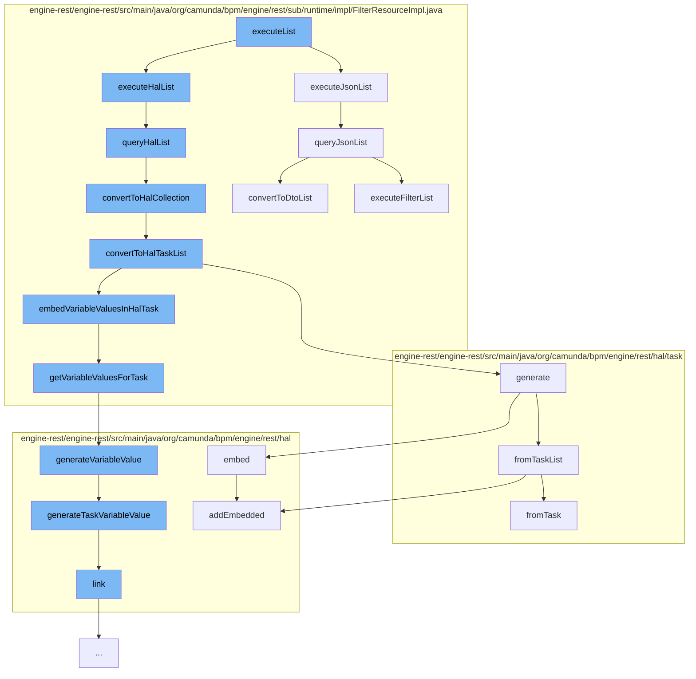

This document will cover the process of executing a list in the FilterResourceImpl.java file, which includes:

 1. Executing the JSON list
 2. Querying the HAL list
 3. Converting to HAL collection
 4. Converting to HAL task list
 5. Generating the HAL task list
 6. Getting variable values for task
 7. Generating variable value
 8. Generating task variable value
 9. Querying the JSON list
10. Executing filter list.



<SwmSnippet path="/engine-rest/engine-rest/src/main/java/org/camunda/bpm/engine/rest/sub/runtime/impl/FilterResourceImpl.java" line="221">

---

# Executing the JSON list

The function `executeJsonList` is used to execute a JSON list. It calls the `queryJsonList` function with null as the first parameter and the provided `firstResult` and `maxResults` as the other parameters.

```java
  public List<Object> executeJsonList(Integer firstResult, Integer maxResults) {
    return queryJsonList(null, firstResult, maxResults);
  }
```

---

</SwmSnippet>

<SwmSnippet path="/engine-rest/engine-rest/src/main/java/org/camunda/bpm/engine/rest/sub/runtime/impl/FilterResourceImpl.java" line="253">

---

# Querying the HAL list

The function `queryHalList` is used to query a HAL list. It calls the `executeFilterList` and `executeFilterCount` functions and then checks if the entities are not null or empty. If they are not, it calls the `convertToHalCollection` function.

```java
  public HalResource queryHalList(String extendingQuery, Integer firstResult, Integer maxResults) {
    List<?> entities = executeFilterList(extendingQuery, firstResult, maxResults);
    long count = executeFilterCount(extendingQuery);

    if (entities != null && !entities.isEmpty()) {
      return convertToHalCollection(entities, count);
    }
    else {
      return new EmptyHalCollection(count);
    }
  }
```

---

</SwmSnippet>

<SwmSnippet path="/engine-rest/engine-rest/src/main/java/org/camunda/bpm/engine/rest/sub/runtime/impl/FilterResourceImpl.java" line="393">

---

# Converting to HAL collection

The function `convertToHalCollection` is used to convert entities to a HAL collection. It checks if the first entity is of class `Task` and if it is, it calls the `convertToHalTaskList` function.

```java
  @SuppressWarnings("unchecked")
  protected HalCollectionResource convertToHalCollection(List<?> entities, long count) {
    if (isEntityOfClass(entities.get(0), Task.class)) {
      return convertToHalTaskList((List<Task>) entities, count);
    } else {
      throw unsupportedEntityClass(entities.get(0));
    }
  }
```

---

</SwmSnippet>

<SwmSnippet path="/engine-rest/engine-rest/src/main/java/org/camunda/bpm/engine/rest/sub/runtime/impl/FilterResourceImpl.java" line="402">

---

# Converting to HAL task list

The function `convertToHalTaskList` is used to convert tasks to a HAL task list. It calls the `HalTaskList.generate` function and the `getVariableInstancesForTasks` function. It then embeds variable values in the HAL task.

```java
  @SuppressWarnings("unchecked")
  protected HalTaskList convertToHalTaskList(List<Task> tasks, long count) {
    HalTaskList halTasks = HalTaskList.generate(tasks, count, getProcessEngine());
    Map<String, List<VariableInstance>> variableInstances = getVariableInstancesForTasks(halTasks);
    if (variableInstances != null) {
      for (HalTask halTask : (List<HalTask>) halTasks.getEmbedded("task")) {
        embedVariableValuesInHalTask(halTask, variableInstances);
      }
    }
    return halTasks;
  }
```

---

</SwmSnippet>

<SwmSnippet path="/engine-rest/engine-rest/src/main/java/org/camunda/bpm/engine/rest/hal/task/HalTaskList.java" line="36">

---

# Generating the HAL task list

The function `generate` is used to generate a HAL task list. It calls the `fromTaskList` function and embeds several entities in the task list.

```java
  public static HalTaskList generate(List<Task> tasks, long count, ProcessEngine engine) {
    return fromTaskList(tasks, count)
      .embed(HalTask.REL_ASSIGNEE, engine)
      .embed(HalTask.REL_OWNER, engine)
      .embed(HalTask.REL_PROCESS_DEFINITION, engine)
      .embed(HalTask.REL_CASE_DEFINITION, engine);
  }
```

---

</SwmSnippet>

<SwmSnippet path="/engine-rest/engine-rest/src/main/java/org/camunda/bpm/engine/rest/sub/runtime/impl/FilterResourceImpl.java" line="431">

---

# Getting variable values for task

The function `getVariableValuesForTask` is used to get variable values for a task. It iterates over variable scope ids and checks if the variable instances contain the variable scope id. If they do, it iterates over the variable instances and checks if the known variable names contain the variable instance name. If they don't, it generates a variable value and adds it to the known variable names.

```java
  protected List<HalResource<?>> getVariableValuesForTask(HalTask halTask, Map<String, List<VariableInstance>> variableInstances) {
    // converted variables values
    List<HalResource<?>> variableValues = new ArrayList<>();

    // variable scope ids to check, ordered by visibility
    LinkedHashSet<String> variableScopeIds = getVariableScopeIds(halTask);

    // names of already converted variables
    Set<String> knownVariableNames = new HashSet<>();

    for (String variableScopeId : variableScopeIds) {
      if (variableInstances.containsKey(variableScopeId)) {
        for (VariableInstance variableInstance : variableInstances.get(variableScopeId)) {
          if (!knownVariableNames.contains(variableInstance.getName())) {
            variableValues.add(HalVariableValue.generateVariableValue(variableInstance, variableScopeId));
            knownVariableNames.add(variableInstance.getName());
          }
        }
      }
    }

```

---

</SwmSnippet>

<SwmSnippet path="/engine-rest/engine-rest/src/main/java/org/camunda/bpm/engine/rest/hal/HalVariableValue.java" line="41">

---

# Generating variable value

The function `generateVariableValue` is used to generate a variable value. It checks if the variable scope id equals the task id and if it does, it calls the `generateTaskVariableValue` function.

```java
  public static HalVariableValue generateVariableValue(VariableInstance variableInstance, String variableScopeId) {
    if (variableScopeId.equals(variableInstance.getTaskId())) {
      return generateTaskVariableValue(variableInstance, variableScopeId);
    }
    else if (variableScopeId.equals(variableInstance.getProcessInstanceId())) {
      return generateProcessInstanceVariableValue(variableInstance, variableScopeId);
    }
    else if (variableScopeId.equals(variableInstance.getExecutionId())) {
      return generateExecutionVariableValue(variableInstance, variableScopeId);
    }
    else if (variableScopeId.equals(variableInstance.getCaseInstanceId())) {
      return generateCaseInstanceVariableValue(variableInstance, variableScopeId);
    }
    else if (variableScopeId.equals(variableInstance.getCaseExecutionId())) {
      return generateCaseExecutionVariableValue(variableInstance, variableScopeId);
    }
    else {
      throw new RestException("Variable scope id '" + variableScopeId + "' does not match with variable instance '" + variableInstance + "'");
    }
  }
```

---

</SwmSnippet>

<SwmSnippet path="/engine-rest/engine-rest/src/main/java/org/camunda/bpm/engine/rest/hal/HalVariableValue.java" line="62">

---

# Generating task variable value

The function `generateTaskVariableValue` is used to generate a task variable value. It calls the `fromVariableInstance` function and links the variable value to the task.

```java
  public static HalVariableValue generateTaskVariableValue(VariableInstance variableInstance, String taskId) {
    return fromVariableInstance(variableInstance)
      .link(REL_SELF, TaskRestService.PATH, taskId, "localVariables");
  }
```

---

</SwmSnippet>

<SwmSnippet path="/engine-rest/engine-rest/src/main/java/org/camunda/bpm/engine/rest/sub/runtime/impl/FilterResourceImpl.java" line="238">

---

# Querying the JSON list

The function `queryJsonList` is used to query a JSON list. It calls the `executeFilterList` function and checks if the entities are not null or empty. If they are not, it calls the `convertToDtoList` function.

```java
  public List<Object> queryJsonList(String extendingQuery, Integer firstResult, Integer maxResults) {
    List<?> entities = executeFilterList(extendingQuery, firstResult, maxResults);

    if (entities != null && !entities.isEmpty()) {
      return convertToDtoList(entities);
    }
    else {
      return Collections.emptyList();
    }
  }
```

---

</SwmSnippet>

<SwmSnippet path="/engine-rest/engine-rest/src/main/java/org/camunda/bpm/engine/rest/sub/runtime/impl/FilterResourceImpl.java" line="265">

---

# Executing filter list

The function `executeFilterList` is used to execute a filter list. It calls the `filterService.listPage` or `filterService.list` function depending on whether `firstResult` and `maxResults` are null or not.

```java
  protected List<?> executeFilterList(String extendingQueryString, Integer firstResult, Integer maxResults) {
    Query<?, ?> extendingQuery = convertQuery(extendingQueryString);
    try {
      if (firstResult != null || maxResults != null) {
        if (firstResult == null) {
          firstResult = 0;
        }
        if (maxResults == null) {
          maxResults = Integer.MAX_VALUE;
        }
        return filterService.listPage(resourceId, extendingQuery, firstResult, maxResults);
      } else {
        return filterService.list(resourceId, extendingQuery);
      }
    }
    catch (NullValueException e) {
      throw filterNotFound(e);
    }
    catch (NotValidException e) {
      throw invalidQuery(e);
    }
```

---

</SwmSnippet>

&nbsp;

*This is an auto-generated document by Swimm AI 🌊 and has not yet been verified by a human*

<SwmMeta version="3.0.0" repo-id="Z2l0aHViJTNBJTNBQ2l0aS1jYW11bmRhJTNBJTNBZ2lsYWRuYXZvdA==" repo-name="Citi-camunda" doc-type="flows"><sup>Powered by [Swimm](/)</sup></SwmMeta>
