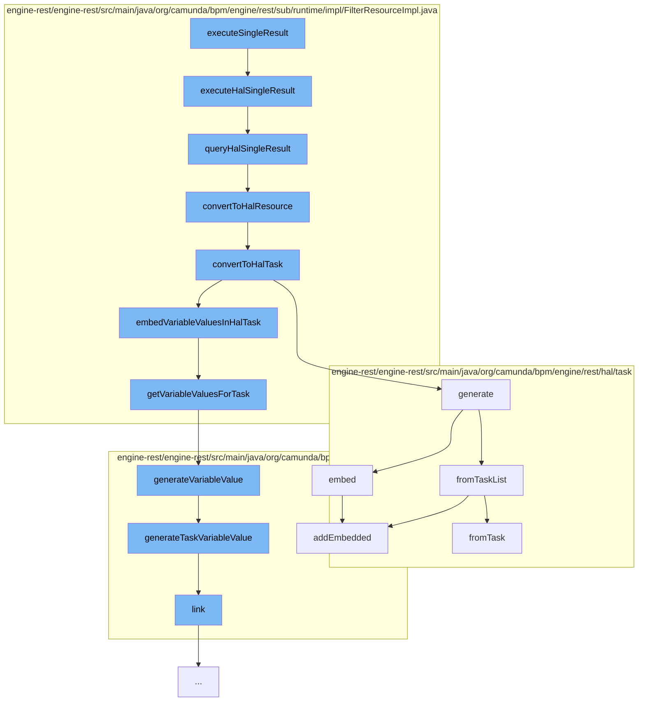

This document will cover the process of executing a single result in the Camunda engine, which includes:

1. Executing the HAL single result
2. Querying the HAL single result
3. Converting the result to a HAL resource
4. Converting the HAL resource to a HAL task
5. Embedding variable values in the HAL task
6. Generating variable values for the task
7. Generating a task variable value
8. Linking the variable value



<SwmSnippet path="/engine-rest/engine-rest/src/main/java/org/camunda/bpm/engine/rest/sub/runtime/impl/FilterResourceImpl.java" line="178">

---

# Executing the HAL single result

The function `executeHalSingleResult` is the entry point of the flow. It calls the `queryHalSingleResult` function with null as an argument.

```java
  public HalResource executeHalSingleResult() {
    return queryHalSingleResult(null);
  }
```

---

</SwmSnippet>

<SwmSnippet path="/engine-rest/engine-rest/src/main/java/org/camunda/bpm/engine/rest/sub/runtime/impl/FilterResourceImpl.java" line="182">

---

# Querying the HAL single result

The function `queryHalSingleResult` executes the filter single result and checks if the entity is not null. If the entity is not null, it converts the entity to a HAL resource.

```java
  public HalResource queryHalSingleResult(String extendingQuery) {
    Object entity = executeFilterSingleResult(extendingQuery);

    if (entity != null) {
      return convertToHalResource(entity);
    }
    else {
      return EmptyHalResource.INSTANCE;
    }
  }
```

---

</SwmSnippet>

<SwmSnippet path="/engine-rest/engine-rest/src/main/java/org/camunda/bpm/engine/rest/sub/runtime/impl/FilterResourceImpl.java" line="375">

---

# Converting the result to a HAL resource

The function `convertToHalResource` checks if the entity is of class Task. If it is, it converts the entity to a HAL task.

```java
  protected HalResource<?> convertToHalResource(Object entity) {
    if (isEntityOfClass(entity, Task.class)) {
      return convertToHalTask((Task) entity);
    }
    else {
      throw unsupportedEntityClass(entity);
    }
  }
```

---

</SwmSnippet>

<SwmSnippet path="/engine-rest/engine-rest/src/main/java/org/camunda/bpm/engine/rest/sub/runtime/impl/FilterResourceImpl.java" line="384">

---

# Converting the HAL resource to a HAL task

The function `convertToHalTask` generates a HAL task and embeds variable values in the HAL task if variable instances are not null.

```java
  protected HalTask convertToHalTask(Task task) {
    HalTask halTask = HalTask.generate(task, getProcessEngine());
    Map<String, List<VariableInstance>> variableInstances = getVariableInstancesForTasks(halTask);
    if (variableInstances != null) {
      embedVariableValuesInHalTask(halTask, variableInstances);
    }
    return halTask;
  }
```

---

</SwmSnippet>

<SwmSnippet path="/engine-rest/engine-rest/src/main/java/org/camunda/bpm/engine/rest/sub/runtime/impl/FilterResourceImpl.java" line="431">

---

# Embedding variable values in the HAL task

The function `getVariableValuesForTask` gets the variable values for the task and generates variable values for each variable instance.

```java
  protected List<HalResource<?>> getVariableValuesForTask(HalTask halTask, Map<String, List<VariableInstance>> variableInstances) {
    // converted variables values
    List<HalResource<?>> variableValues = new ArrayList<>();

    // variable scope ids to check, ordered by visibility
    LinkedHashSet<String> variableScopeIds = getVariableScopeIds(halTask);

    // names of already converted variables
    Set<String> knownVariableNames = new HashSet<>();

    for (String variableScopeId : variableScopeIds) {
      if (variableInstances.containsKey(variableScopeId)) {
        for (VariableInstance variableInstance : variableInstances.get(variableScopeId)) {
          if (!knownVariableNames.contains(variableInstance.getName())) {
            variableValues.add(HalVariableValue.generateVariableValue(variableInstance, variableScopeId));
            knownVariableNames.add(variableInstance.getName());
          }
        }
      }
    }

```

---

</SwmSnippet>

<SwmSnippet path="/engine-rest/engine-rest/src/main/java/org/camunda/bpm/engine/rest/hal/HalVariableValue.java" line="41">

---

# Generating variable values for the task

The function `generateVariableValue` checks the scope of the variable and generates a task variable value if the scope matches with the task id.

```java
  public static HalVariableValue generateVariableValue(VariableInstance variableInstance, String variableScopeId) {
    if (variableScopeId.equals(variableInstance.getTaskId())) {
      return generateTaskVariableValue(variableInstance, variableScopeId);
    }
    else if (variableScopeId.equals(variableInstance.getProcessInstanceId())) {
      return generateProcessInstanceVariableValue(variableInstance, variableScopeId);
    }
    else if (variableScopeId.equals(variableInstance.getExecutionId())) {
      return generateExecutionVariableValue(variableInstance, variableScopeId);
    }
    else if (variableScopeId.equals(variableInstance.getCaseInstanceId())) {
      return generateCaseInstanceVariableValue(variableInstance, variableScopeId);
    }
    else if (variableScopeId.equals(variableInstance.getCaseExecutionId())) {
      return generateCaseExecutionVariableValue(variableInstance, variableScopeId);
    }
    else {
      throw new RestException("Variable scope id '" + variableScopeId + "' does not match with variable instance '" + variableInstance + "'");
    }
  }
```

---

</SwmSnippet>

<SwmSnippet path="/engine-rest/engine-rest/src/main/java/org/camunda/bpm/engine/rest/hal/HalVariableValue.java" line="62">

---

# Generating a task variable value

The function `generateTaskVariableValue` generates a task variable value and links it to the task.

```java
  public static HalVariableValue generateTaskVariableValue(VariableInstance variableInstance, String taskId) {
    return fromVariableInstance(variableInstance)
      .link(REL_SELF, TaskRestService.PATH, taskId, "localVariables");
  }
```

---

</SwmSnippet>

<SwmSnippet path="/engine-rest/engine-rest/src/main/java/org/camunda/bpm/engine/rest/hal/HalVariableValue.java" line="87">

---

# Linking the variable value

The function `link` creates a link for the variable value.

```java
  private HalVariableValue link(HalRelation relation, String resourcePath, String resourceId, String variablesPath) {
    if (resourcePath.startsWith("/")) {
      // trim leading / because otherwise it will be encode as %2F (see CAM-3091)
      resourcePath = resourcePath.substring(1);
    }
    this.linker.createLink(relation, resourcePath, resourceId, variablesPath, this.name);
    return this;
  }
```

---

</SwmSnippet>

&nbsp;

*This is an auto-generated document by Swimm AI 🌊 and has not yet been verified by a human*

<SwmMeta version="3.0.0" repo-id="Z2l0aHViJTNBJTNBQ2l0aS1jYW11bmRhJTNBJTNBZ2lsYWRuYXZvdA==" repo-name="Citi-camunda" doc-type="flows"><sup>Powered by [Swimm](/)</sup></SwmMeta>
