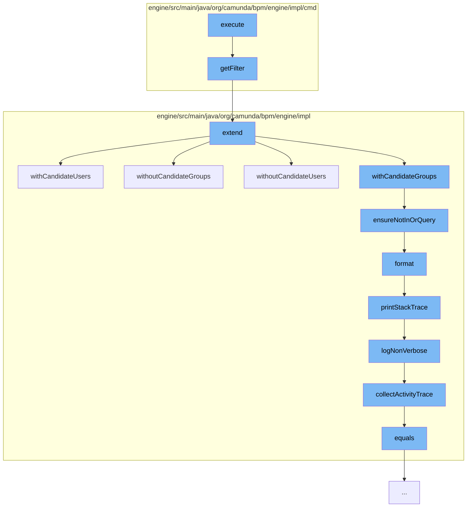

This document will cover the process of executing a filter count command in the Camunda BPMN engine. The process includes the following steps:

1. Executing the filter count command
2. Retrieving the filter
3. Extending the task query
4. Ensuring the query is not in 'or' state
5. Formatting the log record
6. Printing the stack trace
7. Collecting the activity trace
8. Checking the equality of task query variables.



<SwmSnippet path="/engine/src/main/java/org/camunda/bpm/engine/impl/cmd/ExecuteFilterCountCmd.java" line="1">

---

# Executing the Filter Count Command

The `execute` function in `ExecuteFilterCountCmd.java` initiates the process. It is responsible for executing a filter count command in the Camunda BPMN engine.

```java
/*
 * Copyright Camunda Services GmbH and/or licensed to Camunda Services GmbH
 * under one or more contributor license agreements. See the NOTICE file
 * distributed with this work for additional information regarding copyright
 * ownership. Camunda licenses this file to you under the Apache License,
 * Version 2.0; you may not use this file except in compliance with the License.
 * You may obtain a copy of the License at
 *
 *     http://www.apache.org/licenses/LICENSE-2.0
 *
 * Unless required by applicable law or agreed to in writing, software
 * distributed under the License is distributed on an "AS IS" BASIS,
 * WITHOUT WARRANTIES OR CONDITIONS OF ANY KIND, either express or implied.
 * See the License for the specific language governing permissions and
 * limitations under the License.
 */
package org.camunda.bpm.engine.impl.cmd;

import org.camunda.bpm.engine.filter.Filter;
import org.camunda.bpm.engine.impl.interceptor.Command;
import org.camunda.bpm.engine.impl.interceptor.CommandContext;
```

---

</SwmSnippet>

<SwmSnippet path="/engine/src/main/java/org/camunda/bpm/engine/impl/cmd/AbstractExecuteFilterCmd.java" line="49">

---

# Retrieving the Filter

The `getFilter` function retrieves the filter based on the provided filter ID. If an extending query is provided, it extends the filter with the extending query.

```java
  protected Filter getFilter(CommandContext commandContext) {
    ensureNotNull("No filter id given to execute", "filterId", filterId);
    FilterEntity filter = commandContext
      .getFilterManager()
      .findFilterById(filterId);

    ensureNotNull("No filter found for id '" + filterId + "'", "filter", filter);

    if (extendingQuery != null) {
      ((AbstractQuery<?, ?>) extendingQuery).validate();
      filter = (FilterEntity) filter.extend(extendingQuery);
    }

    return filter;
  }
```

---

</SwmSnippet>

<SwmSnippet path="/engine/src/main/java/org/camunda/bpm/engine/impl/TaskQueryImpl.java" line="1803">

---

# Extending the Task Query

The `extend` function extends the task query with the provided extending query. It merges the properties of the base query and the extending query.

```java
  @Override
  public TaskQuery extend(TaskQuery extending) {
    TaskQueryImpl extendingQuery = (TaskQueryImpl) extending;
    TaskQueryImpl extendedQuery = new TaskQueryImpl();

    // only add the base query's validators to the new query;
    // this is because the extending query's validators may not be applicable to the base
    // query and should therefore be executed before extending the query
    extendedQuery.validators = new HashSet<>(validators);

    if (extendingQuery.getName() != null) {
      extendedQuery.taskName(extendingQuery.getName());
    }
    else if (this.getName() != null) {
      extendedQuery.taskName(this.getName());
    }

    if (extendingQuery.getNameLike() != null) {
      extendedQuery.taskNameLike(extendingQuery.getNameLike());
    }
    else if (this.getNameLike() != null) {
```

---

</SwmSnippet>

<SwmSnippet path="/engine/src/main/java/org/camunda/bpm/engine/impl/TaskQueryImpl.java" line="1229">

---

# Ensuring the Query is not in 'or' State

The `ensureNotInOrQuery` function checks if the query is in 'or' state. If it is, it throws an exception.

```java
  protected void ensureNotInOrQuery(String methodName) {
    if (isOrQueryActive) {
      throw new ProcessEngineException(String.format("Invalid query usage: cannot set %s within 'or' query", methodName));
    }
  }
```

---

</SwmSnippet>

<SwmSnippet path="/engine/src/main/java/org/camunda/bpm/engine/impl/util/LogUtil.java" line="82">

---

# Formatting the Log Record

The `format` function formats the log record. It includes the date, log level, thread ID, message, and the stack trace if an exception is thrown.

```java
    public String format(LogRecord record) {
      StringBuilder line = new StringBuilder();
      line.append(dateFormat.format(new Date()));
      if (Level.FINE.equals(record.getLevel())) {
        line.append(" FIN ");
      } else if (Level.FINEST.equals(record.getLevel())) {
        line.append(" FST ");
      } else if (Level.INFO.equals(record.getLevel())) {
        line.append(" INF ");
      } else if (Level.SEVERE.equals(record.getLevel())) {
        line.append(" SEV ");
      } else if (Level.WARNING.equals(record.getLevel())) {
        line.append(" WRN ");
      } else if (Level.FINER.equals(record.getLevel())) {
        line.append(" FNR ");
      } else if (Level.CONFIG.equals(record.getLevel())) {
        line.append(" CFG ");
      }

      int threadId = record.getThreadID();
      String threadIndent = getThreadIndent(threadId);
```

---

</SwmSnippet>

<SwmSnippet path="/engine/src/main/java/org/camunda/bpm/engine/impl/interceptor/BpmnStackTrace.java" line="39">

---

# Printing the Stack Trace

The `printStackTrace` function prints the stack trace. It logs the failed operation and the activity trace.

```java
  public void printStackTrace(boolean verbose) {
    if(perfromedInvocations.isEmpty()) {
      return;
    }

    StringWriter writer = new StringWriter();
    writer.write("BPMN Stack Trace:\n");

    if(!verbose) {
      logNonVerbose(writer);
    }
    else {
      logVerbose(writer);
    }

    LOG.bpmnStackTrace(writer.toString());

    perfromedInvocations.clear();
  }
```

---

</SwmSnippet>

<SwmSnippet path="/engine/src/main/java/org/camunda/bpm/engine/impl/interceptor/BpmnStackTrace.java" line="99">

---

# Collecting the Activity Trace

The `collectActivityTrace` function collects the activity trace. It iterates over the performed invocations and collects the activity IDs and names.

```java
  protected List<Map<String, String>> collectActivityTrace() {
    List<Map<String, String>> activityTrace = new ArrayList<Map<String, String>>();
    for (AtomicOperationInvocation atomicOperationInvocation : perfromedInvocations) {
      String activityId = atomicOperationInvocation.getActivityId();
      if(activityId == null) {
        continue;
      }

      Map<String, String> activity = new HashMap<String, String>();
      activity.put("activityId", activityId);

      String activityName = atomicOperationInvocation.getActivityName();
      if (activityName != null) {
        activity.put("activityName", activityName);
      }

      if(activityTrace.isEmpty() ||
          !activity.get("activityId").equals(activityTrace.get(0).get("activityId"))) {
        activityTrace.add(0, activity);
      }
    }
```

---

</SwmSnippet>

<SwmSnippet path="/engine/src/main/java/org/camunda/bpm/engine/impl/TaskQueryImpl.java" line="2329">

---

# Checking the Equality of Task Query Variables

The `equals` function checks the equality of task query variables. It compares the name, process instance variable, and local variable of the task query variables.

```java
    @Override
    public boolean equals(Object o) {
      if (this == o) return true;
      if (o == null || getClass() != o.getClass()) return false;

      TaskQueryVariableValue other = ((TaskQueryVariableValueComparable) o).getVariableValue();

      return variableValue.getName().equals(other.getName())
             && variableValue.isProcessInstanceVariable() == other.isProcessInstanceVariable()
             && variableValue.isLocal() == other.isLocal();
    }
```

---

</SwmSnippet>

&nbsp;

*This is an auto-generated document by Swimm AI 🌊 and has not yet been verified by a human*

<SwmMeta version="3.0.0" repo-id="Z2l0aHViJTNBJTNBQ2l0aS1jYW11bmRhJTNBJTNBZ2lsYWRuYXZvdA==" repo-name="Citi-camunda" doc-type="flows"><sup>Powered by [Swimm](/)</sup></SwmMeta>
