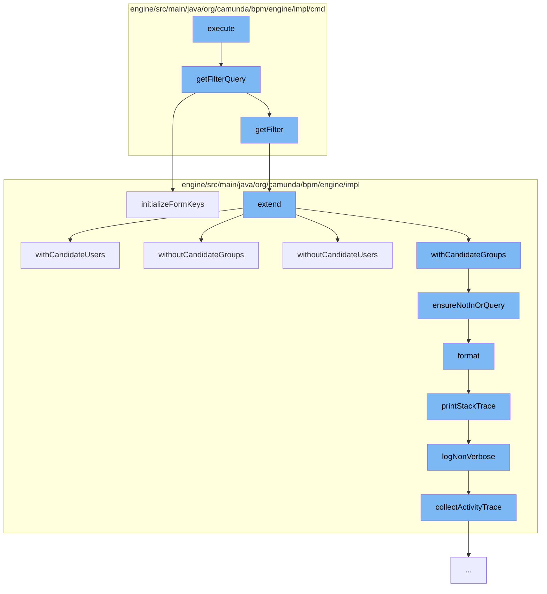

This document will cover the process of executing a filter list page command in the Camunda BPM engine. The process includes the following steps:

1. Executing the filter list page command
2. Getting the filter query
3. Initializing form keys
4. Extending the task query
5. Ensuring not in 'or' query
6. Formatting the log record
7. Printing the BPMN stack trace
8. Logging non-verbose stack trace
9. Collecting activity trace.



<SwmSnippet path="/engine/src/main/java/org/camunda/bpm/engine/impl/cmd/ExecuteFilterListPageCmd.java" line="1">

---

# Executing the filter list page command

The `execute` function in `ExecuteFilterListPageCmd.java` is the entry point of this process. It triggers the execution of a filter list page command.

```java
/*
 * Copyright Camunda Services GmbH and/or licensed to Camunda Services GmbH
 * under one or more contributor license agreements. See the NOTICE file
 * distributed with this work for additional information regarding copyright
 * ownership. Camunda licenses this file to you under the Apache License,
 * Version 2.0; you may not use this file except in compliance with the License.
 * You may obtain a copy of the License at
 *
 *     http://www.apache.org/licenses/LICENSE-2.0
 *
 * Unless required by applicable law or agreed to in writing, software
 * distributed under the License is distributed on an "AS IS" BASIS,
 * WITHOUT WARRANTIES OR CONDITIONS OF ANY KIND, either express or implied.
 * See the License for the specific language governing permissions and
 * limitations under the License.
 */
package org.camunda.bpm.engine.impl.cmd;

import java.util.List;

import org.camunda.bpm.engine.impl.AbstractQuery;
```

---

</SwmSnippet>

<SwmSnippet path="/engine/src/main/java/org/camunda/bpm/engine/impl/cmd/AbstractExecuteFilterCmd.java" line="65">

---

# Getting the filter query

The `getFilterQuery` function retrieves the filter query associated with the command. If the query is an instance of `TaskQuery`, it initializes the form keys.

```java
  protected Query<?, ?> getFilterQuery(CommandContext commandContext) {
    Filter filter = getFilter(commandContext);
    Query<?, ?> query = filter.getQuery();
    if (query instanceof TaskQuery) {
      ((TaskQuery) query).initializeFormKeys();
    }
    return query;
  }
```

---

</SwmSnippet>

<SwmSnippet path="/engine/src/main/java/org/camunda/bpm/engine/impl/TaskQueryImpl.java" line="1067">

---

# Initializing form keys

The `initializeFormKeys` function is used to ensure that the form keys are not in 'or' query.

```java
  @Override
  public TaskQuery initializeFormKeys() {
    ensureNotInOrQuery("initializeFormKeys()");
    this.initializeFormKeys = true;
    return this;
  }
```

---

</SwmSnippet>

<SwmSnippet path="/engine/src/main/java/org/camunda/bpm/engine/impl/TaskQueryImpl.java" line="1803">

---

# Extending the task query

The `extend` function is used to extend the task query with additional parameters. It takes an existing task query as input and extends it with additional parameters.

```java
  @Override
  public TaskQuery extend(TaskQuery extending) {
    TaskQueryImpl extendingQuery = (TaskQueryImpl) extending;
    TaskQueryImpl extendedQuery = new TaskQueryImpl();

    // only add the base query's validators to the new query;
    // this is because the extending query's validators may not be applicable to the base
    // query and should therefore be executed before extending the query
    extendedQuery.validators = new HashSet<>(validators);

    if (extendingQuery.getName() != null) {
      extendedQuery.taskName(extendingQuery.getName());
    }
    else if (this.getName() != null) {
      extendedQuery.taskName(this.getName());
    }

    if (extendingQuery.getNameLike() != null) {
      extendedQuery.taskNameLike(extendingQuery.getNameLike());
    }
    else if (this.getNameLike() != null) {
```

---

</SwmSnippet>

<SwmSnippet path="/engine/src/main/java/org/camunda/bpm/engine/impl/TaskQueryImpl.java" line="1229">

---

# Ensuring not in 'or' query

The `ensureNotInOrQuery` function is used to ensure that the query is not in 'or' query. If it is, it throws a `ProcessEngineException`.

```java
  protected void ensureNotInOrQuery(String methodName) {
    if (isOrQueryActive) {
      throw new ProcessEngineException(String.format("Invalid query usage: cannot set %s within 'or' query", methodName));
    }
  }
```

---

</SwmSnippet>

<SwmSnippet path="/engine/src/main/java/org/camunda/bpm/engine/impl/util/LogUtil.java" line="82">

---

# Formatting the log record

The `format` function is used to format the log record. If the record contains an exception, it prints the stack trace.

```java
    public String format(LogRecord record) {
      StringBuilder line = new StringBuilder();
      line.append(dateFormat.format(new Date()));
      if (Level.FINE.equals(record.getLevel())) {
        line.append(" FIN ");
      } else if (Level.FINEST.equals(record.getLevel())) {
        line.append(" FST ");
      } else if (Level.INFO.equals(record.getLevel())) {
        line.append(" INF ");
      } else if (Level.SEVERE.equals(record.getLevel())) {
        line.append(" SEV ");
      } else if (Level.WARNING.equals(record.getLevel())) {
        line.append(" WRN ");
      } else if (Level.FINER.equals(record.getLevel())) {
        line.append(" FNR ");
      } else if (Level.CONFIG.equals(record.getLevel())) {
        line.append(" CFG ");
      }

      int threadId = record.getThreadID();
      String threadIndent = getThreadIndent(threadId);
```

---

</SwmSnippet>

<SwmSnippet path="/engine/src/main/java/org/camunda/bpm/engine/impl/interceptor/BpmnStackTrace.java" line="39">

---

# Printing the BPMN stack trace

The `printStackTrace` function is used to print the BPMN stack trace. It logs the stack trace in a non-verbose manner.

```java
  public void printStackTrace(boolean verbose) {
    if(perfromedInvocations.isEmpty()) {
      return;
    }

    StringWriter writer = new StringWriter();
    writer.write("BPMN Stack Trace:\n");

    if(!verbose) {
      logNonVerbose(writer);
    }
    else {
      logVerbose(writer);
    }

    LOG.bpmnStackTrace(writer.toString());

    perfromedInvocations.clear();
  }
```

---

</SwmSnippet>

<SwmSnippet path="/engine/src/main/java/org/camunda/bpm/engine/impl/interceptor/BpmnStackTrace.java" line="59">

---

# Logging non-verbose stack trace

The `logNonVerbose` function is used to log the stack trace in a non-verbose manner. It logs the failed operation and the activity trace.

```java
  protected void logNonVerbose(StringWriter writer) {

    // log the failed operation verbosely
    writeInvocation(perfromedInvocations.get(perfromedInvocations.size() - 1), writer);

    // log human consumable trace of activity ids and names
    List<Map<String, String>> activityTrace = collectActivityTrace();
    logActivityTrace(writer, activityTrace);
  }
```

---

</SwmSnippet>

<SwmSnippet path="/engine/src/main/java/org/camunda/bpm/engine/impl/interceptor/BpmnStackTrace.java" line="99">

---

# Collecting activity trace

The `collectActivityTrace` function is used to collect the activity trace. It iterates over the performed invocations and collects the activity ID and name.

```java
  protected List<Map<String, String>> collectActivityTrace() {
    List<Map<String, String>> activityTrace = new ArrayList<Map<String, String>>();
    for (AtomicOperationInvocation atomicOperationInvocation : perfromedInvocations) {
      String activityId = atomicOperationInvocation.getActivityId();
      if(activityId == null) {
        continue;
      }

      Map<String, String> activity = new HashMap<String, String>();
      activity.put("activityId", activityId);

      String activityName = atomicOperationInvocation.getActivityName();
      if (activityName != null) {
        activity.put("activityName", activityName);
      }

      if(activityTrace.isEmpty() ||
          !activity.get("activityId").equals(activityTrace.get(0).get("activityId"))) {
        activityTrace.add(0, activity);
      }
    }
```

---

</SwmSnippet>

&nbsp;

*This is an auto-generated document by Swimm AI 🌊 and has not yet been verified by a human*

<SwmMeta version="3.0.0" repo-id="Z2l0aHViJTNBJTNBQ2l0aS1jYW11bmRhJTNBJTNBZ2lsYWRuYXZvdA==" repo-name="Citi-camunda" doc-type="flows"><sup>Powered by [Swimm](/)</sup></SwmMeta>
