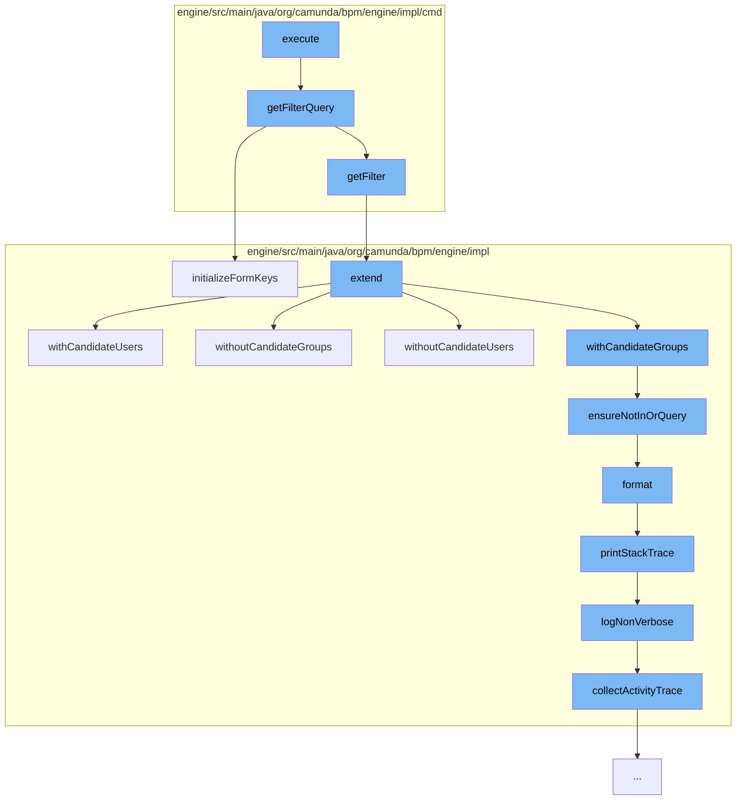

This document will cover the process of executing a filter list in the Camunda BPMN engine, which includes:

1. Getting the filter query
2. Initializing form keys
3. Extending the task query
4. Ensuring not in 'or' query
5. Formatting the log
6. Printing the stack trace
7. Logging non-verbose
8. Collecting activity trace.



<SwmSnippet path="/engine/src/main/java/org/camunda/bpm/engine/impl/cmd/AbstractExecuteFilterCmd.java" line="65">

---

# Getting the filter query

The `getFilterQuery` function retrieves the filter query from the command context. If the query is an instance of `TaskQuery`, it initializes the form keys.

```java
  protected Query<?, ?> getFilterQuery(CommandContext commandContext) {
    Filter filter = getFilter(commandContext);
    Query<?, ?> query = filter.getQuery();
    if (query instanceof TaskQuery) {
      ((TaskQuery) query).initializeFormKeys();
    }
    return query;
  }
```

---

</SwmSnippet>

<SwmSnippet path="/engine/src/main/java/org/camunda/bpm/engine/impl/TaskQueryImpl.java" line="1067">

---

# Initializing form keys

The `initializeFormKeys` function ensures that the query is not an 'or' query and sets the `initializeFormKeys` flag to true.

```java
  @Override
  public TaskQuery initializeFormKeys() {
    ensureNotInOrQuery("initializeFormKeys()");
    this.initializeFormKeys = true;
    return this;
  }
```

---

</SwmSnippet>

<SwmSnippet path="/engine/src/main/java/org/camunda/bpm/engine/impl/TaskQueryImpl.java" line="1803">

---

# Extending the task query

The `extend` function extends the task query by copying the properties of the extending query to a new extended query. It handles various properties such as name, assignee, priority, and more.

```java
  @Override
  public TaskQuery extend(TaskQuery extending) {
    TaskQueryImpl extendingQuery = (TaskQueryImpl) extending;
    TaskQueryImpl extendedQuery = new TaskQueryImpl();

    // only add the base query's validators to the new query;
    // this is because the extending query's validators may not be applicable to the base
    // query and should therefore be executed before extending the query
    extendedQuery.validators = new HashSet<>(validators);

    if (extendingQuery.getName() != null) {
      extendedQuery.taskName(extendingQuery.getName());
    }
    else if (this.getName() != null) {
      extendedQuery.taskName(this.getName());
    }

    if (extendingQuery.getNameLike() != null) {
      extendedQuery.taskNameLike(extendingQuery.getNameLike());
    }
    else if (this.getNameLike() != null) {
```

---

</SwmSnippet>

<SwmSnippet path="/engine/src/main/java/org/camunda/bpm/engine/impl/TaskQueryImpl.java" line="1229">

---

# Ensuring not in 'or' query

The `ensureNotInOrQuery` function throws an exception if the query is an 'or' query. This is to prevent invalid query usage.

```java
  protected void ensureNotInOrQuery(String methodName) {
    if (isOrQueryActive) {
      throw new ProcessEngineException(String.format("Invalid query usage: cannot set %s within 'or' query", methodName));
    }
  }
```

---

</SwmSnippet>

<SwmSnippet path="/engine/src/main/java/org/camunda/bpm/engine/impl/util/LogUtil.java" line="82">

---

# Formatting the log

The `format` function formats the log record. It includes the date, log level, thread ID, message, and logger name.

```java
    public String format(LogRecord record) {
      StringBuilder line = new StringBuilder();
      line.append(dateFormat.format(new Date()));
      if (Level.FINE.equals(record.getLevel())) {
        line.append(" FIN ");
      } else if (Level.FINEST.equals(record.getLevel())) {
        line.append(" FST ");
      } else if (Level.INFO.equals(record.getLevel())) {
        line.append(" INF ");
      } else if (Level.SEVERE.equals(record.getLevel())) {
        line.append(" SEV ");
      } else if (Level.WARNING.equals(record.getLevel())) {
        line.append(" WRN ");
      } else if (Level.FINER.equals(record.getLevel())) {
        line.append(" FNR ");
      } else if (Level.CONFIG.equals(record.getLevel())) {
        line.append(" CFG ");
      }

      int threadId = record.getThreadID();
      String threadIndent = getThreadIndent(threadId);
```

---

</SwmSnippet>

<SwmSnippet path="/engine/src/main/java/org/camunda/bpm/engine/impl/interceptor/BpmnStackTrace.java" line="39">

---

# Printing the stack trace

The `printStackTrace` function prints the BPMN stack trace. It logs the failed operation and the activity trace.

```java
  public void printStackTrace(boolean verbose) {
    if(perfromedInvocations.isEmpty()) {
      return;
    }

    StringWriter writer = new StringWriter();
    writer.write("BPMN Stack Trace:\n");

    if(!verbose) {
      logNonVerbose(writer);
    }
    else {
      logVerbose(writer);
    }

    LOG.bpmnStackTrace(writer.toString());

    perfromedInvocations.clear();
  }
```

---

</SwmSnippet>

<SwmSnippet path="/engine/src/main/java/org/camunda/bpm/engine/impl/interceptor/BpmnStackTrace.java" line="59">

---

# Logging non-verbose

The `logNonVerbose` function logs the failed operation and the activity trace in a non-verbose manner.

```java
  protected void logNonVerbose(StringWriter writer) {

    // log the failed operation verbosely
    writeInvocation(perfromedInvocations.get(perfromedInvocations.size() - 1), writer);

    // log human consumable trace of activity ids and names
    List<Map<String, String>> activityTrace = collectActivityTrace();
    logActivityTrace(writer, activityTrace);
  }
```

---

</SwmSnippet>

<SwmSnippet path="/engine/src/main/java/org/camunda/bpm/engine/impl/interceptor/BpmnStackTrace.java" line="99">

---

# Collecting activity trace

The `collectActivityTrace` function collects the activity trace from the performed invocations. It includes the activity ID and name.

```java
  protected List<Map<String, String>> collectActivityTrace() {
    List<Map<String, String>> activityTrace = new ArrayList<Map<String, String>>();
    for (AtomicOperationInvocation atomicOperationInvocation : perfromedInvocations) {
      String activityId = atomicOperationInvocation.getActivityId();
      if(activityId == null) {
        continue;
      }

      Map<String, String> activity = new HashMap<String, String>();
      activity.put("activityId", activityId);

      String activityName = atomicOperationInvocation.getActivityName();
      if (activityName != null) {
        activity.put("activityName", activityName);
      }

      if(activityTrace.isEmpty() ||
          !activity.get("activityId").equals(activityTrace.get(0).get("activityId"))) {
        activityTrace.add(0, activity);
      }
    }
```

---

</SwmSnippet>

&nbsp;

*This is an auto-generated document by Swimm AI 🌊 and has not yet been verified by a human*

<SwmMeta version="3.0.0" repo-id="Z2l0aHViJTNBJTNBQ2l0aS1jYW11bmRhJTNBJTNBZ2lsYWRuYXZvdA==" repo-name="Citi-camunda" doc-type="flows"><sup>Powered by [Swimm](/)</sup></SwmMeta>
